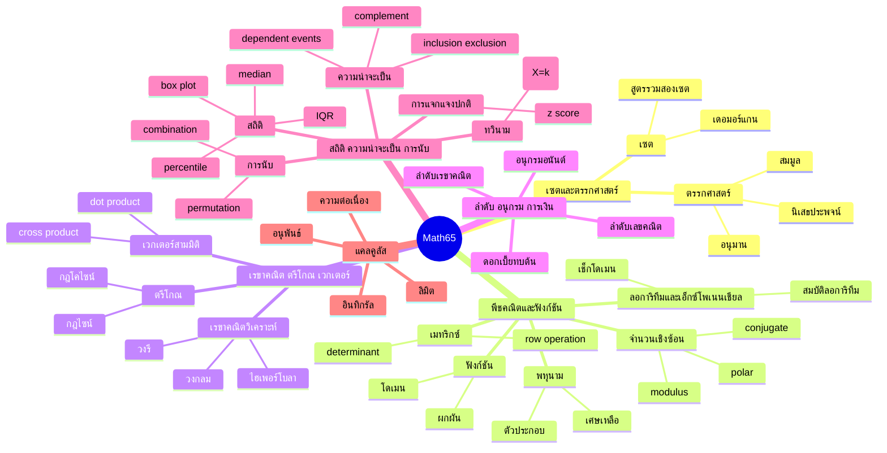
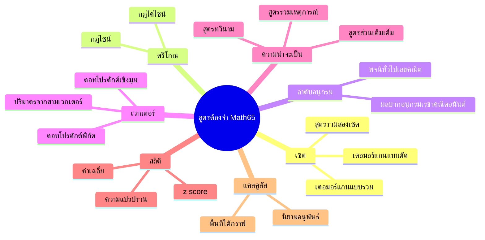
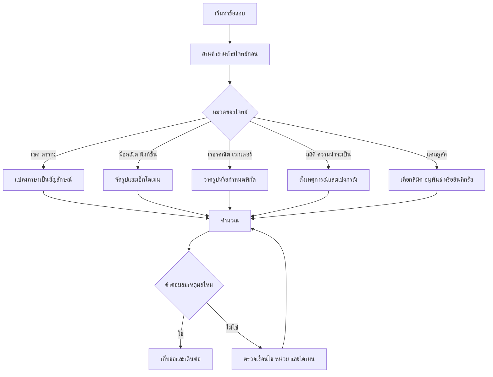

# Mindmap เนื้อหาและสูตร Math65

เอกสารนี้สรุปภาพรวมเนื้อหา สูตร และกลยุทธ์ทำข้อสอบในรูปแบบ Mermaid

## Mindmap ภาพรวมเนื้อหา

## Mindmap สูตรที่ต้องจำ

## สูตรจริง (อ้างอิงด่วน)

- n(A∪B)=n(A)+n(B)-n(A∩B)
- (A∪B)'=A'∩B', (A∩B)'=A'∪B'
- a/sinA=b/sinB=c/sinC
- c^2=a^2+b^2-2ab cosC
- a_n=a_1+(n-1)d
- S_∞=a/(1-r), |r|<1
- u·v=x1x2+y1y2+z1z2
- u·v=|u||v|cosθ
- |u·(v×w)|
- P(A∪B)=P(A)+P(B)-P(A∩B)
- P(A')=1-P(A)
- P(X=k)=C(n,k)p^k(1-p)^(n-k)
- x̄=Σx/n
- Var=E(X^2)-[E(X)]^2
- z=(x-μ)/σ
- f'(x)=lim(h→0)(f(x+h)-f(x))/h
- Area=∫_a^b f(x) dx

## Mindmap กลยุทธ์ทำข้อสอบ

