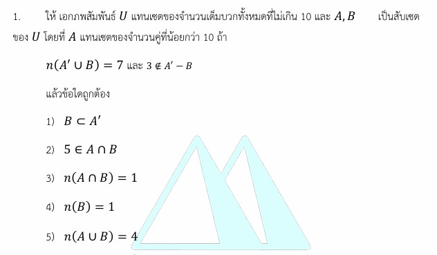

# การแก้โจทย์ข้อ 1 ของวิชาคณิตศาสตร์ประยุกต์ 1 (A-Level) ปี 2565 : **ทฤษฎีเซต (Set Theory)**

การแก้โจทย์ข้อนี้เป็นเรื่องเกี่ยวกับ **ทฤษฎีเซต (Set Theory)** ซึ่งเป็นพื้นฐานสำคัญ โดยทดสอบความเข้าใจเรื่องเอกภพสัมพัทธ์ การดำเนินการของเซต (Operations) และกฎของเดอมอร์แกนครับ

### **โจทย์ข้อ 1 (A-Level 2565)**

กำหนดให้ $U$ เป็นเอกภพสัมพัทธ์ที่แทนเซตของจำนวนเต็มบวกทั้งหมดที่ไม่เกิน 10 และ $A, B$ เป็นสับเซตของ $U$ โดยที่:

* $A$ เป็นเซตของจำนวนคู่ที่น้อยกว่า 10
* $A' \cap B' = \{1, 3, 5, 7, 9\}$
* $B \subset A'$ (หรือในบางฉบับอาจใช้เงื่อนไข $B \cap A = \emptyset$)
**จงหาว่าเซต $B$ คือเซตในข้อใด**

---

### **วิธีทำอย่างละเอียด**

**ขั้นตอนที่ 1: เขียนสมาชิกของเซต $U$ และเซต $A$**

* **เอกภพสัมพัทธ์ ($U$):** จำนวนเต็มบวกที่ไม่เกิน 10 คือ $U = \{1, 2, 3, 4, 5, 6, 7, 8, 9, 10\}$
* **เซต $A$:** จำนวนคู่ที่น้อยกว่า 10 (ไม่รวม 10) คือ $A = \{2, 4, 6, 8\}$
* **หาเซต $A'$ (คอมพลีเมนต์ของ $A$):** คือสมาชิกใน $U$ ที่ไม่อยู่ใน $A$
    จะได้ $A' = \{1, 3, 5, 7, 9, 10\}$

**ขั้นตอนที่ 2: แปลความหมายของเงื่อนไข $A' \cap B'$**
ใช้กฎของเดอมอร์แกน (De Morgan's Law) เพื่อให้ดูง่ายขึ้น:

* $A' \cap B' = (A \cup B)'$
* โจทย์กำหนด $(A \cup B)' = \{1, 3, 5, 7, 9\}$
* ดังนั้นสมาชิกของ $A \cup B$ คือสมาชิกใน $U$ ที่ไม่อยู่ใน $\{1, 3, 5, 7, 9\}$
    จะได้ **$A \cup B = \{2, 4, 6, 8, 10\}$**

**ขั้นตอนที่ 3: วิเคราะห์หาเซต $B$**
จาก $A \cup B = \{2, 4, 6, 8, 10\}$ และเรารู้ว่า $A = \{2, 4, 6, 8\}$

* สมาชิกตัวที่เกินมาคือ **10** จะต้องมาจากเซต $B$ แน่นอน
* พิจารณาเงื่อนไข **$B \subset A'$**: หมายความว่าสมาชิกทุกตัวของ $B$ ต้องอยู่ใน $A'$ ($A' = \{1, 3, 5, 7, 9, 10\}$)
* หาก $B$ มีสมาชิกเป็น $1, 3, 5, 7$ หรือ $9$ ตัวใดตัวหนึ่ง สมาชิกเหล่านั้นต้องไปปรากฏใน $A \cup B$ ด้วย แต่ในขั้นตอนที่ 2 เราพบว่ามันไม่อยู่
* ดังนั้นสมาชิกตัวเดียวที่ $B$ มีได้และสอดคล้องกับทุกเงื่อนไขคือ **10**

**ตอบ:** $B = \{10\}$ (ตรงกับตัวเลือกที่ 1)

---

### **เนื้อหาที่เกี่ยวข้องเพื่อศึกษาเพิ่มเติม**

**1. การดำเนินการของเซต (Set Operations):**

* **ยูเนียน ($\cup$):** เอาสมาชิกของทุกเซตมารวมกัน
* **อินเตอร์เซกชัน ($\cap$):** เอาเฉพาะสมาชิกที่ซ้ำกัน
* **คอมพลีเมนต์ ($A'$):** เอาสมาชิกใน $U$ แต่ไม่เอาใน $A$

**2. กฎของเดอมอร์แกน (De Morgan's Laws):**

* $(A \cup B)' = A' \cap B'$
* $(A \cap B)' = A' \cup B'$
* *ที่มา:* กฎนี้ช่วยในการเปลี่ยนรูปจาก "และ" ของคอมพลีเมนต์ ให้กลายเป็นคอมพลีเมนต์ของ "หรือ" ซึ่งช่วยให้วาดแผนภาพเวนน์-ออยเลอร์ได้ง่ายขึ้น

**3. ความหมายของตัวแปร:**

* **$U$ (Universe):** ขอบเขตของสมาชิกทั้งหมดที่เราสนใจ
* **$n(A)$:** จำนวนสมาชิกของเซต $A$
* **$\subset$ (Subset):** การเป็นสับเซต หมายถึงสมาชิกทุกตัวของเซตหน้าต้องอยู่ในเซตหลัง

---

### **กลยุทธ์แก้โจทย์ประเภทนี้**

* **แจกแจงสมาชิกก่อนเสมอ:** หากโจทย์ให้มาเป็นเงื่อนไขภาษาไทย ให้รีบเขียนเป็นตัวเลขทันทีเพื่อป้องกันความสับสนเรื่องตัวเลขขอบเขต (เช่น น้อยกว่า 10 กับ ไม่เกิน 10)
* **ใช้กฎเดอมอร์แกนยุบรูป:** เมื่อเห็นคอมพลีเมนต์ทับซ้อนกัน ให้พยายามยุบให้อยู่ในรูป $(A \cup B)'$ หรือ $(A \cap B)'$ ก่อนจะหาค่าสมาชิกจริง
* **ตรวจสอบเงื่อนไขสับเซต:** เงื่อนไข $B \subset A'$ เป็นตัวช่วยตัดช้อยส์ได้ดีมาก เพราะมันบอกเราว่าสมาชิกของ $B$ ห้ามซ้ำกับ $A$ โดยเด็ดขาด

---

### **ตัวอย่างโจทย์เพิ่มเติมเพื่อฝึกทำ**

**โจทย์:** กำหนด $U = \{1, 2, 3, 4, 5\}$, $A = \{1, 2\}$ ถ้า $(A \cup B)' = \{5\}$ และ $A \cap B = \emptyset$ จงหาเซต $B$

**เฉลยแนวคิด:**

1. $(A \cup B)' = \{5\} \implies A \cup B = \{1, 2, 3, 4\}$
2. เรารู้ $A = \{1, 2\}$ ดังนั้น $B$ ต้องมีสมาชิกที่เหลือคือ $\{3, 4\}$ หรือมากกว่านั้นแต่ต้องอยู่ใน $\{1, 2, 3, 4\}$
3. เงื่อนไข $A \cap B = \emptyset$ หมายความว่า $B$ ห้ามมี $1$ และ $2$
4. ดังนั้นสมาชิกที่เป็นไปได้ของ $B$ คือ $\{3, 4\}$ เท่านั้น
**ตอบ:** $B = \{3, 4\}$

การฝึกวิเคราะห์เงื่อนไขทีละเปลาะจะทำให้คุณทำคะแนนบทเซตใน A-Level ได้อย่างแม่นยำครับ

---

เงื่อนไข **$B \subset A'$ (B เป็นสับเซตของ A')** ในโจทย์ข้อ 1 ของข้อสอบ A-Level คณิตศาสตร์ 1 ปี 2565 มีความหมายและรายละเอียดการวิเคราะห์ดังนี้ครับ

### **1. ความหมายของเงื่อนไข $B \subset A'$**

ตามนิยามทางเซต การที่ $B$ เป็นสับเซตของ $A'$ หมายความว่า **สมาชิกทุกตัวที่อยู่ในเซต B จะต้องเป็นสมาชิกของเซต A' ด้วย** หรืออธิบายในทางกลับกันได้ว่า **เซต B จะต้องไม่มีสมาชิกตัวใดเลยที่ซ้ำกับเซต A** (นั่นคือ $A \cap B = \emptyset$)

### **2. การวิเคราะห์จากข้อมูลในโจทย์**

จากการคำนวณพื้นฐานในข้อนี้:

* **เอกภพสัมพัทธ์ ($U$):** $\{1, 2, 3, 4, 5, 6, 7, 8, 9, 10\}$
* **เซต $A$ (จำนวนคู่ < 10):** $\{2, 4, 6, 8\}$
* **เซต $A'$ (คอมพลีเมนต์ของ A):** สมาชิกใน $U$ ที่ไม่ใช่เลขคู่ด้านบน คือ $\{1, 3, 5, 7, 9, 10\}$ ซึ่งมีจำนวนสมาชิก **$n(A') = 6$**

### **3. ทำไมเงื่อนไข $B \subset A'$ ถึง "ผิด" ในข้อนี้?**

โจทย์ระบุเงื่อนไขสำคัญคือ **$n(A' \cup B) = 7$** ซึ่งเราสามารถนำมาวิเคราะห์ได้ดังนี้:

* เราทราบว่า $n(A') = 6$ แต่เมื่อนำไปยูเนียนกับ $B$ แล้วกลับมีสมาชิกเพิ่มขึ้นเป็น 7 ตัว
* การที่สมาชิกเพิ่มขึ้นมา 1 ตัวนั้น หมายความว่า **เซต B จะต้องมีสมาชิกอย่างน้อย 1 ตัวที่ไม่ได้อยู่ใน A'** (นั่นคือสมาชิกตัวนั้นต้องอยู่ในเซต $A$)
* เมื่อเซต $B$ มีสมาชิกบางตัว (1 ตัว) ที่ไปอยู่ในเซต $A$ จึงขัดกับนิยามของสับเซตที่ว่าสมาชิก "ทุกตัว" ของ $B$ ต้องอยู่ใน $A'$

**สรุปเหตุผล:**
ในโจทย์ข้อนี้ **$B$ ไม่ได้เป็นสับเซตของ $A'$** เพราะการที่ $n(A' \cup B) = 7$ แสดงว่ามีสมาชิก 1 ตัวใน $B$ ที่มาจากเซต $A$ (ซึ่งคือพื้นที่ส่วน $n(A \cap B) = 1$) ดังนั้นตัวเลือกที่ 1 ที่ระบุว่า $B \subset A'$ จึงเป็นข้อความที่ **ผิด** ครับ

---

สูตร**กฎของเดอมอร์แกน (De Morgan's Laws)** ที่นำมาใช้ในโจทย์ข้อ 1 ของข้อสอบ A-Level ปี 2565 เพื่อช่วยในการเปลี่ยนรูปเซตให้พิจารณาได้ง่ายขึ้น มี 2 รูปแบบหลักดังนี้ครับ

1. **$(A \cup B)' = A' \cap B'$** : คอมพลีเมนต์ของยูเนียน เท่ากับ อินเตอร์เซกชันของคอมพลีเมนต์
2. **$(A \cap B)' = A' \cup B'$** : คอมพลีเมนต์ของอินเตอร์เซกชัน เท่ากับ ยูเนียนของคอมพลีเมนต์

### **การนำไปใช้ในโจทย์ข้อ 1:**

ในโจทย์กำหนดเงื่อนไขว่า **$A' \cap B' = \{1, 3, 5, 7, 9\}$** เราจะใช้สูตรแรกในการถอดรูปสมาชิกออกมา ดังนี้ครับ:

* จากสูตร **$A' \cap B' = (A \cup B)'$**
* จะได้ว่า **$(A \cup B)' = \{1, 3, 5, 7, 9\}$**
* เมื่อเราทราบคอมพลีเมนต์ เราสามารถหาเซตดั้งเดิมได้โดยการนำสมาชิกออกจากเอกภพสัมพัทธ์ ($U$):
  * เนื่องจาก $U = \{1, 2, 3, 4, 5, 6, 7, 8, 9, 10\}$
  * ดังนั้น **$A \cup B = \{2, 4, 6, 8, 10\}$** (สมาชิกใน $U$ ที่ไม่ใช่เลขคี่ข้างต้น)

**สรุปกลยุทธ์:** การใช้กฎของเดอมอร์แกนช่วยให้เราเปลี่ยนจากสิ่งที่ "ไม่เอาใน A และไม่เอาใน B" ให้กลายเป็นสิ่งที่ **"ไม่เอาในยูเนียนของ A และ B"** ซึ่งทำให้เรามองภาพรวมของสมาชิกที่หายไปจากทั้งสองเซตรวมกันได้ชัดเจนขึ้นครับ
