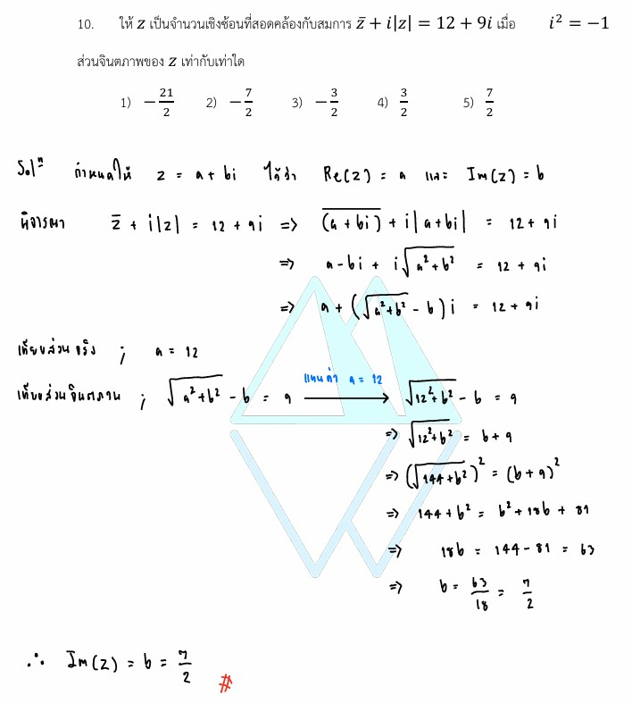

# การแก้โจทย์ **ข้อ 10 ของวิชาคณิตศาสตร์ประยุกต์ 1 (A-Level) ปี 2565** เป็นเรื่องเกี่ยวกับ **จำนวนเชิงซ้อน (Complex Numbers)** โดยเน้นทักษะการแก้สมการที่ประกอบด้วยจำนวนเชิงซ้อน สังยุค (Conjugate) และค่าสัมบูรณ์ (Modulus) ครับ

## **เฉลยละเอียดโจทย์ข้อ 10**

**โจทย์:** ให้ $z$ เป็นจำนวนเชิงซ้อนที่สอดคล้องกับสมการ $\bar{z} + i|z| = 12 + 9i$ เมื่อ $i^2 = -1$ จงหาว่าส่วนจินตภาพของ $z$ เท่ากับเท่าใด,

---

**วิธีทำอย่างละเอียด:**

**ขั้นตอนที่ 1: กำหนดตัวแปรแทนจำนวนเชิงซ้อน**
ให้ $z = a + bi$ โดยที่ $a$ คือส่วนจริง และ $b$ คือส่วนจินตภาพที่โจทย์ต้องการหา
จะได้ว่า:

* **สังยุคของ $z$ ($\bar{z}$):** คือ $a - bi$
* **ค่าสัมบูรณ์ของ $z$ ($|z|$):** คือ $\sqrt{a^2 + b^2}$

**ขั้นตอนที่ 2: แทนค่าลงในสมการที่โจทย์ให้มา**
นำค่าที่กำหนดแทนลงในสมการ $\bar{z} + i|z| = 12 + 9i$ จะได้:
$$(a - bi) + i\sqrt{a^2 + b^2} = 12 + 9i$$

**ขั้นตอนที่ 3: จัดรูปสมการโดยแยกส่วนจริงและส่วนจินตภาพ**
รวมกลุ่มก้อนที่ไม่มี $i$ และกลุ่มก้อนที่มี $i$:
$$a + i(\sqrt{a^2 + b^2} - b) = 12 + 9i$$

**ขั้นตอนที่ 4: เทียบสัมประสิทธิ์ของส่วนจริงและส่วนจินตภาพ**
ตามหลักการเท่ากันของจำนวนเชิงซ้อน:

1. **ส่วนจริง:** $a = 12$
2. **ส่วนจินตภาพ:** $\sqrt{a^2 + b^2} - b = 9$

**ขั้นตอนที่ 5: แก้สมการหาค่า $b$ (ส่วนจินตภาพ)**
นำค่า $a = 12$ แทนลงในสมการส่วนจินตภาพ:
$$\sqrt{12^2 + b^2} - b = 9$$
$$\sqrt{144 + b^2} = b + 9$$
ยกกำลังสองทั้งสองข้างเพื่อกำจัดรากที่สอง:
$$144 + b^2 = (b + 9)^2$$
$$144 + b^2 = b^2 + 18b + 81$$
$$144 = 18b + 81$$
$$18b = 144 - 81$$
$$18b = 63$$
$$b = \frac{63}{18} = \frac{7}{2}$$

**ตอบ:** ส่วนจินตภาพของ $z$ เท่ากับ **$\frac{7}{2}$** (ตรงกับตัวเลือกที่ 4)

---

### **เนื้อหาที่เกี่ยวข้องเพื่อศึกษาเพิ่มเติม**

**1. สูตรและนิยามสำคัญ:**

* **จำนวนเชิงซ้อน ($z$):** มักเขียนในรูป $a + bi$ โดย $a, b \in \mathbb{R}$ และ $i = \sqrt{-1}$
* **สังยุค ($\bar{z}$):** คือการเปลี่ยนเครื่องหมายหน้าส่วนจินตภาพจากบวกเป็นลบ (หรือกลับกัน) เพื่อใช้ในการกำจัดส่วนจินตภาพหรือแก้สมการ
* **ค่าสัมบูรณ์ ($|z|$):** คือระยะห่างจากจุดกำเนิดถึงพิกัด $(a, b)$ บนระนาบเชิงซ้อน
* **การเท่ากันของจำนวนเชิงซ้อน:** $a + bi = c + di$ ก็ต่อเมื่อ $a = c$ และ $b = d$

**2. ความหมายของตัวแปร:**

* **$i$:** หน่วยจินตภาพ (Imaginary unit) มีสมบัติสำคัญคือ **$i^2 = -1$**
* **ส่วนจริง (Real part):** คือค่า $a$ ใน $z = a + bi$
* **ส่วนจินตภาพ (Imaginary part):** คือค่า $b$ ใน $z = a + bi$ (สังเกตว่าส่วนจินตภาพคือ **ตัวเลขหน้า $i$** เท่านั้น ไม่รวมตัว $i$ มาด้วย)

### **กลยุทธ์แก้โจทย์ประเภทนี้**

* **"สมมติ $z = a + bi$" เสมอ:** เมื่อเจอสมการที่มีตัวแปร $z$ ปนกับ $\bar{z}$ หรือ $|z|$ กลยุทธ์ที่ได้ผลที่สุดคือการเปลี่ยนทุกอย่างให้เป็นตัวแปรส่วนจริง ($a$) และส่วนจินตภาพ ($b$) เพื่อเปลี่ยนสมการเชิงซ้อนให้เป็นระบบสมการจำนวนจริงปกติ
* **การตรวจสอบคำตอบ:** เมื่อแก้ค่า $b$ ได้จากการยกกำลังสอง (ในขั้นตอนที่ 5) ควรตรวจสอบว่าค่าที่ได้ทำให้ฝั่ง $b + 9$ ไม่เป็นค่าลบ เพราะผลลัพธ์จากรากที่สองต้องเป็นบวกเสมอ (ในที่นี้ $7/2 + 9$ เป็นบวก จึงใช้งานได้)

---

### **ตัวอย่างโจทย์เพิ่มเติมเพื่อฝึกทำ**

**โจทย์:** กำหนดให้ $2z - \bar{z} = 3 + 6i$ จงหาค่าของ $|z|$
**เฉลยแนวคิด:**

1. ให้ $z = a + bi$ จะได้ $2(a + bi) - (a - bi) = 3 + 6i$
2. จัดรูป: $(2a - a) + i(2b + b) = 3 + 6i \implies a + 3bi = 3 + 6i$
3. เทียบส่วนจะได้ $a = 3$ และ $3b = 6 \implies b = 2$
4. หาค่า $|z| = \sqrt{3^2 + 2^2} = \sqrt{9 + 4} = \sqrt{13}$
**ตอบ:** $\sqrt{13}$

การฝึกฝนแยกส่วนจริงและส่วนจินตภาพแบบนี้จะช่วยให้ทำคะแนนบทจำนวนเชิงซ้อนในข้อสอบ A-Level ได้อย่างแม่นยำครับ!

---

การสมมติค่า **$z = a + bi$** เป็นกลยุทธ์พื้นฐานที่สำคัญที่สุดในการแก้โจทย์จำนวนเชิงซ้อนเมื่อโจทย์มีการปนกันของตัวแปร $z$ หลายรูปแบบ (เช่น มีทั้งสังยุคและค่าสัมบูรณ์) โดยมีรายละเอียดขั้นตอนและเหตุผลเพิ่มเติมจากข้อ 10 ดังนี้ครับ

### **1. ทำไมต้องสมมติ $z = a + bi$?**

ในทางคณิตศาสตร์ **$z$** เป็นตัวแปรเชิงซ้อนตัวเดียว แต่ข้างในประกอบด้วยค่าอิสระ 2 ค่า คือ **ส่วนจริง (Real part)** และ **ส่วนจินตภาพ (Imaginary part)** การแตก $z$ ออกเป็น $a + bi$ ช่วยให้เราสามารถเปลี่ยนจาก "สมการเชิงซ้อน" ให้กลายเป็น **"ระบบสมการจำนวนจริง"** ซึ่งแก้ได้ง่ายกว่ามาก

### **2. การแปลงส่วนประกอบต่างๆ ของ $z$ ในข้อ 10**

เมื่อเรากำหนดให้ $z = a + bi$ (โดยที่ $a, b$ เป็นจำนวนจริง) ส่วนประกอบอื่นๆ ในสมการจะเปลี่ยนไปตามนิยามดังนี้:

* **สังยุค ($\bar{z}$):** จะเปลี่ยนเครื่องหมายหน้า $i$ จากบวกเป็นลบ ได้เป็น **$a - bi$**
* **ค่าสัมบูรณ์ ($|z|$):** คือระยะห่างจากจุดกำเนิด มีค่าเป็นบวกเสมอ คำนวณจาก **$\sqrt{a^2 + b^2}$**

### **3. ขั้นตอนการแทนค่าและจัดกลุ่ม (Grouping)**

จากสมการโจทย์: $\bar{z} + i|z| = 12 + 9i$
เมื่อแทนค่าที่สมมติลงไปจะได้:
$$(a - bi) + i(\sqrt{a^2 + b^2}) = 12 + 9i$$

**เทคนิคสำคัญ:** เราต้องรวบรวมพจน์ที่มี $i$ ไว้ด้วยกัน และพจน์ที่ไม่มี $i$ ไว้ด้วยกัน เพื่อแยก "โลกของจริง" ออกจาก "โลกของจินตภาพ":

* **กลุ่มที่ไม่มี $i$ (ส่วนจริง):** มีแค่ตัว **$a$** ตัวเดียว
* **กลุ่มที่มี $i$ (ส่วนจินตภาพ):** มี $-bi$ และ $i\sqrt{a^2 + b^2}$ ดึงตัวร่วมออกมาได้เป็น **$i(\sqrt{a^2 + b^2} - b)$**

จะสรุปสมการใหม่ได้เป็น: **$a + i(\sqrt{a^2 + b^2} - b) = 12 + 9i$**

### **4. การเทียบสัมประสิทธิ์ (Comparing Coefficients)**

ขั้นตอนนี้คือหัวใจของการใช้ $a + bi$ โดยเราจะจับคู่สิ่งที่อยู่ตำแหน่งเดียวกันของฝั่งซ้ายและฝั่งขวา:

1. **ส่วนจริง = ส่วนจริง:** จะได้ **$a = 12$** ทันที
2. **ส่วนจินตภาพ = ส่วนจินตภาพ:** จะได้ **$\sqrt{a^2 + b^2} - b = 9$**

### **5. สรุปผลการหาค่า**

เมื่อเราได้ระบบสมการมาแล้ว ก็นำค่า $a = 12$ ไปแทนในสมการที่ 2:

* $\sqrt{12^2 + b^2} = 9 + b$
* $144 + b^2 = (9 + b)^2$ (ยกกำลังสองทั้งสองข้าง)
* $144 + b^2 = 81 + 18b + b^2$
* $144 - 81 = 18b \implies 63 = 18b \implies \mathbf{b = \frac{7}{2}}$

**ข้อควรจำ:** โจทย์ถามหา **"ส่วนจินตภาพ"** ซึ่งก็คือค่า **$b$** ที่เราสมมติไว้ตั้งแต่แรกนั่นเองครับ ดังนั้นคำตอบคือ **$7/2$**
