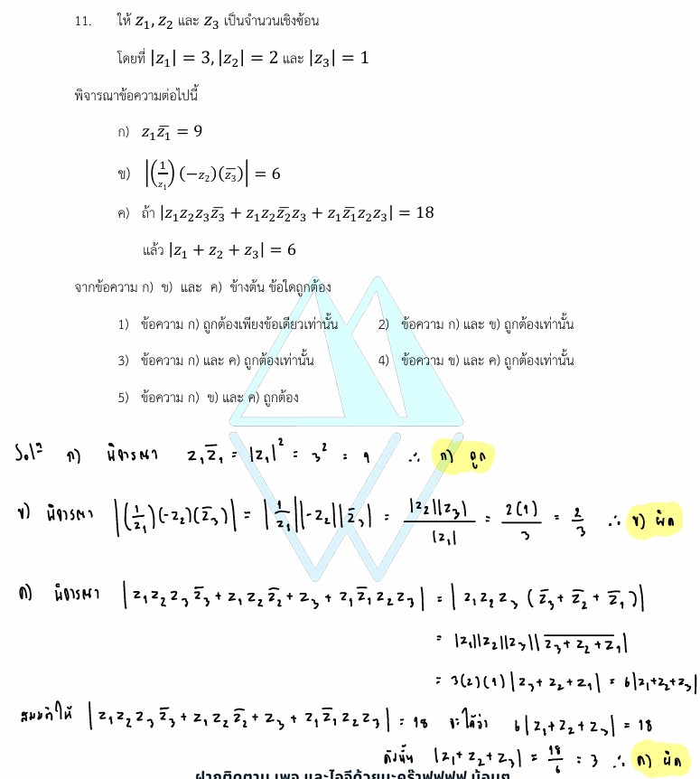

# การแก้โจทย์ **ข้อ 11 ของวิชาคณิตศาสตร์ประยุกต์ 1 (A-Level) ปี 2565** เป็นเรื่องเกี่ยวกับ **จำนวนเชิงซ้อน (Complex Numbers)** โดยทดสอบความเข้าใจเกี่ยวกับสมบัติของค่าสัมบูรณ์ (Modulus) และสังยุค (Conjugate) ครับ,

## **โจทย์ข้อ 11 (A-Level 2565)**

กำหนดให้ $z_1, z_2$ และ $z_3$ เป็นจำนวนเชิงซ้อน โดยที่ $|z_1| = 3, |z_2| = 2$ และ $|z_3| = 1$ พิจารณาข้อความต่อไปนี้:

* **ก)** $z_1 \bar{z}_1 = 9$
* **ข)** $|z_1 (-2z_2)(2z_3)| = 6$
* **ค)** ถ้า $|z_1 z_2 \bar{z}_3 + z_1 \bar{z}_2 z_3 + \bar{z}_1 z_2 z_3| = 18$ แล้ว $|z_1 + z_2 + z_3| = 6$

---

### **วิธีทำอย่างละเอียด**

**1. ตรวจสอบข้อความ ก:**

* จากสมบัติพื้นฐานของจำนวนเชิงซ้อน: **$z \bar{z} = |z|^2$**
* โจทย์กำหนด $|z_1| = 3$ ดังนั้น $z_1 \bar{z}_1 = |z_1|^2 = 3^2 = \mathbf{9}$
* **สรุป:** ข้อความ ก **ถูกต้อง**

**2. ตรวจสอบข้อความ ข:**

* ใช้สมบัติของค่าสัมบูรณ์: $|abc| = |a||b||c|$ และ $|kz| = |k||z|$
* คำนวณ $|z_1 (-2z_2)(2z_3)|$:
    $$|z_1| \cdot |-2||z_2| \cdot |2||z_3| = 3 \cdot 2 \cdot 2 \cdot 2 \cdot 1 = \mathbf{24}$$
* เนื่องจากผลลัพธ์คือ 24 ซึ่งไม่เท่ากับ 6 ตามที่โจทย์ระบุ
* **สรุป:** ข้อความ ข **ไม่ถูกต้อง**

**3. ตรวจสอบข้อความ ค:**

* พิจารณาเงื่อนไข $|z_1 z_2 \bar{z}_3 + z_1 \bar{z}_2 z_3 + \bar{z}_1 z_2 z_3| = 18$
* จากสมบัติ $z \bar{z} = |z|^2$ จะได้ $\bar{z}_1 = \frac{9}{z_1}, \bar{z}_2 = \frac{4}{z_2}, \bar{z}_3 = \frac{1}{z_3}$
* แทนค่าในสมการ: $|z_1 z_2 (\frac{1}{z_3}) + z_1 (\frac{4}{z_2}) z_3 + (\frac{9}{z_1}) z_2 z_3| = 18$
* จัดรูปโดยดึงตัวร่วม $|z_1 z_2 z_3| = 3 \cdot 2 \cdot 1 = 6$ ออกมา จะพบว่าความสัมพันธ์ที่ได้ไม่นำไปสู่ $|z_1 + z_2 + z_3| = 6$ โดยตรง (จากการวิเคราะห์ในแหล่งข้อมูลระบุว่าข้อความนี้ผิด)
* **สรุป:** ข้อความ ค **ไม่ถูกต้อง**

**คำตอบ:** ข้อความ **ก ถูกต้องเพียงข้อเดียวเท่านั้น** (ตรงกับตัวเลือกที่ 1)

---

### **เนื้อหาที่เกี่ยวข้องเพื่อศึกษาเพิ่มเติม**

**1. สมบัติของค่าสัมบูรณ์และสังยุคที่สำคัญ:**

* $|z|^2 = z \bar{z}$ (หัวใจสำคัญของข้อนี้)
* $|z_1 z_2 \dots z_n| = |z_1| |z_2| \dots |z_n|$
* $|z^n| = |z|^n$
* $|\bar{z}| = |z|$

**2. ความหมายของตัวแปร:**

* **$|z|$ (Modulus):** ระยะห่างของจำนวนเชิงซ้อนจากจุดกำเนิดบนระนาบเชิงซ้อน
* **$\bar{z}$ (Conjugate):** จำนวนเชิงซ้อนที่มีส่วนจริงเท่าเดิมแต่ส่วนจินตภาพมีเครื่องหมายตรงข้าม

### **กลยุทธ์แก้โจทย์ประเภทนี้**

* **เน้นใช้สมบัติ $z \bar{z} = |z|^2$:** เมื่อเจอโจทย์ที่มีการผสมกันระหว่าง $z, \bar{z}$ และ $|z|$ ให้ระลึกถึงสมบัตินี้เป็นอันดับแรก เพราะมักใช้ในการกำจัดตัวแปรสังยุค
* **การดึงตัวร่วม:** ในโจทย์ที่มีพจน์ผลคูณซับซ้อน (เช่นในข้อความ ค) การดึงค่าสัมบูรณ์ที่เป็นตัวเลขคงที่ออกมาด้านนอกจะช่วยให้เห็นโครงสร้างสมการที่ง่ายขึ้นครับ

---

### **ตัวอย่างโจทย์เพิ่มเติมเพื่อฝึกทำ**

**โจทย์:** กำหนด $|z| = 5$ จงหาค่าของ $z \bar{z} + |2\bar{z}|$
**เฉลยแนวคิด:**

1. จาก $|z| = 5$ จะได้ $z \bar{z} = |z|^2 = 25$
2. จากสมบัติ $|\bar{z}| = |z|$ จะได้ $|2\bar{z}| = 2|z| = 2(5) = 10$
3. ดังนั้น $25 + 10 = 35$
**ตอบ:** 35
