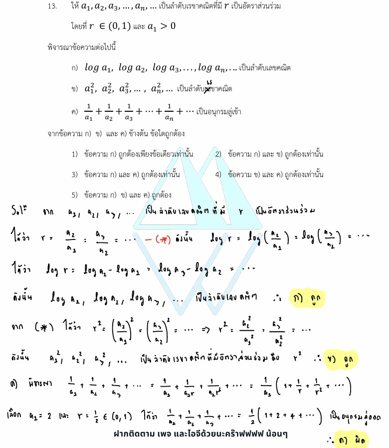

# การแก้โจทย์ **ข้อ 13 ของวิชาคณิตศาสตร์ประยุกต์ 1 (A-Level) ปี 2565** เป็นเรื่องเกี่ยวกับ **ลำดับและอนุกรม (Sequences and Series)** โดยเน้นการตรวจสอบสมบัติของลำดับเรขาคณิตเมื่อนำไปใช้ร่วมกับลอการิทึม การยกกำลัง และการพิจารณาการลู่เข้าของอนุกรมครับ

## **โจทย์ข้อ 13 (A-Level 2565)**

กำหนดให้ $a_1, a_2, a_3, \dots, a_n, \dots$ เป็นลำดับเรขาคณิตที่มี $r$ เป็นอัตราส่วนร่วม โดยที่ $r \in (0, 1)$ และ $a_1 > 0$ พิจารณาข้อความต่อไปนี้:

* **ก)** $\log a_1, \log a_2, \log a_3, \dots, \log a_n, \dots$ เป็นลำดับเลขคณิต
* **ข)** $a_1^2, a_2^2, a_3^2, \dots, a_n^2, \dots$ เป็นลำดับเรขาคณิต
* **ค)** $r^{-1} + r^{-2} + r^{-3} + \dots + r^{-n} + \dots$ เป็นอนุกรมลู่เข้า
**จากข้อความ ก), ข) และ ค) ข้างต้น ข้อใดถูกต้อง**

---

### **วิธีทำอย่างละเอียด**

**1. ตรวจสอบข้อความ ก:**

* จากนิยามลำดับเรขาคณิต พจน์ที่ $n$ คือ $a_n = a_1 r^{n-1}$
* เมื่อนำมาใส่ลอการิทึม: $\log a_n = \log(a_1 r^{n-1})$
* ใช้สมบัติของ Log: $\log a_n = \log a_1 + (n-1)\log r$
* จะเห็นว่านี่คือรูปแบบของ **ลำดับเลขคณิต** ($A + (n-1)D$) โดยมีพจน์แรกคือ $\log a_1$ และผลต่างร่วม ($d$) คือ $\log r$
* **สรุป:** ข้อความ ก **ถูกต้อง**

**2. ตรวจสอบข้อความ ข:**

* พิจารณาลำดับพจน์ใหม่ที่เกิดจากการยกกำลังสอง: $a_n^2 = (a_1 r^{n-1})^2 = a_1^2 (r^2)^{n-1}$
* จะเห็นว่าลำดับใหม่ยังมีโครงสร้างเป็นลำดับเรขาคณิต โดยมีพจน์แรกคือ $a_1^2$ และมีอัตราส่วนร่วมใหม่คือ $r^2$
* **สรุป:** ข้อความ ข **ถูกต้อง**

**3. ตรวจสอบข้อความ ค:**

* พิจารณาอนุกรม $r^{-1} + r^{-2} + r^{-3} + \dots$ ซึ่งก็คือ $\frac{1}{r} + \frac{1}{r^2} + \frac{1}{r^3} + \dots$
* นี่คืออนุกรมเรขาคณิตที่มีอัตราส่วนร่วมคือ $R = \frac{1}{r}$
* โจทย์กำหนดให้ $r \in (0, 1)$ (เช่น $r = 0.5$) ดังนั้น $R = \frac{1}{r}$ จะมีค่ามากกว่า 1 เสมอ (เช่น $1/0.5 = 2$)
* **เงื่อนไขการลู่เข้า:** อนุกรมเรขาคณิตจะลู่เข้า (Convergent) ก็ต่อเมื่อ $|R| < 1$ เท่านั้น
* เนื่องจากในข้อนี้ $R > 1$ อนุกรมจึงเป็น **อนุกรมลู่ออก (Divergent)**
* **สรุป:** ข้อความ ค **ไม่ถูกต้อง**

**ตอบ:** ข้อความ **ก และ ข ถูกต้องเท่านั้น** (ตรงกับตัวเลือกที่ 2)

---

### **เนื้อหาที่เกี่ยวข้องเพื่อศึกษาเพิ่มเติม**

**1. สูตรและนิยามสำคัญ:**

* **ลำดับเรขาคณิต:** $a_n = a_1 r^{n-1}$
* **ลำดับเลขคณิต:** $a_n = a_1 + (n-1)d$
* **อนุกรมเรขาคณิตอนันต์:** จะลู่เข้าเมื่อ $|r| < 1$ และมีผลบวกคือ $S_\infty = \frac{a_1}{1-r}$

**2. ความหมายของตัวแปร:**

* **$a_1$:** พจน์แรกของลำดับ
* **$r$:** อัตราส่วนร่วม (Common Ratio) คือค่าที่นำไปคูณพจน์ปัจจุบันเพื่อให้ได้พจน์ถัดไป
* **$d$:** ผลต่างร่วม (Common Difference) คือค่าที่นำไปบวกพจน์ปัจจุบันเพื่อให้ได้พจน์ถัดไป

### **กลยุทธ์แก้โจทย์ประเภทนี้**

* **เปลี่ยนรูปพจน์ทั่วไป:** เมื่อเจอโจทย์ลำดับที่ถูกแปลง (เช่น ใส่ Log หรือ ยกกำลัง) ให้เขียนพจน์ทั่วไป $a_n = a_1 r^{n-1}$ ลงไปก่อน แล้วจัดรูปเพื่อดูว่าผลลัพธ์เข้าข่ายนิยามลำดับแบบใด
* **ตรวจสอบเงื่อนไขลู่เข้า:** เมื่อเห็นอนุกรมอนันต์ ให้หาอัตราส่วนร่วม ($R$) ให้เจอก่อน แล้วเช็คว่า $|R| < 1$ หรือไม่ หากมากกว่า 1 ให้สรุปว่าลู่ออกทันทีครับ

---

### **ตัวอย่างโจทย์เพิ่มเติมเพื่อฝึกทำ**

**โจทย์:** ถ้า $b_1, b_2, b_3, \dots$ เป็นลำดับเลขคณิตที่มีผลต่างร่วม $d = 2$ จงพิจารณาว่าลำดับ $3^{b_1}, 3^{b_2}, 3^{b_3}, \dots$ เป็นลำดับประเภทใด
**เฉลยแนวคิด:**

1. จากลำดับเลขคณิต $b_n = b_1 + (n-1)(2)$
2. พิจารณาลำดับใหม่: $3^{b_n} = 3^{b_1 + (n-1)(2)} = 3^{b_1} \cdot (3^2)^{n-1} = 3^{b_1} \cdot 9^{n-1}$
3. จะเห็นว่าพจน์นี้อยู่ในรูป $A \cdot R^{n-1}$ โดยมี $A = 3^{b_1}$ และ $R = 9$
**ตอบ:** เป็นลำดับเรขาคณิตที่มีอัตราส่วนร่วมเท่ากับ 9

---

สมบัติของ**ลำดับเรขาคณิต (Geometric Sequence)** ที่ถูกนำมาใช้ในโจทย์ข้อ 13 ของข้อสอบ A-Level คณิตศาสตร์ 1 ปี 2565 มีประเด็นสำคัญที่ควรศึกษาเพิ่มเติมดังนี้ครับ:

### **1. นิยามและพจน์ทั่วไป (General Term)**

ลำดับเรขาคณิตคือลำดับที่อัตราส่วนของพจน์ที่อยู่ติดกันมีค่าคงตัว เรียกว่า **อัตราส่วนร่วม (Common Ratio: $r$)** โดยมีพจน์ทั่วไปคือ:
$$\mathbf{a_n = a_1 r^{n-1}}$$
ในโจทย์ข้อนี้กำหนดเงื่อนไขเพิ่มเติมคือ **$r \in (0, 1)$** (เป็นเศษส่วนบวกที่น้อยกว่า 1) และ **$a_1 > 0$**

### **2. การแปลงลำดับเรขาคณิตเป็นลำดับเลขคณิตด้วยลอการิทึม**

เมื่อเราใส่ $\log$ เข้าไปในพจน์ทั่วไปของลำดับเรขาคณิต จะเกิดการเปลี่ยนรูปแบบการคำนวณจาก **"การคูณ"** เป็น **"การบวก"** ตามสมบัติของ Logarithm:

* $\log a_n = \log(a_1 \cdot r^{n-1})$
* $\log a_n = \log a_1 + (n-1) \log r$
* **Insights:** จะเห็นว่าพจน์ใหม่นี้อยู่ในรูป **$A + (n-1)d$** ซึ่งเป็นนิยามของ **ลำดับเลขคณิต** โดยมีผลต่างร่วม ($d$) เท่ากับ **$\log r$** นั่นเอง

### **3. การยกกำลังสมาชิกในลำดับเรขาคณิต**

หากเรานำสมาชิกทุกตัวในลำดับเรขาคณิตมาลอพิกัด (เช่น ยกกำลังสอง) ลำดับที่ได้จะยังคงเป็น **ลำดับเรขาคณิต** เสมอ:

* พิจารณา $a_n^2 = (a_1 r^{n-1})^2 = a_1^2 (r^2)^{n-1}$
* **Insights:** ลำดับใหม่นี้จะมีพจน์แรกคือ **$a_1^2$** และมีอัตราส่วนร่วมใหม่เป็น **$r^2$**

### **4. เงื่อนไขการลู่เข้าของอนุกรมเรขาคณิตอนันต์**

อนุกรมเรขาคณิตอนันต์ $\sum_{n=1}^{\infty} aR^{n-1}$ จะเป็น **อนุกรมลู่เข้า (Convergent)** ก็ต่อเมื่อ **$|R| < 1$** เท่านั้น

* ในโจทย์ข้อความ ค) อนุกรมคือ $r^{-1} + r^{-2} + r^{-3} + \dots$ หรือ $\frac{1}{r} + \frac{1}{r^2} + \frac{1}{r^3} + \dots$
* อัตราส่วนร่วม ($R$) ของอนุกรมนี้คือ **$1/r$**
* เนื่องจากโจทย์กำหนด $0 < r < 1$ (เช่น $r = 1/2$) จะส่งผลให้ $R = 1/r > 1$ (เช่น $R = 2$)
* **สรุปผล:** เมื่อ $|R| > 1$ อนุกรมนี้จึงเป็น **อนุกรมลู่ออก (Divergent)** ไม่ใช่อนุกรมลู่เข้า

**กลยุทธ์เพิ่มเติม:** ในการทำข้อสอบ เมื่อเจอโจทย์ลักษณะ "ข้อความใดถูกต้อง" เกี่ยวกับลำดับ การสมมติตัวเลขง่ายๆ ที่สอดคล้องกับเงื่อนไข (เช่น ให้ $a_1 = 4$ และ $r = 1/2$) จะช่วยให้ตรวจสอบความถูกต้องของแต่ละข้อความได้รวดเร็วและเห็นภาพชัดเจนขึ้นครับ

---

การแก้โจทย์ **ข้อ 14 ของวิชาคณิตศาสตร์ประยุกต์ 1 (A-Level) ปี 2565** เป็นการทดสอบความรู้เรื่อง **คณิตศาสตร์การเงิน (Financial Mathematics)** โดยเฉพาะเรื่องดอกเบี้ยทบต้นและการหาเงินรวมของเงินฝากที่มีค่าเพิ่มขึ้นเป็นลำดับเรขาคณิตครับ

---

### **โจทย์ข้อ 14 (A-Level 2565)**

สันติฝากเงินกับธนาคารแห่งหนึ่ง ซึ่งให้อัตราดอกเบี้ยร้อยละ 3 ต่อปี และคิดดอกเบี้ยแบบทบต้นทุกเดือน ถ้าสันติฝากเงินทุกสิ้นเดือน เป็นเวลา 12 เดือน โดยสิ้นเดือนที่ 1 ฝากเงิน 3,000 บาท และจำนวนเงินที่ฝากในเดือนถัด ๆ ไป จะเพิ่มขึ้นร้อยละ 5 ของจำนวนเงินที่ฝากในเดือนก่อนหน้า เมื่อสิ้นเดือนที่ 12 หลังจากที่สันติฝากเงินแล้ว สันติจะมีเงินรวมทั้งหมดกี่บาท

---

### **วิธีทำอย่างละเอียด**

**ขั้นตอนที่ 1: วิเคราะห์อัตราดอกเบี้ย**

* ดอกเบี้ยร้อยละ 3 ต่อปี คิดทบต้นทุกเดือน
* อัตราดอกเบี้ยต่องวด (เดือน) คือ $i = \frac{3}{100 \times 12} = 0.0025$
* ตัวคูณการทบต้นในแต่ละเดือนคือ **$1 + i = 1.0025$**

**ขั้นตอนที่ 2: วิเคราะห์จำนวนเงินที่ฝากในแต่ละเดือน**
เงินฝากจะเพิ่มขึ้นร้อยละ 5 ($1.05$ เท่า) จากเดือนก่อนหน้า:

* สิ้นเดือนที่ 1 ฝาก $3,000$ บาท
* สิ้นเดือนที่ 2 ฝาก $3,000(1.05)^1$ บาท
* สิ้นเดือนที่ $i$ ฝาก **$3,000(1.05)^{i-1}$** บาท

**ขั้นตอนที่ 3: คำนวณมูลค่าในอนาคต (Future Value) ณ สิ้นเดือนที่ 12 ของแต่ละงวด**
เนื่องจากฝากทุก "สิ้นเดือน" ระยะเวลาที่เงินแต่ละก้อนจะได้รับดอกเบี้ยจะไม่เท่ากัน:

* **เงินงวดที่ $i$** ฝาก ณ สิ้นเดือนที่ $i$ จะเหลือเวลาสะสมดอกเบี้ยจนถึงสิ้นเดือนที่ 12 เป็นเวลา **$12 - i$ เดือน**
* มูลค่าของเงินงวดที่ $i$ เมื่อถึงสิ้นเดือนที่ 12 คือ:
    $$\text{มูลค่าเงินงวดที่ } i = \text{เงินที่ฝาก} \times (\text{ตัวคูณดอกเบี้ย})^{\text{ระยะเวลา}}$$
    $$\text{มูลค่าเงินงวดที่ } i = [3,000(1.05)^{i-1}] \times (1.0025)^{12-i}$$

**ขั้นตอนที่ 4: หาผลรวมเงินทั้งหมด**
นำมูลค่าของเงินฝากทั้ง 12 งวดมารวมกันโดยใช้สัญลักษณ์ซิกม่า ($\sum$):
$$\text{เงินรวม} = \mathbf{\sum_{i=1}^{12} 3,000(1.05)^{i-1}(1.0025)^{12-i}}$$

**ตอบ:** ตรงกับตัวเลือกที่ 1

---

### **เนื้อหาที่เกี่ยวข้องเพื่อศึกษาเพิ่มเติม**

**1. สูตรดอกเบี้ยทบต้น (Compound Interest):**
$$FV = P(1+i)^n$$

* **$FV$ (Future Value):** เงินรวมในอนาคต
* **$P$ (Principal):** เงินต้น
* **$i$:** อัตราดอกเบี้ยต่องวด
* **$n$:** จำนวนงวดที่คิดดอกเบี้ย

**2. ลำดับเรขาคณิต (Geometric Sequence):**
ในโจทย์ข้อนี้ เงินฝากในแต่ละเดือนมีลักษณะเป็นลำดับเรขาคณิตที่มีพจน์แรก $a_1 = 3,000$ และอัตราส่วนร่วม $r = 1.05$

### **กลยุทธ์แก้โจทย์ประเภทนี้**

* **เปลี่ยนอัตราดอกเบี้ยปีเป็นเดือนเสมอ:** หากโจทย์บอกว่าทบต้นทุกเดือน ต้องหารด้วย 12 เสมอ
* **วาดแผนภาพกระแสเงินสด (Timeline):** เพื่อดูว่าเงินแต่ละก้อนถูกฝากไว้นานกี่เดือน (เช่น ฝากสิ้นเดือนที่ 1 ถึงสิ้นเดือนที่ 12 คือ 11 เดือน ไม่ใช่ 12 เดือน)
* **หาความสัมพันธ์ของงวดที่ $i$:** พยายามเขียนสูตรของเงินฝากงวดใดๆ ในรูปตัวแปร $i$ เพื่อนำไปใส่ในเครื่องหมาย $\sum$ ได้ง่าย

---

### **ตัวอย่างโจทย์เพิ่มเติมเพื่อฝึกทำ**

**โจทย์:** มานะฝากเงินทุกสิ้นเดือน เดือนละ 1,000 บาท เป็นเวลา 6 เดือน ธนาคารให้ดอกเบี้ยร้อยละ 12 ต่อปี ทบต้นทุกเดือน เมื่อสิ้นเดือนที่ 6 มานะจะมีเงินรวมเท่าใด (ในรูปซิกม่า)

**เฉลยแนวคิด:**

1. ดอกเบี้ยต่อเดือน $i = \frac{12}{100 \times 12} = 0.01$
2. เงินฝากแต่ละงวดคงที่คือ $1,000$
3. งวดที่ $i$ จะได้รับดอกเบี้ยนาน $6-i$ เดือน
4. มูลค่าเงินงวดที่ $i$ คือ $1,000(1.01)^{6-i}$
**ตอบ:** $\sum_{i=1}^{6} 1,000(1.01)^{6-i}$

การฝึกฝนจัดรูปสมการในเครื่องหมาย $\sum$ จะช่วยให้คุณประหยัดเวลาในข้อสอบที่มีตัวเลือกซับซ้อนแบบนี้ได้ครับ!

---

วิธีหาผลรวมมูลค่าเงินฝากให้อยู่ในรูป **Sigma ($\sum$)** โดยอ้างอิงจากโจทย์ข้อ 14 ของข้อสอบ A-Level คณิตศาสตร์ 1 ปี 2565 มีขั้นตอนการพิจารณาดังนี้ครับ:

### **1. หาอัตราดอกเบี้ยต่องวด (เดือน)**

โจทย์กำหนดดอกเบี้ยร้อยละ 3 ต่อปี คิดทบต้นทุกเดือน เราต้องแปลงเป็นอัตราดอกเบี้ยต่อเดือนก่อน:

* อัตราดอกเบี้ย ($i$) = $\frac{3}{100 \times 12} = 0.0025$
* ตัวคูณเพิ่มมูลค่าต่อเดือน (Compound Factor) คือ **$1.0025$**

### **2. หาจำนวนเงินที่ฝากในแต่ละงวด ($j$)**

สันติฝากเงินทุกสิ้นเดือน โดยเงินก้อนแรกคือ 3,000 บาท และก้อนถัดไปเพิ่มขึ้นร้อยละ 5 ($1.05$ เท่า):

* เงินฝากงวดที่ 1 = $3,000$ บาท
* เงินฝากงวดที่ 2 = $3,000(1.05)^1$ บาท
* **เงินฝากงวดที่ $j$** = $3,000(1.05)^{j-1}$ บาท

### **3. หาระยะเวลาที่เงินแต่ละก้อนจะได้รับดอกเบี้ย**

เนื่องจากการฝากเงินเกิดขึ้นที่ **"สิ้นเดือน"** เงินแต่ละก้อนจะมีระยะเวลาสะสมดอกเบี้ยจนถึงสิ้นเดือนที่ 12 ไม่เท่ากัน:

* เงินงวดที่ 1 (ฝากสิ้นเดือน 1) ได้รับดอกเบี้ยนาน $12 - 1 = 11$ เดือน
* เงินงวดที่ 2 (ฝากสิ้นเดือน 2) ได้รับดอกเบี้ยนาน $12 - 2 = 10$ เดือน
* **เงินงวดที่ $j$** จะได้รับดอกเบี้ยนาน **$12 - j$** เดือน

### **4. คำนวณมูลค่าในอนาคตของเงินแต่ละงวด**

มูลค่าเงินงวดที่ $j$ เมื่อถึงสิ้นเดือนที่ 12 จะคำนวณจาก:
$$\text{เงินฝากงวดที่ } j \times (\text{ตัวคูณดอกเบี้ย})^{\text{ระยะเวลาที่ได้รับดอกเบี้ย}}$$
จะได้สูตรคือ: **$3,000(1.05)^{j-1} \times (1.0025)^{12-j}$**

### **5. เขียนในรูปผลรวม Sigma ($\sum$)**

เมื่อเราต้องการทราบเงินรวมทั้งหมดของเงินฝากทั้ง 12 งวด ให้นำมูลค่าของทุกงวดมาบวกกันโดยใช้สัญลักษณ์ Sigma โดยเปลี่ยนตัวแปร $j$ เป็นดัชนีของการรวม (เช่น $i$):
$$\text{เงินรวมทั้งหมด} = \mathbf{\sum_{i=1}^{12} 3,000(1.05)^{i-1}(1.0025)^{12-i}}$$

**สรุปกลยุทธ์:** กุญแจสำคัญคือการแยกให้ออกว่าพจน์ใดเป็น **เงินต้นที่เปลี่ยนไป** (ตามลำดับเรขาคณิต 1.05) และพจน์ใดเป็น **ดอกเบี้ยทบต้น** (1.0025) ที่ขึ้นอยู่กับระยะเวลาที่เงินก้อนนั้นอยู่ในบัญชีครับ

---

จากแหล่งข้อมูลและโจทย์ข้อ 14 ในข้อสอบ A-Level คณิตศาสตร์ 1 ปี 2565 สามารถสรุปสูตรและหลักการคำนวณมูลค่าเงินในอนาคต (Future Value) ได้ดังนี้ครับ

### **1. สูตรพื้นฐานของดอกเบี้ยทบต้น (Compound Interest)**

สำหรับการฝากเงินก้อนเดียวทิ้งไว้ในบัญชี:
$$\mathbf{FV = P(1+i)^n}$$

* **$FV$ (Future Value):** มูลค่าเงินในอนาคต หรือเงินรวม
* **$P$ (Principal):** เงินต้น
* **$i$:** อัตราดอกเบี้ยต่องวด (Interest rate per period)
* **$n$:** จำนวนงวดทั้งหมดที่ได้รับดอกเบี้ย

### **2. การหาอัตราดอกเบี้ยต่องวด ($i$)**

หากโจทย์กำหนดดอกเบี้ยเป็นรายปีแต่คิดทบต้นทุกเดือน ต้องแปลงเป็นดอกเบี้ยต่อเดือนเสมอ:

* **สูตร:** $i = \frac{\text{อัตราดอกเบี้ยต่อปี}}{100 \times 12}$
* **ตัวอย่าง:** ดอกเบี้ยร้อยละ 3 ต่อปี คิดทบต้นทุกเดือน จะได้ $i = \frac{3}{1200} = 0.0025$ และตัวคูณดอกเบี้ยคือ **$1.0025$**

### **3. สูตรมูลค่าเงินรวมในรูป Sigma ($\sum$) สำหรับการฝากเป็นงวด**

ในกรณีที่มีการฝากเงิน **"ทุกสิ้นเดือน"** และเงินฝากแต่ละงวดมีค่าไม่เท่ากัน (เช่น เพิ่มขึ้นเป็นลำดับเรขาคณิต) สูตรจะพิจารณาจากเงินแต่ละก้อนแยกกัน:

* **เงินฝากงวดที่ $i$ ($R_i$):** หากเงินฝากเพิ่มขึ้นร้อยละ 5 ทุกเดือน เงินงวดที่ $i$ จะเท่ากับ $3,000(1.05)^{i-1}$
* **ระยะเวลาสะสมดอกเบี้ย:** หากฝากตอน **"สิ้นเดือน"** ที่ $i$ จนถึงสิ้นเดือนที่ 12 เงินก้อนนั้นจะได้รับดอกเบี้ยเป็นเวลา **$12 - i$** งวด
* **มูลค่าอนาคตของเงินงวดที่ $i$:** $[3,000(1.05)^{i-1}] \times (1.0025)^{12-i}$

**สูตรเงินรวมทั้งหมด (Total FV):**
$$\mathbf{\sum_{i=1}^{n} R_i(1+i)^{n-i}}$$
โดยอ้างอิงจากโจทย์ข้อ 14 จะได้คำตอบในรูป:
$$\mathbf{\sum_{i=1}^{12} 3,000(1.05)^{i-1}(1.0025)^{12-i}}$$

### **กลยุทธ์สำคัญในการใช้สูตร**

1. **ตรวจสอบจุดที่ฝาก:** ต้องดูว่าฝาก "ต้นเดือน" หรือ "สิ้นเดือน" เพราะจะมีผลต่อจำนวนงวดที่ได้รับดอกเบี้ย (ถ้าฝากสิ้นเดือนที่ 1 ไปถึงสิ้นเดือนที่ 12 จะคิดดอกเบี้ยแค่ 11 งวด)
2. **ระวังตัวแปร $i$ และ $r$:** อย่าสับสนระหว่างอัตราดอกเบี้ย ($i$) กับอัตราการเพิ่มขึ้นของเงินฝาก ($r$)
3. **การเขียนในรูป Sigma:** พจน์ที่เป็นดอกเบี้ยทบต้นจะมีเลขชี้กำลังเป็น **(จำนวนงวดทั้งหมด - งวดที่ฝาก)** เสมอ
