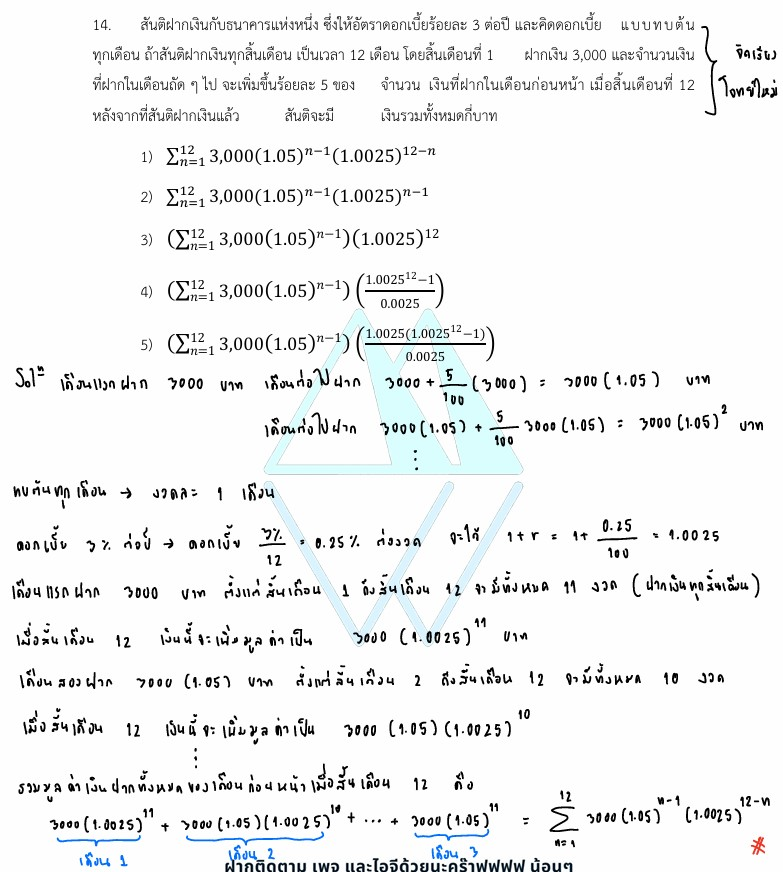

# การแก้โจทย์ **ข้อ 14 ของวิชาคณิตศาสตร์ประยุกต์ 1 (A-Level) ปี 2565** เป็นการทดสอบความเข้าใจเรื่อง **คณิตศาสตร์การเงิน (Financial Mathematics)** โดยเฉพาะเรื่องการหาเงินรวม (Future Value) ของการฝากเงินที่มีลักษณะเป็นงวดๆ และจำนวนเงินฝากมีการเปลี่ยนแปลงตามลำดับเรขาคณิตครับ,

## **เฉลยละเอียดโจทย์ข้อ 14 (A-Level 2565)**

**โจทย์:** สันติฝากเงินกับธนาคารที่ให้อัตราดอกเบี้ยร้อยละ 3 ต่อปี คิดดอกเบี้ยแบบทบต้นทุกเดือน สันติฝากเงินทุกสิ้นเดือนเป็นเวลา 12 เดือน เดือนแรกฝาก 3,000 บาท และเดือนถัดๆ ไปฝากเพิ่มขึ้นร้อยละ 5 ของเดือนก่อนหน้า เมื่อสิ้นเดือนที่ 12 สันติจะมีเงินรวมกี่บาท,

---

### **วิธีทำอย่างละเอียด**

**ขั้นตอนที่ 1: วิเคราะห์อัตราดอกเบี้ยต่องวด**

* อัตราดอกเบี้ย 3% ต่อปี คิดทบต้นทุกเดือน
* เราต้องหาอัตราดอกเบี้ยต่อเดือน ($i$) = $\frac{3}{100 \times 12} = 0.0025$
* ตัวคูณการทบต้น (Interest Factor) ในแต่ละเดือนคือ **$1 + i = 1.0025$**

**ขั้นตอนที่ 2: วิเคราะห์จำนวนเงินที่ฝากในแต่ละเดือน**
เงินฝากจะเพิ่มขึ้นร้อยละ 5 ($1.05$ เท่า) จากเดือนก่อนหน้า:

* สิ้นเดือนที่ 1 ฝาก $3,000$ บาท
* สิ้นเดือนที่ 2 ฝาก $3,000(1.05)^1$ บาท
* สิ้นเดือนที่ $i$ จะฝากเงินจำนวน **$3,000(1.05)^{i-1}$** บาท

**ขั้นตอนที่ 3: คำนวณมูลค่าเงินฝากแต่ละงวด ณ สิ้นเดือนที่ 12**
เนื่องจากฝากเงินทุก "สิ้นเดือน" ระยะเวลาที่เงินแต่ละก้อนจะสะสมดอกเบี้ยจะไม่เท่ากัน:

* **เงินงวดที่ $i$** ฝาก ณ สิ้นเดือนที่ $i$ จะเหลือเวลาสะสมดอกเบี้ยจนถึงสิ้นเดือนที่ 12 เป็นเวลา **$12 - i$ เดือน**,
* มูลค่าในอนาคตของเงินงวดที่ $i$ คือ:
    $$\text{เงินที่ฝาก} \times (1+i)^{\text{ระยะเวลา}}$$
    $$\mathbf{FV_i = [3,000(1.05)^{i-1}] \times (1.0025)^{12-i}}$$

**ขั้นตอนที่ 4: สรุปผลรวมในรูป Sigma ($\sum$)**
นำมูลค่าเงินฝากทั้ง 12 งวดมารวมกัน:
$$\text{เงินรวมทั้งหมด} = \mathbf{\sum_{i=1}^{12} 3,000(1.05)^{i-1}(1.0025)^{12-i}}$$

**ตอบ:** ตรงกับตัวเลือกที่ 1

---

### **เนื้อหาที่เกี่ยวข้องเพื่อศึกษาเพิ่มเติม**

**1. สูตรดอกเบี้ยทบต้น (Compound Interest):**
$$FV = P(1+i)^n$$

* **$FV$ (Future Value):** มูลค่าในอนาคต (เงินต้นรวมดอกเบี้ย)
* **$P$ (Principal):** เงินต้น
* **$i$ (Interest rate per period):** อัตราดอกเบี้ยต่องวด (ถ้าบอกเป็นรายปีต้องหารจำนวนงวดใน 1 ปี)
* **$n$:** จำนวนงวดทั้งหมด

**2. ลำดับเรขาคณิต (Geometric Sequence):**
จำนวนเงินที่สันติฝากในแต่ละเดือนมีลักษณะเป็นลำดับเรขาคณิต โดยมีพจน์แรก $a_1 = 3,000$ และอัตราส่วนร่วม $r = 1.05$ (มาจาก $1 + 0.05$)

---

### **กลยุทธ์แก้โจทย์ประเภทนี้**

* **ตรวจสอบเวลาการฝาก:** ต้องระวังว่าฝาก **"ต้นเดือน"** หรือ **"สิ้นเดือน"** หากฝากสิ้นเดือนที่ 1 เดือนนั้นจะยังไม่ได้ดอกเบี้ย ต้องรอไปจนสิ้นเดือนที่ 2 ถึงจะได้ดอกเบี้ยครั้งแรก (ทำให้เลขชี้กำลังของดอกเบี้ยคืองวดสุดท้ายลบงวดที่ฝาก),
* **การแปลงอัตราดอกเบี้ย:** โจทย์มักให้อัตราดอกเบี้ยต่อปีมาเสมอ ต้องแปลงเป็นต่องวด (เดือน/ไตรมาส) ให้สัมพันธ์กับการทบต้น
* **เขียนแจกแจงทีละงวด:** หากสับสนการเขียน Sigma ให้ลองเขียนเงินฝากงวดแรกและงวดที่สองในรูปสมการก่อน จะช่วยให้เห็นรูปแบบความสัมพันธ์ของดัชนี $i$ ได้ชัดเจนขึ้น

---

### **ตัวอย่างโจทย์เพิ่มเติมเพื่อฝึกทำ**

**โจทย์:** สมชายฝากเงินทุกสิ้นเดือน เดือนละ 1,000 บาท เป็นเวลา 10 เดือน ธนาคารให้อัตราดอกเบี้ยร้อยละ 6 ต่อปี ทบต้นทุกเดือน เมื่อสิ้นเดือนที่ 10 สมชายจะมีเงินรวมเท่าใด (เขียนในรูปซิกม่า)

**เฉลยแนวคิด:**

1. อัตราดอกเบี้ยต่อเดือน $i = \frac{6}{100 \times 12} = 0.005$ ดังนั้นตัวคูณคือ $1.005$
2. เงินฝากแต่ละงวดคงที่คือ $1,000$ (ไม่มีการเพิ่มขึ้นแบบลำดับเรขาคณิตเหมือนข้อของสันติ)
3. เงินงวดที่ $i$ จะได้รับดอกเบี้ยนาน $10 - i$ เดือน
4. มูลค่าเงินงวดที่ $i$ คือ $1,000(1.005)^{10-i}$
**ตอบ:** $\sum_{i=1}^{10} 1,000(1.005)^{10-i}$
