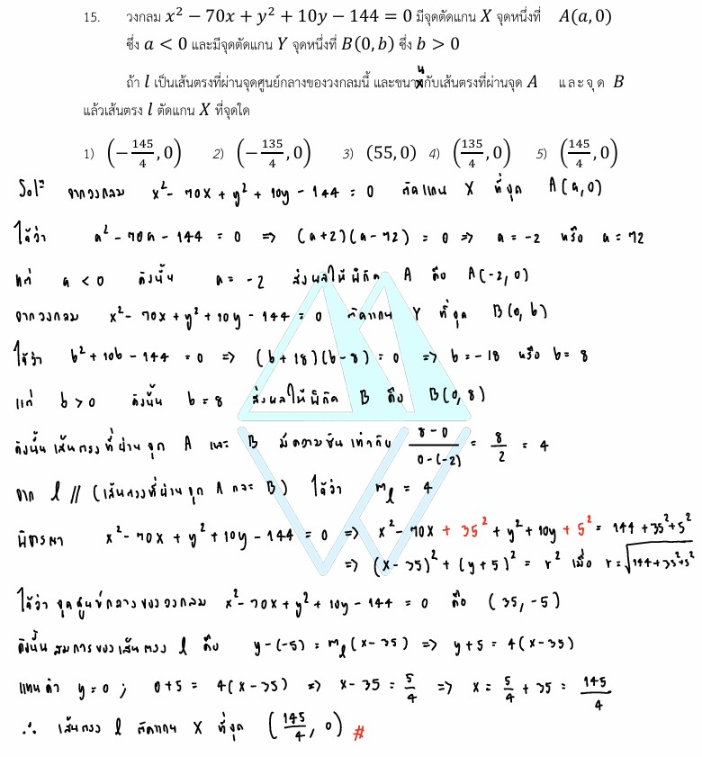

# เฉลยข้อ 15 วิชาคณิตศาสตร์ประยุกต์ 1 (A-Level) ปี 2565

การแก้โจทย์ **ข้อ 15 ของวิชาคณิตศาสตร์ประยุกต์ 1 (A-Level) ปี 2565** เป็นการบูรณาการความรู้เรื่อง **เรขาคณิตวิเคราะห์ (Analytic Geometry)** โดยเฉพาะสมบัติของ **วงกลม** และ **เส้นตรง** ครับ

## **เฉลยละเอียดโจทย์ข้อ 15 (A-Level 2565)**

**โจทย์:** วงกลม $x^2 - 70x + y^2 + 10y - 144 = 0$ มีจุดตัดแกน $X$ จุดหนึ่งที่ $A(a, 0)$ ซึ่ง $a < 0$ และมีจุดตัดแกน $Y$ จุดหนึ่งที่ $B(0, b)$ ซึ่ง $b > 0$ ถ้า $L$ เป็นเส้นตรงที่ผ่านจุดศูนย์กลางของวงกลมนี้และขนานกับเส้นตรงที่ผ่านจุด $A$ และจุด $B$ แล้วเส้นตรง $L$ ตัดแกน $X$ ที่จุดใด

---

**วิธีทำอย่างละเอียด:**

**ขั้นตอนที่ 1: หาพิกัดของจุด $A$ (จุดตัดแกน $X$)**

* หาจุดตัดแกน $X$ โดยแทนค่า **$y = 0$** ในสมการวงกลม:
    $$x^2 - 70x + 0^2 + 10(0) - 144 = 0 \implies x^2 - 70x - 144 = 0$$
* แยกตัวประกอบ: $(x - 72)(x + 2) = 0$ จะได้ $x = 72$ หรือ $x = -2$
* โจทย์ระบุ $a < 0$ ดังนั้น **$a = -2$** พิกัดจุดคือ **$A(-2, 0)$**

**ขั้นตอนที่ 2: หาพิกัดของจุด $B$ (จุดตัดแกน $Y$)**

* หาจุดตัดแกน $Y$ โดยแทนค่า **$x = 0$** ในสมการวงกลม:
    $$0^2 - 70(0) + y^2 + 10y - 144 = 0 \implies y^2 + 10y - 144 = 0$$
* แยกตัวประกอบ: $(y + 18)(y - 8) = 0$ จะได้ $y = -18$ หรือ $y = 8$
* โจทย์ระบุ $b > 0$ ดังนั้น **$b = 8$** พิกัดจุดคือ **$B(0, 8)$**

**ขั้นตอนที่ 3: หาความชันของเส้นตรงที่ผ่านจุด $A$ และ $B$**

* ใช้สูตรความชัน $m = \frac{y_2 - y_1}{x_2 - x_1}$
    $$m_{AB} = \frac{8 - 0}{0 - (-2)} = \frac{8}{2} = 4$$
* เนื่องจากเส้นตรง $L$ ขนานกับเส้นตรง $AB$ ดังนั้น **ความชันของ $L$ ($m_L$) ต้องเท่ากับ 4**

**ขั้นตอนที่ 4: หาจุดศูนย์กลางของวงกลม**

* จากสมการ $x^2 - 70x + y^2 + 10y - 144 = 0$ จัดรูปโดยการ **ทำเป็นกำลังสองสมบูรณ์**:
    $$(x^2 - 70x + 35^2) + (y^2 + 10y + 5^2) = 144 + 1225 + 25$$
    $$(x - 35)^2 + (y + 5)^2 = 1394$$
* จะได้จุดศูนย์กลาง $(h, k) = \mathbf{(35, -5)}$

**ขั้นตอนที่ 5: หาสมการเส้นตรง $L$ และจุดตัดแกน $X$**

* สร้างสมการเส้นตรง $L$ ผ่านจุด $(35, -5)$ ด้วยความชัน $m = 4$:
    $$y - (-5) = 4(x - 35) \implies y + 5 = 4x - 140$$
* หาจุดตัดแกน $X$ ของเส้นตรง $L$ โดยแทนค่า **$y = 0$**:
    $$0 + 5 = 4x - 140 \implies 4x = 145 \implies \mathbf{x = \frac{145}{4}}$$

**ตอบ:** เส้นตรง $L$ ตัดแกน $X$ ที่จุด **$(\frac{145}{4}, 0)$** (ตรงกับตัวเลือกที่ 5)

---

### **เนื้อหาที่เกี่ยวข้องเพื่อศึกษาเพิ่มเติม**

**1. ภาคตัดกรวย (วงกลม):**

* **รูปแบบทั่วไป:** $x^2 + y^2 + Dx + Ey + F = 0$
* **การหาจุดศูนย์กลางแบบรวดเร็ว:** $(h, k) = (-\frac{D}{2}, -\frac{E}{2})$ ในข้อนี้จะได้ $(-\frac{-70}{2}, -\frac{10}{2}) = (35, -5)$

**2. เรขาคณิตวิเคราะห์ (เส้นตรง):**

* **เส้นตรงที่ขนานกัน:** จะมีความชันเท่ากันเสมอ ($m_1 = m_2$)
* **จุดตัดแกน:** จุดตัดแกน $X$ คือตำแหน่งที่ $y=0$ และจุดตัดแกน $Y$ คือตำแหน่งที่ $x=0$

### **กลยุทธ์แก้โจทย์ประเภทนี้**

* **แตกโจทย์เป็นส่วนๆ:** อย่าพยายามแก้ทั้งก้อน ให้เริ่มจากหาจุดตัดเพื่อระบุพิกัด $A, B$ จากนั้นหาจุดสำคัญของวงกลม (จุดศูนย์กลาง) แล้วค่อยสร้างความสัมพันธ์ของเส้นตรงในตอนท้าย
* **ใช้สูตรลัดช่วยเช็ค:** การหาจุดศูนย์กลางจาก $-\frac{D}{2}$ และ $-\frac{E}{2}$ จะเร็วกว่าการทำกำลังสองสมบูรณ์ในห้องสอบ ช่วยลดเวลาและข้อผิดพลาดในการคำนวณเลขยกกำลังเยอะๆ ครับ

---

### **ตัวอย่างโจทย์เพิ่มเติมเพื่อฝึกทำ**

**โจทย์:** วงกลม $x^2 + y^2 - 4x - 6y - 12 = 0$ มีจุดศูนย์กลางที่ $C$ จงหาสมการเส้นตรงที่ผ่านจุด $C$ และขนานกับเส้นตรง $y = 2x + 5$
**เฉลยแนวคิด:**

1. หาจุดศูนย์กลาง $C$: $(h, k) = (-\frac{-4}{2}, -\frac{-6}{2}) = (2, 3)$
2. หาความชัน: เส้นตรงขนานกับ $y = 2x + 5$ ดังนั้น $m = 2$
3. สร้างสมการ: $y - 3 = 2(x - 2) \implies y = 2x - 1$
**ตอบ:** $y = 2x - 1$

การฝึกฝนการหาจุดศูนย์กลางและการสร้างสมการเส้นตรงจะช่วยให้น้องๆ ทำโจทย์แนวนี้ได้คล่องแคล่วขึ้นครับ!

---

สำหรับการหาจุดศูนย์กลางของวงกลมในข้อ 15 จากสมการ $x^2 - 70x + y^2 + 10y - 144 = 0$ นอกจากวิธี **"จัดรูปกำลังสองสมบูรณ์"** ที่ปรากฏในแหล่งข้อมูลแล้ว, ยังมีวิธีอื่นๆ ที่ช่วยให้หาคำตอบได้รวดเร็วขึ้นดังนี้ครับ:

### **1. วิธีใช้สูตรลัดจากรูปทั่วไป (General Form)**

หากสมการวงกลมอยู่ในรูปทั่วไปคือ $x^2 + y^2 + Dx + Ey + F = 0$ เราสามารถหาจุดศูนย์กลาง $(h, k)$ ได้ทันทีจากสูตร:

* **$h = -\frac{D}{2}$**
* **$k = -\frac{E}{2}$**

**การประยุกต์ใช้กับโจทย์ข้อ 15:**

* จากสมการ $D = -70$ และ $E = 10$
* จะได้ $h = -\frac{-70}{2} = \mathbf{35}$
* จะได้ $k = -\frac{10}{2} = \mathbf{-5}$
* **จุดศูนย์กลางคือ $(35, -5)$** ซึ่งตรงกับวิธีจัดรูปในแหล่งข้อมูล แต่วิธีนี้จะเร็วกว่ามากในห้องสอบ

---

### **2. วิธีใช้แคลคูลัส (Partial Derivatives)**

วิธีนี้เป็นเทคนิคที่อยู่นอกเหนือจากบทเรียนปกติเล็กน้อย แต่ใช้ได้ผลเสมอ โดยการหา **อนุพันธ์ย่อย (Differential)** เทียบกับตัวแปรทีละตัวแล้วจับเท่ากับ 0:

* **หาค่า $x$:** ดิฟสมการเทียบกับ $x$ (มอง $y$ เป็นค่าคงที่):
    $$\frac{d}{dx}(x^2 - 70x) = 2x - 70 = 0 \implies \mathbf{x = 35}$$
* **หาค่า $y$:** ดิฟสมการเทียบกับ $y$ (มอง $x$ เป็นค่าคงที่):
    $$\frac{d}{dy}(y^2 + 10y) = 2y + 10 = 0 \implies \mathbf{y = -5}$$
* **จุดศูนย์กลางคือ $(35, -5)$**

---

### **3. วิธีใช้สมบัติของจุดตัดแกน (ในกรณีพิเศษ)**

แม้ว่าจุดตัดแกนในข้อนี้ $A(-2, 0)$ และจุดตัดอีกจุด $x=72$ (ซึ่งได้จากการแก้สมการ $x^2 - 70x - 144 = 0$) จะไม่ใช่เส้นผ่านศูนย์กลางโดยตรง แต่เราทราบว่า **เส้นตรงที่ลากตั้งฉากและแบ่งครึ่งคอร์ดใดๆ จะต้องผ่านจุดศูนย์กลางเสมอ**:

* คอร์ดบนแกน X คือจุด $(-2, 0)$ และ $(72, 0)$
* จุดกึ่งกลางของคอร์ดนี้คือ $\frac{-2 + 72}{2} = \mathbf{35}$ (ซึ่งก็คือค่า $h$)
* คอร์ดบนแกน Y คือจุด $(0, 8)$ และ $(0, -18)$
* จุดกึ่งกลางของคอร์ดนี้คือ $\frac{8 + (-18)}{2} = \mathbf{-5}$ (ซึ่งก็คือค่า $k$)

**สรุปกลยุทธ์:**
ในการสอบ A-Level **วิธีที่ 1 (สูตรลัด)** เป็นวิธีที่แนะนำที่สุดเพราะประหยัดเวลาและลดความเสี่ยงในการคิดเลขผิดจากการกระจายกำลังสองครับ ส่วนวิธีที่ 3 จะมีประโยชน์มากหากโจทย์ไม่ได้ให้สมการวงกลมมาตรงๆ แต่ให้พิกัดจุดตัดบนแกนมาแทนครับ

---

จากโจทย์ข้อ 15 ในข้อสอบ A-Level คณิตศาสตร์ 1 ปี 2565 ที่กำหนดสมการวงกลมเป็น **$x^2 - 70x + y^2 + 10y - 144 = 0$** เราสามารถสรุปสูตรลัดและเทคนิคในการหาจุดศูนย์กลาง $(h, k)$ เพื่อใช้ในห้องสอบให้รวดเร็วขึ้นได้ดังนี้ครับ:

### **1. สูตรลัดจากสมการรูปแบบทั่วไป (General Form)**

หากสมการวงกลมอยู่ในรูป $x^2 + y^2 + Dx + Ey + F = 0$ (โดยที่สัมประสิทธิ์หน้า $x^2$ และ $y^2$ ต้องเป็น 1) คุณสามารถหาจุดศูนย์กลางได้ทันทีจากสูตร:

* **$h = -\frac{D}{2}$**
* **$k = -\frac{E}{2}$**

**ตัวอย่างจากโจทย์ข้อ 15:**

* ค่า $D = -70$ และ $E = 10$
* จะได้ $h = -\frac{-70}{2} = \mathbf{35}$
* จะได้ $k = -\frac{10}{2} = \mathbf{-5}$
* **จุดศูนย์กลางคือ $(35, -5)$**

---

### **2. วิธีจัดรูปกำลังสองสมบูรณ์แบบรวดเร็ว (Completing the Square)**

จากวิธีทำในเฉลย หากคุณต้องการจัดรูปให้เป็น $(x - h)^2 + (y - k)^2 = r^2$:

* **ขั้นตอน:** นำสัมประสิทธิ์หน้า $x$ และ $y$ มา **"หารด้วย 2 แล้วเปลี่ยนเครื่องหมาย"**
* จาก $-70x \rightarrow (-70 \div 2) = -35 \rightarrow$ เปลี่ยนเป็น **$+35$** (แต่ในวงเล็บจะเป็น $(x - 35)$)
* จาก $+10y \rightarrow (10 \div 2) = +5 \rightarrow$ เปลี่ยนเป็น **$-5$** (แต่ในวงเล็บจะเป็น $(y + 5)$)
* **สรุป:** เลขในวงเล็บจะเป็นเครื่องหมายตรงข้ามกับพิกัดจุดศูนย์กลางเสมอ

---

### **3. วิธีใช้สมบัติจุดกึ่งกลางคอร์ด (กรณีทราบจุดตัดแกน)**

ในโจทย์ข้อนี้มีการหาจุดตัดแกน X และแกน Y:

* จุดตัดแกน X คือ $x = -2$ และ $x = 72$
* **สูตรลัดหา $h$:** นำจุดตัดบนแกน X สองจุดมาหาค่าเฉลี่ย $\frac{-2 + 72}{2} = \mathbf{35}$
* จุดตัดแกน Y คือ $y = 8$ และ $y = -18$
* **สูตรลัดหา $k$:** นำจุดตัดบนแกน Y สองจุดมาหาค่าเฉลี่ย $\frac{8 + (-18)}{2} = \mathbf{-5}$
* วิธีนี้ใช้ได้ดีเมื่อโจทย์บอกจุดตัดแกนหรือจุดปลายของเส้นผ่านศูนย์กลางมาให้ครับ

**ข้อควรระวัง:** ก่อนใช้สูตรลัดในข้อ 1 **ต้องตรวจสอบให้แน่ใจว่าสัมประสิทธิ์หน้า $x^2$ และ $y^2$ เป็น 1 เท่านั้น** หากเป็นตัวเลขอื่น (เช่น $2x^2 + 2y^2...$) ต้องนำตัวเลขนั้นไปหารตลอดทั้งสมการก่อนจึงจะใช้สูตร $-\frac{D}{2}$ และ $-\frac{E}{2}$ ได้ถูกต้องครับ
