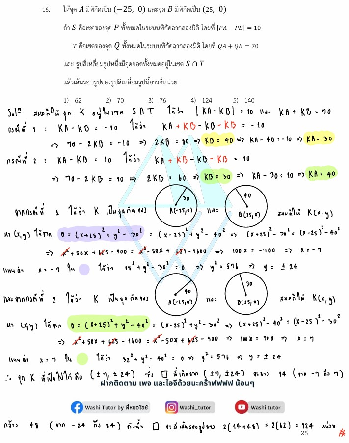

# เฉลยข้อ 16 คณิตศาสตร์ประยุกต์ 1 (A-Level) ปี 2565

การแก้โจทย์ **ข้อ 16 ของวิชาคณิตศาสตร์ประยุกต์ 1 (A-Level) ปี 2565** เป็นการทดสอบความรู้เรื่อง **เรขาคณิตวิเคราะห์และภาคตัดกรวย** โดยอาศัยนิยามของวงรีและไฮเพอร์โบลาผ่านระยะห่างจากจุดโฟกัสครับ

## **เฉลยละเอียดโจทย์ข้อ 16 (A-Level 2565)**

**โจทย์:** ให้จุด $A(-25, 0)$ และจุด $B(25, 0)$ ถ้า $C$ คือเซตของจุด $P$ ที่ $|PA - PB| = 10$ และ $E$ คือเซตของจุด $P$ ที่ $PA + PB = 70$ โดยสี่เหลี่ยมรูปหนึ่งมีจุดยอดอยู่ในเซต $C \cap E$ จงหาความยาวเส้นรอบรูปของสี่เหลี่ยมนี้

---

**วิธีทำอย่างละเอียด:**

**ขั้นตอนที่ 1: วิเคราะห์นิยามของภาคตัดกรวย**

* **เซต $C$:** $|PA - PB| = 10$ คือนิยามของ **ไฮเพอร์โบลา** ที่มีจุด $A$ และ $B$ เป็นจุดโฟกัส โดยมีค่า $2a = 10$
* **เซต $E$:** $PA + PB = 70$ คือนิยามของ **วงรี** ที่มีจุด $A$ และ $B$ เป็นจุดโฟกัสร่วมกัน โดยมีค่า $2a = 70$
* จุดยอดของสี่เหลี่ยมคือจุดตัดของกราฟทั้งสอง ($C \cap E$)

**ขั้นตอนที่ 2: หาค่าระยะทาง $PA$ และ $PB$ ณ จุดตัด**
ให้ $d_1 = PA$ และ $d_2 = PB$ จากเงื่อนไขโจทย์จะได้ระบบสมการ:

1. $d_1 + d_2 = 70$
2. $|d_1 - d_2| = 10$ ซึ่งแยกได้เป็น 2 กรณีคือ $d_1 - d_2 = 10$ หรือ $d_2 - d_1 = 10$

* **กรณีที่ 1 ($d_1 - d_2 = 10$):** นำสมการ (1) + (2) จะได้ $2d_1 = 80 \implies d_1 = 40$ และจะได้ $d_2 = 30$
* **กรณีที่ 2 ($d_2 - d_1 = 10$):** จะได้ $d_2 = 40$ และ $d_1 = 30$

**ขั้นตอนที่ 3: หาพิกัดของจุดตัด $(x, y)$**
สมมติจุดตัดคือ $K(x, y)$ และใช้สูตรระยะทางจากจุดโฟกัส $(\pm 25, 0)$:

* จากกรณีที่ 1: $(x+25)^2 + y^2 = 40^2$ และ $(x-25)^2 + y^2 = 30^2$
* นำสมการมาลบกัน: $[(x^2 + 50x + 625) - (x^2 - 50x + 625)] = 1600 - 900 \implies 100x = 700 \implies \mathbf{x = 7}$
* แทนค่า $x=7$ เพื่อหา $y$: $(7-25)^2 + y^2 = 900 \implies (-18)^2 + y^2 = 900 \implies 324 + y^2 = 900 \implies y^2 = 576 \implies \mathbf{y = \pm 24}$
* จะได้จุดตัด 2 จุดแรกคือ $(7, 24)$ และ $(7, -24)$
* ในทำนองเดียวกัน จากกรณีที่ 2 จะได้จุดตัดอีก 2 จุดที่สมมาตรกันคือ **$x = -7$** และ $y = \pm 24$

**ขั้นตอนที่ 4: คำนวณความยาวเส้นรอบรูป**
จุดยอดทั้ง 4 คือ $(7, 24), (7, -24), (-7, 24), (-7, -24)$ ซึ่งประกอบกันเป็นรูปสี่เหลี่ยมผืนผ้า:

* ความกว้าง (ตามแนวแกน X): $7 - (-7) = 14$ หน่วย
* ความยาว (ตามแนวแกน Y): $24 - (-24) = 48$ หน่วย
* เส้นรอบรูป = $2 \times (\text{กว้าง} + \text{ยาว}) = 2 \times (14 + 48) = 2 \times 62 = \mathbf{124}$ **หน่วย**

**ตอบ:** 124 (ตรงกับตัวเลือกที่ 4)

---

### **เนื้อหาที่เกี่ยวข้องเพื่อศึกษาเพิ่มเติม**

**1. สูตรและนิยามสำคัญ:**

* **วงรี (Ellipse):** ผลรวมระยะทางจากจุดบนวงรีไปยังจุดโฟกัสทั้งสองคงที่ ($PF_1 + PF_2 = 2a$)
* **ไฮเพอร์โบลา (Hyperbola):** ผลต่างสัมบูรณ์ของระยะทางจากจุดบนไฮเพอร์โบลาไปยังจุดโฟกัสทั้งสองคงที่ ($|PF_1 - PF_2| = 2a$)
* **จุดโฟกัส ($c$):** ระยะห่างจากจุดศูนย์กลางถึงจุดโฟกัส ในข้อนี้คือ 25

**2. ความหมายของตัวแปร:**

* **$PA, PB$:** ระยะห่างระหว่างจุดใดๆ $P$ กับจุดคงที่ $A$ และ $B$ (ซึ่งทำหน้าที่เป็นจุดโฟกัส)
* **$C \cap E$:** จุดร่วมที่อยู่ทั้งบนไฮเพอร์โบลาและวงรีพร้อมกัน (จุดตัด)

---

### **กลยุทธ์แก้โจทย์ประเภทนี้**

* **ใช้นิยามเรขาคณิตแทนสมการ:** ข้อนี้หากพยายามสร้างสมการมาตรฐานของวงรีและไฮเพอร์โบลาจะคำนวณเลขเยอะมาก การใช้ความสัมพันธ์ $PA \pm PB$ เพื่อหาค่าระยะห่างจริง ($d_1, d_2$) ก่อนจะช่วยให้หาพิกัดได้ง่ายกว่ามาก
* **ใช้สมมาตร:** กราฟทั้งสองมีจุดศูนย์กลางที่ $(0, 0)$ และมีแกนสมมาตรเป็นแกน X และ Y ทำให้เมื่อเราหาพิกัดในจตุภาคแรกได้ เราจะทราบพิกัดอีก 3 จุดที่เหลือทันที

---

### **ตัวอย่างโจทย์เพิ่มเติมเพื่อฝึกทำ**

**โจทย์:** กำหนดจุด $F_1(-5, 0)$ และ $F_2(5, 0)$ ถ้าจุด $P(x, y)$ สอดคล้องกับ $PF_1 + PF_2 = 20$ และ $|PF_1 - PF_2| = 4$ จงหาพิกัด $x$ ของจุด $P$ ทั้งหมด
**เฉลยแนวคิด:**

1. แก้ระบบสมการ $d_1 + d_2 = 20$ และ $d_1 - d_2 = 4$ จะได้ $d_1 = 12, d_2 = 8$
2. ใช้สูตรระยะทาง: $(x+5)^2 + y^2 = 12^2$ และ $(x-5)^2 + y^2 = 8^2$
3. ลบสมการ: $(x^2+10x+25) - (x^2-10x+25) = 144 - 64$
4. $20x = 80 \implies x = 4$
5. ในอีกกรณีที่ $d_2 - d_1 = 4$ จะได้ $x = -4$
**ตอบ:** $x = 4$ และ $x = -4$

---

จากโจทย์ข้อ 16 ของข้อสอบ A-Level คณิตศาสตร์ 1 ปี 2565 สามารถสรุปสมบัติของ**ไฮเพอร์โบลา (Hyperbola)** ที่ถูกนำมาใช้ในการแก้ปัญหาได้ดังนี้ครับ:

### **1. นิยามเชิงเรขาคณิต (Geometric Definition)**

ไฮเพอร์โบลาคือเซตของจุด $P$ ทั้งหมดในระนาบที่**ผลต่างสัมบูรณ์ของระยะทาง**จากจุด $P$ ไปยังจุดคงที่สองจุด (จุดโฟกัส) มีค่าคงตัว

* **สูตรพิกัด:** $|PA - PB| = 2a$ โดยที่ $A$ และ $B$ คือจุดโฟกัส
* **จากโจทย์:** กำหนดให้ $|PA - PB| = 10$ ดังนั้นค่าคงตัว **$2a$ จึงเท่ากับ 10** (หรือ $a = 5$) ซึ่ง $2a$ คือความยาวของแกนตามขวาง (Transverse Axis)

### **2. จุดโฟกัสและระยะโฟกัส (Foci and Focal Length)**

* **จุดโฟกัส:** ในโจทย์คือจุด $A(-25, 0)$ และ $B(25, 0)$
* **ระยะห่างระหว่างโฟกัส ($2c$):** คำนวณจากระยะห่างระหว่างจุด $A$ และ $B$ ซึ่งเท่ากับ $25 - (-25) = 50$ หน่วย ดังนั้น **$c = 25$**

### **3. การหาจุดตัดด้วยนิยามระยะทาง**

โจทย์ข้อนี้ไม่ได้เน้นการสร้างสมการมาตรฐาน แต่ใช้การแก้ระบบสมการจากนิยามของระยะทางเพื่อหาพิกัดจุดตัดระหว่างไฮเพอร์โบลา ($C$) และวงรี ($E$) ที่มีจุดโฟกัสร่วมกัน:

* **ไฮเพอร์โบลา ($C$):** $|PA - PB| = 10$
* **วงรี ($E$):** $PA + PB = 70$
* **เทคนิคการแก้:** เมื่อนำสมการทั้งสองมาบวกและลบกัน จะสามารถหาระยะทางจริงจากจุดตัดไปยังจุดโฟกัสแต่ละจุดได้ ($PA = 40, PB = 30$ หรือในทางกลับกัน) ซึ่งนำไปสู่การหาพิกัด $(x, y)$ ได้ง่ายขึ้น

### **4. สมบัติความสมมาตร (Symmetry)**

* เนื่องจากไฮเพอร์โบลาและวงรีในโจทย์มีจุดศูนย์กลางร่วมกันที่ $(0, 0)$ และมีแกนโฟกัสอยู่บนแกน X เหมือนกัน กราฟทั้งสองจึงมีความสมมาตรเทียบกับทั้งแกน X และแกน Y
* **ผลลัพธ์:** จุดตัดที่ได้จะมีทั้งหมด 4 จุดในแต่ละจตุภาค คือ $(7, 24), (7, -24), (-7, 24)$ และ $(-7, -24)$ ซึ่งประกอบกันเป็นรูปสี่เหลี่ยมผืนผ้า

**กลยุทธ์สำคัญจากข้อนี้:** การจำนิยาม $|PA - PB| = 2a$ จะช่วยให้เราไม่ต้องเสียเวลาจัดรูปสมการกำลังสองที่ซับซ้อน แต่สามารถใช้ความสัมพันธ์ของระยะทางมาสร้างระบบสมการเชิงเส้นเพื่อหาคำตอบได้ทันทีครับ
