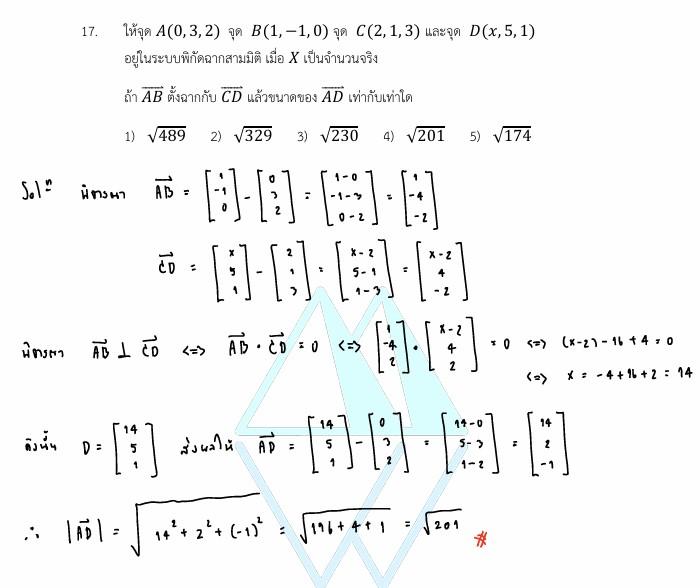

# เฉลยข้อ 17 คณิตศาสตร์ประยุกต์ 1 (A-Level) ปี 2565

การแก้โจทย์ **ข้อ 17 ของวิชาคณิตศาสตร์ประยุกต์ 1 (A-Level) ปี 2565** เป็นเรื่องเกี่ยวกับ **เวกเตอร์ในระบบพิกัดฉากสามมิติ (Vectors in 3D)** โดยทดสอบความเข้าใจเรื่องการสร้างเวกเตอร์จากจุด ผลคูณเชิงสเกลาร์ (Dot Product) และการหาขนาดของเวกเตอร์ครับ,

## **เฉลยละเอียดโจทย์ข้อ 17 (A-Level 2565)**

**โจทย์:** ให้จุด $A(0, 3, 2)$, $B(1, -1, 0)$, $C(2, 1, 3)$ และ $D(x, 5, 1)$ อยู่ในระบบพิกัดฉากสามมิติ เมื่อ $x$ เป็นจำนวนจริง ถ้า $\vec{AB}$ ตั้งฉากกับ $\vec{CD}$ แล้วขนาดของ $\vec{AD}$ เท่ากับเท่าใด

---

**วิธีทำอย่างละเอียด:**

**ขั้นตอนที่ 1: สร้างเวกเตอร์ $\vec{AB}$ และ $\vec{CD}$ จากพิกัดจุด**

* **$\vec{AB}$** = พิกัดจุดปลาย ($B$) - พิกัดจุดต้น ($A$):
    $$\vec{AB} = \begin{bmatrix} 1 - 0 \\ -1 - 3 \\ 0 - 2 \end{bmatrix} = \begin{bmatrix} 1 \\ -4 \\ -2 \end{bmatrix}$$
* **$\vec{CD}$** = พิกัดจุดปลาย ($D$) - พิกัดจุดต้น ($C$):
    $$\vec{CD} = \begin{bmatrix} x - 2 \\ 5 - 1 \\ 1 - 3 \end{bmatrix} = \begin{bmatrix} x - 2 \\ 4 \\ -2 \end{bmatrix}$$

**ขั้นตอนที่ 2: ใช้เงื่อนไขการตั้งฉากหาค่า $x$**
เวกเตอร์สองก้อนจะ **"ตั้งฉากกัน"** ก็ต่อเมื่อ **ผลคูณเชิงสเกลาร์ (Dot Product) เท่ากับ 0**:
$$\vec{AB} \cdot \vec{CD} = 0$$
$$(1)(x - 2) + (-4)(4) + (-2)(-2) = 0$$
$$x - 2 - 16 + 4 = 0$$
$$x - 14 = 0 \implies \mathbf{x = 14}$$

**ขั้นตอนที่ 3: หาขนาดของเวกเตอร์ $\vec{AD}$**

* เมื่อทราบ $x = 14$ จะได้จุด $D(14, 5, 1)$
* หาเวกเตอร์ **$\vec{AD}$** = $D - A$:
    $$\vec{AD} = \begin{bmatrix} 14 - 0 \\ 5 - 3 \\ 1 - 2 \end{bmatrix} = \begin{bmatrix} 14 \\ 2 \\ -1 \end{bmatrix}$$
* คำนวณขนาด $|\vec{AD}| = \sqrt{a^2 + b^2 + c^2}$:
    $$|\vec{AD}| = \sqrt{14^2 + 2^2 + (-1)^2}$$
    $$|\vec{AD}| = \sqrt{196 + 4 + 1} = \mathbf{\sqrt{201}}$$

**ตอบ:** ขนาดของ $\vec{AD}$ เท่ากับ **$\sqrt{201}$** (ตรงกับตัวเลือกที่ 4),

---

### **เนื้อหาที่เกี่ยวข้องเพื่อศึกษาเพิ่มเติม**

**1. สูตรและนิยามสำคัญ:**

* **เวกเตอร์ระหว่างจุด:** $\vec{P_1P_2} = (x_2-x_1)\vec{i} + (y_2-y_1)\vec{j} + (z_2-z_1)\vec{k}$
* **Dot Product ($\vec{u} \cdot \vec{v}$):** $u_1v_1 + u_2v_2 + u_3v_3$ มีสมบัติสำคัญคือ ถ้า $\vec{u} \perp \vec{v}$ แล้ว $\vec{u} \cdot \vec{v} = 0$
* **ขนาดของเวกเตอร์ ($|\vec{u}|$):** $\sqrt{u_1^2 + u_2^2 + u_3^2}$

**2. ความหมายของตัวแปร:**

* **$x, y, z$:** พิกัดในแกน X, Y และ Z ตามลำดับ
* **$\vec{i}, \vec{j}, \vec{k}$:** เวกเตอร์หนึ่งหน่วยในแนวแกน X, Y และ Z

### **กลยุทธ์แก้โจทย์ประเภทนี้**

* **"ปลายลบต้น":** ระวังอย่าสลับพิกัดระหว่างจุดต้นกับจุดปลายในการสร้างเวกเตอร์
* **ใช้สมบัติ Dot Product:** เมื่อโจทย์พูดถึงการ "ตั้งฉาก" ให้พุ่งเป้าไปที่การจับเวกเตอร์มา Dot กันให้ได้ 0 ทันที วิธีนี้จะช่วยแก้หาตัวแปรที่ค้างอยู่ได้เร็วที่สุด
* **ตรวจสอบตัวเลข:** การคำนวณขนาดเวกเตอร์มักเกี่ยวข้องกับการยกกำลังสอง (เช่น $14^2 = 196$) ควรแม่นยำตัวเลขพื้นฐานเพื่อความรวดเร็วครับ

---

### **ตัวอย่างโจทย์เพิ่มเติมเพื่อฝึกทำ**

**โจทย์:** กำหนด $\vec{u} = \vec{i} + a\vec{j} + 2\vec{k}$ และ $\vec{v} = 2\vec{i} - \vec{j} + \vec{k}$ ถ้า $\vec{u}$ ตั้งฉากกับ $\vec{v}$ จงหาขนาดของเวกเตอร์ $\vec{u}$
**เฉลยแนวคิด:**

1. $\vec{u} \cdot \vec{v} = (1)(2) + (a)(-1) + (2)(1) = 2 - a + 2 = 4 - a$
2. เนื่องจากตั้งฉากกัน จะได้ $4 - a = 0 \implies a = 4$
3. หาขนาด $|\vec{u}| = \sqrt{1^2 + 4^2 + 2^2} = \sqrt{1 + 16 + 4} = \sqrt{21}$
**ตอบ:** $\sqrt{21}$
