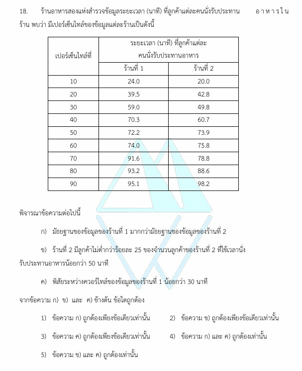

# เฉลยข้อ 18 วิชาคณิตศาสตร์ประยุกต์ 1 (A-Level) ปี 2565

การแก้โจทย์ **ข้อ 18 ของวิชาคณิตศาสตร์ประยุกต์ 1 (A-Level) ปี 2565** เป็นการทดสอบความรู้เรื่อง **สถิติ (Statistics)** โดยเน้นความเข้าใจเกี่ยวกับ **เปอรเซ็นไทล์ (Percentile)**, **มัธยฐาน (Median)** และ **พิสัยระหว่างควอรไทล์ (Interquartile Range - IQR)** ของข้อมูลครับ

## **เฉลยละเอียดโจทย์ข้อ 18 (A-Level 2565)**

**โจทย์:** ร้านอาหารสองแห่งสำรวจระยะเวลาที่ลูกค้านั่งรับประทานอาหาร (หน่วย: นาที) โดยให้ข้อมูลในรูปเปอรเซ็นไทล์ดังตาราง:

| เปอรเซ็นไทล์ที่ | ร้านที่ 1 | ร้านที่ 2 |
| :--- | :---: | :---: |
| 10 | 24.0 | 20.0 |
| 20 | 39.5 | 42.8 |
| 30 | 59.0 | 49.8 |
| 40 | 70.3 | 60.7 |
| 50 | 72.2 | 73.9 |
| 60 | 74.0 | 75.8 |
| 70 | 91.6 | 78.8 |
| 80 | 93.2 | 88.6 |
| 90 | 95.1 | 98.2 |

**พิจารณาข้อความ:**

**ก) มัธยฐานของร้านที่ 1 มากกว่ามัธยฐานของร้านที่ 2**

* **นิยาม:** มัธยฐาน (Median) คือค่าที่ตรงกับเปอรเซ็นไทล์ที่ 50 ($P_{50}$)
* จากตาราง:
  * มัธยฐานร้านที่ 1 = $P_{50}$ (R1) = **72.2 นาที**
  * มัธยฐานร้านที่ 2 = $P_{50}$ (R2) = **73.9 นาที**
* **ตรวจสอบ:** 72.2 > 73.9 หรือไม่? คำตอบคือ **ไม่ใช่**
* **สรุป:** ข้อความ ก **ไม่ถูกต้อง**

**ข) ร้านที่ 2 มีลูกค้าไม่ต่ำกว่าร้อยละ 25 ที่ใช้เวลาน้อยกว่า 50 นาที**

* **นิยาม:** เปอรเซ็นไทล์ที่ $r$ ($P_r$) หมายถึงมีข้อมูลที่มีค่าน้อยกว่าหรือเท่ากับค่านั้นอยู่ $r\%$
* จากตารางร้านที่ 2: $P_{30} = \mathbf{49.8}$ **นาที**
* นั่นหมายความว่า มีลูกค้าประมาณ **30%** ที่ใช้เวลา **น้อยกว่าหรือเท่ากับ 49.8 นาที**
* เนื่องจาก 50 นาที มีค่ามากกว่า 49.8 นาที ดังนั้นจำนวนลูกค้าที่ใช้เวลาน้อยกว่า 50 นาทีจึงต้องมากกว่าหรือเท่ากับ 30% แน่นอน
* **ตรวจสอบ:** 30% ไม่ต่ำกว่าร้อยละ 25 ใช่หรือไม่? คำตอบคือ **ใช่**
* **สรุป:** ข้อความ ข **ถูกต้อง**

**ค) พิสัยระหว่างควอรไทล์ (IQR) ของร้านที่ 1 น้อยกว่า 30 นาที**

* **สูตร:** $IQR = Q_3 - Q_1 = P_{75} - P_{25}$
* หาค่าประมาณจากตารางของร้านที่ 1:
  * $P_{25}$ (อยู่ระหว่าง $P_{20}$ และ $P_{30}$): ค่าคือ $\frac{39.5 + 59.0}{2} = 49.25$ นาที
  * $P_{75}$ (อยู่ระหว่าง $P_{70}$ และ $P_{80}$): ค่าคือ $\frac{91.6 + 93.2}{2} = 92.4$ นาที
* **คำนวณ:** $IQR = 92.4 - 49.25 = \mathbf{43.15}$ **นาที**
* **ตรวจสอบ:** 43.15 น้อยกว่า 30 นาทีหรือไม่? คำตอบคือ **ไม่**
* **สรุป:** ข้อความ ค **ไม่ถูกต้อง**

**คำตอบ:** ข้อความ **ข ถูกต้องเพียงข้อเดียวเท่านั้น** (ตรงกับตัวเลือกที่ 2)

---

### **เนื้อหาที่เกี่ยวข้องเพื่อศึกษาเพิ่มเติม**

**1. สูตรและนิยามสำคัญ:**

* **เปอรเซ็นไทล์ ($P_r$):** เป็นการแบ่งข้อมูลออกเป็น 100 ส่วนเท่าๆ กัน เพื่อบอกตำแหน่งของข้อมูลนั้นในกลุ่ม
* **ควอรไทล์ ($Q_i$):** การแบ่งข้อมูลเป็น 4 ส่วน โดย $Q_1 = P_{25}, Q_2 = P_{50}$ (มัธยฐาน) และ $Q_3 = P_{75}$
* **พิสัยระหว่างควอรไทล์ (IQR):** เป็นการวัดการกระจายของข้อมูล 50% ที่อยู่ตรงกลาง ยิ่งค่า IQR มากแสดงว่าข้อมูลมีการกระจายสูง

**2. ความหมายของตัวแปร:**

* **$r$:** ลำดับของเปอรเซ็นไทล์ (1-100)
* **$P_{50}$:** ค่าที่อยู่ตำแหน่งกึ่งกลางของข้อมูลทั้งหมด

### **กลยุทธ์แก้โจทย์ประเภทนี้**

* **จำความสัมพันธ์ $Median = P_{50}$:** โจทย์สถิติมักใช้คำว่า "มัธยฐาน" สลับกับ "เปอรเซ็นไทล์ที่ 50" เสมอ
* **การประมาณค่า:** หากโจทย์ถามค่าที่ไม่มีในตารางเป๊ะๆ (เช่น $P_{25}$) ให้มองดูช่วงข้อมูลที่โอบล้อมมันไว้ (ในที่นี้คือ $P_{20}$ และ $P_{30}$) เพื่อกะค่าคร่าวๆ
* **อ่านนิยาม $P_r$ ให้ดี:** $P_{30} = 49.8$ แปลว่า "30% ของข้อมูลมีค่าน้อยกว่าหรือเท่ากับ 49.8" การตีความตรงนี้สำคัญมากในข้อ ข ครับ

---

### **ตัวอย่างโจทย์เพิ่มเติมเพื่อฝึกทำ**

**โจทย์:** ข้อมูลชุดหนึ่งมี $P_{25} = 15$ และ $P_{75} = 40$ หากร้านอาหารต้องการแจกรางวัลให้ลูกค้าที่ใช้เวลาอยู่กลางกลุ่ม 50% (ลูกค้าระหว่าง $Q_1$ ถึง $Q_3$) ลูกค้ากลุ่มนี้ต้องใช้เวลาในช่วงกี่นาที และมีค่า IQR เท่าใด
**เฉลยแนวคิด:**

1. ช่วงเวลา $Q_1$ ถึง $Q_3$ คือค่าระหว่าง $P_{25}$ และ $P_{75}$
2. จะได้ช่วงเวลาคือ **15 ถึง 40 นาที**
3. $IQR = 40 - 15 = 25$ นาที
**ตอบ:** ช่วง 15-40 นาที, IQR = 25 นาที
