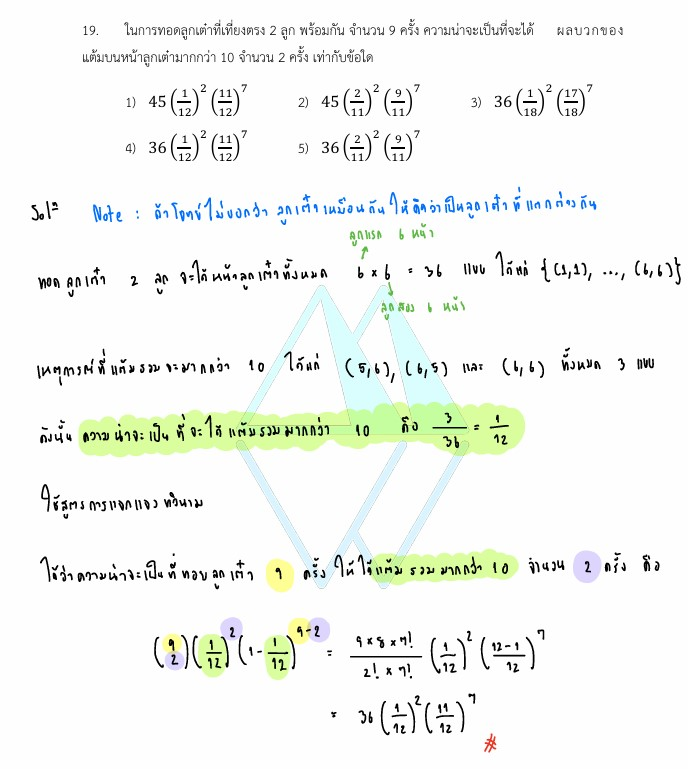

# การแจกแจงทวินาม (Binomial Distribution)

จากโจทย์ในรูปภาพ เป็นปัญหาเกี่ยวกับ **"ความน่าจะเป็นและการแจกแจงทวินาม (Binomial Distribution)"** ซึ่งเป็นหัวข้อสำคัญในวิชาคณิตศาสตร์ (ระดับมัธยมศึกษาตอนปลาย) ดังมีรายละเอียดวิธีทำ เนื้อหา และกลยุทธ์ในการแก้โจทย์ดังนี้ครับ

---

## 1. เฉลยและวิธีทำอย่างละเอียด

**โจทย์:** "ในการทอดลูกเต๋าที่เที่ยงตรง 2 ลูก พร้อมกัน จำนวน 9 ครั้ง ความน่าจะเป็นจะได้ ผลบวกของแต้มบนหน้าลูกเต๋ามากกว่า 10 จำนวน 2 ครั้ง เท่ากับข้อใด"

### **ขั้นตอนที่ 1: หาความน่าจะเป็นในการทอดลูกเต๋า 2 ลูก 1 ครั้ง แล้วได้ผลบวกแต้มมากกว่า 10**

* การทอดลูกเต๋าที่เที่ยงตรง 2 ลูก 1 ครั้ง จะมีผลลัพธ์ทั้งหมดที่อาจจะเกิดขึ้นได้ ($n(S)$) เท่ากับ $6 \times 6 = 36$ วิธี
* เหตุการณ์ที่ผลบวกของแต้ม**มากกว่า 10** (คือผลบวกเท่ากับ 11 หรือ 12) ได้แก่คู่แต้มต่อไปนี้:
* ผลบวกเท่ากับ 11: $(5, 6), (6, 5)$
* ผลบวกเท่ากับ 12: $(6, 6)$

* จำนวนเหตุการณ์ที่สนใจ ($n(E)$) = $3$ วิธี
* ดังนั้น ความน่าจะเป็นที่จะเกิดเหตุการณ์นี้ในการทอด 1 ครั้ง (ให้แทนด้วยตัวแปร $p$) คือ:

$$p = \frac{n(E)}{n(S)} = \frac{3}{36} = \frac{1}{12}$$

* และความน่าจะเป็นที่จะ**ไม่เกิด**เหตุการณ์นี้ใน 1 ครั้ง (ให้แทนด้วยตัวแปร $q$) คือ:

$$q = 1 - p = 1 - \frac{1}{12} = \frac{11}{12}$$

#### **ขั้นตอนที่ 2: ใช้สูตรการแจกแจงทวินาม (Binomial Distribution)**

โจทย์กำหนดให้ทำการทดลองซ้ำๆ กันทั้งหมด $n = 9$ ครั้ง (ซึ่งเป็นอิสระต่อกัน) และต้องการหาความน่าจะเป็นที่เหตุการณ์สำเร็จจะเกิดขึ้น $x = 2$ ครั้ง

จากสูตรความน่าจะเป็นของการแจกแจงทวินาม:

$$P(X = x) = \binom{n}{x} \cdot p^x \cdot q^{n-x}$$

แทนค่าลงในสูตร:

* $n = 9$ (จำนวนครั้งทั้งหมด)
* $x = 2$ (จำนวนครั้งที่สำเร็จที่ต้องการ)
* $p = \frac{1}{12}$
* $q = \frac{11}{12}$

$$P(X = 2) = \binom{9}{2} \cdot \left(\frac{1}{12}\right)^2 \cdot \left(\frac{11}{12}\right)^{9-2}$$

คำนวณค่าของ $\binom{9}{2}$:

$$\binom{9}{2} = \frac{9!}{2!(9-2)!} = \frac{9 \times 8}{2 \times 1} = 36$$

แทนค่ากลับเข้าไปในสมการ:

$$P(X = 2) = 36 \left(\frac{1}{12}\right)^2 \left(\frac{11}{12}\right)^7$$

**สรุปคำตอบ:** ตรงกับตัวเลือกข้อ **4) $36\left(\frac{1}{12}\right)^2\left(\frac{11}{12}\right)^7$**

---

### 2. เนื้อหาและสูตรคณิตศาสตร์ที่เกี่ยวข้อง

#### **การทดลองสุ่มแบบแบร์นูลลี (Bernoulli Trial) และการแจกแจงทวินาม**

เมื่อเราทำการทดลองสุ่มอย่างเดียวกันซ้ำๆ กันจำนวน $n$ ครั้ง โดยแต่ละครั้งเป็นอิสระต่อกัน และการทดลองในแต่ละครั้งมีผลลัพธ์ที่เป็นไปได้เพียง 2 อย่าง คือ **"สำเร็จ (Success)"** หรือ **"ไม่สำเร็จ (Failure)"** เราจะเรียกโครงสร้างนี้ว่าการแจกแจงทวินาม

#### **สูตรของการแจกแจงทวินาม:**

$$P(X = x) = \binom{n}{x} p^x q^{n-x}$$

**ความหมายของตัวแปรและค่าคงที่:**

* $X$ คือ ตัวแปรสุ่มทวินาม (นับจำนวนครั้งที่ประสบความสำเร็จ)
* $x$ คือ จำนวนครั้งที่ประสบความสำเร็จตามที่โจทย์ถาม ($0, 1, 2, ..., n$)
* $n$ คือ จำนวนครั้งของการทดลองทั้งหมด
* $p$ คือ ความน่าจะเป็นที่จะเกิดความ**สำเร็จ**ในการทดลอง 1 ครั้ง (ค่าอยู่ระหว่าง 0 ถึง 1)
* $q$ คือ ความน่าจะเป็นที่จะเกิดความ**ไม่สำเร็จ**ในการทดลอง 1 ครั้ง ซึ่งหาได้จาก $q = 1 - p$
* $\binom{n}{x}$ หรือ $C_{n,x}$ คือ จำนวนวิธีในการเลือกครั้งที่สำเร็จจากความพยายามทั้งหมด มีสูตรคำนวณคือ $\frac{n!}{x!(n-x)!}$

---

### 3. กลยุทธ์ในการแก้โจทย์ประเภทนี้

เมื่ออ่านโจทย์ความน่าจะเป็น ให้สังเกตคีย์เวิร์ดต่อไปนี้เพื่อประเมินว่าเป็น "การแจกแจงทวินาม" หรือไม่:

1. **มีการทำซ้ำ:** โจทย์จะระบุชัดเจนว่าทำกิจกรรมเดิมซ้ำๆ หลายครั้ง (เช่น ทอดลูกเต๋า 9 ครั้ง, โยนเหรียญ 10 ครั้ง, ยิงปืน 5 นัด)
2. **แยกผลลัพธ์เป็น 2 หน้าชัดเจน:** สิ่งที่โจทย์สนใจจะถูกนิยามให้เป็น "ความสำเร็จ" (เช่น ได้แต้มมากกว่า 10, ได้หัว, ยิงเข้าเป้า) ส่วนผลลัพธ์อื่นๆ ทั้งหมดจะกลายเป็น "ความไม่สำเร็จ"
3. **แต่ละครั้งเป็นอิสระต่อกัน:** ผลลัพธ์ของการทำครั้งแรกไม่มีผลต่อการทำครั้งถัดไป

**ขั้นตอนการทำ:**

* **Step 1:** หาความน่าจะเป็นของการทำพฤติกรรมนั้นเพียง **1 ครั้ง** ก่อนเสมอเพื่อหาค่า $p$ และ $q$
* **Step 2:** ระบุจำนวนครั้งทั้งหมด ($n$) และจำนวนครั้งที่ต้องการสำเร็จ ($x$)
* **Step 3:** เขียนโครงสร้างสูตร $\binom{n}{x} p^x q^{n-x}$ แล้วแทนค่าเพื่อหาคำตอบ

---

### 4. ตัวอย่างโจทย์เพิ่มเติมเพื่อฝึกฝน

#### **โจทย์ข้อที่ 1:**

ครอบครัวหนึ่งต้องการมีบุตร 5 คน ถ้าความน่าจะเป็นที่จะได้บุตรชายหรือบุตรสาวในการคลอดแต่ละครั้งมีค่าเท่ากันคือ $\frac{1}{2}$ จงหาความน่าจะเป็นที่ครอบครัวนี้จะมีบุตรชาย 3 คนพอดี

**วิธีทำ:**

1. เป็นการทดลองซ้ำกัน $n = 5$ ครั้ง (มีลูก 5 คน)
2. ความน่าจะเป็นที่จะสำเร็จ (ได้บุตรชายในการคลอด 1 ครั้ง) คือ $p = \frac{1}{2}$
3. ความน่าจะเป็นที่จะไม่สำเร็จ (ได้บุตรสาว) คือ $q = 1 - \frac{1}{2} = \frac{1}{2}$
4. ต้องการให้สำเร็จ $x = 3$ ครั้ง
5. ใช้สูตร:

$$P(X = 3) = \binom{5}{3} \left(\frac{1}{2}\right)^3 \left(\frac{1}{2}\right)^{5-3}$$

$$\binom{5}{3} = \frac{5 \times 4 \times 3}{3 \times 2 \times 1} = 10$$

$$P(X = 3) = 10 \left(\frac{1}{2}\right)^3 \left(\frac{1}{2}\right)^2 = 10 \left(\frac{1}{32}\right) = \frac{10}{32} = \frac{5}{16}$$

**เฉลย:** $\frac{5}{16}$ (หรือ 0.3125)

#### **โจทย์ข้อที่ 2:**

นักกีฬายิงปืนคนหนึ่งมีความน่าจะเป็นที่จะยิงเข้าเป้าในแต่ละนัดเท่ากับ $0.8$ ถ้านักกีฬาคนนี้ยิงปืนทั้งหมด 4 นัด จงหาความน่าจะเป็นที่เขาจะยิงเข้าเป้าอย่างน้อย 3 นัด

**วิธีทำ:**

1. จำนวนครั้งทั้งหมด $n = 4$
2. ความน่าจะเป็นเข้าเป้า $p = 0.8$, ไม่เข้าเป้า $q = 0.2$
3. คำว่า **"อย่างน้อย 3 นัด"** หมายความว่า เข้าเป้า 3 นัด ($x=3$) หรือ เข้าเป้า 4 นัด ($x=4$)
4. คำนวณแยกกรณีแล้วนำมารวมกัน:

* **กรณี $x = 3$:** $\binom{4}{3} (0.8)^3 (0.2)^1 = 4 \times 0.512 \times 0.2 = 0.4096$
* **กรณี $x = 4$:** $\binom{4}{4} (0.8)^4 (0.2)^0 = 1 \times 0.4096 \times 1 = 0.4096$

1. ความน่าจะเป็นรวม = $0.4096 + 0.4096 = 0.8192$
**เฉลย:** $0.8192$
