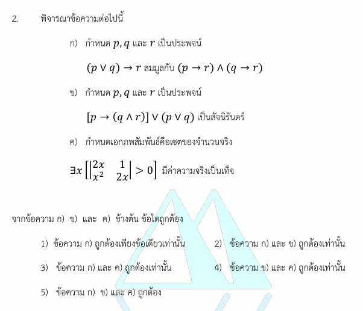

# การแก้โจทย์ข้อ 2 วิชาคณิตศาสตร์ประยุกต์ 1 (A-Level) ปี 2565 : **ตรรกศาสตร์ (Logic)**

การแก้โจทย์ **ข้อ 2 ของวิชาคณิตศาสตร์ประยุกต์ 1 (A-Level) ปี 2565** เป็นเรื่องเกี่ยวกับ **ตรรกศาสตร์ (Logic)** โดยทดสอบความรู้เรื่องประพจน์ที่สมมูลกัน การตรวจสอบสัจนิรันดร์ และค่าความจริงของประโยคที่มีตัวบ่งปริมาณครับ

## เฉลยละเอียดโจทย์ข้อ 2

**โจทย์:** พิจารณาข้อความต่อไปนี้

* **ก.** $(p \lor q) \to r$ สมมูลกับ $(p \to r) \land (q \to r)$
* **ข.** $[p \to (q \land r)] \lor (p \lor q)$ เป็นสัจนิรันดร์
* **ค.** $\exists x [|2x - 1| - (x^2 - 2x) > 0]$ มีค่าความจริงเป็นเท็จ เมื่อเอกภพสัมพัทธ์คือเซตของจำนวนจริง
**จงหาว่าข้อความใดถูกต้อง**

---

**วิธีทำอย่างละเอียด:**

**ขั้นตอนที่ 1: ตรวจสอบข้อความ ก (การสมมูล)**
เราสามารถใช้กฎของตรรกศาสตร์ในการจัดรูปเพื่อตรวจสอบความสมมูลได้ดังนี้:

1. ใช้กฎการเปลี่ยนรูปเงื่อนไข: $A \to B \equiv \neg A \lor B$
2. ฝั่งซ้ายของโจทย์: $(p \lor q) \to r \equiv \neg(p \lor q) \lor r$
3. ใช้กฎของเดอมอร์แกน (De Morgan's Law): $(\neg p \land \neg q) \lor r$
4. ใช้กฎการแจกแจง (Distributive Law): $(\neg p \lor r) \land (\neg q \lor r)$
5. เปลี่ยนกลับเป็นรูปเงื่อนไข: **$(p \to r) \land (q \to r)$**

* **สรุป:** ข้อความ ก **ถูกต้อง**

**ขั้นตอนที่ 2: ตรวจสอบข้อความ ข (สัจนิรันดร์)**
ใช้วิธีการ "หาข้อขัดแย้ง" โดยสมมติให้ประพจน์ทั้งหมดเป็น **เท็จ (F)**:

1. ประพจน์เชื่อมด้วย "หรือ" ($\lor$) จะเป็นเท็จเมื่อทั้งสองก้อนเป็นเท็จ:
    * ก้อนหลัง $(p \lor q) \equiv \text{F}$ จะได้ว่า **$p$ เป็น F และ $q$ เป็น F**
    * ก้อนหน้า $p \to (q \land r) \equiv \text{F}$
2. พิจารณาก้อนหน้า $p \to (q \land r) \equiv \text{F}$ ตามเงื่อนไข "ถ้า...แล้ว..." จะเป็นเท็จเมื่อ:
    * ตัวหน้า ($p$) ต้องเป็นจริง (T) และตัวหลัง ($q \land r$) ต้องเป็นเท็จ (F)
3. **พบข้อขัดแย้ง:** จากการวิเคราะห์ก้อนหลังได้ว่า $p$ เป็น F แต่ก้อนหน้ากลับระบุว่า $p$ ต้องเป็น T

* **สรุป:** เมื่อเกิดข้อขัดแย้งแสดงว่าไม่สามารถเป็นเท็จได้เลย ประพจน์นี้จึงเป็นสัจนิรันดร์ ข้อความ ข **ถูกต้อง**

**ขั้นตอนที่ 3: ตรวจสอบข้อความ ค (ตัวบ่งปริมาณ)**
โจทย์ถามว่า $\exists x [|2x - 1| - (x^2 - 2x) > 0]$ เป็นเท็จจริงหรือไม่:

1. ประโยคที่มี $\exists x$ จะเป็น **จริง** หากเราสามารถหา $x$ เพียง "ตัวเดียว" ที่ทำให้เงื่อนไขในวงเล็บเป็นจริง
2. ลองสุ่มแทนค่า $x$: ให้ **$x = 0$**
    * แทนค่า: $|2(0) - 1| - (0^2 - 2(0)) = | -1 | - 0 = \mathbf{1}$
    * ผลลัพธ์: $1 > 0$ ซึ่งเป็น **จริง**
3. เนื่องจากพบ $x = 0$ ที่ทำให้ประโยคเป็นจริง ค่าความจริงของ $\exists x$ จึงเป็น **จริง (True)**

* **สรุป:** โจทย์ระบุว่าเป็นเท็จ ดังนั้นข้อความ ค **ผิด**

**ตอบ:** ข้อความ **ก. และ ข. ถูกต้องเท่านั้น** (ตรงกับตัวเลือกที่ 2 ของข้อสอบ)

---

### **เนื้อหาที่เกี่ยวข้องเพื่อศึกษาเพิ่มเติม**

**1. สูตรและสมบัติสำคัญ:**

* **กฎการเปลี่ยนกลุ่ม:** $p \to q \equiv \neg p \lor q$
* **กฎของเดอมอร์แกน:** $\neg(p \lor q) \equiv \neg p \land \neg q$
* **นิยาม $\exists x$ (Exists):** ขอแค่มีตัวอย่างที่จริงเพียงกรณีเดียว ค่าความจริงจะเป็นจริงทันที

**2. ความหมายของตัวแปร:**

* **$p, q, r$:** แทนประพจน์ที่มีค่าความจริงได้สองแบบคือ จริง (T) หรือ เท็จ (F)
* **$\equiv$ (สมมูล):** หมายถึงทั้งสองฝั่งมีตารางค่าความจริงเหมือนกันทุกประการ
* **สัจนิรันดร์ (Tautology):** ประพจน์ที่เป็นจริงในทุกกรณีที่เป็นไปได้

### **กลยุทธ์แก้โจทย์ประเภทนี้**

* **เลี่ยงการวาดตาราง:** สำหรับประพจน์ 3 ตัวแปร ($p, q, r$) ตารางจะมีถึง 8 แถว ซึ่งเสียเวลามากในห้องสอบ การใช้กฎการจัดรูปหรือวิธีหาข้อขัดแย้งจะรวดเร็วกว่า
* **การเช็ค $\exists x$:** อย่าพยายามแก้อสมการเต็มรูปแบบ ให้ลองสุ่ม "ตัวเลขง่ายๆ" เช่น 0, 1, -1 แทนค่าก่อน หากเจอตัวที่ทำให้เป็นจริง งานจะจบลงทันที

---

### **ตัวอย่างโจทย์เพิ่มเติมเพื่อฝึกทำ**

**โจทย์:** จงตรวจสอบว่าประพจน์ $[(p \to q) \land p] \to q$ เป็นสัจนิรันดร์หรือไม่
**เฉลยแนวคิด:**

1. สมมติให้เป็นเท็จ: จะได้ก้อนหน้า $[(p \to q) \land p]$ เป็น T และตัวหลัง $q$ เป็น F
2. จากก้อนหน้าที่เป็นจริง: จะได้ $p$ เป็น T และ $(p \to q)$ เป็น T
3. ตรวจสอบ: เมื่อ $p$ เป็น T และ $q$ เป็น F จะทำให้ $p \to q$ เป็น **เท็จ** ซึ่งขัดแย้งกับที่สรุปไว้ในข้อ 2
4. **สรุป:** เกิดข้อขัดแย้ง ดังนั้นเป็นสัจนิรันดร์

---

วิธีการเช็คสัจนิรันดร์ในข้อ 2 ข) ของข้อสอบ A-Level ปี 2565 โดยใช้ **"วิธีหาข้อขัดแย้ง"** มีขั้นตอนดังนี้ครับ

**โจทย์ประพจน์:** $[p \to (q \land r)] \lor (p \lor q)$,

### **ขั้นตอนการตรวจสอบ**

1. **สมมติให้เป็นเท็จ:** เริ่มต้นจากการสมมติให้ประพจน์รวมทั้งหมดมีค่าความจริงเป็น **เท็จ (F)** เพื่อดูว่าจะเกิดข้อขัดแย้งหรือไม่
2. **พิจารณาตัวเชื่อมหลัก:** ตัวเชื่อมหลักของประพจน์นี้คือ **"หรือ" ($\lor$)**
    * ประพจน์ที่เชื่อมด้วย "หรือ" จะเป็นเท็จได้เพียงกรณีเดียว คือ **ทั้งสองก้อนต้องเป็นเท็จ**
    * จะได้ก้อนหลัง: $(p \lor q) \equiv \text{F}$
    * จะได้ก้อนหน้า: $[p \to (q \land r)] \equiv \text{F}$
3. **หาค่าความจริงจากก้อนหลัง:** จาก $(p \lor q) \equiv \text{F}$
    * ตามกฎของ "หรือ" จะสรุปได้ทันทีว่า **$p$ ต้องเป็น F** และ **$q$ ต้องเป็น F**
4. **ตรวจสอบก้อนหน้า:** นำค่าที่ได้ไปเช็คกับ $[p \to (q \land r)] \equiv \text{F}$
    * ตามกฎของตัวเชื่อม **"ถ้า...แล้ว..." ($\to$)** ประพจน์จะเป็นเท็จเมื่อ **ตัวหน้าเป็นจริง (T)** และ **ตัวหลังเป็นเท็จ (F)**
    * นั่นหมายความว่า เงื่อนไขของก้อนนี้ระบุว่า **$p$ ต้องเป็น T**
5. **สรุปข้อขัดแย้ง:**
    * เราพบว่าจากก้อนหลังบอกว่า **$p$ เป็น F** แต่ก้อนหน้ากลับบอกว่า **$p$ เป็น T**
    * ค่าความจริงของ $p$ ขัดแย้งกันเองในเวลาเดียวกัน

**ผลสรุป:** เมื่อสมมติให้เป็นเท็จแล้วเกิดข้อขัดแย้ง แสดงว่าประพจน์นี้ **ไม่สามารถเป็นเท็จได้เลย** (ต้องเป็นจริงในทุกกรณี) จึงสรุปได้ว่าเป็น **สัจนิรันดร์** ครับ

---

สรุปสูตรและหลักการสำคัญทางตรรกศาสตร์ที่ปรากฏในโจทย์ข้อ 2 ของข้อสอบ A-Level คณิตศาสตร์ 1 ปี 2565 มีรายละเอียดที่ควรจำเพื่อใช้ในการทำข้อสอบดังนี้ครับ

### **1. สูตรการสมมูล (Equivalence Laws)**

สูตรเหล่านี้ช่วยในการจัดรูปประพจน์ที่ซับซ้อนให้ง่ายขึ้น ซึ่งใช้ในการตรวจสอบข้อความ ก:

* **กฎการเปลี่ยนรูปเงื่อนไข:** $p \to q \equiv \neg p \lor q$ (ถ้า...แล้ว เปลี่ยนเป็น ไม่...หรือ)
* **กฎของเดอมอร์แกน (De Morgan’s Laws):**
  * $\neg(p \lor q) \equiv \neg p \land \neg q$
  * $\neg(p \land q) \equiv \neg p \lor \neg q$
* **กฎการแจกแจง (Distributive Laws):**
  * $p \lor (q \land r) \equiv (p \lor q) \land (p \lor r)$
  * $p \land (q \lor r) \equiv (p \land q) \lor (p \land r)$

### **2. หลักการตรวจสอบสัจนิรันดร์ (Tautology)**

สัจนิรันดร์คือประพจน์ที่เป็น **จริงเสมอ** ในทุกกรณีของตัวแปรย่อย หลักการที่นิยมใช้ในข้อสอบคือ **"วิธีหาข้อขัดแย้ง"** (ใช้ในข้อความ ข):

* **สมมติให้ประพจน์รวมเป็น เท็จ (F)** แล้วไล่หาค่าความจริงของประพจน์ย่อย
* หากเกิด **ข้อขัดแย้ง** (เช่น $p$ เป็นทั้งจริงและเท็จในเวลาเดียวกัน) แสดงว่าเป็น **สัจนิรันดร์**
* หาก **ไม่เกิดข้อขัดแย้ง** แสดงว่าสามารถเป็นเท็จได้ จึง **ไม่ใช่สัจนิรันดร์**
* **จุดสังเกต:** ประพจน์ที่เชื่อมด้วย $\lor$ (หรือ) จะเป็นเท็จได้กรณีเดียวคือ **F $\lor$ F** และประพจน์เชื่อมด้วย $\to$ (ถ้า...แล้ว) จะเป็นเท็จได้กรณีเดียวคือ **T $\to$ F**

### **3. ค่าความจริงของตัวบ่งปริมาณ (Quantifiers)**

ใช้สำหรับการพิจารณาประโยคเปิดที่มีตัวบ่งปริมาณ เช่นในข้อความ ค:

* **$\forall x [P(x)]$ (สำหรับ $x$ ทุกตัว):** จะเป็น **จริง** เมื่อ $P(x)$ เป็นจริงสำหรับ $x$ **ทุกค่า** ในเอกภพสัมพัทธ์ และเป็น **เท็จ** เมื่อพบ $x$ อย่างน้อย **1 ตัว** ที่ทำให้ $P(x)$ เป็นเท็จ
* **$\exists x [P(x)]$ (สำหรับ $x$ บางตัว):** จะเป็น **จริง** เมื่อพบ $x$ อย่างน้อย **1 ตัว** ที่ทำให้ $P(x)$ เป็นจริง และเป็น **เท็จ** เมื่อ $P(x)$ เป็นเท็จสำหรับ $x$ **ทุกค่า**

**กลยุทธ์เพิ่มเติม:** ในการเช็คตัวบ่งปริมาณ $\exists x$ หากเราสามารถสุ่มแทนค่า $x$ เพียงค่าเดียวแล้วทำให้ประโยคในวงเล็บเป็นจริงได้ ประพจน์นั้นจะเป็น **จริง (True)** ทันที ซึ่งในข้อ 2 ค) เราสามารถแทน $x=0$ เพื่อพิสูจน์ได้ว่าประพจน์นั้นเป็นจริง
