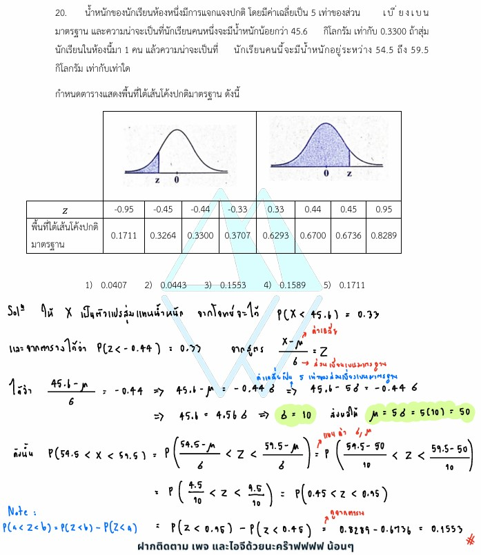

# ข้อ 20: การแจกแจงปกติและคะแนนมาตรฐาน

จากโจทย์ข้อ 20 ในรูปภาพ เป็นปัญหาเกี่ยวกับ **"การแจกแจงปกติ (Normal Distribution) และคะแนนมาตรฐาน ($Z$-score)"** ซึ่งเป็นหนึ่งในหัวข้อสำคัญของวิชาสถิติในระดับมัธยมศึกษาตอนปลาย โดยในภาพมีการเขียนวิธีคิดด้วยลายมือไว้บ้างแล้ว ต่อไปนี้เป็นคำอธิบายและวิธีทำอย่างละเอียดในทุกขั้นตอน พร้อมเนื้อหาเสริมความรู้ครับ

---

## 1. เฉลยและวิธีทำอย่างละเอียด

**โจทย์:** น้ำหนักของนักเรียนห้องหนึ่งมีการแจกแจงปกติ โดยมีค่าเฉลี่ยเลขคณิตเป็น 5 เท่าของส่วนเบี่ยงเบนมาตรฐาน และความน่าจะเป็นที่นักเรียนคนหนึ่งจะมีน้ำหนักน้อยกว่า 45.6 กิโลกรัม เท่ากับ 0.3300 ถ้าสุ่มนักเรียนในห้องนี้มา 1 คน แล้วความน่าจะเป็นที่นักเรียนคนนี้จะมีน้ำหนักอยู่ระหว่าง 54.5 ถึง 59.5 กิโลกรัม เท่ากับเท่าใด

### **ขั้นตอนที่ 1: ตีความจากสิ่งที่โจทย์กำหนด และเขียนเป็นสัญลักษณ์ทางสถิติ**

* ให้ $X$ เป็นตัวแปรสุ่มแทนน้ำหนักของนักเรียน
* โจทย์บอกว่า "ค่าเฉลี่ยเลขคณิต ($\mu$) เป็น 5 เท่าของส่วนเบี่ยงเบนมาตรฐาน ($\sigma$)"
จะได้ความสัมพันธ์คือ: $\mu = 5\sigma$  ---- (สมการที่ 1)
* โจทย์บอกว่า "ความน่าจะเป็นที่น้ำหนักน้อยกว่า 45.6 กิโลกรัม เท่ากับ 0.3300"
จะได้: $P(X < 45.6) = 0.3300$

#### **ขั้นตอนที่ 2: เปลี่ยนค่า $X$ ให้เป็นคะแนนมาตรฐาน $Z$ เพื่อหาค่า $\sigma$ และ $\mu$**

จากสูตรแปลงเป็นคะแนนมาตรฐาน: $Z = \frac{X - \mu}{\sigma}$
เมื่อ $X = 45.6$ จะได้ค่า $Z$ คือ:

$$Z = \frac{45.6 - \mu}{\sigma}$$

จากข้อมูลความน่าจะเป็น $P(X < 45.6) = 0.3300$ หมายความว่าพื้นที่ใต้เส้นโค้งปกติทางด้านซ้ายของค่า $Z$ นี้มีค่าเท่ากับ $0.3300$
เมื่อนำไปเทียบกับตารางที่โจทย์ให้มา:

* ช่องที่พื้นที่ใต้เส้นโค้งมีค่าสะสมเท่ากับ **0.3300** จะตรงกับค่า **$Z = -0.44$**

ดังนั้น เราสามารถตั้งสมการได้ว่า:

$$-0.44 = \frac{45.6 - \mu}{\sigma}$$

$$-0.44\sigma = 45.6 - \mu$$

แทนค่า $\mu = 5\sigma$ จากสมการที่ 1 ลงไป:

$$-0.44\sigma = 45.6 - 5\sigma$$

$$-0.44\sigma + 5\sigma = 45.6$$

$$4.56\sigma = 45.6$$

$$\sigma = \frac{45.6}{4.56} = 10$$

เมื่อได้ค่าส่วนเบี่ยงเบนมาตรฐาน $\sigma = 10$ ก็นำกลับไปหาค่าเฉลี่ยเลขคณิต $\mu$:

$$\mu = 5(10) = 50$$

#### **ขั้นตอนที่ 3: หาความน่าจะเป็นที่น้ำหนักอยู่ระหว่าง 54.5 ถึง 59.5 กิโลกรัม**

โจทย์ต้องการหา $P(54.5 < X < 59.5)$
แปลงค่าตำแหน่ง $X = 54.5$ และ $X = 59.5$ เป็นคะแนนมาตรฐาน $Z$ (โดยใช้ $\mu = 50$ และ $\sigma = 10$):

* **หา $Z_1$ ที่ $X = 54.5$:**

$$Z_1 = \frac{54.5 - 50}{10} = \frac{4.5}{10} = 0.45$$

* **หา $Z_2$ ที่ $X = 59.5$:**

$$Z_2 = \frac{59.5 - 50}{10} = \frac{9.5}{10} = 0.95$$

ดังนั้น โจทย์กำลังให้เราหาค่า $P(0.45 < Z < 0.95)$ ซึ่งหาได้จากพื้นที่สะสม:

$$P(0.45 < Z < 0.95) = P(Z < 0.95) - P(Z < 0.45)$$

เปิดตารางที่โจทย์กำหนดให้:

* พื้นที่เมื่อ $Z < 0.95$ มีค่าเท่ากับ **0.8289**
* พื้นที่เมื่อ $Z < 0.45$ มีค่าเท่ากับ **0.6736**

คำนวณผลต่าง:

$$0.8289 - 0.6736 = 0.1553$$

**สรุปคำตอบ:** ตรงกับตัวเลือกข้อ **3) 0.1553**

---

### 2. เนื้อหาและสถิติที่เกี่ยวข้อง

#### **การแจกแจงปกติ (Normal Distribution)**

เป็นการแจกแจงความน่าจะเป็นของตัวแปรสุ่มต่อเนื่องที่มีลักษณะเป็นรูปเส้นโค้งคว่ำคล้ายรูประฆัง (Bell-shaped curve) โดยข้อมูลส่วนใหญ่จะกระจุกตัวอยู่ตรงกลางบริเวณค่าเฉลี่ยเลขคณิต และสมมาตรกันทั้งสองฝั่ง

#### **สูตรคะแนนมาตรฐาน (Z-score)**

เนื่องจากการแจกแจงปกติของข้อมูลแต่ละชุดมีค่าเฉลี่ย ($\mu$) และส่วนเบี่ยงเบนมาตรฐาน ($\sigma$) ไม่เท่ากัน นักสถิติจึงแปลงข้อมูลทุกชุดให้อยู่ในรูปแบบมาตรฐานเดียวกัน เรียกว่า **"การแจกแจงปกติมาตรฐาน (Standard Normal Distribution)"** ซึ่งมีค่าเฉลี่ยเป็น 0 และส่วนเบี่ยงเบนมาตรฐานเป็น 1 โดยใช้สูตร:

$$Z = \frac{X - \mu}{\sigma}$$

**ความหมายของตัวแปร:**

* $X$ คือ ค่าของข้อมูลดิบเดิมที่โจทย์ให้มา
* $\mu$ (มิว) คือ ค่าเฉลี่ยเลขคณิตของประชากร
* $\sigma$ (ซิกมา) คือ ส่วนเบี่ยงเบนมาตรฐานของประชากร
* $Z$ คือ คะแนนมาตรฐาน (บอกว่าข้อมูลชิ้นนั้นอยู่ห่างจากค่าเฉลี่ยเป็นกี่เท่าของส่วนเบี่ยงเบนมาตรฐาน)

**การอ่านตารางพื้นที่สะสม:**
ตารางในโจทย์ข้อนี้ให้พื้นที่ในลักษณะ **"พื้นที่สะสมตั้งแต่ฝั่งซ้ายสุดลากมาจนถึงจุด $Z$"** หรือเขียนแทนด้วยสัญลักษณ์ $P(Z < z)$ ดังนั้น:

* หากต้องการหาพื้นที่ระหว่างจุดสองจุด $Z_1$ ถึง $Z_2$ (เมื่อ $Z_2 > Z_1$) เราจึงสามารถนำพื้นที่สะสมมาลบกันได้โดยตรง: $P(Z < Z_2) - P(Z < Z_1)$

---

### 3. กลยุทธ์ในการแก้โจทย์ประเภทนี้

1. **เชื่อมโยงตัวแปรก่อน:** โจทย์มักจะไม่บอกค่า $\mu$ และ $\sigma$ มาตรงๆ แต่จะบอกความสัมพันธ์มาเป็นสมการ เช่น เป็นกี่เท่ากัน หรือบอกคำใบ้ผ่านข้อความมา 2 ข้อมูลเพื่อสกัดเป็น 2 สมการ
2. **วาดรูปเส้นโค้งระฆังคว่ำเสมอ:** การวาดรูปและระบายสีพื้นที่ระบุตำแหน่ง $Z$ จะช่วยป้องกันการหลงทิศทาง (เช่น ลืมใส่เครื่องหมายลบให้กับค่า $Z$ ที่อยู่ฝั่งซ้ายของค่าเฉลี่ย)
3. **ตรวจสอบประเภทตาราง:** สังเกตภาพหัวตารางให้ดีว่า ตารางที่โจทย์ให้มาเป็นพื้นที่เริ่มจากตรงกลาง ($0$ ถึง $Z$) หรือเป็นพื้นที่สะสมจากซ้ายสุด ($-\infty$ ถึง $Z$) เพราะวิธีคำนวณจะต่างกัน (ในโจทย์ข้อนี้ระบุชัดเจนว่าเป็นพื้นที่สะสมจากซ้ายสุด)

---

### 4. ตัวอย่างโจทย์เพิ่มเติมเพื่อฝึกฝน

**โจทย์:** ข้อมูลชุดหนึ่งมีการแจกแจงปกติ โดยมีส่วนเบี่ยงเบนมาตรฐานเท่ากับ 5 กิโลกรัม ถ้าความน่าจะเป็นที่ข้อมูลจะมีค่าน้อยกว่า 60 กิโลกรัม เท่ากับ 0.8413 จงหาค่าเฉลี่ยเลขคณิตของข้อมูลชุดนี้
*(กำหนดค่า $Z = 1.00$ มีพื้นที่สะสมเท่ากับ 0.8413)*

**วิธีทำ:**

1. โจทย์กำหนดให้ $\sigma = 5$
2. โจทย์บอกว่า $P(X < 60) = 0.8413$ ซึ่งพบว่าตรงกับค่าพื้นที่สะสมของ $Z = 1.00$ พอดี
3. นำไปแทนค่าในสูตร $Z = \frac{X - \mu}{\sigma}$:

$$1.00 = \frac{60 - \mu}{5}$$

$$5 = 60 - \mu$$

$$\mu = 60 - 5 = 55$$

**เฉลย:** ค่าเฉลี่ยเลขคณิตของข้อมูลชุดนี้เท่ากับ 55 กิโลกรัม
