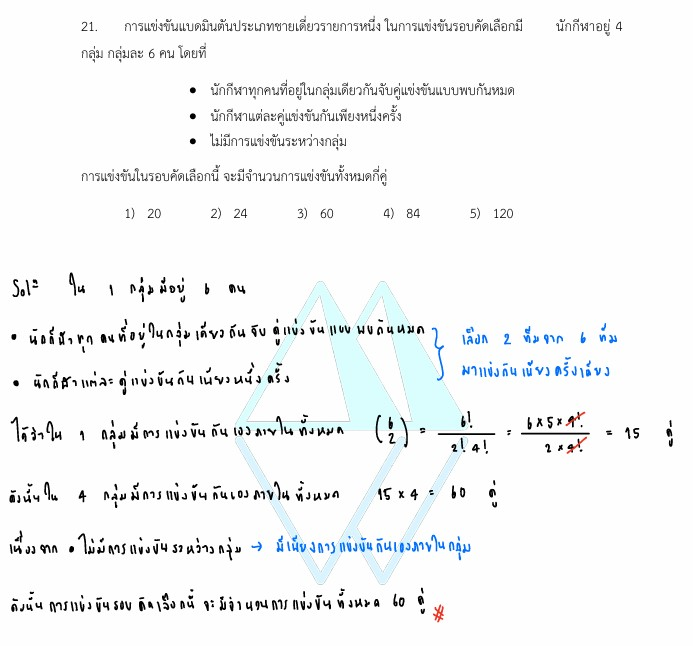

# ข้อ 21: การจัดหมู่ (Combination)

จากโจทย์ข้อ 21 ในรูปภาพ เป็นปัญหาเกี่ยวกับ **"วิธีเรียงสับเปลี่ยนและจัดหมู่ (Permutations and Combinations)"** โดยเฉพาะเรื่อง **"การจัดหมู่ (Combination)"** ที่ใช้บ่อยมากในการคำนวณจำนวนคู่แข่งขันกีฬาหรือการจับมือทักทายครับ ต่อไปนี้เป็นคำอธิบายและวิธีทำอย่างละเอียดครับ

---

## 1. เฉลยและวิธีทำอย่างละเอียด

**โจทย์:** การแข่งขันแบดมินตันประเภทชายเดี่ยวรายการหนึ่ง ในการแข่งขันรอบคัดเลือกมีนักกีฬาอยู่ 4 กลุ่ม กลุ่มละ 6 คน โดยที่

* นักกีฬาทุกคนที่อยู่ในกลุ่มเดียวกันจับคู่แข่งขันแบบพบกันหมด
* นักกีฬาแต่ละคู่แข่งขันกันเพียงหนึ่งครั้ง
* ไม่มีการแข่งขันระหว่างกลุ่ม
การแข่งขันในรอบคัดเลือกนี้ จะมีจำนวนการแข่งขันทั้งหมดกี่คู่

### **ขั้นตอนที่ 1: คำนวณจำนวนคู่แข่งขันภายใน 1 กลุ่ม**

* ในแต่ละกลุ่มมีนักกีฬาอยู่ 6 คน
* การจัดคู่แข่งขันประเภทชายเดี่ยว หมายความว่าเราต้อง **เลือกนักกีฬามาทีละ 2 คน** จากทั้งหมด 6 คนในกลุ่มนั้นมารวมกันเพื่อเกิดการแข่งขัน 1 แมตช์ (โดยที่ลำดับในการเลือกไม่มีผล เช่น นาย A แข่งกับ นาย B ก็คือนาย B แข่งกับ นาย A นับเป็น 1 คู่เท่ากัน)
* ใช้สูตรการจัดหมู่ $\binom{n}{r}$ โดยที่ $n = 6$ และ $r = 2$

$$\text{จำนวนคู่แข่งขันใน } 1 \text{ กลุ่ม} = \binom{6}{2}$$

$$\binom{6}{2} = \frac{6!}{2!(6-2)!} = \frac{6 \times 5}{2 \times 1} = 15 \text{ คู่}$$

#### **ขั้นตอนที่ 2: คำนวณจำนวนคู่แข่งขันรวมทั้งหมดทุกกลุ่ม**

* เนื่องจากโจทย์ระบุว่า "ไม่มีการแข่งขันระหว่างกลุ่ม" แปลว่าแต่ละกลุ่มแข่งแยกกันโดยอิสระ
* มีกลุ่มทั้งหมด 4 กลุ่ม และทุกกลุ่มมีจำนวนคนเท่ากัน (กลุ่มละ 6 คน จึงมีกลุ่มละ 15 คู่เท่ากัน)
* นำจำนวนคู่แข่งขันของหนึ่งกลุ่มมาคูณกับจำนวนกลุ่มทั้งหมด:

$$\text{จำนวนการแข่งขันทั้งหมด} = 15 \text{ คู่/กลุ่ม} \times 4 \text{ กลุ่ม} = 60 \text{ คู่}$$

**สรุปคำตอบ:** ตรงกับตัวเลือกข้อ **3) 60**

---

### 2. เนื้อหาและสูตรคณิตศาสตร์ที่เกี่ยวข้อง

#### **กฎการจัดหมู่ (Combination)**

การจัดหมู่คือการเลือกสิ่งของจำนวน $r$ สิ่ง ออกมาจากสิ่งของที่แตกต่างกัน $n$ สิ่ง โดย**ไม่สนใจลำดับ**ก่อนหลังในการเลือก สิ่งสำคัญมีเพียงแค่ว่า "ใครหรือสิ่งใดถูกเลือกมาอยู่ในกลุ่มบ้าง" เท่านั้น

#### **สูตรของการจัดหมู่:**

$$\binom{n}{r} \quad \text{หรือ} \quad C_{n,r} = \frac{n!}{r!(n-r)!}$$

**ความหมายของตัวแปรและสัญลักษณ์:**

* $n$ คือ จำนวนสิ่งของทั้งหมดที่มีให้เลือก (ในโจทย์ข้อนี้คือ นักกีฬา 6 คนในกลุ่ม)
* $r$ คือ จำนวนสิ่งของที่ต้องการเลือกในแต่ละครั้ง (ในโจทย์ข้อนี้คือ เลือกมา 2 คนเพื่อสร้าง 1 คู่แข่งขัน)
* $!$ (แฟกทอเรียล) คือ ผลคูณของจำนวนเต็มบวกตั้งแต่ 1 ถึงจำนวนนั้นๆ เช่น $4! = 4 \times 3 \times 2 \times 1 = 24$

---

### 3. กลยุทธ์ในการแก้โจทย์ประเภทนี้

เมื่อเจอโจทย์แนว "แจกของ", "จับมือ", "แข่งขันกีฬา", หรือ "ลากเส้นเชื่อมจุด" ให้ใช้หลักการคิดดังนี้ครับ:

1. **เช็คเรื่องลำดับ (ใจความสำคัญที่สุด):** ถามตัวเองก่อนว่า ลำดับมีผลไหม?

* ถ้าระหว่างการเลือก $A$ แล้วตามด้วย $B$ มีความหมาย**เหมือนกับ**เลือก $B$ แล้วตามด้วย $A$ (เช่น การแข่งขันกัน, การจับมือ, การเลือกคณะกรรมการที่ตำแหน่งเท่ากัน) $\rightarrow$ **ใช้การจัดหมู่ (สูตร $\binom{n}{r}$)**
* ถ้าระหว่าง $AB$ กับ $BA$ ความหมาย**ไม่เหมือนกัน** (เช่น การสลับที่นั่ง, การเลือกประธานและรองประธาน, การสร้างเลขหลักหน่วยหลักสิบ) $\rightarrow$ **ใช้การเรียงสับเปลี่ยน (สูตร $P_{n,r}$ หรือกฎการคูณ)**

1. **มองหาโครงสร้างสูตรลัดของการจับคู่:** สำหรับการจับคู่ของ 2 สิ่ง จากทั้งหมด $n$ สิ่ง (นั่นคือ $r=2$) สูตรจะลดรูปเหลือเพียง:

$$\binom{n}{2} = \frac{n(n-1)}{2}$$

เทคนิคนี้จะช่วยให้คิดเลขในใจได้เร็วขึ้นมาก เช่น มีคน 6 คน จับคู่กันได้ $\frac{6 \times 5}{2} = 15$ คู่ ทันที
3. **แบ่งขั้นตอนคิด:** หากมีการแบ่งกลุ่มหรือเงื่อนไขซ้อน ให้คิดคำนวณจำนวนวิธีในสับเซตย่อยให้เสร็จสิ้นก่อน จากนั้นจึงใช้ **"กฎการบวก"** (ถ้างานแยกกันเด็ดขาด) หรือ **"กฎการคูณ"** (ถ้ารวมเป็นขั้นตอนต่อเนื่องกัน) เพื่อหาผลลัพธ์สุดท้าย

---

### 4. ตัวอย่างโจทย์เพิ่มเติมเพื่อฝึกฝน

#### **โจทย์ข้อที่ 1:**

ในงานเลี้ยงปิดเทอมครั้งหนึ่ง มีเพื่อนสนิทมาเจอกันทั้งหมด 10 คน ถ้าทุกคนต้องการจับมือทักทายกันให้ครบทุกคน โดยแต่ละคู่จะจับมือกันเพียงครั้งเดียวเท่านั้น อยากทราบว่าจะเกิดการจับมือทั้งหมดกี่ครั้ง

**วิธีทำ:**

1. มีคนทั้งหมด $n = 10$ คน
2. การจับมือกันแต่ละครั้งต้องใช้คน $r = 2$ คน และลำดับในการจับมือไม่มีความสำคัญ ($A$ จับ $B$ มีค่าเท่ากับ $B$ จับ $A$)
3. แทนค่าในสูตรลัดของการเลือก 2 สิ่ง:

$$\text{จำนวนการจับมือ} = \frac{n(n-1)}{2} = \frac{10 \times 9}{2} = 45 \text{ ครั้ง}$$

**เฉลย:** จะเกิดการจับมือทั้งหมด 45 ครั้ง

#### **โจทย์ข้อที่ 2:**

มีจุดอยู่ 8 จุดบนเส้นรอบวงของวงกลมวงหนึ่ง ถ้าเราต้องการลากเส้นตรงเชื่อมจุดเหล่านี้เพื่อสร้างรูปสามเหลี่ยม โดยใช้วงกลมนี้เป็นจุดยอด จะสามารถสร้างรูปสามเหลี่ยมที่แตกต่างกันได้ทั้งหมดกี่รูป

**วิธีทำ:**

1. การสร้างรูปสามเหลี่ยม 1 รูป จำเป็นต้องเลือกจุดยอดมาทั้งหมด $r = 3$ จุด จากจุดที่มีอยู่ทั้งหมด $n = 8$ จุด
2. ลำดับในการเลือกจุดไม่มีผลต่อรูปสามเหลี่ยม (เลือกจุด $A, B, C$ ก็ได้สามเหลี่ยมรูปเดียวกับเลือก $B, C, A$) จึงใช้สูตรการจัดหมู่:

$$\binom{8}{3} = \frac{8!}{3!(8-3)!} = \frac{8 \times 7 \times 6}{3 \times 2 \times 1} = 56 \text{ รูป}$$

**เฉลย:** สามารถสร้างรูปสามเหลี่ยมได้ทั้งหมด 56 รูป
