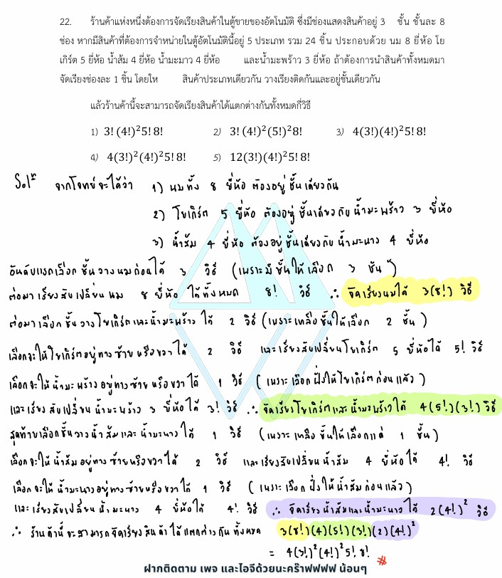

# ข้อ 22

จากโจทย์ข้อ 22 ในรูปภาพ เป็นปัญหาเกี่ยวกับ **"วิธีเรียงสับเปลี่ยนเชิงเส้น (Linear Permutation)"** โดยเพิ่มเงื่อนไขการมัดติดกันและการแบ่งพื้นที่จัดวาง (การแบ่งชั้นในตู้สินค้า) ซึ่งเป็นโจทย์ประยุกต์ระดับปานกลางค่อนไปทางสูงในบทหลักการนับเบื้องต้นและความน่าจะเป็นครับ ต่อไปนี้เป็นคำอธิบายและวิธีทำอย่างละเอียดทุกขั้นตอนครับ

---

## 1. เฉลยและวิธีทำอย่างละเอียด

**โจทย์:** ร้านค้าแห่งหนึ่งต้องการจัดเรียงสินค้าในตู้ขายของอัตโนมัติ ซึ่งมีช่องแสดงสินค้าอยู่ 3 ชั้น ชั้นละ 8 ช่อง หากมีสินค้าที่ต้องการจำหน่ายในตู้อัตโนมัตินี้อยู่ 5 ประเภท รวม 24 ชิ้น ประกอบด้วย นม 8 ยี่ห้อ, โยเกิร์ต 5 ยี่ห้อ, น้ำส้ม 4 ยี่ห้อ, น้ำมะนาว 4 ยี่ห้อ และน้ำมะพร้าว 3 ยี่ห้อ ถ้าต้องการนำสินค้าทั้งหมดมาจัดเรียงช่องละ 1 ชิ้น โดยให้ **สินค้าประเภทเดียวกัน วางเรียงติดกันและอยู่ชั้นเดียวกัน** แล้วร้านค้านี้จะสามารถจัดเรียงสินค้าได้แตกต่างกันทั้งหมดกี่วิธี

### **ขั้นตอนที่ 1: วิเคราะห์พื้นที่และขนาดของกลุ่มสินค้า**

ตู้สินค้ามี 3 ชั้น แต่ละชั้นมี 8 ช่อง (รวม $3 \times 8 = 24$ ช่องพอดีกับจำนวนสินค้าทั้งหมด)
สินค้าแต่ละประเภทระบุว่ามีจำนวนชิ้น (ยี่ห้อที่แตกต่างกัน) ดังนี้:

* นม = 8 ชิ้น
* โยเกิร์ต = 5 ชิ้น
* น้ำส้ม = 4 ชิ้น
* น้ำมะนาว = 4 ชิ้น
* น้ำมะพร้าว = 3 ชิ้น

เงื่อนไขสำคัญคือ: **"สินค้าประเภทเดียวกัน วางเรียงติดกันและอยู่ชั้นเดียวกัน"** แปลว่าเราต้องบริหารพื้นที่แต่ละชั้น (ที่มีความจุ 8 ช่อง) ให้กลุ่มสินค้าลงได้พอดีโดยไม่แตกกลุ่ม

#### **ขั้นตอนที่ 2: วางแผนแบ่งกลุ่มสินค้าลงตู้ 3 ชั้น**

เราต้องจับคู่กลุ่มสินค้าให้มีผลรวมจำนวนชิ้นเท่ากับ 8 พอดี เพื่อที่จะบรรจุลงในแต่ละชั้นที่มี 8 ช่องได้:

* **ชั้นที่มี นม:** เนื่องจากนมมี 8 ชิ้นพอดี มันจึงต้องยึดครองชั้นนั้นไปเลย 1 ชั้นเต็มๆ (ส่งผลให้เหลือนม 1 กลุ่มใหญ่ความยาว 8)
* **ชั้นที่เหลืออีก 2 ชั้น:** ต้องกระจายสินค้าที่เหลืออีก 4 ประเภท (5, 4, 4, 3 ชิ้น) ลงไปชั้นละ 8 ช่อง
ลองจับคู่ตัวเลข: $5 + 3 = 8$ และ $4 + 4 = 8$
ดังนั้น กลุ่มสินค้าจะถูกจับคู่มัดรวมกันตามชั้นได้แบบเดียวเท่านั้น คือ:

1. **ชั้นของนม:** (กลุ่ม 8 ชิ้น)
2. **ชั้นของโยเกิร์ต + น้ำมะพร้าว:** (กลุ่ม 5 ชิ้น + กลุ่ม 3 ชิ้น = 8 ชิ้นพอดี)
3. **ชั้นของน้ำส้ม + น้ำมะนาว:** (กลุ่ม 4 ชิ้น + กลุ่ม 4 ชิ้น = 8 ชิ้นพอดี)

#### **ขั้นตอนที่ 3: คำนวณจำนวนวิธีเรียงสับเปลี่ยนในแต่ละส่วน**

**1) ขั้นตอนการเลือกชั้นให้กับกลุ่มสินค้า (Permutation ของชั้น)**
เรามีกลุ่มสินค้า 3 ชุดที่จะลงไปในตู้ 3 ชั้นที่แตกต่างกัน (ชั้นบน ชั้นกลาง ชั้นล่าง)

* สลับกลุ่มสินค้า 3 ชุดลง 3 ชั้น ทำได้: $3!$ วิธี

**2) ขั้นตอนการสลับสิ่งของภายในแต่ละกลุ่มสินค้า (ยี่ห้อต่างกัน)**
สินค้าแต่ละชิ้นถือว่าต่างยี่ห้อกัน สามารถสลับที่กันเองภายในกลุ่มของตัวเองได้:

* นม 8 ยี่ห้อ สลับกันเองได้: $8!$ วิธี
* โยเกิร์ต 5 ยี่ห้อ สลับกันเองได้: $5!$ วิธี
* น้ำส้ม 4 ยี่ห้อ สลับกันเองได้: $4!$ วิธี
* น้ำมะนาว 4 ยี่ห้อ สลับกันเองได้: $4!$ วิธี
* น้ำมะพร้าว 3 ยี่ห้อ สลับกันเองได้: $3!$ วิธี

**3) ขั้นตอนการสลับกลุ่มภายในชั้นเดียวกัน**

* ชั้นที่มี นม: มีกลุ่มเดียว สลับไม่ได้ ($1$ วิธี)
* ชั้นที่มี โยเกิร์ต + น้ำมะพร้าว: มี 2 กลุ่มใหญ่วางติดกัน สามารถสลับฝั่งกันได้ (เช่น โยเกิร์ตอยู่ซ้าย-มะพร้าวอยู่ขวา หรือ มะพร้าวอยู่ซ้าย-โยเกิร์ตอยู่ขวา) สลับได้: $2!$ วิธี
* ชั้นที่มี น้ำส้ม + น้ำมะนาว: มี 2 กลุ่มใหญ่ สามารถสลับฝั่งกันได้เช่นกัน สลับได้: $2!$ วิธี

#### **ขั้นตอนที่ 4: รวมผลลัพธ์ด้วยกฎการคูณ**

นำจำนวนวิธีของทุกขั้นตอนที่เกิดขึ้นต่อเนื่องกันมาคูณกันทั้งหมด:

$$\text{จำนวนวิธีรวม} = \underbrace{3!}_{\text{สลับชั้น}} \times \underbrace{(8! \times 5! \times 4! \times 4! \times 3!)}_{\text{สลับยี่ห้อในแต่ละประเภท}} \times \underbrace{(2! \times 2!)}_{\text{สลับกลุ่มในชั้น}}$$

จัดรูปตัวเลขเพื่อให้ตรงกับตัวเลือกในโจทย์:

* สังเกตตัวเลขคงที่ด้านนอก: $2! \times 2! = 2 \times 2 = 4$
* ยุบส่วนที่เป็นแฟกทอเรียลซ้ำ: $4! \times 4! = (4!)^2$

เขียนใหม่จะได้:

$$\text{จำนวนวิธีรวม} = 4(3!)(4!)^2 5! 8! 3!$$

เมื่อเรียงตามช้อยส์ (เรียงลำดับจากแฟกทอเรียลน้อยไปมากในส่วนท้าย):

$$\text{จำนวนวิธีรวม} = 4(3!)^2(4!)^2 5! 8!$$

*(เนื่องจาก $3!$ ด้านหน้าคูณกับ $3!$ ด้านหลัง ยุบรวมเป็น $(3!)^2$ ได้พอดี)*

**สรุปคำตอบ:** ตรงกับตัวเลือกข้อ **4) $4(3!)^2(4!)^25!8!$**

---

### 2. เนื้อหาและสูตรคณิตศาสตร์ที่เกี่ยวข้อง

#### **วิธีเรียงสับเปลี่ยนเชิงเส้น (Linear Permutation)**

คือการนำสิ่งของที่แตกต่างกันทั้งหมด $n$ สิ่ง มาจัดเรียงเป็นแถวตรง โดยถือลำดับก่อนหลังเป็นสำคัญ จำนวนวิธีในการจัดเรียงจะเท่ากับ **$n!$ (เอนแฟกทอเรียล)**

$$n! = n \times (n-1) \times (n-2) \times ... \times 3 \times 2 \times 1$$

#### **กฎการนับเบื้องต้นที่ใช้ในข้อนี้:**

1. **กฎการคูณ (Multiplication Principle):** หากการทำงานหนึ่งประกอบด้วยหลายขั้นตอนย่อยที่ต้องทำต่อเนื่องกันจนเสร็จงาน จำนวนวิธีทั้งหมดจะเท่ากับผลคูณของจำนวนวิธีในแต่ละขั้นตอนย่อย
2. **เทคนิคการมัดติด (Grouping Technique):** หากโจทย์ระบุว่าต้องการให้สิ่งของบางสิ่ง "อยู่ติดกันเสมอ" กลยุทธ์คือให้ **"มัดสิ่งของเหล่านั้นรวมกันมองเป็น 1 ชิ้นใหญ่"** เพื่อสลับที่กับสิ่งของชิ้นอื่นภายนอกก่อน จากนั้นจึงค่อยสลับที่กันเองภายในมัดนั้น

---

### 3. กลยุทธ์ในการแก้โจทย์ประเภทนี้

เมื่อเจอโจทย์การจัดสิ่งของลงช่อง/ลงชั้นที่มีข้อจำกัดเยอะๆ ให้ทำตามแผนดังนี้:

1. **เช็คความจุและขนาดก้อนข้อมูล:** นำจำนวนช่องที่มีกับจำนวนของมาแผ่ออกดู แล้วดูว่าก้อนไหนมีขนาดใหญ่จนขยับไปไหนไม่ได้ (เช่น นมมี 8 ชิ้นเท่าความจุชั้นพอดี แปลว่าล็อกตำแหน่งห้ามแบ่ง)
2. **คิดจากภาพใหญ่ไปภาพเล็ก (Macro to Micro):**

* ขั้นที่ 1: เลือกตำแหน่งหรือสลับที่ "บล็อก/กลุ่มใหญ่" ก่อน
* ขั้นที่ 2: สลับตำแหน่ง "ภายในมัด" ของแต่ละกลุ่ม

1. **อย่าลืมการสลับฝั่งในชั้น:** โจทย์แนวนี้จุดที่คนมักจะพลาดที่สุดคือ ลืมคิดว่าเมื่อกลุ่มสินค้า 2 กลุ่มยัดอยู่ในชั้นเดียวกัน (เช่น ส้ม กับ มะนาว) มันสลับซ้าย-ขวา ย้ายฝั่งกันได้ ซึ่งทำให้ต้องคูณด้วย $2!$ เพิ่มเข้าไป

---

### 4. ตัวอย่างโจทย์เพิ่มเติมเพื่อฝึกฝน

**โจทย์:** มีหนังสือคณิตศาสตร์ที่แตกต่างกัน 3 เล่ม และหนังสือเคมีที่แตกต่างกัน 2 เล่ม ต้องการจัดหนังสือทั้งหมดวางเรียงบนชั้นวางหนังสือแถวยาวแถวเดียว โดยต้องการให้หนังสือวิชาเดียวกันวางติดกันเสมอ จะจัดได้ทั้งหมดกี่วิธี

**วิธีทำ:**

1. มัดหนังสือคณิตศาสตร์ 3 เล่มรวมเป็น 1 มัดใหญ่ และมัดหนังสือเคมี 2 เล่มรวมเป็น 1 มัดใหญ่
2. ตอนนี้เรามีสิ่งของทั้งหมด 2 มัดใหญ่ สลับที่ระว่างมัดได้: $2!$ วิธี
3. สลับที่กันเองภายในมัดหนังสือคณิตศาสตร์ได้: $3!$ วิธี
4. สลับที่กันเองภายในมัดหนังสือเคมีได้: $2!$ วิธี
5. นำทุกขั้นตอนมาคูณกันด้วยกฎการคูณ:

$$\text{จำนวนวิธีรวม} = 2! \times 3! \times 2! = 2 \times 6 \times 2 = 24 \text{ วิธี}$$

**เฉลย:** 24 วิธี
