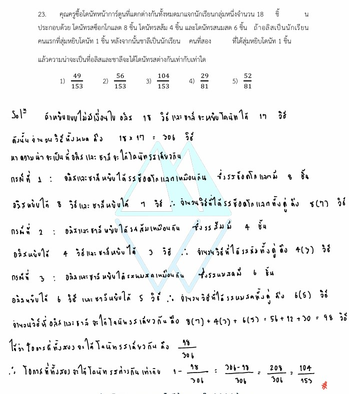

# โจทย์ข้อ 23

จากโจทย์ข้อ 23 ในรูปภาพ เป็นปัญหาเกี่ยวกับ **"ความน่าจะเป็นของเหตุการณ์หลายขั้นตอนแบบไม่ใส่คืน (Probability of Dependent Events)"** ซึ่งเกี่ยวข้องกับกฎการคูณของความน่าจะเป็นและหลักการแยกกรณี (กฎการบวก) ครับ ต่อไปนี้เป็นคำอธิบายและวิธีทำอย่างละเอียดทุกขั้นตอนครับ

---

## 1. เฉลยและวิธีทำอย่างละเอียด

**โจทย์:** คุณครูซื้อโดนัทหน้าการ์ตูนที่แตกต่างกันทั้งหมดมาแจกนักเรียนกลุ่มหนึ่งจำนวน 18 ชิ้น ประกอบด้วย โดนัทรสช็อกโกแลต 8 ชิ้น โดนัทรสส้ม 4 ชิ้น และโดนัทรสนมสด 6 ชิ้น ถ้าอลิสเป็นนักเรียนคนแรกที่สุ่มหยิบโดนัท 1 ชิ้น หลังจากนั้นชาลีเป็นนักเรียนคนที่สองที่สุ่มหยิบโดนัท 1 ชิ้น แล้วความน่าจะเป็นที่อลิสและชาลีจะได้โดนัทรสต่างกันเท่ากับเท่าใด

เมื่อโจทย์ถามถึงความน่าจะเป็นที่ได้ **"รสต่างกัน"** เราสามารถเลือกคิดคำนวณได้ 2 วิธีหลักๆ ดังนี้ครับ:

### **วิธีที่ 1: คิดจากเหตุการณ์ตรงข้าม (กฎคอมพลีเมนต์ - แนะนำเพราะคิดเลขน้อยกว่า)**

การที่ทั้งสองคนได้รสต่างกัน เหตุการณ์ตรงข้ามของมันก็คือ **"ทั้งสองคนได้รสเหมือนกัน"** **ขั้นตอนที่ 1: หาความน่าจะเป็นที่ทั้งสองคนหยิบได้รสเหมือนกัน**
เนื่องจากเป็นการหยิบทีละคนและไม่มีการใส่คืน จำนวนโดนัททั้งหมดจะลดลงในการหยิบครั้งที่สอง (จาก 18 ชิ้น เหลือ 17 ชิ้น) เราสามารถแยกเป็น 3 กรณีที่ได้รสเหมือนกัน:

* **กรณีที่ 1: ได้รสช็อกโกแลตทั้งคู่**
* อลิสหยิบได้ช็อกโกแลต: $\frac{8}{18}$
* ชาลีหยิบได้ช็อกโกแลต: $\frac{7}{17}$ (ช็อกโกแลตเหลือ 7 ชิ้น จากทั้งหมดเหลือ 17 ชิ้น)
* ความน่าจะเป็น = $\frac{8}{18} \times \frac{7}{17} = \frac{56}{306}$

* **กรณีที่ 2: ได้รสส้มทั้งคู่**
* อลิสหยิบได้รสส้ม: $\frac{4}{18}$
* ชาลีหยิบได้รสส้ม: $\frac{3}{17}$ (รสส้มเหลือ 3 ชิ้น จากทั้งหมดเหลือ 17 ชิ้น)
* ความน่าจะเป็น = $\frac{4}{18} \times \frac{3}{17} = \frac{12}{306}$

* **กรณีที่ 3: ได้รสนมสดทั้งคู่**
* อลิสหยิบได้รสนมสด: $\frac{6}{18}$
* ชาลีหยิบได้รสนมสด: $\frac{5}{17}$ (รสนมสดเหลือ 5 ชิ้น จากทั้งหมดเหลือ 17 ชิ้น)
* ความน่าจะเป็น = $\frac{6}{18} \times \frac{5}{17} = \frac{30}{306}$

นำความน่าจะเป็นของทั้ง 3 กรณีมารวมกัน (เพราะงานแยกขาดจากกัน):

$$\text{P(ได้รสเหมือนกัน)} = \frac{56 + 12 + 30}{306} = \frac{98}{306}$$

**ขั้นตอนที่ 2: หาความน่าจะเป็นที่ได้รสต่างกัน**

$$\text{P(ได้รสต่างกัน)} = 1 - \text{P(ได้รสเหมือนกัน)}$$

$$\text{P(ได้รสต่างกัน)} = 1 - \frac{98}{306} = \frac{306 - 98}{306} = \frac{208}{306}$$

ทอนให้เป็นเศษส่วนอย่างต่ำ โดยนำ 2 มาหารทั้งเศษและส่วน:

$$\frac{208 \div 2}{306 \div 2} = \frac{104}{153}$$

---

#### **วิธีที่ 2: คิดแบบแยกกรณีตรงๆ (จับคู่รสที่ต่างกัน)**

เราต้องจับคู่กรณีที่อลิสและชาลีได้คนละรสกัน ซึ่งมีทั้งหมด $3 \times 2 = 6$ กรณี ดังนี้:

1. **อลิส ช็อกฯ (8/18) $\times$ ชาลี ส้ม (4/17)** = $\frac{32}{306}$
2. **อลิส ช็อกฯ (8/18) $\times$ ชาลี นมสด (6/17)** = $\frac{48}{306}$
3. **อลิส ส้ม (4/18) $\times$ ชาลี ช็อกฯ (8/17)** = $\frac{32}{306}$
4. **อลิส ส้ม (4/18) $\times$ ชาลี นมสด (6/17)** = $\frac{24}{306}$
5. **อลิส นมสด (6/18) $\times$ ชาลี ช็อกฯ (8/17)** = $\frac{48}{306}$
6. **อลิส นมสด (6/18) $\times$ ชาลี ส้ม (4/17)** = $\frac{24}{306}$

นำทั้ง 6 กรณีมาบวกกัน:

$$\text{P(ได้รสต่างกัน)} = \frac{32 + 48 + 32 + 24 + 48 + 24}{306} = \frac{208}{306} = \frac{104}{153}$$

**สรุปคำตอบ:** ตรงกับตัวเลือกข้อ **3) $\frac{104}{153}$**

---

### 2. เนื้อหาและสูตรคณิตศาสตร์ที่เกี่ยวข้อง

#### **ความน่าจะเป็นของเหตุการณ์ที่ไม่เป็นอิสระต่อกัน (Dependent Events)**

เหตุการณ์สองเหตุการณ์จะเป็นเหตุการณ์ที่ไม่อิสระต่อกัน ก็ต่อเมื่อผลลัพธ์ของเหตุการณ์แรก **มีผลกระทบ** ต่อโอกาสที่จะเกิดเหตุการณ์ที่สอง เช่น โจทย์ข้อนี้ที่เมื่ออลิสหยิบโดนัทไปแล้ว ไม่ได้ใส่คืนเข้าไปใหม่ ทำให้จำนวนโดนัทรวมและจำนวนโดนัทรสนั้นๆ ลดลง ส่งผลให้เศษส่วนความน่าจะเป็นของชาลีเปลี่ยนไป

#### **สูตรและกฎที่เกี่ยวข้อง:**

1. **กฎการคูณสำหรับเหตุการณ์ที่ไม่เป็นอิสระต่อกัน:**

$$P(A \cap B) = P(A) \times P(B|A)$$

* $P(A)$ คือ ความน่าจะเป็นที่อลิสหยิบได้โดนัทรสที่ต้องการในครั้งแรก
* $P(B|A)$ คือ ความน่าจะเป็นที่ชาลีหยิบได้โดนัท โดยคิดบนเงื่อนไขที่ว่าโดนัทในกล่องลดลงไปแล้วจากการหยิบของอลิส

1. **กฎคอมพลีเมนต์ (Complement Rule):**

$$P(E) = 1 - P(E')$$

เมื่อ $E$ คือเหตุการณ์ที่เราสนใจ และ $E'$ คือเหตุการณ์ตรงข้ามทั้งหมด ค่าความน่าจะเป็นรวมของทุกหน้าในจักรวาลของการทดลองสุ่มจะมีค่าเท่ากับ $1$ เสมอ

---

### 3. กลยุทธ์ในการแก้โจทย์ประเภทนี้

1. **วิเคราะห์สถานการณ์ "ใส่คืน" หรือ "ไม่ใส่คืน":** * ถ้า**ไม่ใส่คืน** (เหมือนโจทย์ข้อนี้) ส่วนแบ่งกลุ่มในการคูณขั้นถัดไป ตัวส่วนจะลดลงทีละ 1 เสมอ ($18 \rightarrow 17$) และตัวเศษจะลดลงถ้าสุ่มโดนรสเดิม

* ถ้า**ใส่คืน** ความน่าจะเป็นในการหยิบทุกครั้งจะเท่าเดิมตลอดเวลา

1. **ทางเลือก "คิดตรงๆ" vs "คิดตรงข้าม":** * ถ้าโจทย์ใช้คำว่า *"รสต่างกัน"*, *"ได้สีต่างกัน"*, หรือ *"อย่างน้อย..."* บ่อยครั้งที่การคิดแบบตรงข้าม (เอา 1 ตั้งแล้วลบด้วยกรณีที่เหมือนกันทั้งหมด) จะช่วยลดจำนวนกรณีที่ต้องคำนวณลงอย่างมาก ลดความผิดพลาดในการคิดเลขได้ดีเยี่ยม
2. **เขียนแผนภาพต้นไม้ (Tree Diagram):** หากสับสนในการแยกกรณี การแตกกิ่งก้านของผลลัพธ์ในการหยิบครั้งที่ 1 และครั้งที่ 2 จะช่วยให้เห็นภาพรวมของเศษส่วนชัดเจนขึ้น

---

### 4. ตัวอย่างโจทย์เพิ่มเติมเพื่อฝึกฝน

**โจทย์:** ในกล่องใบหนึ่งมีลูกบอลสีแดง 5 ลูก และสีขาว 3 ลูก สุ่มหยิบลูกบอลทีละลูกจำนวน 2 ครั้ง โดย**ไม่ใส่คืน** จงหาความน่าจะเป็นที่จะหยิบได้ลูกบอลสีต่างกัน

**วิธีทำ:**
ใช้กลยุทธ์คิดจากเหตุการณ์ตรงข้าม คือหาความน่าจะเป็นที่ได้ "สีเหมือนกัน" ก่อน

* **กรณีได้สีแดงทั้งคู่:** ครั้งแรกได้แดง $\frac{5}{8}$ ครั้งที่สองได้แดง $\frac{4}{7} \rightarrow \frac{5}{8} \times \frac{4}{7} = \frac{20}{56}$
* **กรณีได้สีขาวทั้งคู่:** ครั้งแรกได้ขาว $\frac{3}{8}$ ครั้งที่สองได้ขาว $\frac{2}{7} \rightarrow \frac{3}{8} \times \frac{2}{7} = \frac{6}{56}$

รวมความน่าจะเป็นที่ได้สีเหมือนกัน = $\frac{20 + 6}{56} = \frac{26}{56}$

ดังนั้น ความน่าจะเป็นที่ได้สีต่างกันคือ:

$$1 - \frac{26}{56} = \frac{30}{56} = \frac{15}{28}$$

**เฉลย:** $\frac{15}{28}$
