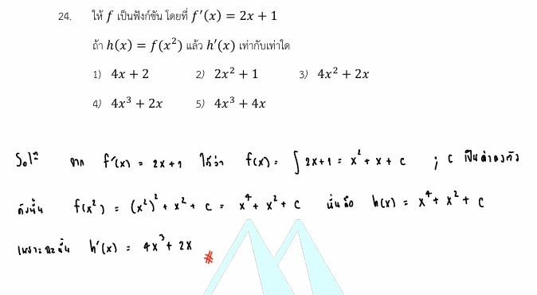

# ข้อ 24 คณิตศาสตร์ประยุกต์ 1 (A-Level) ปี 2565

การแก้โจทย์ **ข้อ 24 ของวิชาคณิตศาสตร์ประยุกต์ 1 (A-Level) ปี 2565** เป็นเรื่องเกี่ยวกับ **แคลคูลัส (Calculus)** โดยเฉพาะการหาอนุพันธ์ของฟังก์ชันประกอบ (Composite Function) โดยใช้กฎลูกโซ่ (Chain Rule) หรือการใช้อินทิเกรตเพื่อหาฟังก์ชันต้นแบบครับ

## **โจทย์ข้อ 24 (A-Level 2565)**

กำหนดให้ $k$ เป็นฟังก์ชัน โดยที่ $k'(x) = 2x + 1$
ถ้า $h(x) = k(x^2)$ แล้ว $h'(x)$ เท่ากับเท่าใด

---

### **วิธีทำอย่างละเอียด**

**วิธีที่ 1: การหาฟังก์ชันต้นแบบ (Integration)**

1. **หาฟังก์ชัน $k(x)$:** จากโจทย์ให้ $k'(x) = 2x + 1$ เราหา $k(x)$ ได้จากการอินทิเกรต:
    $$k(x) = \int (2x + 1) dx = x^2 + x + C$$ (เมื่อ $C$ เป็นค่าคงตัว)
2. **สร้างฟังก์ชัน $h(x)$:** โจทย์กำหนด $h(x) = k(x^2)$ ให้นำ $x^2$ ไปแทนในตำแหน่งของ $x$ ในฟังก์ชัน $k(x)$:
    $$h(x) = (x^2)^2 + (x^2) + C = x^4 + x^2 + C$$
3. **หาอนุพันธ์ $h'(x)$:** ดิฟฟังก์ชัน $h(x)$ เทียบกับ $x$:
    $$h'(x) = \frac{d}{dx}(x^4 + x^2 + C) = \mathbf{4x^3 + 2x}$$

**วิธีที่ 2: ใช้กฎลูกโซ่ (Chain Rule) - วิธีนี้รวดเร็วกว่า**

1. จาก $h(x) = k(x^2)$ เมื่อต้องการหา $h'(x)$ ให้ใช้กฎลูกโซ่:
    $$h'(x) = k'(x^2) \cdot \frac{d}{dx}(x^2)$$
2. นำค่า $k'(x) = 2x + 1$ มาใช้ โดยเปลี่ยน $x$ เป็น $x^2$:
    $$k'(x^2) = 2(x^2) + 1 = 2x^2 + 1$$
3. แทนค่ากลับในสูตร:
    $$h'(x) = (2x^2 + 1) \cdot (2x)$$
    $$h'(x) = 4x^3 + 2x$$

**คำตอบ:** ตรงกับตัวเลือกที่ 4 คือ **$4x^3 + 2x$**

---

### **เนื้อหาที่เกี่ยวข้องเพื่อศึกษาเพิ่มเติม**

**1. สูตรและนิยามสำคัญ:**

* **กฎการหาอนุพันธ์ (Power Rule):** $\frac{d}{dx} x^n = nx^{n-1}$
* **การอินทิเกรตพื้นฐาน:** $\int x^n dx = \frac{x^{n+1}}{n+1} + C$
* **กฎลูกโซ่ (Chain Rule):** ใช้หาอนุพันธ์ของฟังก์ชันซ้อนฟังก์ชัน $(f(g(x)))' = f'(g(x)) \cdot g'(x)$

**2. ความหมายของตัวแปรและค่าคงที่:**

* **$k'(x)$:** อนุพันธ์ของ $k$ หรืออัตราการเปลี่ยนแปลงของ $k$ ณ จุด $x$
* **$C$:** ค่าคงตัวของการอินทิเกรต (Constant of integration) ซึ่งจะหายไปเมื่อเราดิฟฟังก์ชันกลับ
* **$k(x^2)$:** ฟังก์ชันประกอบที่มองว่า "ไส้ใน" คือ $x^2$

### **กลยุทธ์แก้โจทย์ประเภทนี้**

* **เลือกวิธีที่ถนัด:** หากโจทย์ถามหาอนุพันธ์ของฟังก์ชันประกอบ การใช้ **กฎลูกโซ่** โดยตรงมักจะประหยัดเวลากว่าการอินทิเกรตหาฟังก์ชันต้นแบบแล้วค่อยดิฟกลับ
* **ระวัง "ดิฟไส้":** ในกฎลูกโซ่ อย่าลืมคูณด้วยอนุพันธ์ของฟังก์ชันที่อยู่ข้างใน (ในข้อนี้คือการดิฟ $x^2$ ได้ $2x$) ซึ่งเป็นจุดที่ผิดบ่อยที่สุดครับ

---

### **ตัวอย่างโจทย์เพิ่มเติมเพื่อฝึกทำ**

**โจทย์:** กำหนดให้ $f'(x) = 3x^2 - 4$ ถ้า $g(x) = f(x^3)$ จงหาค่าของ $g'(x)$
**เฉลยแนวคิด:**

1. ใช้กฎลูกโซ่: $g'(x) = f'(x^3) \cdot \frac{d}{dx}(x^3)$
2. แทน $x^3$ ลงใน $f'(x)$: $f'(x^3) = 3(x^3)^2 - 4 = 3x^6 - 4$
3. ดิฟไส้: $\frac{d}{dx}(x^3) = 3x^2$
4. ดังนั้น $g'(x) = (3x^6 - 4) \cdot 3x^2 = 9x^8 - 12x^2$
**ตอบ:** $9x^8 - 12x^2$

---

จากการศึกษาโจทย์ **ข้อ 24 ของข้อสอบ A-Level คณิตศาสตร์ 1 ปี 2565** และแนวทางการแก้ปัญหาในแหล่งข้อมูล สามารถสรุปสูตรและหลักการของ **กฎลูกโซ่ (Chain Rule)** เพื่อใช้ในการหาอนุพันธ์ของฟังก์ชันประกอบ (Composite Function) ได้ดังนี้ครับ

### **1. นิยามและสูตรของกฎลูกโซ่**

กฎลูกโซ่ใช้สำหรับหาอนุพันธ์ของฟังก์ชันที่ซ้อนกันอยู่ หรือฟังก์ชันประกอบในรูป $h(x) = f(g(x))$ โดยมีสูตรสำคัญคือ:
$$\mathbf{h'(x) = f'(g(x)) \cdot g'(x)}$$

* **$f'(g(x))$:** คือการดิฟฟังก์ชัน "ตัวนอก" โดยที่ยังคงไส้ใน ($g(x)$) ไว้เหมือนเดิม
* **$g'(x)$:** คือการดิฟฟังก์ชัน "ตัวใน" หรือที่มักเรียกกันว่า **"ดิฟไส้"** แล้วนำมาคูณเพิ่มเข้าไป

### **2. ตัวอย่างการประยุกต์ใช้จากโจทย์ข้อ 24**

โจทย์กำหนดให้ $k'(x) = 2x + 1$ และ $h(x) = k(x^2)$ โดยให้หา $h'(x)$ มีขั้นตอนดังนี้:

1. **พิจารณาโครงสร้างฟังก์ชัน:** $h(x)$ เป็นฟังก์ชันประกอบที่มี $k$ เป็นฟังก์ชันนอก และ $x^2$ เป็นฟังก์ชันใน
2. **ใช้กฎลูกโซ่:**
    * $h'(x) = k'(x^2) \cdot \frac{d}{dx}(x^2)$
3. **คำนวณส่วนประกอบ:**
    * **ดิฟตัวนอก:** นำ $x^2$ ไปแทนใน $k'(x)$ จะได้ $k'(x^2) = 2(x^2) + 1 = 2x^2 + 1$
    * **ดิฟตัวใน (ดิฟไส้):** ดิฟ $x^2$ ได้ผลลัพธ์คือ $2x$
4. **สรุปผลคูณ:**
    * $h'(x) = (2x^2 + 1) \cdot (2x) = \mathbf{4x^3 + 2x}$

### **3. ข้อควรระวังและกลยุทธ์ในการทำข้อสอบ**

* **อย่าลืมดิฟไส้:** ข้อผิดพลาดที่พบบ่อยที่สุดคือการดิฟเฉพาะฟังก์ชันนอกแล้วลืมคูณอนุพันธ์ของฟังก์ชันใน ($g'(x)$) เข้าไปด้วย
* **ความรวดเร็ว:** ในการสอบ A-Level การใช้กฎลูกโซ่โดยตรงมักจะ **ประหยัดเวลามากกว่า** การพยายามหาฟังก์ชันต้นแบบก่อนแล้วค่อยนำมาดิฟใหม่
* **การแทนค่า:** เมื่อดิฟฟังก์ชันนอก ($f'$) ต้องระวังการแทนค่าตัวแปรด้วยฟังก์ชันใน ($g(x)$) ทั้งชุด ไม่ใช่แค่ตัวแปร $x$ เดี่ยวๆ ครับ

---

จากการศึกษาโจทย์**ข้อ 24** ในแหล่งข้อมูลเกี่ยวกับฟังก์ชันประกอบ สามารถสรุปสูตรและหลักการของ **กฎลูกโซ่ (Chain Rule)** สำหรับการหาอนุพันธ์ได้ดังนี้ครับ:

### **1. สูตรพื้นฐานของกฎลูกโซ่**

เมื่อเรามีฟังก์ชันประกอบในรูป $h(x) = f(g(x))$ สูตรในการหาอนุพันธ์คือ:
$$\mathbf{h'(x) = f'(g(x)) \cdot g'(x)}$$

* **$f'(g(x))$:** คือการดิฟฟังก์ชัน **"ตัวนอก"** (ในที่นี้คือ $f$) โดยที่ยังคงรักษาฟังก์ชัน **"ตัวใน"** ($g(x)$) ไว้เหมือนเดิม
* **$g'(x)$:** คือการดิฟฟังก์ชัน **"ตัวใน"** หรือที่มักเรียกกันว่า **"ดิฟไส้"** แล้วนำผลลัพธ์มาคูณต่อท้าย

### **2. การประยุกต์ใช้ในโจทย์ (อ้างอิงข้อ 24)**

จากโจทย์ที่กำหนดให้ $k'(x) = 2x + 1$ และ $h(x) = k(x^2)$ เราสามารถหา $h'(x)$ ได้ตามขั้นตอนดังนี้:

1. **ใช้สูตรกฎลูกโซ่:** $h'(x) = k'(x^2) \cdot \frac{d}{dx}(x^2)$
2. **ดิฟตัวนอก:** แทน $x$ ใน $k'(x)$ ด้วย $x^2$ จะได้ $k'(x^2) = 2(x^2) + 1$
3. **ดิฟตัวใน (ดิฟไส้):** ดิฟ $x^2$ ได้ผลลัพธ์คือ $2x$
4. **สรุปคำตอบ:** นำมาคูณกันได้ $h'(x) = (2x^2 + 1)(2x) = \mathbf{4x^3 + 2x}$

### **3. กลยุทธ์ในการทำข้อสอบ**

* **ตรวจสอบโครงสร้าง:** แยกแยะให้ออกว่าฟังก์ชันใดคือ "ตัวนอก" และฟังก์ชันใดคือ "ไส้ใน" ก่อนเริ่มดิฟ
* **อย่าลืมดิฟไส้:** จุดที่ผิดบ่อยที่สุดคือการดิฟเฉพาะฟังก์ชันนอกแล้วลืมคูณด้วยอนุพันธ์ของฟังก์ชันข้างใน ($g'(x)$)
* **ความรวดเร็ว:** การใช้กฎลูกโซ่โดยตรงในฟังก์ชันประกอบมักจะ **ประหยัดเวลากว่า** การหาฟังก์ชันต้นแบบผ่านการอินทิเกรตแล้วค่อยนำมาดิฟใหม่

การจำรูปแบบ **"ดิฟนอก(คงใน) $\times$ ดิฟใน"** จะช่วยให้น้องๆ นำสูตรกฎลูกโซ่ไปใช้กับโจทย์แคลคูลัสในระดับ A-Level ได้อย่างแม่นยำครับ

---

ความสัมพันธ์ระหว่าง**อนุพันธ์ (Derivative)** และ**การอินทิเกรต (Integration)** เป็นพื้นฐานสำคัญของแคลคูลัส โดยทั้งสองกระบวนการนี้มีความสัมพันธ์กันในลักษณะเป็น**การดำเนินการที่ตรงข้ามกัน** หรือกระบวนการย้อนกลับของกันและกัน ดังนี้ครับ:

1. **การอินทิเกรตคือการหาฟังก์ชันต้นแบบ (Antiderivative):** หากเราทราบอนุพันธ์ของฟังก์ชันหนึ่ง เราสามารถใช้การอินทิเกรตเพื่อหาฟังก์ชันดั้งเดิมก่อนการดิฟได้ เช่น ในโจทย์ข้อ 24 ที่กำหนดอนุพันธ์มาให้คือ $k'(x) = 2x + 1$ เมื่อเราทำการ**อินทิเกรต** จะได้ฟังก์ชันต้นแบบคือ $k(x) = x^2 + x + C$ (โดยที่ $C$ คือค่าคงตัวของการอินทิเกรต)
2. **อนุพันธ์คือการหาอัตราการเปลี่ยนแปลง:** ในทางกลับกัน หากเรามีฟังก์ชัน $h(x) = k(x^2)$ และต้องการหาอนุพันธ์ $h'(x)$ เราจะใช้อนุพันธ์ในการคำนวณเพื่อดูอัตราการเปลี่ยนแปลงของฟังก์ชันนั้น ซึ่งในข้อสอบมีการใช้**กฎลูกโซ่ (Chain Rule)** ร่วมด้วยเพื่อให้ได้ผลลัพธ์ $4x^3 + 2x$
3. **ความสัมพันธ์เชิงพื้นที่:** การอินทิเกรตไม่ได้เป็นเพียงการย้อนกลับของอนุพันธ์เท่านั้น แต่ยังมีความสัมพันธ์กับการหา**ปริมาณสะสมหรือพื้นที่** ดังจะเห็นได้จากโจทย์ข้อ 29 ที่ใช้**อินทิกรัลจำกัดเขต**ในการหาพื้นที่ที่ปิดล้อมด้วยเส้นโค้ง $f(x)$ กับแกน $X$ ซึ่งได้ผลลัพธ์เป็นค่าพื้นที่ 36 ตารางหน่วย

**สรุปสั้นๆ:**

* **อนุพันธ์:** ทำหน้าที่ "กระจาย" หรือ "หาความชัน" จากฟังก์ชันใหญ่ไปสู่หน่วยย่อย (อัตราการเปลี่ยนแปลง)
* **การอินทิเกรต:** ทำหน้าที่ "รวม" หรือ "หาพื้นที่" จากหน่วยย่อย (อนุพันธ์) กลับไปสู่ปริมาณรวมหรือฟังก์ชันดั้งเดิม
