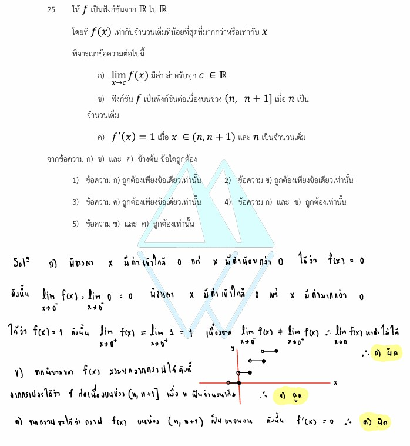

# การแก้โจทย์ **ข้อ 25 ของวิชาคณิตศาสตร์ประยุกต์ 1 (A-Level) ปี 2565** เป็นการทดสอบความเข้าใจเรื่อง **แคลคูลัส (Calculus)** โดยเฉพาะสมบัติของฟังก์ชันพิเศษที่เรียกว่า **ฟังก์ชันเพดาน (Ceiling Function)** ในด้านลิมิต ความต่อเนื่อง และอนุพันธ์ครับ,

## **โจทย์ข้อ 25 (A-Level 2565)**

กำหนดให้ $f$ เป็นฟังก์ชันจาก $\mathbb{R}$ ไป $\mathbb{R}$ โดยที่ $f(x)$ เท่ากับ **จำนวนเต็มที่น้อยที่สุดที่มากกว่าหรือเท่ากับ $x$** (เขียนแทนด้วย $\lceil x \rceil$) พิจารณาข้อความต่อไปนี้:

* **ก)** $\lim_{x \to a} f(x)$ มีค่า สำหรับทุก $a \in \mathbb{R}$
* **ข)** ฟังก์ชัน $f$ เป็นฟังก์ชันต่อเนื่องบนช่วง $(n, n+1]$ เมื่อ $n$ เป็นจำนวนเต็ม
* **ค)** $f'(x) = 1$ เมื่อ $x \in (n, n+1)$ และ $n$ เป็นจำนวนเต็ม

---

### **วิธีทำอย่างละเอียด**

**1. วิเคราะห์นิยามของฟังก์ชัน $f(x)$:**
ฟังก์ชันนี้คือ **Ceiling Function** ตัวอย่างเช่น:

* $f(0.5) = 1$
* $f(1) = 1$
* $f(1.2) = 2$
* $f(-0.5) = 0$
กราฟจะมีลักษณะเป็นขั้นบันไดที่จุดทึบอยู่ทางขวาและจุดโปร่งอยู่ทางซ้ายของแต่ละขั้น

**2. ตรวจสอบข้อความ ก (ลิมิต):**

* พิจารณาจุดที่ $a$ เป็นจำนวนเต็ม เช่น $a = 0$
  * **ลิมิตทางซ้าย ($\lim_{x \to 0^-} f(x)$):** เมื่อ $x$ มีค่าเข้าใกล้ 0 จากทางซ้าย (เช่น $-0.1$) ค่า $f(x)$ จะเท่ากับ **$0$**
  * **ลิมิตทางขวา ($\lim_{x \to 0^2} f(x)$):** เมื่อ $x$ มีค่าเข้าใกล้ 0 จากทางขวา (เช่น $0.1$) ค่า $f(x)$ จะเท่ากับ **$1$**
* เนื่องจากลิมิตทางซ้ายและขวาไม่เท่ากัน ลิมิตที่จุดจำนวนเต็มจึง **หาค่าไม่ได้**
* **สรุป:** ข้อความ ก **ไม่ถูกต้อง**

**3. ตรวจสอบข้อความ ข (ความต่อเนื่อง):**

* บนช่วงเปิด $(n, n+1)$ ค่าของ $f(x)$ จะคงที่เท่ากับ $n+1$ เสมอ จึงต่อเนื่องในช่วงนี้
* พิจารณาที่จุดปลาย $x = n+1$:
  * $\lim_{x \to (n+1)^-} f(x) = n+1$
  * ค่าฟังก์ชัน $f(n+1) = n+1$
* เมื่อลิมิตทางซ้ายเท่ากับค่าของฟังก์ชัน ฟังก์ชันจึงมีความต่อเนื่องบนช่วงครึ่งเปิด $(n, n+1]$
* **สรุป:** ข้อความ ข **ถูกต้อง**

**4. ตรวจสอบข้อความ ค (อนุพันธ์):**

* จากข้อความ ข เราทราบว่าบนช่วงเปิด $(n, n+1)$ ฟังก์ชัน $f(x)$ มีค่าคงที่ (เป็นเส้นตรงแนวนอน)
* อนุพันธ์ของค่าคงที่ ($c'$) จะเท่ากับ **$0$** เสมอ ไม่ใช่ 1
* **สรุป:** ข้อความ ค **ไม่ถูกต้อง**

**คำตอบ:** ข้อความ **ข ถูกต้องเพียงข้อเดียวเท่านั้น** (ตรงกับตัวเลือกที่ 2),

---

### **เนื้อหาที่เกี่ยวข้องเพื่อศึกษาเพิ่มเติม**

**1. ฟังก์ชันเพดาน (Ceiling Function: $\lceil x \rceil$):**

* **ความหมาย:** คือการปัดเศษขึ้นเป็นจำนวนเต็มเสมอ
* **ความแตกต่าง:** ต่างจาก **Floor Function ($\lfloor x \rfloor$)** ที่ใช้ในข้อ 19 ซึ่งเป็นการปัดเศษลง (จำนวนเต็มที่มากที่สุดที่น้อยกว่าหรือเท่ากับ $x$)

**2. นิยามความต่อเนื่องบนช่วง:**

* ฟังก์ชันจะต่อเนื่องบนช่วง $(a, b]$ ก็ต่อเมื่อต่อเนื่องทุกจุดในช่วงเปิด $(a, b)$ และมีความต่อเนื่องทางซ้ายที่จุด $b$ ($\lim_{x \to b^-} f(x) = f(b)$)

### **กลยุทธ์แก้โจทย์ประเภทนี้**

* **วาดกราฟ:** ฟังก์ชันขั้นบันไดจะเข้าใจง่ายที่สุดเมื่อเห็นรูปกราฟ จะเห็นชัดเจนว่าจุดใดขาด (ลิมิตหาค่าไม่ได้) และช่วงใดราบเรียบ (อนุพันธ์เป็น 0)
* **ทดลองแทนค่า:** หากจำนิยามไม่ได้ ให้ลองแทนค่า $x$ ที่เป็นทศนิยมบวกและลบเพื่อหาแนวโน้มของค่าฟังก์ชัน

---

### **ตัวอย่างโจทย์เพิ่มเติมเพื่อฝึกทำ (ข้อมูลเพิ่มเติมไม่อยู่ในแหล่งข้อมูล)**

**โจทย์:** กำหนด $g(x) = \lceil x \rceil + \lfloor x \rfloor$ จงหาค่าของ $\lim_{x \to 0.5} g(x)$
**เฉลยแนวคิด:**

1. ที่ $x = 0.5$ ทั้งฟังก์ชันเพดานและฟังก์ชันพื้นไม่มีการกระโดดของค่า
2. $\lim_{x \to 0.5} \lceil x \rceil = 1$
3. $\lim_{x \to 0.5} \lfloor x \rfloor = 0$
4. ดังนั้น $\lim_{x \to 0.5} g(x) = 1 + 0 = 1$
**ตอบ:** 1

*(หมายเหตุ: ตัวอย่างโจทย์เพิ่มเติมนี้เป็นการสร้างขึ้นเพื่อเสริมความเข้าใจโดยอิงจากหลักการในข้อสอบครับ)*
