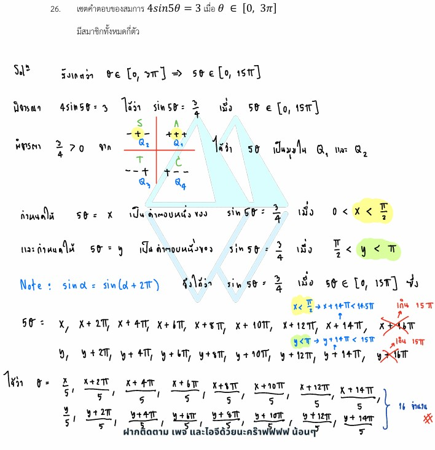

# การแก้โจทย์ **ข้อ 26 ของวิชาคณิตศาสตร์ประยุกต์ 1 (A-Level) ปี 2565** เป็นเรื่องเกี่ยวกับ **ฟังก์ชันตรีโกณมิติ (Trigonometry)** โดยเน้นการแก้สมการตรีโกณมิติและการหาจำนวนคำตอบในช่วงที่กำหนดครับ

## **เฉลยละเอียดโจทย์ข้อ 26 (A-Level 2565)**

**โจทย์:** เซตคำตอบของสมการ $4\sin^2(5\theta) = 3$ เมื่อ $\theta \in [0, \pi/3]$ มีสมาชิกทั้งหมดกี่ตัว

---

**วิธีทำอย่างละเอียด:**

**ขั้นตอนที่ 1: จัดรูปสมการตรีโกณมิติ**

* จากสมการ $4\sin^2(5\theta) = 3$
* ย้าย 4 ไปหาร: $\sin^2(5\theta) = \frac{3}{4}$
* ถอดรากที่สองทั้งสองข้าง: **$\sin(5\theta) = \pm\frac{\sqrt{3}}{2}$**
* นั่นคือเราต้องหาค่า $5\theta$ ที่ทำให้ค่า $\sin$ เป็น $\frac{\sqrt{3}}{2}$ หรือ $-\frac{\sqrt{3}}{2}$

**ขั้นตอนที่ 2: พิจารณาช่วงของมุม $5\theta$**

* โจทย์กำหนดช่วงของ $\theta$ คือ $0 \le \theta \le \frac{\pi}{3}$
* ดังนั้น ช่วงของมุม $5\theta$ คือ $5(0) \le 5\theta \le 5(\frac{\pi}{3})$
* จะได้ **$0 \le 5\theta \le \frac{5\pi}{3}$**

**ขั้นตอนที่ 3: หาค่ามุม $5\theta$ ที่สอดคล้องในช่วง**
พิจารณาจากวงกลมหนึ่งหน่วย ค่า $\sin$ ที่เท่ากับ $\pm\frac{\sqrt{3}}{2}$ มีมุมอ้างอิง (Reference Angle) คือ $\frac{\pi}{3}$ (หรือ 60 องศา)

* **กรณี $\sin(5\theta) = \frac{\sqrt{3}}{2}$ (ควอดรันต์ที่ 1 และ 2):**
  * $5\theta = \frac{\pi}{3}$ (อยู่ในช่วง $0$ ถึง $\frac{5\pi}{3}$)
  * $5\theta = \pi - \frac{\pi}{3} = \frac{2\pi}{3}$ (อยู่ในช่วง $0$ ถึง $\frac{5\pi}{3}$)
* **กรณี $\sin(5\theta) = -\frac{\sqrt{3}}{2}$ (ควอดรันต์ที่ 3 และ 4):**
  * $5\theta = \pi + \frac{\pi}{3} = \frac{4\pi}{3}$ (อยู่ในช่วง $0$ ถึง $\frac{5\pi}{3}$)
  * $5\theta = 2\pi - \frac{\pi}{3} = \frac{5\pi}{3}$ (อยู่ในช่วง $0$ ถึง $\frac{5\pi}{3}$)

**ขั้นตอนที่ 4: สรุปจำนวนคำตอบ**

* ค่า $5\theta$ ที่เป็นไปได้คือ $\frac{\pi}{3}, \frac{2\pi}{3}, \frac{4\pi}{3}, \frac{5\pi}{3}$ ซึ่งเมื่อหารด้วย 5 จะได้ค่า $\theta$ ที่แตกต่างกัน 4 ค่าพอดี
* ดังนั้น เซตคำตอบมีสมาชิกทั้งหมด **4 ตัว**

**ตอบ:** 4

---

### **เนื้อหาที่เกี่ยวข้องเพื่อศึกษาเพิ่มเติม**

**1. สูตรและค่ามุมมาตรฐาน:**

* $\sin \frac{\pi}{3} = \frac{\sqrt{3}}{2}$
* การหาค่าในควอดรันต์ต่างๆ: $Q_2 = \pi - \theta$, $Q_3 = \pi + \theta$, $Q_4 = 2\pi - \theta$

**2. ความหมายของตัวแปรและค่าคงที่:**

* **$5\theta$:** คือมุมภายในฟังก์ชันตรีโกณมิติ การมีเลข 5 คูณอยู่หมายความว่าคาบของฟังก์ชันจะแคบลง ทำให้ในช่วงหนึ่งๆ มีโอกาสเกิดคำตอบได้มากขึ้น
* **$\sin^2(x)$:** หมายถึง $(\sin x)^2$ เมื่อถอดรูทต้องระวังว่าได้ทั้งค่าบวกและลบ

### **กลยุทธ์แก้โจทย์ประเภทนี้**

* **ขยายช่วงมุมเสมอ:** เมื่อมุมในฟังก์ชันไม่ใช่ $\theta$ ตัวเดียว (เช่น $5\theta$) ให้คูณช่วงที่โจทย์ให้มาด้วยเลขนั้นก่อน เพื่อหาขอบเขตของคำตอบที่แท้จริง
* **เช็คค่าบวก/ลบ:** หากสมการเป็นกำลังสอง $(\sin^2)$ อย่าลืมพิจารณาคำตอบทั้งฝั่งบวกและฝั่งลบของวงกลมหนึ่งหน่วย
* **ระวังจุดขอบ:** ตรวจสอบว่าคำตอบที่หาได้เท่ากับค่าขอบของช่วงพอดีหรือไม่ (เช่น $\frac{5\pi}{3}$ ในข้อนี้) เพื่อไม่ให้พลาดการนับจำนวนสมาชิก

---

### **ตัวอย่างโจทย์เพิ่มเติมเพื่อฝึกทำ**

**โจทย์:** จงหาจำนวนคำตอบของสมการ $2\cos(2\theta) = 1$ เมื่อ $\theta \in [0, \pi]$
**เฉลยแนวคิด:**

1. จัดรูป: $\cos(2\theta) = 1/2$
2. หาช่วงมุม $2\theta$: เนื่องจาก $0 \le \theta \le \pi$ ดังนั้น $0 \le 2\theta \le 2\pi$
3. หาค่า $2\theta$ ที่ทำให้ $\cos = 1/2$: คือ $\frac{\pi}{3}$ (Q1) และ $2\pi - \frac{\pi}{3} = \frac{5\pi}{3}$ (Q4)
4. ทั้งสองค่าอยู่ในช่วง $0$ ถึง $2\pi$
**ตอบ:** 2 คำตอบ

---

วิธีการหาจำนวนคำตอบของสมการตรีโกณมิติ โดยเฉพาะเมื่อมีการกำหนดช่วงของคำตอบมาให้ สามารถสรุปขั้นตอนตามแนวทางการแก้โจทย์ข้อ 26 จากข้อสอบ A-Level ปี 2565 ได้ดังนี้ครับ:

### **1. จัดรูปสมการให้อยู่ในรูปพื้นฐาน**

ขั้นตอนแรกคือการแก้สมการเพื่อหาค่าของฟังก์ชันตรีโกณมิตินั้นๆ (เช่น $\sin, \cos$ หรือ $\tan$)

* **ตัวอย่าง:** จากสมการ $4\sin^2(5\theta) = 3$ ให้ย้ายข้างเพื่อหาค่า $\sin^2(5\theta) = \frac{3}{4}$
* ถอดรากที่สองเพื่อหาค่าฟังก์ชันเดี่ยว: $\sin(5\theta) = \pm\frac{\sqrt{3}}{2}$
* **ข้อควรระวัง:** เมื่อถอดรากที่สองจากกำลังสอง ต้องพิจารณาคำตอบทั้งค่าบวกและค่าลบ

### **2. ขยายช่วงของมุมตามฟังก์ชัน (Domain Adjustment)**

หากมุมภายในฟังก์ชันไม่ใช่ตัวแปรเดี่ยว (เช่น $5\theta$) เราต้องปรับช่วงของมุมที่โจทย์กำหนดให้สอดคล้องกัน

* **ตัวอย่าง:** โจทย์กำหนดช่วง $\theta \in [0, \pi/3]$
* เนื่องจากมุมในฟังก์ชันคือ $5\theta$ เราต้องนำ 5 ไปคูณตลอดทั้งช่วง: **$0 \le 5\theta \le \frac{5\pi}{3}$**
* ขั้นตอนนี้สำคัญมากเพราะจะช่วยให้เราทราบขอบเขตที่แท้จริงในการหาคำตอบบนวงกลมหนึ่งหน่วย

### **3. หาค่ามุมที่สอดคล้องโดยใช้วงกลมหนึ่งหน่วย**

พิจารณาว่าในหนึ่งรอบวงกลม ($0$ ถึง $2\pi$) มีมุมใดบ้างที่ให้ค่าฟังก์ชันตามที่คำนวณได้ในข้อ 1 และตรวจสอบว่าอยู่ในช่วงที่ปรับแล้วจากข้อ 2 หรือไม่

* **จากตัวอย่าง:** หาค่ามุมที่ทำให้ $\sin = \frac{\sqrt{3}}{2}$ หรือ $-\frac{\sqrt{3}}{2}$ ภายในช่วง $0$ ถึง $5\pi/3$
* **คำตอบที่ได้:**
  * **ค่าบวก (ควอดรันต์ที่ 1 และ 2):** $5\theta = \frac{\pi}{3}$ และ $\frac{2\pi}{3}$
  * **ค่าลบ (ควอดรันต์ที่ 3 และ 4):** $5\theta = \frac{4\pi}{3}$ และ $\frac{5\pi}{3}$
* ตรวจสอบว่าทุกค่าอยู่ในช่วง $[0, 5\pi/3]$ หรือไม่ ซึ่งในกรณีนี้ทั้ง 4 ค่าอยู่ในช่วงพอดี

### **4. นับจำนวนสมาชิกในเซตคำตอบ**

เมื่อได้ค่ามุมทั้งหมดที่สอดคล้องตามเงื่อนไขแล้ว ให้นับจำนวนคำตอบเหล่านั้น

* ในโจทย์ข้อนี้ มีค่า $5\theta$ ที่เป็นไปได้ทั้งหมด 4 ค่า คือ $\frac{\pi}{3}, \frac{2\pi}{3}, \frac{4\pi}{3}, \frac{5\pi}{3}$
* แต่ละค่าของ $5\theta$ จะนำไปสู่ค่า $\theta$ ที่แตกต่างกัน 4 ค่า
* **สรุป:** เซตคำตอบของสมการนี้มีสมาชิกทั้งหมด **4 ตัว**

**กลยุทธ์สำคัญ:** การวาดวงกลมหนึ่งหน่วยจะช่วยให้คุณเห็นภาพของคำตอบในแต่ละควอดรันต์ได้ชัดเจนขึ้น และลดความเสี่ยงในการลืมนับคำตอบที่ซ้ำรอบหรือคำตอบที่เป็นค่าลบครับ
