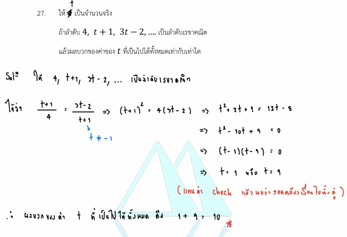

# เฉลยข้อ 27 คณิตศาสตร์ประยุกต์ 1 (A-Level) ปี 2565

การแก้โจทย์ **ข้อ 27 ของวิชาคณิตศาสตร์ประยุกต์ 1 (A-Level) ปี 2565** เป็นการทดสอบความเข้าใจเกี่ยวกับ **ลำดับเรขาคณิต (Geometric Sequence)** โดยใช้สมบัติพื้นฐานของอัตราส่วนร่วมในการสร้างสมการกำลังสองเพื่อหาคำตอบครับ

## **เฉลยละเอียดโจทย์ข้อ 27 (A-Level 2565)**

**โจทย์:** ให้ $d$ เป็นจำนวนจริง ถ้าลำดับ $4, d + 1, 3d - 2, \dots$ เป็นลำดับเรขาคณิต แล้วผลบวกของค่าของ $d$ ที่เป็นไปได้ทั้งหมดเท่ากับเท่าใด

---

### **วิธีทำอย่างละเอียด**

**ขั้นตอนที่ 1: ใช้สมบัติของลำดับเรขาคณิตสร้างสมการ**

* ในลำดับเรขาคณิต อัตราส่วนระหว่างพจน์ที่อยู่ติดกัน (พจน์หลังหารด้วยพจน์หน้า) จะมีค่าคงตัวเสมอ เรียกว่า **อัตราส่วนร่วม (Common Ratio: $r$)**
* จากลำดับ $a_1 = 4, a_2 = d + 1, a_3 = 3d - 2$ จะได้ความสัมพันธ์:
    $$\frac{a_2}{a_1} = \frac{a_3}{a_2} \implies \mathbf{a_2^2 = a_1 \cdot a_3}$$
* แทนค่าจากโจทย์:
    $$(d + 1)^2 = 4(3d - 2)$$

**ขั้นตอนที่ 2: แก้สมการกำลังสอง**

* กระจายกำลังสองสมบูรณ์ทางซ้าย และคูณกระจายทางขวา:
    $$d^2 + 2d + 1 = 12d - 8$$
* ย้ายข้างพจน์ทั้งหมดมาไว้ฝั่งเดียวกันเพื่อจัดรูปสมการ $ax^2 + bx + c = 0$:
    $$d^2 - 10d + 9 = 0$$
* แยกตัวประกอบ:
    $$(d - 1)(d - 9) = 0$$
* จะได้ค่า $d$ ที่เป็นไปได้คือ **$d = 1$** หรือ **$d = 9$**

**ขั้นตอนที่ 3: ตรวจสอบคำตอบและหาผลรวม**

* เมื่อนำค่า $d$ ไปแทนในลำดับเพื่อตรวจสอบ:
  * ถ้า $d = 1$: ลำดับคือ $4, 2, 1$ (เป็นลำดับเรขาคณิตที่มี $r = 1/2$)
  * ถ้า $d = 9$: ลำดับคือ $4, 10, 25$ (เป็นลำดับเรขาคณิตที่มี $r = 2.5$)
* เนื่องจากทั้งคู่สอดคล้องกับเงื่อนไขลำดับเรขาคณิต โจทย์ถามหา **ผลบวกของค่า $d$ ทั้งหมด**:
    $$\text{ผลบวก} = 1 + 9 = \mathbf{10}$$

**ตอบ:** 10

---

### **เนื้อหาที่เกี่ยวข้องเพื่อศึกษาเพิ่มเติม**

**1. นิยามลำดับเรขาคณิต:**

* คือลำดับที่มีพจน์ทั่วไปอยู่ในรูป $a_n = a_1 r^{n-1}$
* สมบัติพจน์กลาง: ถ้า $a, b, c$ เป็นลำดับเรขาคณิต แล้ว **$b^2 = ac$**

**2. ความหมายของตัวแปร:**

* **$d$:** ในโจทย์นี้คือค่าคงที่ที่เป็นส่วนประกอบของพจน์ในลำดับ (ไม่ใช่ผลต่างร่วมเหมือนลำดับเลขคณิต)
* **$r$ (อัตราส่วนร่วม):** ค่าที่เกิดจาก $\frac{a_{n+1}}{a_n}$ หาก $r$ เป็นลบ ลำดับจะมีค่าบวกสลับลบ

### **กลยุทธ์แก้โจทย์ประเภทนี้**

* **ใช้สมบัติพจน์กลาง:** เมื่อเจอโจทย์ที่ให้พจน์ 3 พจน์ติดกันมาในรูปตัวแปร ให้ตั้งสมการด้วย "พจน์กลางกำลังสอง = พจน์หน้าคูณพจน์หลัง" เสมอ จะช่วยลดขั้นตอนการหา $r$ ก่อนได้
* **ตรวจสอบเงื่อนไขโจทย์:** บางโจทย์อาจระบุเพิ่มเติมว่า "เป็นลำดับที่มีค่าเพิ่มขึ้น" หรือ "$d$ ต้องเป็นจำนวนเต็มบวก" เพื่อคัดกรองคำตอบที่ได้จากสมการกำลังสอง
* **สูตรลัดผลบวกราก:** จากสมการ $d^2 - 10d + 9 = 0$ หากโจทย์ถามหาผลบวกของคำตอบทันที สามารถใช้สูตร $-\frac{b}{a}$ ได้ ซึ่งจะได้ $-\frac{(-10)}{1} = 10$ ช่วยประหยัดเวลาการแยกตัวประกอบในกรณีที่ตัวเลขยากครับ

---

### **ตัวอย่างโจทย์เพิ่มเติมเพื่อฝึกทำ**

**โจทย์:** กำหนดให้ $x, x+2, x+6$ เป็นสามพจน์แรกของลำดับเรขาคณิต จงหาค่า $x$ และอัตราส่วนร่วม $r$
**เฉลยแนวคิด:**

1. ตั้งสมการ: $(x+2)^2 = x(x+6)$
2. กระจาย: $x^2 + 4x + 4 = x^2 + 6x$
3. แก้สมการ: $4x + 4 = 6x \implies 2x = 4 \implies x = 2$
4. หาลำดับ: $2, 4, 8$
5. หา $r$: $4/2 = 2$
**ตอบ:** $x = 2, r = 2$

---

จากโจทย์**ข้อ 27** ของข้อสอบ A-Level คณิตศาสตร์ 1 ปี 2565 สามารถสรุปสูตรและสมบัติสำคัญของ**ลำดับเรขาคณิต (Geometric Sequence)** ที่ใช้ในการแก้โจทย์ได้ดังนี้ครับ

### **1. นิยามและอัตราส่วนร่วม (Common Ratio)**

ลำดับเรขาคณิตคือลำดับที่อัตราส่วนของพจน์หลังต่อพจน์หน้ามีค่าคงตัวเสมอ ซึ่งเรียกว่า **อัตราส่วนร่วม ($r$)**

* **สูตร:** $r = \frac{a_2}{a_1} = \frac{a_3}{a_2} = \dots = \frac{a_{n+1}}{a_n}$

### **2. สมบัติพจน์กลางของลำดับเรขาคณิต**

เมื่อกำหนดให้พจน์ 3 พจน์เรียงกันเป็นลำดับเรขาคณิต เช่น $a, b, c$ เราสามารถหาความสัมพันธ์ได้จากอัตราส่วนร่วม $\frac{b}{a} = \frac{c}{b}$ ซึ่งจัดรูปได้เป็นสูตรสำคัญที่ใช้ในโจทย์ข้อนี้คือ:
$$\mathbf{b^2 = a \cdot c}$$

* **การประยุกต์ใช้ในโจทย์:** จากลำดับ $4, d + 1, 3d - 2$ จะได้สมการ $(d + 1)^2 = 4(3d - 2)$

### **3. การหาผลรวมของค่าตัวแปร**

หลังจากจัดรูปสมการเรขาคณิตแล้ว มักจะได้เป็น**สมการกำลังสอง** ในรูปแบบ $ax^2 + bx + c = 0$ ซึ่งในข้อนี้คือ $d^2 - 10d + 9 = 0$

* **การหาค่าตัวแปร:** ใช้วิธีแยกตัวประกอบ $(d - 1)(d - 9) = 0$ จะได้ $d = 1$ หรือ $d = 9$
* **ผลบวกของค่าที่ได้:** นำค่าที่หาได้มารวมกัน $1 + 9 = 10$

### **กลยุทธ์เพิ่มเติมในการทำข้อสอบ**

* **การตรวจสอบเงื่อนไข:** เมื่อได้ค่าตัวแปรมาแล้ว ควรนำกลับไปแทนในลำดับเพื่อเช็คว่ายังคงเป็นลำดับเรขาคณิตจริงหรือไม่ (เช่น ถ้า $d=1$ ลำดับจะเป็น $4, 2, 1$ ซึ่งมี $r = 0.5$)
* **สูตรลัดผลบวกของราก:** หากโจทย์ถามหาผลรวมของคำตอบจากสมการกำลังสองทันที (โดยไม่ต้องแยกคำตอบ) สามารถใช้สูตร **$-\frac{b}{a}$** จากสมการ $d^2 - 10d + 9 = 0$ จะได้ $-\frac{(-10)}{1} = 10$ ได้เช่นกันครับ
