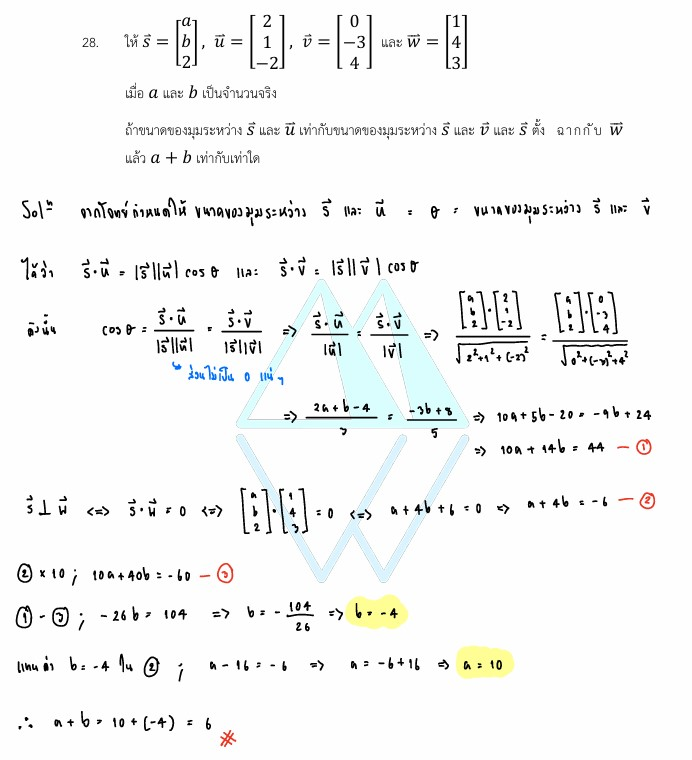

# เฉลยข้อ 28 คณิตศาสตร์ประยุกต์ 1 (A-Level) ปี 2565

การแก้โจทย์ **ข้อ 28 ของวิชาคณิตศาสตร์ประยุกต์ 1 (A-Level) ปี 2565** เป็นการบูรณาการความรู้เรื่อง **เวกเตอร์ในระบบพิกัดฉากสามมิติ (Vectors in 3D)** โดยทดสอบเรื่องผลคูณเชิงสเกลาร์ (Dot Product), ขนาดของเวกเตอร์ และสมบัติของมุมระหว่างเวกเตอร์ครับ,

## **เฉลยละเอียดโจทย์ข้อ 28 (A-Level 2565)**

**โจทย์:**
กำหนดให้ $\vec{a} = \begin{bmatrix} a \\ b \\ 2 \end{bmatrix}$, $\vec{b} = \begin{bmatrix} 2 \\ 1 \\ -2 \end{bmatrix}$, $\vec{c} = \begin{bmatrix} 0 \\ -3 \\ 4 \end{bmatrix}$ และ $\vec{d} = \begin{bmatrix} 1 \\ 4 \\ 3 \end{bmatrix}$ โดยที่ $a, b$ เป็นจำนวนจริง
ถ้าขนาดของมุมระหว่าง $\vec{a}$ และ $\vec{b}$ เท่ากับขนาดของมุมระหว่าง $\vec{a}$ และ $\vec{c}$ และ $\vec{a}$ ตั้งฉากกับ $\vec{d}$ แล้วค่าของ $a + b$ เท่ากับเท่าใด

---

**วิธีทำอย่างละเอียด:**

**ขั้นตอนที่ 1: ใช้เงื่อนไขการตั้งฉากสร้างสมการที่ 1**
เวกเตอร์ตั้งฉากกัน ผลคูณเชิงสเกลาร์ (Dot Product) ต้องเป็น 0:
$$\vec{a} \cdot \vec{d} = 0$$
$$(a)(1) + (b)(4) + (2)(3) = 0$$
$$a + 4b + 6 = 0 \implies \mathbf{a + 4b = -6} \quad \text{--- (1)}$$

**ขั้นตอนที่ 2: ใช้เงื่อนไขมุมระหว่างเวกเตอร์สร้างสมการที่ 2**
จากสูตรมุมระหว่างเวกเตอร์ $\cos \theta = \frac{\vec{u} \cdot \vec{v}}{|\vec{u}| |\vec{v}|}$
โจทย์ระบุว่ามุมเท่ากัน ดังนั้นค่า $\cos$ ของทั้งสองคู่ต้องเท่ากัน:
$$\frac{\vec{a} \cdot \vec{b}}{|\vec{a}| |\vec{b}|} = \frac{\vec{a} \cdot \vec{c}}{|\vec{a}| |\vec{c}|}$$
*ตัด $|\vec{a}|$ ออกจากทั้งสองข้าง* จะเหลือ: **$\frac{\vec{a} \cdot \vec{b}}{|\vec{b}|} = \frac{\vec{a} \cdot \vec{c}}{|\vec{c}|}$**

**ขั้นตอนที่ 3: คำนวณค่าเพื่อแทนในสมการมุม**

* **$\vec{a} \cdot \vec{b} = (a)(2) + (b)(1) + (2)(-2) = 2a + b - 4$**
* **$|\vec{b}| = \sqrt{2^2 + 1^2 + (-2)^2} = \sqrt{9} = 3$**
* **$\vec{a} \cdot \vec{c} = (a)(0) + (b)(-3) + (2)(4) = -3b + 8$**
* **$|\vec{c}| = \sqrt{0^2 + (-3)^2 + 4^2} = \sqrt{25} = 5$**

แทนค่ากลับเข้าไป:
$$\frac{2a + b - 4}{3} = \frac{-3b + 8}{5}$$
$$5(2a + b - 4) = 3(-3b + 8)$$
$$10a + 5b - 20 = -9b + 24$$
$$10a + 14b = 44 \implies \mathbf{5a + 7b = 22} \quad \text{--- (2)}$$

**ขั้นตอนที่ 4: แก้ระบบสมการหาค่า $a$ และ $b$**

* จาก (1): $a = -6 - 4b$
* แทนใน (2): $5(-6 - 4b) + 7b = 22$
* $-30 - 20b + 7b = 22 \implies -13b = 52 \implies \mathbf{b = -4}$
* หาค่า $a$: $a = -6 - 4(-4) = -6 + 16 = \mathbf{10}$

**หาคำตอบ:** $a + b = 10 + (-4) = \mathbf{6}$

**ตอบ:** 6

---

### **เนื้อหาที่เกี่ยวข้องเพื่อศึกษาเพิ่มเติม**

**1. สูตรและนิยามสำคัญ:**

* **Dot Product ($\vec{u} \cdot \vec{v}$):** $u_1v_1 + u_2v_2 + u_3v_3$ เป็นการหาผลรวมของผลคูณในแต่ละแกน
* **มุมระหว่างเวกเตอร์:** ความสัมพันธ์นี้ช่วยหาความคล้ายคลึงกันในทิศทางของเวกเตอร์ โดยไม่ต้องทราบขนาดของเวกเตอร์ร่วม ($\vec{a}$)
* **การตั้งฉาก:** เวกเตอร์จะตั้งฉากกันเมื่อทำมุม $90^\circ$ ทำให้ค่า $\cos 90^\circ = 0$ ส่งผลให้ Dot Product เป็น 0 เสมอ

**2. ความหมายของตัวแปร:**

* **$a, b$:** สัมประสิทธิ์หรือพิกัดในแนวแกน X และ Y ของเวกเตอร์ $\vec{a}$ ที่เราต้องการหา
* **$|\vec{v}|$:** ขนาด (Length) ของเวกเตอร์ คำนวณจากทฤษฎีบทพีทาโกรัสใน 3 มิติ

### **กลยุทธ์แก้โจทย์ประเภทนี้**

* **ลดรูปสมการ:** ในโจทย์ที่ระบุว่า "มุมเท่ากัน" โดยมีเวกเตอร์ตัวหนึ่งร่วมกัน ($\vec{a}$) คุณสามารถตัดค่าขนาดของเวกเตอร์นั้น ($|\vec{a}|$) ทิ้งได้ทันทีเพื่อลดความซับซ้อน
* **สร้างระบบสมการ:** โจทย์ประเภทนี้มักให้เงื่อนไขมา 2 อย่าง (เช่น มุมเท่า และ ตั้งฉาก) เพื่อให้เราสร้างสมการ 2 ตัวแปรเพื่อแก้หาคำตอบ
* **ระวังเครื่องหมาย:** จุดที่ผิดบ่อยที่สุดคือการคำนวณ Dot Product ที่มีค่าลบ (เช่น $2 \times -2$) ต้องรอบคอบเรื่องเครื่องหมายครับ

---

### **ตัวอย่างโจทย์เพิ่มเติมเพื่อฝึกทำ**

**โจทย์:** กำหนด $\vec{u} = \begin{bmatrix} x \\ y \\ 1 \end{bmatrix}$ โดย $\vec{u}$ ตั้งฉากกับ $\vec{v} = \begin{bmatrix} 1 \\ 1 \\ 2 \end{bmatrix}$ และ $\vec{u}$ ทำมุมกับ $\vec{w} = \begin{bmatrix} 3 \\ 4 \\ 0 \end{bmatrix}$ เป็นมุม $90^\circ$ จงหาค่า $x$ และ $y$
**เฉลยแนวคิด:**

1. $\vec{u} \perp \vec{v} \implies x + y + 2 = 0$
2. $\vec{u} \perp \vec{w} \implies 3x + 4y = 0 \implies y = -0.75x$
3. แทนค่า: $x - 0.75x + 2 = 0 \implies 0.25x = -2 \implies x = -8$
4. หา $y$: $y = -0.75(-8) = 6$
**ตอบ:** $x = -8, y = 6$
