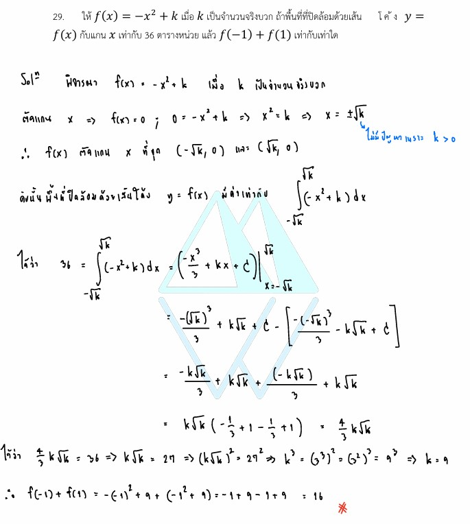

# เฉลยข้อ 29 วิชาคณิตศาสตร์ประยุกต์ 1 (A-Level) ปี 2565

การแก้โจทย์ **ข้อ 29 ของวิชาคณิตศาสตร์ประยุกต์ 1 (A-Level) ปี 2565** เป็นการประยุกต์ใช้ความรู้เรื่อง **แคลคูลัส (Calculus)** ในหัวข้อ **อินทิกรัลจำกัดเขต (Definite Integral)** เพื่อหาพื้นที่ที่ปิดล้อมด้วยเส้นโค้งครับ

## **เฉลยละเอียดโจทย์ข้อ 29 (A-Level 2565)**

**โจทย์:** ให้ $f(x) = -x^2 + c$ เมื่อ $c$ เป็นจำนวนจริงบวก ถ้าพื้นที่ที่ปิดล้อมด้วยเส้นโค้ง $y = f(x)$ กับแกน $X$ เท่ากับ 36 ตารางหน่วย แล้ว $f(-1) + f(1)$ เท่ากับเท่าใด

---

**วิธีทำอย่างละเอียด:**

**ขั้นตอนที่ 1: หาจุดตัดแกน $X$ เพื่อกำหนดขอบเขตการอินทิเกรต**

* จุดตัดแกน $X$ คือจุดที่ $y = f(x) = 0$
* $-x^2 + c = 0 \implies x^2 = c \implies x = \pm\sqrt{c}$
* ดังนั้น เส้นโค้งนี้ตัดแกน $X$ ที่จุด $x = -\sqrt{c}$ และ $x = \sqrt{c}$ ซึ่งจะเป็นขอบเขตล่างและขอบเขตบนในการหาพื้นที่

**ขั้นตอนที่ 2: ตั้งสมการการหาพื้นที่ด้วยการอินทิเกรต**

* พื้นที่ปิดล้อม ($A$) หาได้จาก $\int_{a}^{b} f(x) dx$
* $36 = \int_{-\sqrt{c}}^{\sqrt{c}} (-x^2 + c) dx$

**ขั้นตอนที่ 3: คำนวณค่าอินทิกรัล**

* อินทิเกรตพจน์ $-x^2 + c$ จะได้:
    $$\left[ -\frac{x^3}{3} + cx \right]_{-\sqrt{c}}^{\sqrt{c}} = 36$$
* แทนค่าขอบเขตบนและขอบเขตล่าง:
    $$\left( -\frac{(\sqrt{c})^3}{3} + c\sqrt{c} \right) - \left( -\frac{(-\sqrt{c})^3}{3} + c(-\sqrt{c}) \right) = 36$$
    $$\left( -\frac{c\sqrt{c}}{3} + c\sqrt{c} \right) - \left( \frac{c\sqrt{c}}{3} - c\sqrt{c} \right) = 36$$
    $$\frac{2c\sqrt{c}}{3} - \left( -\frac{2c\sqrt{c}}{3} \right) = 36$$
    $$\frac{4c\sqrt{c}}{3} = 36$$

**ขั้นตอนที่ 4: แก้สมการหาค่า $c$**

* $4c\sqrt{c} = 36 \times 3 = 108$
* $c\sqrt{c} = 27$
* เนื่องจาก $c\sqrt{c} = c^1 \cdot c^{1/2} = c^{3/2}$ และ $27 = 3^3$
* จะได้ $(c^{1/2})^3 = 3^3 \implies \sqrt{c} = 3 \implies \mathbf{c = 9}$

**ขั้นตอนที่ 5: หาคำตอบของโจทย์**

* ได้ฟังก์ชันที่สมบูรณ์คือ $f(x) = -x^2 + 9$
* $f(-1) = -(-1)^2 + 9 = -1 + 9 = 8$
* $f(1) = -(1)^2 + 9 = -1 + 9 = 8$
* **$f(-1) + f(1) = 8 + 8 = \mathbf{16}$**

**ตอบ:** 16

---

### **เนื้อหาที่เกี่ยวข้องเพื่อศึกษาเพิ่มเติม**

**1. พื้นที่ปิดล้อมด้วยเส้นโค้ง (Area Under the Curve):**

* พื้นที่ระหว่างเส้นโค้ง $y = f(x)$ กับแกน $X$ จาก $x=a$ ถึง $x=b$ คือค่าสัมบูรณ์ของ $\int_{a}^{b} f(x) dx$
* **ที่มา:** เป็นการรวมพื้นที่ของสี่เหลี่ยมผืนผ้าเล็กๆ จำนวนมหาศาลภายใต้เส้นโค้ง (Riemann Sum)

**2. ความหมายของตัวแปรและค่าคงที่:**

* **$c$:** คือจุดยอดของพาราโบลาบนแกน $Y$ (Y-intercept) ในกรณีนี้คือ 9
* **$-x^2$:** สัมประสิทธิ์หน้า $x^2$ เป็นลบ แสดงว่าเป็นพาราโบลาคว่ำ

---

### **กลยุทธ์แก้โจทย์ประเภทนี้**

* **ใช้ความสมมาตร:** เนื่องจากพาราโบลา $y = -x^2 + c$ เป็นฟังก์ชันคู่ (สมมาตรเทียบแกน $Y$) เราสามารถอินทิเกรตจาก $0$ ถึง $\sqrt{c}$ แล้วคูณด้วย 2 ได้ ซึ่งจะช่วยให้คำนวณตัวเลขได้ง่ายขึ้นและลดความผิดพลาดเรื่องเครื่องหมายลบ
* **วาดรูปประกอบ:** การร่างกราฟคร่าวๆ จะช่วยให้เราเห็นขอบเขตของพื้นที่และจุดตัดแกน $X$ ได้ชัดเจน

---

### **ตัวอย่างโจทย์เพิ่มเติมเพื่อฝึกทำ**

**โจทย์:** พื้นที่ที่ปิดล้อมด้วยเส้นโค้ง $y = k - x^2$ และแกน $X$ มีค่าเท่ากับ $4/3$ ตารางหน่วย จงหาค่าของ $k$ (เมื่อ $k > 0$)
**เฉลยแนวคิด:**

1. จุดตัดแกน $X$ คือ $\pm\sqrt{k}$
2. $\int_{-\sqrt{k}}^{\sqrt{k}} (k - x^2) dx = \frac{4}{3} k\sqrt{k}$
3. ตั้งสมการ: $\frac{4}{3} k\sqrt{k} = \frac{4}{3}$
4. จะได้ $k\sqrt{k} = 1 \implies \mathbf{k = 1}$
**ตอบ:** $k = 1$
