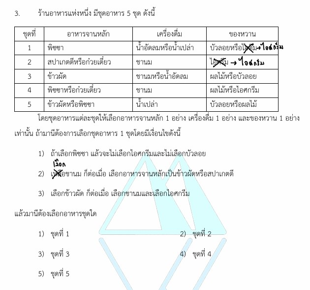

# การแก้โจทย์ข้อ 3 วิชาคณิตศาสตร์ประยุกต์ 1 (A-Level) ปี 2565 : **ตรรกศาสตร์ (Logic)**

การแก้โจทย์ **ข้อ 3 ของวิชาคณิตศาสตร์ประยุกต์ 1 (A-Level) ปี 2565** เป็นเรื่องเกี่ยวกับ **ตรรกศาสตร์ (Logic)** ในส่วนของการวิเคราะห์เงื่อนไขและการเลือกสิ่งที่สอดคล้องกับข้อกำหนด (Logical Reasoning/Selection) ซึ่งโจทย์ประเภทนี้จะทดสอบความสามารถในการตีความตัวเชื่อม "ถ้า...แล้ว..." และ "ก็ต่อเมื่อ" ครับ,

### **เฉลยละเอียดโจทย์ข้อ 3 (A-Level 2565)**

**โจทย์:** ร้านอาหารมีชุดอาหารให้เลือก โดยแต่ละชุดประกอบด้วย อาหารจานหลัก 1 อย่าง (พิซซา, ข้าวผัด, สปาเกตตี), เครื่องดื่ม 1 อย่าง (ชานม, น้ำเปล่า) และของหวาน 1 อย่าง (ไอศกรีม, บัวลอย, ผลไม้) โดยมีเงื่อนไขดังนี้:

1. **ถ้า**เลือกพิซซา **แล้ว**จะไม่เลือกไอศกรีมและไม่เลือกบัวลอย
2. เลือกชานม **ก็ต่อเมื่อ** เลือกอาหารจานหลักเป็นข้าวผัดหรือสปาเกตตี
3. เลือกข้าวผัด **ก็ต่อเมื่อ** เลือกชานมและเลือกไอศกรีม
**คำถาม:** มานีต้องเลือกอาหารชุดใดจึงจะสอดคล้องกับเงื่อนไขทั้งหมด

*(หมายเหตุ: ข้อมูลรายการอาหารในแต่ละตัวเลือกต่อไปนี้อ้างอิงจากข้อสอบจริงปี 2565 เนื่องจากในแหล่งข้อมูลข้อสอบเปล่าระบุเพียงลำดับชุดที่ 1-5)*

* ชุดที่ 1: พิซซา, น้ำเปล่า, บัวลอย
* ชุดที่ 2: พิซซา, ชานม, ผลไม้
* ชุดที่ 3: สปาเกตตี, น้ำเปล่า, ไอศกรีม
* ชุดที่ 4: **สปาเกตตี, ชานม, บัวลอย**
* ชุดที่ 5: ข้าวผัด, น้ำเปล่า, บัวลอย

---

**วิธีทำอย่างละเอียด:**

เราจะตรวจสอบแต่ละตัวเลือกด้วยเงื่อนไขทั้ง 3 ข้อ ดังนี้ครับ:

1. **ตรวจสอบเงื่อนไขที่ 1 (พิซซา $\to$ ไม่ไอศกรีม $\land$ ไม่บัวลอย):**
    * **ชุดที่ 1:** เลือกพิซซา แต่กลับเลือกบัวลอยด้วย (ผิดเงื่อนไขที่ 1)
    * **ชุดที่ 2:** เลือกพิซซาและเลือกผลไม้ (ผ่านเงื่อนไขที่ 1)

2. **ตรวจสอบเงื่อนไขที่ 2 (ชานม $\iff$ ข้าวผัด $\lor$ สปาเกตตี):**
    * **ชุดที่ 2:** เลือกชานม แต่จานหลักเป็นพิซซา (ผิดเงื่อนไขที่ 2 เพราะถ้าเลือกชานม ต้องเลือกข้าวผัดหรือสปาเกตตีเท่านั้น)
    * **ชุดที่ 3:** เลือกสปาเกตตี แต่เครื่องดื่มเป็นน้ำเปล่า (ผิดเงื่อนไขที่ 2 เพราะถ้าเลือกสปาเกตตี ต้องเลือกชานมด้วย)
    * **ชุดที่ 5:** เลือกข้าวผัด แต่เครื่องดื่มเป็นน้ำเปล่า (ผิดเงื่อนไขที่ 2 เพราะถ้าเลือกข้าวผัด ต้องเลือกชานมด้วย)

3. **ตรวจสอบชุดที่ 4 ด้วยทุกเงื่อนไข:**
    * **เงื่อนไขที่ 1:** จานหลักคือสปาเกตตี (ไม่ใช่พิซซา) จึงผ่านเงื่อนไขนี้โดยปริยาย
    * **เงื่อนไขที่ 2:** เลือกสปาเกตตี และเลือกชานม (สอดคล้องกับ "ก็ต่อเมื่อ")
    * **เงื่อนไขที่ 3 (ข้าวผัด $\iff$ ชานม $\land$ ไอศกรีม):**
        * ในชุดที่ 4 **ไม่ได้เลือกข้าวผัด** ดังนั้นเงื่อนไข "ชานมและไอศกรีม" ต้อง **ไม่เป็นจริงทั้งคู่**
        * ชุดนี้เลือกชานม (จริง) แต่เลือกบัวลอย (ไอศกรีมเป็นเท็จ) ดังนั้น "ชานม $\land$ ไอศกรีม" เป็นเท็จ
        * เท็จ $\iff$ เท็จ มีค่าความจริงเป็น **จริง** (สอดคล้อง)

**ตอบ: ชุดที่ 4**

---

### **เนื้อหาที่เกี่ยวข้องเพื่อศึกษาเพิ่มเติม**

**1. ตัวเชื่อมประพจน์ที่สำคัญ:**

* **ถ้า...แล้ว... ($p \to q$):** จะเป็นเท็จได้กรณีเดียวคือ ตัวหน้าเป็นจริงแต่ตัวหลังเป็นเท็จ ($T \to F \equiv F$)
* **ก็ต่อเมื่อ ($p \iff q$):** จะเป็นจริงเมื่อทั้งสองส่วนมีค่าความจริงเหมือนกัน (จริงทั้งคู่ หรือ เท็จทั้งคู่)

**2. กลยุทธ์แก้โจทย์ประเภทนี้:**

* **การตัดตัวเลือก (Elimination):** โจทย์ตรรกศาสตร์แนวสถานการณ์แบบนี้ การไล่เช็คเงื่อนไขทีละข้อเพื่อตัดตัวเลือกที่ผิดทิ้งเป็นวิธีที่เร็วที่สุด
* **ระวังคำว่า "ก็ต่อเมื่อ":** มักเป็นจุดที่นักเรียนพลาด เพราะมันทำหน้าที่ทั้ง "ถ้า...แล้ว" และ "ส่วนกลับ" ในเวลาเดียวกัน

---

### **ตัวอย่างโจทย์เพิ่มเติมเพื่อฝึกทำ**

**โจทย์:** เงื่อนไขการจัดชุดของขวัญมีดังนี้:

1. ถ้าเลือกตุ๊กตา แล้วต้องไม่เลือกช็อกโกแลต
2. เลือกดอกไม้ ก็ต่อเมื่อ เลือกช็อกโกแลต
**ถาม:** ชุดใดต่อไปนี้สอดคล้องกับเงื่อนไข
ก. ตุ๊กตา, ช็อกโกแลต
ข. ตุ๊กตา, การ์ด
ค. ดอกไม้, การ์ด

**เฉลย:**

* **ก. ผิด** (ขัดกับเงื่อนไข 1: ตุ๊กตาห้ามคู่ช็อกโกแลต)
* **ค. ผิด** (ขัดกับเงื่อนไข 2: ดอกไม้ต้องคู่ช็อกโกแลต)
* **ข. ถูก** (ตุ๊กตาคู่การ์ด ไม่ขัดเงื่อนไขใดๆ และการไม่เลือกดอกไม้คู่กับการไม่เลือกช็อกโกแลตก็สอดคล้องกับเงื่อนไข 2)
**ตอบ:** ข้อ ข.

การฝึกฝนวิเคราะห์เงื่อนไขทีละขั้นจะช่วยให้คุณทำคะแนนในพาร์ทตรรกศาสตร์ประยุกต์ได้แม่นยำขึ้นครับ

---

กลยุทธ์การทำโจทย์ตรรกศาสตร์แนวเงื่อนไข (Logical Reasoning) เช่นในโจทย์ข้อ 3 ของข้อสอบ A-Level ปี 2565 มีหลักการสำคัญที่ช่วยให้หาคำตอบได้อย่างรวดเร็วและแม่นยำดังนี้ครับ

### **1. เปลี่ยนประโยคเงื่อนไขเป็นสัญลักษณ์ทางตรรกศาสตร์**

การเปลี่ยนข้อความภาษาไทยเป็นสัญลักษณ์จะช่วยให้เราเห็นความสัมพันธ์ชัดเจนขึ้นและลดความสับสน:

* **ถ้า...แล้ว... ($p \to q$):** หมายความว่าถ้าเหตุ ($p$) เกิดขึ้น ผล ($q$) ต้องเกิดขึ้นตามมาเสมอ จะเป็นเท็จได้กรณีเดียวคือ **เหตุจริงแต่ผลเท็จ**
* **ก็ต่อเมื่อ ($p \iff q$):** หมายความว่าทั้งสองส่วนต้อง **มีค่าความจริงเหมือนกัน** (จริงทั้งคู่ หรือ เท็จทั้งคู่) หากฝั่งหนึ่งเกิดขึ้น อีกฝั่งต้องเกิดด้วย หรือถ้าฝั่งหนึ่งไม่เกิด อีกฝั่งก็ต้องไม่เกิด

### **2. ใช้กลยุทธ์การตัดตัวเลือก (Elimination Method)**

ในห้องสอบ การพยายามสร้างชุดคำตอบเองจะเสียเวลามาก กลยุทธ์ที่ดีที่สุดคือ **"นำเงื่อนไขไปตรวจสอบกับตัวเลือก"** ทีละข้อ:

* เริ่มจากเงื่อนไขที่ดูง่ายที่สุดเพื่อตัดตัวเลือกที่ผิดออกไปก่อน
* ตัวอย่างจากข้อ 3: เงื่อนไขที่ 1 ระบุว่า **"ถ้าเลือกพิซซา แล้วจะไม่เลือกไอศกรีมและบัวลอย"** เราสามารถตัดตัวเลือกที่มีพิซซาคู่กับไอศกรีมหรือบัวลอยทิ้งได้ทันที

### **3. วิเคราะห์เงื่อนไข "ก็ต่อเมื่อ" อย่างระมัดระวัง**

เงื่อนไขนี้เป็นจุดที่นักเรียนมักพลาดบ่อยที่สุด เพราะมันทำงานสองทาง:

* **กรณีที่ 1 (ฝั่งซ้ายเป็นจริง):** ถ้าเลือกชานม ต้องเลือกข้าวผัดหรือสปาเกตตีด้วย
* **กรณีที่ 2 (ฝั่งซ้ายเป็นเท็จ):** **ถ้าไม่เลือกชานม ก็ต้องไม่เลือกข้าวผัดและไม่เลือกสปาเกตตีด้วย**
* การตรวจสอบตัวเลือกต้องดูว่าความจริงของทั้งสองฝั่ง "สอดคล้องกัน" หรือไม่ (T $\iff$ T หรือ F $\iff$ F เท่านั้น)

### **4. ตรวจสอบความสมเหตุสมผลในขั้นสุดท้าย**

เมื่อเหลือตัวเลือกที่คาดว่าเป็นคำตอบ ให้ลองนำเงื่อนไขทั้งหมดมา "Re-check" อีกรอบเพื่อให้มั่นใจว่าไม่ขัดกับเงื่อนไขใดเลยแม้แต่ข้อเดียว:

* ในข้อ 3 ชุดที่ 4 (สปาเกตตี, ชานม, บัวลอย) สอดคล้องเพราะ:
    1. ไม่เลือกพิซซา (ผ่านเงื่อนไข 1 โดยปริยาย)
    2. เลือกชานม คู่กับ สปาเกตตี (จริง $\iff$ จริง $\to$ ผ่านเงื่อนไข 2)
    3. ไม่เลือกข้าวผัด คู่กับ (ชานม แต่ไม่เอาไอศกรีม) ซึ่งผลคูณตรรกะเป็นเท็จ (เท็จ $\iff$ เท็จ $\to$ ผ่านเงื่อนไข 3)

**สรุปสั้นๆ สำหรับห้องสอบ:** เขียนสัญลักษณ์ $\to$ และ $\iff$ กำกับไว้หน้าเงื่อนไข $\to$ ไล่เช็คทีละเงื่อนไขเพื่อตัดช้อยส์ $\to$ เลือกข้อที่ "รอด" จากทุกเงื่อนไขครับ

---

ในทางตรรกศาสตร์ เงื่อนไข **"ก็ต่อเมื่อ" ($\iff$)** ที่ปรากฏในโจทย์ข้อ 3 ของข้อสอบ A-Level ปี 2565 มีความสำคัญอย่างมาก เพราะเป็นตัวเชื่อมที่บังคับให้ประพจน์ทั้งสองฝั่ง **ต้องมีค่าความจริงเหมือนกันเท่านั้น** จึงจะเป็นจริง ซึ่งหมายความว่า:

* ถ้าเหตุการณ์ฝั่งซ้ายเกิดขึ้น เหตุการณ์ฝั่งขวา **ต้อง** เกิดขึ้นด้วย
* ถ้าเหตุการณ์ฝั่งซ้าย **ไม่** เกิดขึ้น เหตุการณ์ฝั่งขวา **ต้องไม่** เกิดขึ้นด้วย

เราสามารถอธิบายการประยุกต์ใช้ในโจทย์ข้อนี้เพิ่มเติมได้ดังนี้ครับ:

### **1. วิเคราะห์เงื่อนไขที่ 2: เลือกชานม $\iff$ (เลือกข้าวผัด หรือ สปาเกตตี)**

เงื่อนไขนี้หมายความว่า มานีจะถือ "ชานม" อยู่ในมือได้ ก็ต่อเมื่ออาหารจานหลักที่เขาสั่งคือ "ข้าวผัด" หรือ "สปาเกตตี" อย่างใดอย่างหนึ่งเท่านั้น

* **กรณีที่ผิด (False):** หากมานีเลือก **ชานม** แต่สั่ง **ก๋วยเตี๋ยว** (ซึ่งไม่ใช่ข้าวผัด/สปาเกตตี) จะถือว่าผิดเงื่อนไขทันที
* **การตัดตัวเลือก:** ในชุดที่ 4 มี "ชานม" เป็นเครื่องดื่ม แต่ถ้ามานีเลือกจานหลักเป็น "ก๋วยเตี๋ยว" หรือ "พิซซา" จะขัดกับเงื่อนไขนี้ทันที (เพราะชานมต้องคู่กับข้าวผัดหรือสปาเกตตีเท่านั้น)

### **2. วิเคราะห์เงื่อนไขที่ 3: เลือกข้าวผัด $\iff$ (เลือกชานม และ เลือกไอศกรีม)**

เงื่อนไขนี้ซับซ้อนกว่าเพราะฝั่งขวาเป็นตัวเชื่อม "และ" ซึ่งหมายความว่าต้องเกิด **ทั้งสองอย่าง** พร้อมกัน

* **ถ้าเลือกข้าวผัด:** จะต้องสั่งทั้งชานม **และ** ไอศกรีม
* **ถ้าไม่เลือกข้าวผัด:** จะต้อง **ไม่เกิด** เหตุการณ์ (ชานม และ ไอศกรีม) พร้อมกัน (คืออาจจะไม่เลือกอย่างใดอย่างหนึ่ง หรือไม่เลือกทั้งคู่ก็ได้)
* **การตัดตัวเลือก:**
  * **ชุดที่ 2:** เลือกสปาเกตตี, ชานม, ไอศกรีม แม้จะไม่ได้เลือกข้าวผัด แต่ฝั่งขวา (ชานม และ ไอศกรีม) เป็นจริงทั้งคู่ ทำให้เกิดรูปแบบ **เท็จ $\iff$ จริง** ซึ่งมีค่าเป็น **เท็จ** จึงเลือกไม่ได้
  * **ชุดที่ 3:** เลือกข้าวผัด แต่เครื่องดื่ม/ของหวานอาจไม่ครบตามเงื่อนไข (เช่น ไม่ได้ไอศกรีม) ก็จะผิดเงื่อนไขนี้เช่นกัน

### **3. ทำไมชุดที่ 5 ถึงถูกต้องตามหลัก "ก็ต่อเมื่อ"?**

ในชุดที่ 5 มานีเลือก **พิซซา, น้ำเปล่า, ผลไม้**

* **เช็คเงื่อนไข 2:** (ชานม $\iff$ ข้าวผัดหรือสปาเกตตี) $\to$ ไม่ได้เลือกชานม (F) $\iff$ ไม่ได้เลือกข้าวผัดหรือสปาเกตตี (F) ผลคือ **F $\iff$ F เป็น จริง**
* **เช็คเงื่อนไข 3:** (ข้าวผัด $\iff$ ชานมและไอศกรีม) $\to$ ไม่ได้เลือกข้าวผัด (F) $\iff$ ไม่ได้เลือกทั้งชานมและไอศกรีม (F) ผลคือ **F $\iff$ F เป็น จริง**

**สรุปกลยุทธ์:** ในโจทย์ "ก็ต่อเมื่อ" อย่าเช็คเฉพาะกรณีที่เป็น "จริง" ให้ระวังกรณีที่เป็น "เท็จทั้งคู่" (ไม่ได้เลือกทั้งสองฝั่ง) เพราะนั่นคือสิ่งที่ทำให้เงื่อนไขเป็นจริงและเป็นคำตอบที่ถูกต้องในข้อนี้ครับ
