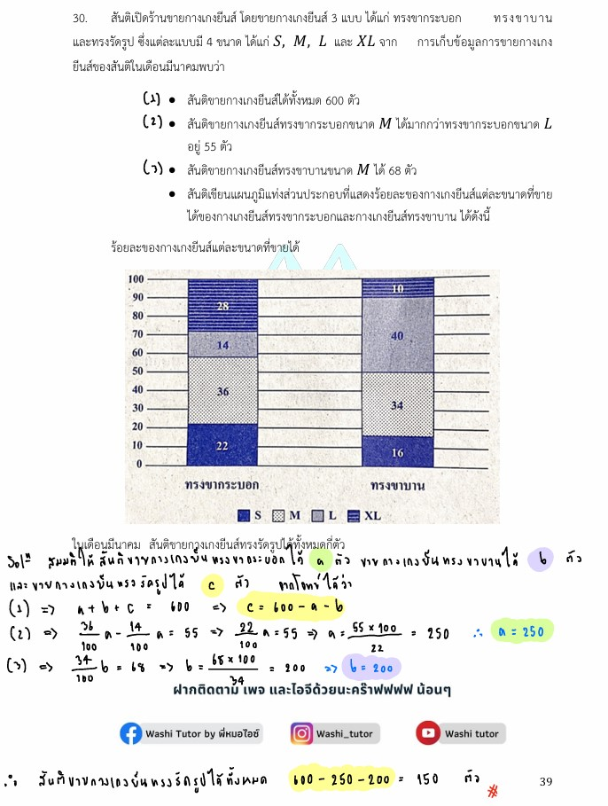

# ข้อ 30

จากโจทย์ข้อ 30 ในรูปภาพ เป็นปัญหาประยุกต์เกี่ยวกับ **"สถิติพรรณนา (Descriptive Statistics) และการตีความแผนภูมิแท่งส่วนประกอบ (Component Bar Chart)"** ร่วมกับการตั้งสมการเชิงเส้นเพื่อหาค่าตัวแปรที่ไม่ทราบค่าครับ ต่อไปนี้เป็นอธิบายและวิธีทำอย่างละเอียดทุกขั้นตอนครับ

---

## 1. เฉลยและวิธีทำอย่างละเอียด

**โจทย์:** สันติเปิดร้านขายกางเกงยีนส์ โดยขายกางเกงยีนส์ 3 แบบ ได้แก่ ทรงขากระบอก ทรงขาบาน และทรงรัดรูป ซึ่งแต่ละแบบมี 4 ขนาด ได้แก่ $S, M, L$ และ $XL$ จากการเก็บข้อมูลการขายกางเกงยีนส์ของสันติในเดือนมีนาคมพบว่า

* (1) สันติขายกางเกงยีนส์ได้ทั้งหมด 600 ตัว
* (2) สันติขายกางเกงยีนส์ทรงขากระบอกขนาด $M$ ได้มากกว่าทรงขากระบอกขนาด $L$ อยู่ 55 ตัว
* (3) สันติขายกางเกงยีนส์ทรงขาบานขนาด $M$ ได้ 68 ตัว
* สันติเขียนแผนภูมิแท่งส่วนประกอบแสดงร้อยละของกางเกงยีนส์แต่ละขนาดที่ขายได้ของกางเกงยีนส์ทรงขากระบอกและกางเกงยีนส์ทรงขาบาน ได้ดังแผนภูมิในรูป

โจทย์ถาม: **"ในเดือนมีนาคม สันติขายกางเกงยีนส์ทรงรัดรูปได้ทั้งหมดกี่ตัว"**

### **ขั้นตอนที่ 1: วิเคราะห์แผนภูมิแท่งส่วนประกอบเพื่อหากระบวนการคิด**

แผนภูมินี้ระบุ **"ร้อยละ (เปอร์เซ็นต์)"** ของขนาดกางเกงภายในทรงนั้นๆ (ไม่ใช่จำนวนตัวโดยตรง) แถบสีจากล่างขึ้นบนเรียงตามขนาดคือ $S, M, L, XL$

**พิจารณาทรงขาบานก่อน:**

* จากข้อมูลเงื่อนไข (3): ทรงขาบานขนาด $M$ ขายได้ $68$ ตัว
* ดูที่แท่ง "ทรงขาบาน" (แท่งขวา) ช่องขนาด $M$ คือช่วงลายจุด มีพื้นที่เปรียบเทียบเป็นร้อยละเท่ากับ $34\%$
* หมายความว่า **$34\%$ ของกางเกงทรงขาบานทั้งหมด มีค่าเท่ากับ $68$ ตัว**

ให้ $N_{\text{ขาบาน}}$ คือจำนวนกางเกงทรงขาบานทั้งหมดที่ขายได้:

$$\frac{34}{100} \times N_{\text{ขาบาน}} = 68$$

$$N_{\text{ขาบาน}} = \frac{68 \times 100}{34} = 2 \times 100 = 200 \text{ ตัว}$$

ดังนั้น สันติขายกางเกง**ทรงขาบานได้ทั้งหมด 200 ตัว**

---

**พิจารณาทรงขากระบอก:**

* ดูที่แท่ง "ทรงขากระบอก" (แท่งซ้าย):
* ขนาด $M$ (ลายจุด) คิดเป็นร้อยละ $36\%$
* ขนาด $L$ (สีเทาอ่อน) คิดเป็นร้อยละ $14\%$

* จากข้อมูลเงื่อนไข (2): "ขนาด $M$ ได้มากกว่าขนาด $L$ อยู่ 55 ตัว"
* เมื่อเทียบเป็นร้อยละ จะได้ว่า ขนาด $M$ มีร้อยละมากกว่าขนาด $L$ อยู่เท่ากับ $36\% - 14\% = 22\%$
* หมายความว่า **$22\%$ ของกางเกงทรงขากระบอกทั้งหมด มีค่าเท่ากับ $55$ ตัว**

ให้ $N_{\text{ขากระบอก}}$ คือจำนวนกางเกงทรงขากระบอกทั้งหมดที่ขายได้:

$$\frac{22}{100} \times N_{\text{ขากระบอก}} = 55$$

$$N_{\text{ขากระบอก}} = \frac{55 \times 100}{22} = \frac{5 \times 100}{2} = 250 \text{ ตัว}$$

ดังนั้น สันติขายกางเกง**ทรงขากระบอกได้ทั้งหมด 250 ตัว**

---

#### **ขั้นตอนที่ 2: หาจำนวนกางเกงยีนส์ทรงรัดรูป**

* จากข้อมูลเงื่อนไข (1): สันติขายกางเกงยีนส์ได้ทั้งหมดทุกทรงรวมกัน = $600$ ตัว
* สมการรวมคือ:

$$\text{ทรงขากระบอก} + \text{ทรงขาบาน} + \text{ทรงรัดรูป} = 600$$

$$250 + 200 + \text{ทรงรัดรูป} = 600$$

$$450 + \text{ทรงรัดรูป} = 600$$

$$\text{ทรงรัดรูป} = 600 - 450 = 150 \text{ ตัว}$$

**สรุปคำตอบ:** ในเดือนมีนาคม สันติขายกางเกงยีนส์ทรงรัดรูปได้ทั้งหมด **150 ตัว**

---

### 2. เนื้อหาและคณิตศาสตร์ที่เกี่ยวข้อง

#### **แผนภูมิแท่งส่วนประกอบ (Component Bar Chart)**

เป็นเครื่องมือทางสถิติที่ใช้ในการนำเสนอข้อมูลเชิงปริมาณหรือเชิงคุณภาพ โดยแบ่งแท่งสี่เหลี่ยมผืนผ้าหนึ่งแท่งออกเป็นส่วนย่อยๆ ตามสัดส่วนของข้อมูล ความสูงทั้งหมดของแท่งมักจะแทนค่าสารสนเทศรวม 2 รูปแบบหลักคือ:

1. **แทนจำนวนจริง (Absolute Value):** ความสูงของแท่งคือยอดรวมทั้งหมดจริง
2. **แทนร้อยละสะสม (Relative Value / Percentage):** ความสูงของแท่งจะถูกปรับให้เท่ากับ $100\%$ เสมอ เพื่อเน้นเปรียบเทียบ "โครงสร้างสัดส่วนภายใน" ของแต่ละกลุ่ม (เหมือนโจทย์ข้อนี้)

#### **หลักการคำนวณร้อยละ (Percentage)**

ร้อยละคือการเปรียบเทียบปริมาณใดปริมาณหนึ่งต่อ 100 หน่วย สูตรพื้นฐานที่นิยมใช้ในการสกัดข้อมูลจากแผนภูมิรูปพัดหรือแผนภูมิแท่งร้อยละคือ:

$$\text{ปริมาณจริงย่อย} = \frac{\text{ร้อยละของส่วนนั้น}}{100} \times \text{ปริมาณรวมทั้งหมดของกลุ่มนั้น}$$

---

### 3. กลยุทธ์ในการแก้โจทย์ประเภทนี้

1. **แยก "กลุ่มหลัก" ออกจากกันให้ชัดเจน:** สังเกตว่าตัวฐานของร้อยละในแท่งขากระบอก ($250$ ตัว) ไม่เท่ากับตัวฐานของแท่งขาบาน ($200$ ตัว) ห้ามนำเปอร์เซ็นต์ข้ามแท่งมารวมหรือลบกันเด็ดขาด
2. **มองหาจุดที่บอกค่าสัมบูรณ์ (จำนวนจริง):** โจทย์แนวนี้จะแอบซ่อนตัวเลขจริงมาให้เสมอ (เช่น $68$ ตัว หรือ $55$ ตัว) ให้เราจับคู่ตัวเลขนั้นกับผลต่างหรือพื้นที่ร้อยละในแผนภูมิเพื่อทำการย้อนกลับหา "ค่ารวม ($N$)" ของแท่งนั้นก่อน
3. **ตรวจสอบคำถามสุดท้าย:** โจทย์มักหลอกให้เราคำนวณแท่งที่โชว์แทบตาย แต่สุดท้ายไปถามหากลุ่มที่ไม่ได้โชว์ในภาพ (ทรงรัดรูป) ดังนั้นเมื่อได้ค่าจากแผนภูมิครบแล้ว ต้องนำไปลบออกจากยอดรวมใหญ่สุดเสมอ

---

### 4. ตัวอย่างโจทย์เพิ่มเติมเพื่อฝึกฝน

**โจทย์:** โรงเรียนแห่งหนึ่งมีนักเรียนชั้น ม.6 ทั้งหมด 400 คน แบ่งเป็นแผนการเรียนวิทย์-คณิต และแผนการเรียนศิลป์-ภาษา จากการสำรวจการศึกษาต่อพบว่า $40\%$ ของนักเรียนแผนกศิลป์-ภาษา เลือกเรียนต่อคณะมนุษยศาสตร์ ซึ่งคิดเป็นจำนวน 48 คน หากนักเรียนที่เหลือทั้งหมดอยู่แผนกวิทย์-คณิต อยากทราบว่าโรงเรียนนี้มีนักเรียนแผนกวิทย์-คณิตจำนวนกี่คน

**วิธีทำ:**

1. สนใจกลุ่มศิลป์-ภาษา: โจทย์บอกว่า $40\%$ ของศิลป์-ภาษา เท่ากับ 48 คน
2. ตั้งสมการหาจำนวนนักเรียนศิลป์-ภาษาทั้งหมด ($N_{\text{ศิลป์}}$):

$$\frac{40}{100} \times N_{\text{ศิลป์}} = 48$$

$$N_{\text{ศิลป์}} = \frac{48 \times 100}{40} = 120 \text{ คน}$$

1. โจทย์บอกยอดรวมนักเรียน ม.6 ทั้งหมดคือ 400 คน
2. ดังนั้น นักเรียนวิทย์-คณิต = $400 - 120 = 280$ คน

**เฉลย:** โรงเรียนนี้มีนักเรียนแผนกวิทย์-คณิตจำนวน 280 คน
