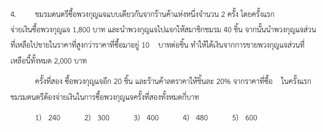

# การแก้โจทย์ข้อ 4 วิชาคณิตศาสตร์ประยุกต์ 1 (A-Level) ปี 2565 : **พีชคณิต (Algebra)**

การแก้โจทย์ **ข้อ 4 ของวิชาคณิตศาสตร์ประยุกต์ 1 (A-Level) ปี 2565** เป็นโจทย์ปัญหาเกี่ยวกับ **พีชคณิต (Algebra)** ในหัวข้อการตั้งสมการเพื่อแก้ปัญหาชีวิตประจำวัน โดยใช้ความรู้เรื่องราคาขาย กำไร และร้อยละครับ

### **โจทย์ข้อ 4 (A-Level 2565)**

ชมรมดนตรีซื้อพวงกุญแจแบบเดียวกัน 2 ครั้ง:

* **ครั้งแรก:** จ่ายเงิน 1,800 บาท นำไปแจกสมาชิก 40 ชิ้น ที่เหลือขายราคาที่สูงกว่าทุน 10 บาทต่อชิ้น ได้เงินจากการขายทั้งหมด 2,000 บาท
* **ครั้งที่สอง:** ซื้ออีก 20 ชิ้น ร้านลดราคาให้ชิ้นละ 20% จากราคาซื้อครั้งแรก
* **คำถาม:** ชมรมต้องจ่ายเงินซื้อพวงกุญแจครั้งที่สองกี่บาท

---

### **วิธีทำอย่างละเอียด**

**ขั้นตอนที่ 1: ตั้งสมการหาจำนวนพวงกุญแจที่ซื้อครั้งแรก**

* ให้ $x$ แทนจำนวนพวงกุญแจที่ซื้อมาครั้งแรก
* ราคาต้นทุนต่อชิ้นในการซื้อครั้งแรก $= \frac{1,800}{x}$ บาท
* แจกไป 40 ชิ้น เหลือพวงกุญแจมาขาย $= x - 40$ ชิ้น
* ราคาขายต่อชิ้น $= \frac{1,800}{x} + 10$ บาท
* เงินที่ได้จากการขายทั้งหมดคือ 2,000 บาท เขียนเป็นสมการได้ว่า:
    $$(x - 40) \left( \frac{1,800}{x} + 10 \right) = 2,000$$

**ขั้นตอนที่ 2: แก้สมการหาค่า $x$**

1. จัดรูปในวงเล็บ: $(x - 40) \left( \frac{1,800 + 10x}{x} \right) = 2,000$
2. นำ $x$ คูณตลอด: $(x - 40)(1,800 + 10x) = 2,000x$
3. กระจายวงเล็บ: $1,800x + 10x^2 - 72,000 - 400x = 2,000x$
4. จัดรูปสมการกำลังสอง: $10x^2 - 600x - 72,000 = 0$
5. นำ 10 หารตลอด: $x^2 - 60x - 7,200 = 0$
6. แยกตัวประกอบ: $(x - 120)(x + 60) = 0$
7. ได้ค่า $x = 120$ (เนื่องจากจำนวนชิ้นต้องเป็นบวก)

**ขั้นตอนที่ 3: คำนวณราคาซื้อครั้งที่สอง**

* ราคาต้นทุนต่อชิ้นในการซื้อครั้งแรก $= \frac{1,800}{120} = \mathbf{15}$ **บาท**
* ครั้งที่สองร้านลดให้ 20% ของราคาเดิม:
  * ส่วนลด $= \frac{20}{100} \times 15 = 3$ บาท
  * ราคาซื้อใหม่ $= 15 - 3 = \mathbf{12}$ **บาทต่อชิ้น**
* ซื้อครั้งที่สองจำนวน 20 ชิ้น จะต้องจ่ายเงิน $= 20 \times 12 = \mathbf{240}$ **บาท**

**ตอบ:** 240 บาท (ตรงกับตัวเลือกที่ 1)

---

### **เนื้อหาที่เกี่ยวข้องเพื่อศึกษาเพิ่มเติม**

**1. การแก้สมการกำลังสอง (Quadratic Equation):**
รูปทั่วไปคือ $ax^2 + bx + c = 0$ การแยกตัวประกอบเพื่อหาค่า $x$ เป็นทักษะสำคัญที่ต้องใช้ในโจทย์ปัญหาเกือบทุกแนว

**2. ความหมายของตัวแปรและค่าคงที่:**

* **$x$:** แทนจำนวนสิ่งของทั้งหมดที่ยังไม่ทราบค่า
* **$20\%$:** การลดราคา (Discount) หมายถึงการจ่ายเงินเพียง $80\%$ ของราคาเดิม หรือคำนวณส่วนลดแล้วนำมาลบออกจากราคาตั้งต้น

### **กลยุทธ์แก้โจทย์ประเภทนี้**

* **กำหนดตัวแปรให้ตรงจุด:** มักเริ่มจากการให้ตัวแปรแทนสิ่งที่โจทย์ไม่ได้บอกมาในตอนแรก (เช่น จำนวนชิ้น หรือราคาต่อหน่วย)
* **สร้างตารางสรุปข้อมูล:** แบ่งเป็น "ซื้อครั้งที่ 1", "ขายส่วนที่เหลือ", "ซื้อครั้งที่ 2" จะช่วยให้ไม่สับสนตัวเลข
* **เช็คความสมเหตุสมผล:** จำนวนสินค้า ($x$) ต้องเป็นจำนวนเต็มบวกเสมอ หากคำนวณได้ค่าติดลบให้ตัดทิ้งทันที

---

### **ตัวอย่างโจทย์เพิ่มเติมเพื่อฝึกทำ**

**โจทย์:** พ่อค้าซื้อผลไม้มาด้วยเงิน 600 บาท หากเขาซื้อได้มากกว่าเดิม 10 กิโลกรัม ในราคาเดิม เขาจะประหยัดเงินได้กิโลกรัมละ 2 บาท จงหาว่าเดิมเขาซื้อผลไม้มากี่กิโลกรัม

**เฉลยแนวคิด:**

1. ให้เดิมซื้อมา $x$ กิโลกรัม ราคา $600/x$ บาท
2. เงื่อนไขใหม่: ซื้อ $x + 10$ กิโลกรัม ราคา $600/(x+10)$ บาท
3. สมการความต่างราคา: $\frac{600}{x} - \frac{600}{x+10} = 2$
4. แก้สมการจะได้ $x = 50$
**ตอบ:** เดิมซื้อมา 50 กิโลกรัม

การฝึกเปลี่ยนข้อความให้เป็นสมการทางคณิตศาสตร์จะช่วยให้น้องๆ ทำคะแนนในส่วนนี้ได้อย่างมั่นใจครับ!

---

กลยุทธ์การแก้โจทย์พหุนามและสมการกำลังสองในข้อ 4 ของข้อสอบ A-Level ปี 2565 (ซึ่งเป็นโจทย์ปัญหาพวงกุญแจ) สามารถสรุปเป็นขั้นตอนสำคัญที่ช่วยให้แก้โจทย์ได้อย่างเป็นระบบดังนี้ครับ

### **1. การกำหนดตัวแปรให้ตรงจุด (Variable Definition)**

เริ่มต้นด้วยการกำหนดตัวแปรให้กับสิ่งที่โจทย์ยังไม่ได้บอกแต่จำเป็นต้องใช้ในการสร้างสมการ ในข้อนี้คือ **"จำนวนพวงกุญแจที่ซื้อมาครั้งแรก"** โดยกำหนดให้เป็น $x$ ชิ้น

### **2. การสร้างความสัมพันธ์จากโจทย์ (Translating Words to Equations)**

แปลงเงื่อนไขภาษาไทยให้เป็นนิพจน์ทางคณิตศาสตร์:

* **ราคาต้นทุนต่อชิ้น:** นำเงินที่จ่ายทั้งหมดหารด้วยจำนวนชิ้น จะได้ $\frac{1,800}{x}$ บาท
* **จำนวนชิ้นที่ขาย:** หักส่วนที่แจกฟรีออกไป 40 ชิ้น จะเหลือขาย $x - 40$ ชิ้น
* **ราคาขายต่อชิ้น:** โจทย์ระบุว่าขายสูงกว่าทุน 10 บาท ดังนั้นราคาขายคือ $\left( \frac{1,800}{x} + 10 \right)$ บาท
* **สมการรายได้:** (จำนวนที่ขาย) $\times$ (ราคาขายต่อชิ้น) $=$ รายได้ทั้งหมด 2,000 บาท
  * จะได้สมการ: $(x - 40) \left( \frac{1,800}{x} + 10 \right) = 2,000$

### **3. การจัดรูปและแก้สมการกำลังสอง (Solving the Quadratic Equation)**

ใช้ทักษะพีชคณิตเพื่อเปลี่ยนรูปเศษส่วนให้เป็นสมการกำลังสองมาตรฐาน:

* กระจายวงเล็บและกำจัดตัวส่วน ($x$) จนได้รูป **$x^2 - 60x - 7,200 = 0$**
* **การแยกตัวประกอบ:** มองหาตัวเลขสองตัวที่คูณกันได้ $-7,200$ และบวกกันได้ $-60$ ซึ่งคือ $-120$ และ $60$
* จะได้ $(x - 120)(x + 60) = 0$ ดังนั้น **$x = 120$** (เลือกค่าบวกเพราะเป็นจำนวนสิ่งของ)

### **4. การคิดร้อยละและส่วนลด (Discount Calculation)**

เมื่อได้จำนวนชิ้นแล้ว ให้นำไปหาคำตอบที่โจทย์ถามจริง:

* หาต้นทุนครั้งแรก: $1,800 / 120 = 15$ บาทต่อชิ้น
* คำนวณส่วนลด 20%: ลดไป $15 \times 0.20 = 3$ บาท เหลือราคาชิ้นละ $12$ บาท
* **คำตอบสุดท้าย:** ซื้อ 20 ชิ้น ราคาชิ้นละ 12 บาท ต้องจ่ายเงินทั้งหมด **240 บาท**

**สรุปเทคนิคสำหรับการสอบ:**

* **สร้างตาราง:** การแยกข้อมูลเป็น "ครั้งแรก" "ส่วนที่ขาย" และ "ครั้งที่สอง" จะช่วยลดความสับสนในการตั้งสมการ
* **เช็คเงื่อนไข:** จำนวนสิ่งของต้องเป็นจำนวนเต็มบวกเสมอ หากแก้สมการได้ค่าลบให้ตัดทิ้งได้ทันที
* **ระวังคำถาม:** อย่าหยุดแค่ตอนหาค่า $x$ ได้ เพราะโจทย์ A-Level มักถามขั้นตอนถัดไป (เช่น ราคาครั้งที่สอง) เสมอครับ

---

ขั้นตอนการแก้สมการกำลังสองจากโจทย์ข้อ 4 ของข้อสอบ A-Level คณิตศาสตร์ 1 ปี 2565 มีรายละเอียดการจัดรูปและแก้สมการทางพีชคณิตดังนี้ครับ

### **1. การตั้งสมการเริ่มต้น**

จากเงื่อนไขที่ชมรมซื้อพวงกุญแจมา $x$ ชิ้น ในราคา 1,800 บาท (ทุนชิ้นละ $1,800/x$ บาท) แล้วแจกไป 40 ชิ้น นำที่เหลือ ($x - 40$) มาขายในราคาที่สูงกว่าทุน 10 บาท ($1,800/x + 10$) จนได้เงิน 2,000 บาท จะได้สมการหลักคือ:
$$(x - 40) \left( \frac{1,800}{x} + 10 \right) = 2,000 \text{}$$

### **2. การจัดรูปเพื่อกำจัดตัวส่วน**

เพื่อให้คำนวณได้ง่ายขึ้น เราจะทำการรวมพจน์ในวงเล็บหลังและกำจัดตัวส่วน $x$ ดังนี้:

* **ปรับพจน์ในวงเล็บ:** $(x - 40) \left( \frac{1,800 + 10x}{x} \right) = 2,000$
* **นำ $x$ คูณตลอดทั้งสองข้างของสมการ:** จะได้ $(x - 40)(1,800 + 10x) = 2,000x$

### **3. การกระจายวงเล็บ (Expansion)**

ทำการคูณกระจายสมาชิกในวงเล็บเข้าด้วยกัน:
$$1,800x + 10x^2 - 72,000 - 400x = 2,000x \text{}$$

### **4. การจัดรูปเข้าสู่รูปมาตรฐาน $ax^2 + bx + c = 0$**

ย้ายพจน์ทั้งหมดมาไว้ฝั่งซ้ายและรวมพจน์ที่คล้ายกัน:

* $10x^2 + 1,400x - 72,000 = 2,000x$
* $10x^2 - 600x - 72,000 = 0$
* **ทำให้เลขน้อยลง:** นำ 10 หารตลอดทั้งสมการ จะได้ **$x^2 - 60x - 7,200 = 0$**

### **5. การแยกตัวประกอบ (Factoring)**

เราต้องหาตัวเลขสองตัวที่ **คูณกันได้ $-7,200$** และ **บวกกันได้ $-60$** ซึ่งตัวเลขนั้นคือ $-120$ และ $60$:
$$(x - 120)(x + 60) = 0 \text{}$$

### **6. การหาคำตอบของ $x$**

จะได้ค่า $x$ ออกมา 2 ค่า คือ:

* $x = 120$ หรือ $x = -60$
* **การเลือกคำตอบ:** เนื่องจาก $x$ แทนจำนวนพวงกุญแจซึ่งต้องเป็นจำนวนจริงบวก ดังนั้น **$x = 120$**

**สรุปผล:** จากการแก้สมการกำลังสองนี้ ทำให้เราทราบว่าชมรมซื้อพวงกุญแจครั้งแรกมาทั้งหมด **120 ชิ้น** ซึ่งเป็นข้อมูลสำคัญในการนำไปหาต้นทุนต่อชิ้น (1,800/120 = 15 บาท) เพื่อคำนวณส่วนลดและค่าใช้จ่ายในการซื้อครั้งที่สองต่อไปครับ
