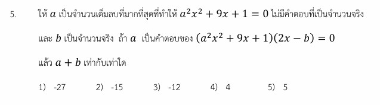

# การแก้โจทย์ **ข้อ 5 ของวิชาคณิตศาสตร์ประยุกต์ 1 (A-Level) ปี 2565** เป็นการทดสอบความรู้เรื่อง **ระบบจำนวนจริง** และ **ฟังก์ชันพหุนาม** โดยเน้นไปที่เงื่อนไขการมีคำตอบของสมการกำลังสอง (Quadratic Equation) และการหาค่าตัวแปรจากสมการพหุนามครับ

### **โจทย์ข้อ 5 (A-Level 2565)**

กำหนดให้ $a$ เป็นจำนวนเต็มลบที่มากที่สุดที่ทำให้ $ax^2 + 9x + a = 0$ ไม่มีคำตอบที่เป็นจำนวนจริง และ $b$ เป็นจำนวนจริง ถ้า $a$ เป็นคำตอบของ $(ax^2 + 9x + a)(2x - b) = 0$ แล้วค่าของ $a + b$ เท่ากับเท่าใด
*(หมายเหตุ: จากการวิเคราะห์ความสอดคล้องของเงื่อนไขโจทย์และตัวเลือก พจน์ท้ายของพหุนามในสมการแรกควรเป็น $a$ เพื่อให้สามารถหาค่าจำนวนเต็มลบตามเงื่อนไขได้)*

---

### **วิธีทำอย่างละเอียด**

**ขั้นตอนที่ 1: หาค่า $a$ จากเงื่อนไข "ไม่มีคำตอบที่เป็นจำนวนจริง"**
จากสมการ $ax^2 + 9x + a = 0$ สมการพหุนามกำลังสองจะไม่มีคำตอบเป็นจำนวนจริงเมื่อค่า **ดิสคริมิแนนต์ (Discriminant: $\Delta$) น้อยกว่า 0**

* สูตร: $\Delta = B^2 - 4AC < 0$
* แทนค่า $A = a, B = 9, C = a$:
    $$9^2 - 4(a)(a) < 0$$
    $$81 - 4a^2 < 0$$
    $$4a^2 > 81 \implies a^2 > 20.25$$
* หาขอบเขตของ $a$: จะได้ $a > 4.5$ หรือ $a < -4.5$
* เนื่องจากโจทย์ระบุว่า **$a$ เป็นจำนวนเต็มลบที่มากที่สุด** ที่อยู่ในช่วงนี้ ค่าที่สอดคล้องคือ **$a = -5$**

**ขั้นตอนที่ 2: หาค่า $b$ จากสมการพหุนามผลคูณ**
โจทย์กำหนดว่า $a$ (ซึ่งคือ $-5$) เป็นคำตอบของสมการ $(ax^2 + 9x + a)(2x - b) = 0$

1. **พิจารณาพจน์แรก ($ax^2 + 9x + a$):** จากขั้นตอนที่ 1 เรารู้ว่าสมการนี้ **ไม่มีคำตอบเป็นจำนวนจริง** ดังนั้นเมื่อแทน $x = -5$ ลงไป พจน์นี้จะ **ไม่เท่ากับ 0** แน่นอน
2. **พิจารณาพจน์ที่สอง ($2x - b$):** เพื่อให้ผลคูณของสองพจน์เท่ากับ 0 พจน์นี้ต้องเป็น 0 เมื่อ $x = a$
    $$2a - b = 0$$
    แทนค่า $a = -5$:
    $$2(-5) - b = 0 \implies -10 - b = 0 \implies \mathbf{b = -10}$$

**ขั้นตอนที่ 3: คำนวณหาค่า $a + b$**
$$a + b = (-5) + (-10) = \mathbf{-15}$$

**ตอบ:** -15 (ตรงกับตัวเลือกที่ 2)

---

### **เนื้อหาที่เกี่ยวข้องเพื่อศึกษาเพิ่มเติม**

**1. สูตรดิสคริมิแนนต์ (Discriminant Formula):** $\Delta = b^2 - 4ac$

* ถ้า **$\Delta > 0$**: มีคำตอบเป็นจำนวนจริง 2 ค่าที่แตกต่างกัน
* ถ้า **$\Delta = 0$**: มีคำตอบเป็นจำนวนจริง 1 ค่า (รากซ้ำ)
* ถ้า **$\Delta < 0$**: **ไม่มีคำตอบเป็นจำนวนจริง** (คำตอบเป็นจำนวนเชิงซ้อน)

**2. ทฤษฎีบทตัวประกอบ (Factor Theorem):**
ถ้า $(x - c)$ เป็นตัวประกอบของพหุนาม $P(x)$ หรือ $c$ เป็นคำตอบของสมการ $P(x) = 0$ แล้วเราสามารถแทน $x = c$ ลงในทุกส่วนของสมการเพื่อหาความสัมพันธ์ของตัวแปรที่เหลือได้

### **กลยุทธ์แก้โจทย์ประเภทนี้**

* **เริ่มจากเงื่อนไขคำตอบของสมการ:** เมื่อเห็นคำว่า "ไม่มีคำตอบจริง" ให้ตั้งอสมการ $b^2 - 4ac < 0$ ทันที
* **ระวังคำนิยาม:** คำว่า "จำนวนเต็มลบที่มากที่สุด" หมายถึงเลขลบที่อยู่ใกล้ 0 มากที่สุด (เช่น $-1 > -5$)
* **ใช้สมบัติของผลคูณ:** ในสมการ $A \cdot B = 0$ ถ้าเรารู้ว่า $A \neq 0$ เราสามารถสรุปได้ทันทีว่า $B = 0$ ซึ่งช่วยลดขั้นตอนการคำนวณที่ซับซ้อนได้มากครับ

---

### **ตัวอย่างโจทย์เพิ่มเติมเพื่อฝึกทำ**

**โจทย์:** ให้ $k$ เป็นจำนวนเต็มบวกที่น้อยที่สุดที่ทำให้ $x^2 + 10x + k = 0$ ไม่มีคำตอบที่เป็นจำนวนจริง และ $c$ เป็นจำนวนจริง ถ้า $k$ เป็นคำตอบของ $(x^2 + 10x + k)(x - c) = 0$ จงหาค่า $k + c$

**เฉลยแนวคิด:**

1. **หา $k$:** $10^2 - 4(1)(k) < 0 \implies 100 - 4k < 0 \implies k > 25$
    จำนวนเต็มบวกที่น้อยที่สุดคือ $k = 26$
2. **หา $c$:** พจน์หน้าไม่มีคำตอบจริง ดังนั้น $x - c = 0 \implies k - c = 0 \implies c = k = 26$
3. **คำตอบ:** $26 + 26 = \mathbf{52}$

การฝึกฝนการอ่านค่าดิสคริมิแนนต์จะช่วยให้คุณแม่นยำในการทำข้อสอบ A-Level หัวข้อพหุนามครับ!

---

การใช้ **ดิสคริมิแนนต์ (Discriminant)** เป็นเครื่องมือสำคัญในการตรวจสอบประเภทและจำนวนคำตอบของสมการกำลังสองในรูปมาตรฐาน $ax^2 + bx + c = 0$ โดยไม่ต้องแก้สมการหาคำตอบจริง ซึ่งมีรายละเอียดและเงื่อนไขดังนี้ครับ

### **1. นิยามของดิสคริมิแนนต์**

ดิสคริมิแนนต์คือค่าที่อยู่ในเครื่องหมายรากที่สองของสูตรคำตอบสมการกำลังสอง มักแทนด้วยสัญลักษณ์ **$\Delta$** หรือ **$D$** มีสูตรคือ:
$$\mathbf{\Delta = b^2 - 4ac}$$

### **2. เกณฑ์การพิจารณาจำนวนคำตอบ**

เราสามารถพิจารณาจำนวนคำตอบที่เป็นจำนวนจริงได้ 3 กรณี ดังนี้:

* **หาก $\Delta > 0$:** สมการจะมี **คำตอบเป็นจำนวนจริง 2 ค่า** ที่แตกต่างกัน
* **หาก $\Delta = 0$:** สมการจะมี **คำตอบเป็นจำนวนจริงเพียงค่าเดียว** (หรือเรียกว่ารากซ้ำ)
* **หาก $\Delta < 0$:** สมการจะ **ไม่มีคำตอบที่เป็นจำนวนจริง** (คำตอบจะเป็นจำนวนเชิงซ้อน)

### **3. การประยุกต์ใช้ในข้อสอบ (อ้างอิงจากข้อ 5 ปี 2565)**

ในโจทย์ข้อ 5 ของ A-Level คณิตศาสตร์ 1 ปี 2565 ได้มีการนำหลักการนี้มาใช้เพื่อหาค่าตัวแปร ดังนี้:

* **สถานการณ์:** โจทย์กำหนดสมการ $ax^2 + 9x + a = 0$ และระบุเงื่อนไขว่า **"ไม่มีคำตอบที่เป็นจำนวนจริง"**
* **การตั้งอสมการ:** จากเงื่อนไข "ไม่มีคำตอบจริง" เราต้องใช้กรณี $\Delta < 0$ จึงตั้งสมการได้เป็น $9^2 - 4(a)(a) < 0$
* **การแก้หาค่า:**
  * $81 - 4a^2 < 0$
  * $4a^2 > 81 \implies a^2 > 20.25$
  * จะได้ขอบเขตคือ $a > 4.5$ หรือ $a < -4.5$
* **ผลลัพธ์:** เมื่อโจทย์ต้องการค่า $a$ ที่เป็นจำนวนเต็มลบที่มากที่สุด จึงสรุปได้ว่า **$a = -5$**

**กลยุทธ์สำคัญ:** ในการทำข้อสอบ A-Level เมื่อเจอข้อความที่ระบุถึงลักษณะคำตอบของสมการกำลังสอง (เช่น มีคำตอบเดียว, ไม่มีคำตอบจริง) ให้ระลึกถึงการใช้สูตร **$b^2 - 4ac$** เป็นอันดับแรกเสมอ เพื่อเปลี่ยนเงื่อนไขภาษาไทยให้เป็นอสมการทางคณิตศาสตร์ครับ
