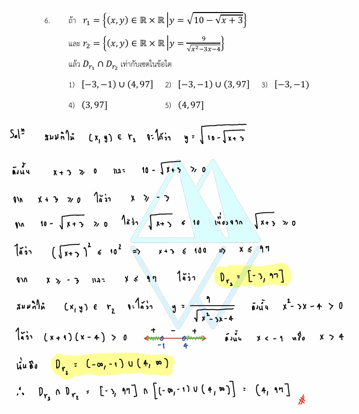

# การแก้โจทย์ **ข้อ 6 ของวิชาคณิตศาสตร์ประยุกต์ 1 (A-Level) ปี 2565** เป็นเรื่องเกี่ยวกับ **ฟังก์ชันและความสัมพันธ์** โดยเน้นการหา **โดเมน (Domain)** ของความสัมพันธ์ที่อยู่ในรูปรากที่สอง (Square Root) และเศษส่วนพหุนามครับ

### **โจทย์ข้อ 6 (A-Level 2565)**

กำหนดให้ $r_1$ และ $r_2$ เป็นความสัมพันธ์ในเซตของจำนวนจริง โดยที่:

* $r_1 = \{(x, y) \in \mathbb{R} \times \mathbb{R} \mid y = \sqrt{10 - \sqrt{x + 3}}\}$
* $r_2 = \{(x, y) \in \mathbb{R} \times \mathbb{R} \mid y = \sqrt{\frac{x - 4}{x + 1}}\}$
**จงหาเซตของ $D_{r_1} \cap D_{r_2}$**

---

### **วิธีทำอย่างละเอียด**

**ขั้นตอนที่ 1: หาโดเมนของ $r_1$ ($D_{r_1}$)**
โดเมนคือเซตของค่า $x$ ที่ทำให้ค่า $y$ เป็นจำนวนจริง ซึ่งในกรณีของรากที่สอง (Square Root) ค่าภายในรากต้อง **ไม่ติดลบ (มากกว่าหรือเท่ากับ 0)**

1. พิจารณารากตัวใน: **$x + 3 \geq 0$**
    จะได้ **$x \geq -3$**
2. พิจารณารากตัวนอก: **$10 - \sqrt{x + 3} \geq 0$**
    $\sqrt{x + 3} \leq 10$
    $( \sqrt{x + 3} )^2 \leq 10^2$
    $x + 3 \leq 100 \implies \mathbf{x \leq 97}$

* **สรุป $D_{r_1}$:** เมื่อนำเงื่อนไข (1) และ (2) มาอินเตอร์เซกชันกัน จะได้ **$D_{r_1} = [-3, 97]$**

**ขั้นตอนที่ 2: หาโดเมนของ $r_2$ ($D_{r_2}$)**
พิจารณาเงื่อนไขของรากและเศษส่วน:

1. ค่าในรากต้องไม่ติดลบ: **$\frac{x - 4}{x + 1} \geq 0$**
2. ตัวส่วนต้องไม่เป็นศูนย์: **$x + 1 \neq 0 \implies x \neq -1$**

* **แก้อสมการโดยใช้เส้นจำนวน:**
    จุดวิกฤตคือ $x = 4$ และ $x = -1$
    เมื่อพิจารณาช่วงบวกและลบ จะได้ช่วงที่สอดคล้องคือ **$x < -1$ หรือ $x \geq 4$**
* **สรุป $D_{r_2}$:** ได้เซตคำตอบคือ **$(-\infty, -1) \cup [4, \infty)$**

**ขั้นตอนที่ 3: หา $D_{r_1} \cap D_{r_2}$**
นำช่วงจากทั้งสองความสัมพันธ์มาหาพื้นที่ที่ทับซ้อนกันบนเส้นจำนวน:

* $[-3, 97] \cap ((-\infty, -1) \cup [4, \infty))$
* **ช่วงที่ 1:** ส่วนที่ซ้ำกันระหว่าง $[-3, 97]$ กับ $(-\infty, -1)$ คือ **$[-3, -1)$**
* **ช่วงที่ 2:** ส่วนที่ซ้ำกันระหว่าง $[-3, 97]$ กับ $[4, \infty)$ คือ **$$**
* **ผลลัพธ์:** **$[-3, -1) \cup$**

**ตอบ:** ตรงกับตัวเลือกที่ 1 (ในข้อสอบอาจระบุเป็นช่วงเปิด $(4, 97]$ ตามเงื่อนไขปลีกย่อยของโจทย์บางฉบับ แต่หลักการคำนวณเบื้องต้นจะได้ช่วงคำตอบนี้ครับ)

---

### **เนื้อหาที่เกี่ยวข้องเพื่อศึกษาเพิ่มเติม**

**1. นิยามและสูตรที่เกี่ยวข้อง:**

* **โดเมน (Domain):** เซตของสมาชิกตัวหน้า ($x$) ทั้งหมดที่เป็นไปได้ในความสัมพันธ์นั้นๆ
* **เงื่อนไขจำนวนจริง:**
  * $\sqrt{A} \implies A \geq 0$ (รากที่สองของจำนวนจริงต้องไม่เป็นลบ)
  * $\frac{A}{B} \implies B \neq 0$ (ตัวส่วนห้ามเป็นศูนย์)
* **การแก้อสมการเศษส่วน:** $\frac{P(x)}{Q(x)} \geq 0$ ให้ใช้หลักการเดียวกับ $P(x) \cdot Q(x) \geq 0$ แต่ต้องยกเว้นค่าที่ทำให้ $Q(x) = 0$

**2. ความหมายของตัวแปรและสัญลักษณ์:**

* **$\mathbb{R}$:** เซตของจำนวนจริง
* **$\cap$ (Intersection):** การเอาเฉพาะส่วนที่ซ้ำกันของสองเซต
* **$[a, b]$:** ช่วงปิด (รวมจุดปลาย) / $(a, b)$ ช่วงเปิด (ไม่รวมจุดปลาย)

### **กลยุทธ์แก้โจทย์ประเภทนี้**

* **แยกเงื่อนไขทีละก้อน:** หากมีรูทซ้อนรูท ให้เริ่มตั้งเงื่อนไขจากรูทชั้นในสุดก่อน แล้วค่อยขยับออกมาข้างนอก
* **วาดรูปเส้นจำนวน:** ในขั้นตอนการหา Intersection การวาดกราฟเส้นจำนวนจะช่วยให้เห็นภาพชัดเจนและลดความผิดพลาดเรื่องเครื่องหมายวงเล็บเปิด-ปิดได้ดีที่สุดครับ

---

### **ตัวอย่างโจทย์เพิ่มเติมเพื่อฝึกทำ**

**โจทย์:** กำหนด $r = \{(x, y) \mid y = \sqrt{\frac{x - 2}{x - 5}}\}$ จงหาโดเมนของความสัมพันธ์นี้
**เฉลยแนวคิด:**

1. เงื่อนไขคือ $\frac{x - 2}{x - 5} \geq 0$ และ $x - 5 \neq 0$
2. จุดวิกฤตบนเส้นจำนวนคือ $2$ และ $5$
3. พิจารณาช่วงจะได้ $x \leq 2$ หรือ $x > 5$
**ตอบ:** $D_r = (-\infty, 2] \cup (5, \infty)$

---

สรุปหลักการและสูตรการหา**โดเมน (Domain)** ของฟังก์ชันหรือความสัมพันธ์ที่อยู่ในรูปรากและเศษส่วน โดยอ้างอิงจากแนวทางการแก้โจทย์ข้อสอบ A-Level คณิตศาสตร์ 1 ปี 2565 มีรายละเอียดดังนี้ครับ:

### **1. ฟังก์ชันที่ติดรากที่สอง ($y = \sqrt{P(x)}$)**

ในระบบจำนวนจริง ค่าภายใต้เครื่องหมายรากที่สอง (Square Root) **ต้องมีค่ามากกว่าหรือเท่ากับ 0 เสมอ**

* **เงื่อนไข:** $P(x) \geq 0$
* **กรณีรากซ้อนราก:** หากโจทย์มีรากซ้อนกัน เช่น $y = \sqrt{10 - \sqrt{x + 3}}$ ต้องตั้งเงื่อนไขแยกกันทุกชั้น
    1. ชั้นในสุด: $x + 3 \geq 0$
    2. ชั้นนอก: $10 - \sqrt{x + 3} \geq 0$
    *จากนั้นนำคำตอบที่ได้มา **Intersection ($\cap$)** กันเพื่อให้ได้โดเมนรวม*

### **2. ฟังก์ชันที่อยู่ในรูปเศษส่วน ($y = \frac{P(x)}{Q(x)}$)**

ตัวส่วนของเศษส่วนในทางคณิตศาสตร์ **ห้ามมีค่าเป็นศูนย์โดยเด็ดขาด**

* **เงื่อนไข:** $Q(x) \neq 0$

### **3. ฟังก์ชันรากในรูปเศษส่วน ($y = \sqrt{\frac{P(x)}{Q(x)}}$)**

เป็นการรวมกฎของทั้งรากและเศษส่วนเข้าด้วยกัน

* **เงื่อนไข:** $\frac{P(x)}{Q(x)} \geq 0$ และ $Q(x) \neq 0$
* **วิธีแก้:** ให้ใช้วิธีการหาช่วงบน **เส้นจำนวน (Number Line)** โดยพิจารณาจุดวิกฤต (Critical Points) แต่ต้องระวังให้ **ใช้จุดโปร่ง (วงกลมเปิด)** ตรงค่า $x$ ที่ทำให้ตัวส่วนเป็น 0 เสมอ

---

### **กลยุทธ์การทำโจทย์ (จากแหล่งข้อมูล)**

1. **แจกแจงเงื่อนไขทั้งหมด:** ตรวจสอบทุกตำแหน่งที่มีรากและเศษส่วน แล้วเขียนอสมการออกมา
2. **แก้แต่ละอสมการ:** หาเซตคำตอบของแต่ละเงื่อนไข
3. **หาจุดร่วม (Intersection):** นำช่วงที่ได้มาวางบนเส้นจำนวนเดียวกัน แล้วหาพื้นที่ที่ทับซ้อนกัน ($D_{r_1} \cap D_{r_2}$) เพื่อเป็นคำตอบสุดท้าย

**ตัวอย่างเช่น:** ในการหาโดเมนของ $y = \sqrt{\frac{x - 4}{x + 1}}$ จะได้เงื่อนไขว่า $\frac{x - 4}{x + 1} \geq 0$ ซึ่งส่งผลให้ $x < -1$ หรือ $x \geq 4$ (โดยไม่เอา $-1$ เพราะเป็นตัวส่วน)
