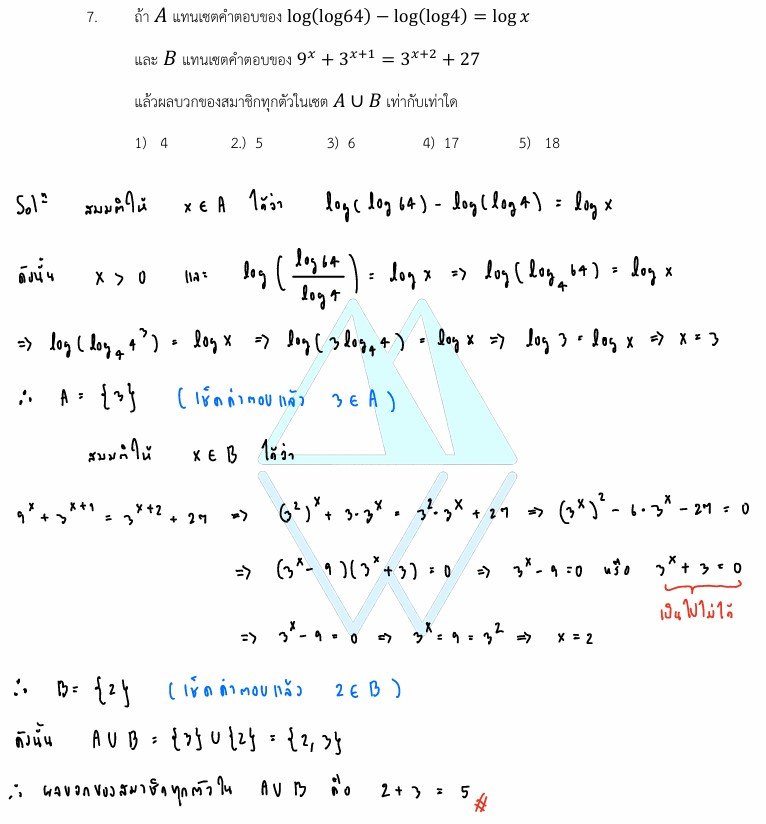

# A-Level 2565 ข้อ 7

## การแก้โจทย์ **ข้อ 7 ของวิชาคณิตศาสตร์ประยุกต์ 1 (A-Level) ปี 2565** เป็นการบูรณาการความรู้ระหว่างเรื่อง **ลอการิทึม (Logarithm)** และ **ฟังก์ชันเอกซ์โพเนนเชียล (Exponential Function)** โดยต้องหาเซตคำตอบของทั้งสองสมการแล้วนำมารวมกันครับ

### **โจทย์ข้อ 7 (A-Level 2565)**

กำหนดให้ $A$ แทนเซตคำตอบของ $\log(\log 64) - \log(\log 4) = \log x$
และ $B$ แทนเซตคำตอบของ $9^x + 3^{x+1} = 3^{x+2} + 27$
**จงหาผลบวกของสมาชิกทุกตัวในเซต $A \cup B$**

---

### **วิธีทำอย่างละเอียด**

**ขั้นตอนที่ 1: หาเซตคำตอบ $A$ (สมการลอการิทึม)**
จากสมการ $\log(\log 64) - \log(\log 4) = \log x$

1. ใช้สมบัติการลบของลอการิทึม $\log M - \log N = \log \frac{M}{N}$:
    $$\log \left( \frac{\log 64}{\log 4} \right) = \log x$$
2. ตัด $\log$ ทั้งสองข้างออก จะได้:
    $$x = \frac{\log 64}{\log 4}$$
3. จัดรูป $\log 64$ ให้อยู่ในรูปฐาน 4 เนื่องจาก $64 = 4^3$:
    $$x = \frac{\log 4^3}{\log 4} = \frac{3 \log 4}{\log 4}$$
4. ตัด $\log 4$ ออก จะได้ **$x = 3$** ดังนั้น **$A = \{3\}$**

**ขั้นตอนที่ 2: หาเซตคำตอบ $B$ (สมการเอกซ์โพเนนเชียล)**
จากสมการ $9^x + 3^{x+1} = 3^{x+2} + 27$

1. จัดรูปฐานให้เป็นเลข 3: $(3^2)^x + 3^x \cdot 3^1 = 3^x \cdot 3^2 + 27$
    $$(3^x)^2 + 3(3^x) = 9(3^x) + 27$$
2. กำหนดตัวแปรช่วย ให้ $y = 3^x$ จะได้สมการพหุนาม:
    $$y^2 + 3y = 9y + 27$$
    $$y^2 - 6y - 27 = 0$$
3. แยกตัวประกอบ:
    $$(y - 9)(y + 3) = 0$$
4. ได้ค่า $y = 9$ หรือ $y = -3$
    * เนื่องจาก $y = 3^x$ ซึ่งค่าของเลขยกกำลังฐานบวกต้องมากกว่า 0 เสมอ ดังนั้น $y = -3$ จึงใช้ไม่ได้
    * ใช้ $y = 9 \implies 3^x = 3^2 \implies \mathbf{x = 2}$
5. ดังนั้น **$B = \{2\}$**

**ขั้นตอนที่ 3: หาผลบวกของสมาชิกใน $A \cup B$**

* $A \cup B = \{3\} \cup \{2\} = \{2, 3\}$
* ผลบวกของสมาชิกคือ $2 + 3 = \mathbf{5}$

**ตอบ:** 5 (ตรงกับตัวเลือกที่ 2)

---

### **เนื้อหาที่เกี่ยวข้องเพื่อศึกษาเพิ่มเติม**

**1. สมบัติของลอการิทึมที่สำคัญ:**

* $\log_a M + \log_a N = \log_a (MN)$
* $\log_a M - \log_a N = \log_a \frac{M}{N}$
* $\log_a M^n = n \log_a M$
* **สูตรเปลี่ยนฐาน:** $\log_b a = \frac{\log_c a}{\log_c b}$ (ซึ่งในโจทย์ข้อนี้ $\frac{\log 64}{\log 4}$ คือค่าของ $\log_4 64$ นั่นเอง)

**2. การแก้สมการเอกซ์โพเนนเชียล:**

* พยายามทำฐานให้เท่ากันทั้งสองข้าง
* หากมีพจน์บวกลบกัน ให้ใช้การสมมติตัวแปร (เช่น $3^x = y$) เพื่อเปลี่ยนสมการให้อยู่ในรูปพหุนามกำลังสอง

### **กลยุทธ์แก้โจทย์ประเภทนี้**

* **ตรวจสอบเงื่อนไขหลัง log:** หลังคำนวณค่า $x$ ได้แล้ว ต้องตรวจสอบเสมอว่าค่า $x$ นั้นทำให้ตัวเลขหลัง $\log$ ในโจทย์ดั้งเดิมเป็นบวกหรือไม่ (ในข้อนี้ $x=3$ เป็นบวก จึงใช้ได้)
* **ระวังค่าของเลขยกกำลัง:** เมื่อสมมติ $y = a^x$ ต้องระลึกเสมอว่า $y$ ต้องเป็นจำนวนจริงบวกเท่านั้น ค่าลบที่ได้จากการแก้สมการพหุนามต้องตัดทิ้ง

---

### **ตัวอย่างโจทย์เพิ่มเติมเพื่อฝึกทำ**

**โจทย์:** ให้ $S$ เป็นเซตคำตอบของสมการ $4^x - 6(2^x) + 8 = 0$ จงหาผลรวมของสมาชิกใน $S$

**เฉลยแนวคิด:**

1. ให้ $y = 2^x$ จะได้สมการ $y^2 - 6y + 8 = 0$
2. แยกตัวประกอบ $(y - 4)(y - 2) = 0$ จะได้ $y = 4$ หรือ $y = 2$
3. เปลี่ยนกลับเป็น $x$:
    * $2^x = 4 \implies x = 2$
    * $2^x = 2 \implies x = 1$
4. ผลรวมสมาชิกคือ $2 + 1 = 3$
**ตอบ:** 3

---

สมบัติของ**ลอการิทึม (Logarithm)** ที่ถูกนำมาใช้ในการแก้โจทย์ข้อ 7 ของข้อสอบ A-Level คณิตศาสตร์ 1 ปี 2565 มีรายละเอียดเชิงลึกเพื่อการศึกษาเพิ่มเติมดังนี้ครับ

### **1. สมบัติการลบของลอการิทึม (Logarithm of a Quotient)**

* **สูตร:** $\log_a M - \log_a N = \log_a \left( \frac{M}{N} \right)$
* **ที่มาและความหมาย:** สมบัตินี้มีรากฐานมาจากสมบัติของเลขยกกำลังที่ว่าเมื่อนำเลขฐานเดียวกันมาหารกัน ให้เอาเลขชี้กำลังมาลบกัน ในโจทย์ข้อนี้ถูกใช้เพื่อยุบรวมพจน์ฝั่งซ้าย:
  * $\log(\log 64) - \log(\log 4)$ กลายเป็น **$\log \left( \frac{\log 64}{\log 4} \right)$**

### **2. สมบัติเลขชี้กำลังหลัง Log (Power Rule)**

* **สูตร:** $\log_a M^n = n \log_a M$
* **การนำไปใช้ในโจทย์:** ใช้เพื่อจัดการกับเลข 64 เพื่อให้ตัดทอนกับตัวส่วนได้ง่ายขึ้น:
  * เนื่องจาก $64 = 4^3$ ดังนั้น $\log 64 = \log 4^3$
  * ตบเลขชี้กำลังลงมาด้านหน้าจะได้ **$3 \log 4$**

### **3. สมบัติการเปลี่ยนฐาน (Change of Base Formula)**

* **สูตร:** $\log_b a = \frac{\log_c a}{\log_c b}$
* **ความสำคัญในข้อนี้:** ในขั้นตอน $x = \frac{\log 64}{\log 4}$ เราสามารถมองในมุมกลับได้ว่านี่คือค่าของ **$\log_4 64$** นั่นเอง ซึ่งการที่ $\log 64 = 3 \log 4$ ทำให้การหารกันเหลือค่าคงที่คือ **3**

### **4. สมบัติการเท่ากัน (One-to-One Property)**

* **หลักการ:** ถ้า $\log_a M = \log_a N$ แล้ว $M = N$
* **การนำไปใช้:** หลังจากยุบพจน์ฝั่งซ้ายแล้ว จะได้ $\log \left( \frac{\log 64}{\log 4} \right) = \log x$ เราจึงสามารถ "ปลด log" ออกทั้งสองข้างเพื่อหาค่า $x$ ได้โดยตรง

### **กลยุทธ์และข้อควรระวัง (Tips & Tricks)**

1. **ตรวจสอบเงื่อนไขหลัง Log (Domain):** ค่าที่อยู่หลัง $\log$ ทุกตัวต้อง **มากกว่า 0 เสมอ** ($M > 0$)
    * ในข้อนี้ $x = 3$ ซึ่งมากกว่า 0 และ $\log 64, \log 4$ ต่างก็มีค่าเป็นบวก ทำให้ $\log$ ชั้นนอกทำงานได้ปกติ
2. **การเลือกฐาน:** หากโจทย์ไม่ระบุฐาน (เขียนแค่ $\log$) หมายถึง **ฐาน 10 (Common Logarithm)**
3. **การสังเกตตัวเลข:** โจทย์ลอการิทึมมักออกแบบมาให้ตัวเลขสัมพันธ์กันในรูปเลขยกกำลัง (เช่น 4, 16, 64) การจัดรูปให้อยู่ในฐานที่เล็กที่สุดจะช่วยให้คำนวณง่ายขึ้นมากครับ

**สรุปการทำงานในโจทย์:** โจทย์เริ่มจากการให้เรา **"ยุบ"** กลุ่มก้อน log ด้วยการลบ จากนั้นให้ **"จัดรูป"** ตัวเลขภายในด้วยเลขยกกำลังเพื่อให้ตัดทอนกันได้ จนเหลือค่าสมการที่ง่ายที่สุดเพื่อหาเซตคำตอบ $A = \{3\}$ ครับ

---

สมบัติของเลขชี้กำลังและฟังก์ชันเอกซ์โพเนนเชียลที่ถูกนำมาใช้ในการหาเซตคำตอบ $B$ จากสมการ **$9^x + 3^{x+1} = 3^{x+2} + 27$** ในโจทย์ข้อ 7 มีรายละเอียดดังนี้ครับ

### **1. การทำฐานให้เท่ากัน (Power of a Power)**

* **สมบัติ:** $(a^m)^n = a^{mn}$
* **การนำไปใช้:** ในโจทย์มีทั้งฐาน 9 และฐาน 3 เราต้องปรับฐาน 9 ให้เป็นฐาน 3 เพื่อให้คำนวณร่วมกันได้
  * $9^x = (3^2)^x = 3^{2x}$ หรือจัดในรูป **$(3^x)^2$** เพื่อเตรียมเข้าสูตรพหุนามกำลังสอง

### **2. การแยกพจน์เลขชี้กำลังที่บวกกัน (Product Rule)**

* **สมบัติ:** $a^{m+n} = a^m \cdot a^n$
* **การนำไปใช้:** โจทย์มีการบวกค่าคงที่ในเลขชี้กำลัง เราต้องแยกออกมาเป็นผลคูณของตัวเลขเพื่อลดรูปสมการ
  * $3^{x+1}$ แยกได้เป็น **$3^x \cdot 3^1$** (หรือ $3 \cdot 3^x$)
  * $3^{x+2}$ แยกได้เป็น **$3^x \cdot 3^2$** (หรือ $9 \cdot 3^x$)

### **3. การเปลี่ยนตัวแปรเพื่อแก้สมการ (Substitution)**

เมื่อจัดรูปตามข้อ 1 และ 2 แล้ว สมการจะอยู่ในรูป:
$$(3^x)^2 + 3(3^x) = 9(3^x) + 27$$

* **กลยุทธ์:** กำหนดตัวแปรช่วยเพื่อให้มองเป็นสมการพหุนามปกติ โดยให้ **$y = 3^x$**
* จะได้สมการใหม่เป็น $y^2 + 3y = 9y + 27$ ซึ่งสามารถย้ายข้างและแยกตัวประกอบได้เป็น $(y - 9)(y + 3) = 0$

### **4. เงื่อนไขของฟังก์ชันเอกซ์โพเนนเชียล (Range of Exponential Function)**

* **หลักการ:** สำหรับฟังก์ชัน $f(x) = a^x$ โดยที่ $a > 0$ ค่าของ **$a^x$ จะต้องเป็นจำนวนจริงบวกเสมอ ($a^x > 0$)** ไม่ว่า $x$ จะเป็นค่าใดก็ตาม
* **การนำไปใช้:** จากการแก้สมการพหุนามได้ค่า $y = 9$ และ $y = -3$
  * กรณี $y = 9$: จะได้ $3^x = 3^2$ ดังนั้น **$x = 2$**
  * กรณี $y = -3$: จะได้ $3^x = -3$ ซึ่ง **เป็นไปไม่ได้** เพราะเลขยกกำลังฐานบวกไม่มีทางได้ผลลัพธ์เป็นค่าลบ จึงต้องตัดค่านี้ทิ้ง

**สรุป:** การใช้สมบัติเหล่านี้ทำให้เราสรุปได้ว่าเซตคำตอบ **$B = \{2\}$** ซึ่งเมื่อนำไปรวมกับเซต $A = \{3\}$ จากพาร์ทลอการิทึม จะได้ผลบวกสมาชิกคือ $2 + 3 = 5$ ครับ
