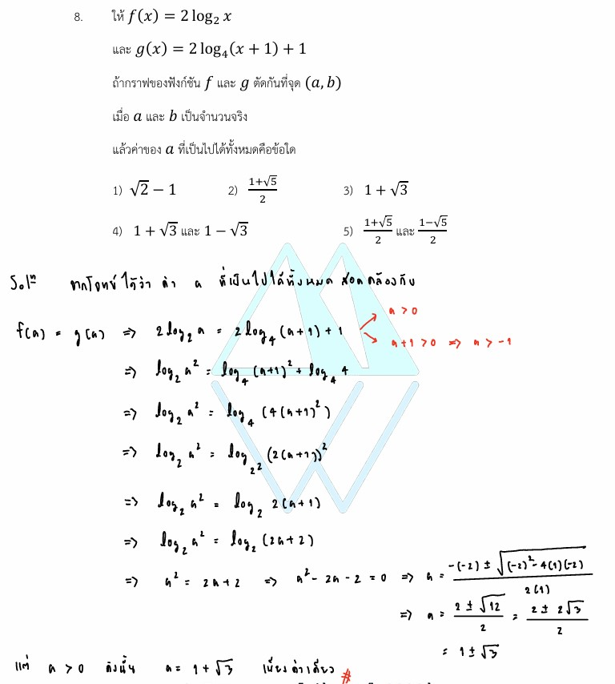

# การแก้โจทย์ **ข้อ 8 ของวิชาคณิตศาสตร์ประยุกต์ 1 (A-Level) ปี 2565** เป็นการทดสอบความรู้เรื่อง **ฟังก์ชันลอการิทึม (Logarithmic Function)** โดยเน้นไปที่การหาจุดตัดของกราฟและการแก้สมการลอการิทึมพื้นฐานครับ

## **เฉลยละเอียดโจทย์ข้อ 8 (A-Level 2565)**

**โจทย์:** กำหนดให้ $f(x) = 2 \log_a x$ และ $g(x) = 2 \log_2(x+1) + 1$ ถ้กราฟของฟังก์ชัน $f$ และ $g$ ตัดกันที่จุด $(a, 2)$ เมื่อ $a$ เป็นจำนวนจริง จงหาค่าของ $a$ ที่เป็นไปได้ทั้งหมด,

---

### **วิธีทำอย่างละเอียด**

**ขั้นตอนที่ 1: วิเคราะห์ความหมายของจุดตัด**
การที่กราฟของฟังก์ชัน $f$ และ $g$ ตัดกันที่จุด $(a, 2)$ หมายความว่า:

1. เมื่อแทน $x = a$ ในฟังก์ชัน $f(x)$ จะต้องได้ค่า $y = 2$ (นั่นคือ $f(a) = 2$)
2. เมื่อแทน $x = a$ ในฟังก์ชัน $g(x)$ จะต้องได้ค่า $y = 2$ (นั่นคือ $g(a) = 2$)

**ขั้นตอนที่ 2: ตรวจสอบฟังก์ชัน $f(a)$**
จาก $f(x) = 2 \log_a x$ แทนค่า $x = a$:
$$f(a) = 2 \log_a a$$
เนื่องจากสมบัติของลอการิทึม $\log_a a = 1$ ดังนั้น:
$$f(a) = 2(1) = 2$$
ซึ่งสอดคล้องกับพิกัด $y = 2$ ที่โจทย์ให้มาสำหรับทุกค่า $a$ ที่เป็นฐานของลอการิทึมได้ ($a > 0$ และ $a \neq 1$)

**ขั้นตอนที่ 3: แก้สมการหาค่า $a$ จากฟังก์ชัน $g(a)$**
จาก $g(x) = 2 \log_2(x+1) + 1$ แทนจุด $(a, 2)$ ลงไป:
$$2 = 2 \log_2(a+1) + 1$$

1. ย้าย $1$ ไปลบออก:
    $$2 - 1 = 2 \log_2(a+1) \implies 1 = 2 \log_2(a+1)$$
2. ย้าย $2$ ไปหาร:
    $$\frac{1}{2} = \log_2(a+1)$$
3. เปลี่ยนรูปจากลอการิทึมเป็นเลขยกกำลัง (นิยาม $\log_b x = y \iff b^y = x$):
    $$a+1 = 2^{1/2}$$
    $$a+1 = \sqrt{2}$$
4. แก้หาค่า $a$:
    $$\mathbf{a = \sqrt{2} - 1}$$

**ตอบ:** $a = \sqrt{2} - 1$ (ตรงกับตัวเลือกที่ 1),

---

### **เนื้อหาที่เกี่ยวข้องเพื่อศึกษาเพิ่มเติม**

**1. นิยามและสมบัติของลอการิทึม:**

* **นิยาม:** $y = \log_a x$ หมายถึง $a^y = x$ โดยที่ $x > 0, a > 0$ และ $a \neq 1$
* **สมบัติสำคัญที่ใช้:**
  * $\log_a a = 1$ (ลอการิทึมของฐานตัวมันเองมีค่าเป็น 1)
  * การเปลี่ยนรูประหว่างรูป Log และรูปเลขยกกำลังเป็นหัวใจสำคัญของการแก้โจทย์บทนี้

**2. ความหมายของตัวแปรและค่าคงที่:**

* **$a$:** ในฟังก์ชัน $f(x)$ ทำหน้าที่เป็น **ฐาน (Base)** ซึ่งมีเงื่อนไขสำคัญคือต้องเป็นจำนวนจริงบวกที่ไม่ใช่ 1
* **$(a, 2)$:** $a$ คือพิกัดบนแกน $x$ และ $2$ คือพิกัดบนแกน $y$ ณ จุดที่กราฟทั้งสองเส้นวิ่งมาเจอกันพอดี

---

### **กลยุทธ์แก้โจทย์ประเภทนี้**

* **จุดตัดคือจุดร่วม:** เมื่อโจทย์บอกจุดตัด ให้รีบนำพิกัด $(x, y)$ นั้นไปแทนในฟังก์ชันที่โจทย์ให้มาทันที มักจะเกิดสมการที่มีตัวแปรเดียวให้เราแก้ได้เสมอ
* **ตรวจสอบเงื่อนไขหลัง Log และฐาน:** หลังจากได้คำตอบแล้ว ควรเช็คเสมอว่าค่า $x$ (หลัง log) ต้องมากกว่า 0 และฐาน $a$ ต้องสอดคล้องตามนิยาม ในข้อนี้ $\sqrt{2}-1 \approx 0.414$ ซึ่งเป็นค่าบวกและไม่เท่ากับ 1 จึงใช้งานได้

---

### **ตัวอย่างโจทย์เพิ่มเติมเพื่อฝึกทำ**

**โจทย์:** กำหนดกราฟของ $f(x) = \log_3 x$ และ $g(x) = k - \log_3 x$ ตัดกันที่จุด $(9, 2)$ จงหาค่า $k$
**เฉลยแนวคิด:**

1. แทนจุด $(9, 2)$ ใน $g(x)$: จะได้ $2 = k - \log_3 9$
2. คำนวณ $\log_3 9$: เนื่องจาก $9 = 3^2$ ดังนั้น $\log_3 9 = 2$
3. แก้สมการ: $2 = k - 2 \implies k = 4$
**ตอบ:** $k = 4$

การฝึกฝนการแทนค่าจุดตัดจะช่วยให้คุณเก็บคะแนนจากบทฟังก์ชันลอการิทึมใน A-Level ได้อย่างรวดเร็วครับ!

---

จากแหล่งข้อมูลที่ปรากฏในข้อสอบและเฉลยคณิตศาสตร์ประยุกต์ A-Level ปี 2565 เทคนิคการหา **"จุดตัด"** ของกราฟฟังก์ชันประเภทต่างๆ สามารถสรุปเป็นกลยุทธ์สำคัญได้ดังนี้ครับ:

### **1. เทคนิคพื้นฐาน: จุดตัดคือ "จุดร่วม"**

หัวใจสำคัญของการหาจุดตัดคือ การระลึกว่า ณ จุดนั้น **ค่า $x$ และ $y$ ของทั้งสองฟังก์ชันต้องเท่ากัน**

* **วิธีแก้:** หากโจทย์ให้สมการ $y = f(x)$ และ $y = g(x)$ มา ให้เราจับทั้งสองสมการมาเท่ากัน คือ **$f(x) = g(x)$** เพื่อแก้หาค่า $x$ จากนั้นจึงนำค่า $x$ ที่ได้ไปแทนกลับในสมการใดสมการหนึ่งเพื่อหาค่า $y$
* **ตัวอย่างจากข้อ 8:** กราฟ $f(x)$ และ $g(x)$ ตัดกันที่จุด $(a, 2)$ เราจึงสามารถแทน $x = a$ และ $y = 2$ ลงในสมการเพื่อแก้หาตัวแปรที่ติดอยู่ได้ทันที

### **2. การหาจุดตัดแกน (Intercepts)**

เป็นพื้นฐานที่พบบ่อยในโจทย์เรขาคณิตวิเคราะห์และฟังก์ชันพหุนาม

* **จุดตัดแกน X:** ให้แทนค่า **$y = 0$** ในสมการแล้วแก้หาค่า $x$
  * *จากข้อ 15:* วงกลมตัดแกน X ที่จุด $(a, 0)$ จึงแทน $y = 0$ ลงในสมการวงกลมจนได้สมการกำลังสอง $a^2 - 70a - 144 = 0$ เพื่อหาค่า $a$
  * *จากข้อ 29:* การหาจุดตัดแกน X ของพาราโบลา $y = -x^2 + \ell$ เพื่อหาขอบเขตของพื้นที่ปิกด้าน
* **จุดตัดแกน Y:** ให้แทนค่า **$x = 0$** ในสมการแล้วแก้หาค่า $y$
  * *จากข้อ 15:* วงกลมตัดแกน Y ที่จุด $(0, b)$ จึงแทน $x = 0$ เพื่อหาค่า $b$

### **3. การหาจุดตัดของภาคตัดกรวย (Conic Sections)**

ในกรณีที่กราฟไม่ใช่เส้นตรง เช่น วงกลม รี หรือไฮเพอร์โบลา จุดตัดมักจะนำไปสู่การแก้ระบบสมการกำลังสอง

* **กลยุทธ์:** หากโจทย์ระบุเงื่อนไขในรูปเซต เช่น จุดยอดสี่เหลี่ยมอยู่ในเซต $c \cap e$ (อินเตอร์เซกชันของสองกราฟ) หมายความว่าเราต้องแก้สมการของกราฟทั้งสองร่วมกัน
* **เทคนิคการจัดรูป:** ในข้อ 16 โจทย์ใช้สมบัติระยะห่างจากจุดโฟกัสเพื่อหาพิกัดจุดตัด แทนที่จะแก้สมการกำลังสองตรงๆ ซึ่งช่วยให้คำนวณได้เร็วขึ้นมาก

### **4. การหาจุดตัดของฟังก์ชันลอการิทึมและเอกซ์โพเนนเชียล**

โจทย์ประเภทนี้มักอาศัยการเปลี่ยนรูปสมการเป็นหลัก

* **กลยุทธ์:** พยายามกำจัด $\log$ หรือทำฐานของเลขยกกำลังให้เท่ากันก่อนจะหาจุดตัด
* **ข้อควรระวัง:** เมื่อได้พิกัดจุดตัด $(x, y)$ มาแล้ว ต้องตรวจสอบเสมอว่าค่าเหล่านั้นสอดคล้องกับ **นิยามของฟังก์ชัน** หรือไม่ (เช่น หลัง $\log$ ต้องเป็นบวก, ฐาน $\log$ ต้องไม่เท่ากับ 1)

**สรุปกลยุทธ์สำหรับการสอบ:**
เมื่อเจอคำว่า "จุดตัด" ให้รีบมองหา **ค่าที่ทราบค่าแล้ว** (เช่น พิกัด $y$ หรือเงื่อนไข $y=0$ เมื่อตัดแกน X) แล้วนำไป **"แทนค่า"** เพื่อลดจำนวนตัวแปรให้เหลือตัวเดียว ซึ่งจะทำให้แก้สมการหาคำตอบได้ง่ายที่สุดครับ

---

จากแหล่งข้อมูลข้อสอบ A-Level คณิตศาสตร์ 1 ปี 2565 สามารถสรุปสมบัติของภาคตัดกรวยที่มักถูกนำมาใช้ในโจทย์พิกัดฉากและการหาจุดตัดของกราฟได้ดังนี้ครับ

### **1. วงกลม (Circle)**

โจทย์มักให้สมการรูปแบบทั่วไปมา เพื่อให้เราหาจุดสำคัญเพื่อนำไปสร้างความสัมพันธ์กับเส้นตรงหรือรูปทรงอื่น:

* **การหาจุดตัดแกน (Intercepts):** เป็นเทคนิคพื้นฐานที่พบบ่อยมาก
  * **ตัดแกน X:** ให้แทนค่า $y = 0$ ในสมการวงกลมแล้วแก้สมการหาค่า $x$
  * **ตัดแกน Y:** ให้แทนค่า $x = 0$ ในสมการวงกลมแล้วแก้สมการหาค่า $y$
* **การหาจุดศูนย์กลาง $(h, k)$:** ใช้วิธีการจัดรูปสมการโดยการ **"ทำเป็นกำลังสองสมบูรณ์"** เพื่อระบุตำแหน่งจุดศูนย์กลางของวงกลม ซึ่งจำเป็นต่อการสร้างสมการเส้นตรงที่ลากผ่านจุดนี้

### **2. วงรี (Ellipse) และ ไฮเพอร์โบลา (Hyperbola)**

ในโจทย์ระดับสูง (เช่น ข้อ 16) มักไม่เน้นการแก้สมการพหุนามที่ซับซ้อน แต่จะทดสอบ **"นิยามเชิงเรขาคณิต"** ของระยะห่างจากจุดโฟกัสเพื่อหาจุดตัด:

* **นิยามวงรี:** เซตของจุดที่ผลรวมของระยะทางจากจุดนั้นไปยังจุดโฟกัสทั้งสอง ($A$ และ $B$) มีค่าคงตัว ($PA + PB = 2a$)
* **นิยามไฮเพอร์โบลา:** เซตของจุดที่ผลต่างสัมบูรณ์ของระยะทางจากจุดนั้นไปยังจุดโฟกัสทั้งสองมีค่าคงตัว ($|PA - PB| = 2a$)
* **กลยุทธ์การหาจุดตัด ($C \cap E$):** หากจุดยอดของรูปสี่เหลี่ยมเป็นจุดตัดของวงรีและไฮเพอร์โบลาที่มีจุดโฟกัสร่วมกัน เราสามารถแก้ระบบสมการจากนิยามระยะทาง (เช่น $PA+PB=70$ และ $PA-PB=10$) เพื่อหาค่าระยะห่างจริง ($PA, PB$) ได้โดยตรง ซึ่งจะนำไปสู่พิกัดจุดตัดได้รวดเร็วกว่าการแก้สมการกำลังสอง

### **3. พาราโบลา (Parabola)**

มักปรากฏในโจทย์พิกัดฉากร่วมกับพหุนามหรือการหาพื้นที่:

* **จุดตัดแกน X:** ในการหาขอบเขตของพื้นที่ที่ปิดล้อมด้วยเส้นโค้งพาราโบลา $y = -x^2 + \ell$ กับแกน X เราต้องหาจุดตัดโดยกำหนดให้ $y = 0$ ซึ่งจะได้ค่า $x = \pm\sqrt{\ell}$ เพื่อใช้เป็นขอบเขตในการคำนวณขั้นต่อไป

**สรุปเทคนิคสำคัญ:**
โจทย์ A-Level มักวางแผนให้เราใช้ **"จุดโฟกัส"** หรือ **"จุดตัดแกน"** เป็นกุญแจสำคัญในการเชื่อมโยงระหว่างภาคตัดกรวยแต่ละประเภท การจำนิยามระยะห่างของวงรีและไฮเพอร์โบลาจะช่วยลดเวลาการคำนวณโจทย์จุดตัดกราฟได้มหาศาลครับ
