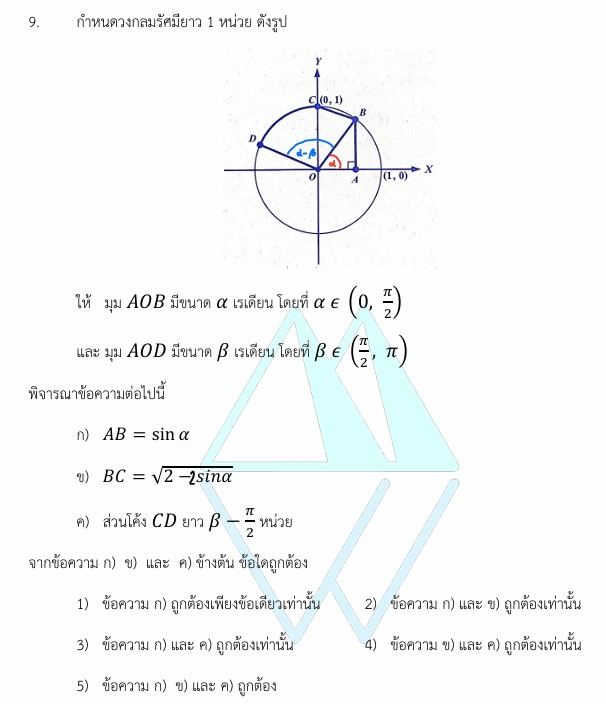

# เฉลยข้อ 9 คณิตศาสตร์ประยุกต์ 1 (A-Level) ปี 2565

การแก้โจทย์ **ข้อ 9 ของวิชาคณิตศาสตร์ประยุกต์ 1 (A-Level) ปี 2565** เป็นการทดสอบความรู้เรื่อง **ตรีโกณมิติ (Trigonometry)** และ **เรขาคณิตวิเคราะห์** โดยเน้นการใช้สมบัติของวงกลมหนึ่งหน่วย พิกัดของจุดบนส่วนโค้ง และความสัมพันธ์ระหว่างมุมกับความยาวส่วนโค้งครับ

## **เฉลยละเอียดโจทย์ข้อ 9 (A-Level 2565)**

**โจทย์:** กำหนดวงกลมรัศมียาว 1 หน่วย ดังรูป โดยมุม $AOB$ มีขนาด $\alpha$ เรเดียน ($0 < \alpha < \pi/2$) และมุม $AOD$ มีขนาด $\beta$ เรเดียน ($\pi/2 < \beta < \pi$) พิจารณาข้อความต่อไปนี้:

* **ก)** $AB = \sin \alpha$
* **ข)** $BC = \sqrt{2 - 2 \sin \alpha}$
* **ค)** ส่วนโค้ง $CD$ ยาว $\beta - \pi/2$ หน่วย
**จงหาว่าข้อความใดถูกต้อง**

---

**วิธีทำอย่างละเอียด:**

**1. ตรวจสอบข้อความ ก:**

* พิจารณาสามเหลี่ยมมุมฉาก $OAB$ โดยมีด้าน $OB$ เป็นรัศมีของวงกลมซึ่งยาว **1 หน่วย**
* จากนิยามของ $\sin$: $\sin \alpha = \frac{\text{ข้าม}}{\text{ฉาก}} = \frac{AB}{OB}$
* แทนค่า $OB = 1$ จะได้ $\sin \alpha = \frac{AB}{1} \implies \mathbf{AB = \sin \alpha}$
* **สรุป:** ข้อความ ก **ถูกต้อง**

**2. ตรวจสอบข้อความ ข:**

* หาพิกัดของจุด $B$ และ $C$:
  * จุด $B$ อยู่บนวงกลมหนึ่งหน่วย ทำมุม $\alpha$ กับแกน X ดังนั้นพิกัดคือ **$(\cos \alpha, \sin \alpha)$**
  * จุด $C$ อยู่บนแกน Y (มุม $\pi/2$) ดังนั้นพิกัดคือ **$(0, 1)$**
* ใช้สูตรระยะห่างระหว่างจุดสองจุด $d = \sqrt{(x_2-x_1)^2 + (y_2-y_1)^2}$:
  * $BC^2 = (0 - \cos \alpha)^2 + (1 - \sin \alpha)^2$
  * $BC^2 = \cos^2 \alpha + (1 - 2 \sin \alpha + \sin^2 \alpha)$
* ใช้เอกลักษณ์ตรีโกณมิติ $\sin^2 \alpha + \cos^2 \alpha = 1$:
  * $BC^2 = 1 + 1 - 2 \sin \alpha = 2 - 2 \sin \alpha$
  * จะได้ **$BC = \sqrt{2 - 2 \sin \alpha}$**
* **สรุป:** ข้อความ ข **ถูกต้อง**

**3. ตรวจสอบข้อความ ค:**

* โจทย์กำหนดมุม $AOD = \beta$ เรเดียน และเราทราบว่ามุม $AOC = \pi/2$ เรเดียน (มุมฉาก)
* ดังนั้น มุมที่จุดศูนย์กลาง $COD = \text{มุม } AOD - \text{มุม } AOC = \mathbf{\beta - \pi/2}$
* สูตรความยาวส่วนโค้ง $s = r\theta$ เมื่อ $\theta$ เป็นเรเดียน
* เนื่องจากรัศมี $r = 1$ จะได้ ส่วนโค้ง $CD = 1 \cdot (\beta - \pi/2) = \mathbf{\beta - \pi/2}$ หน่วย
* **สรุป:** ข้อความ ค **ถูกต้อง**

**ตอบ:** ข้อความ **ก, ข และ ค ถูกต้องทุกข้อ** (ตรงกับตัวเลือกที่ 5)

---

### **เนื้อหาที่เกี่ยวข้องเพื่อศึกษาเพิ่มเติม**

**1. สูตรและนิยามสำคัญ:**

* **พิกัดบนวงกลมหนึ่งหน่วย:** จุดใดๆ บนวงกลมที่ทำมุม $\theta$ กับแกน X ทางบวก จะมีพิกัดเป็น **$(x, y) = (\cos \theta, \sin \theta)$**
* **ความยาวส่วนโค้ง ($s$):** $s = r\theta$ (ถ้า $r=1$ ความยาวส่วนโค้งจะเท่ากับขนาดของมุมในหน่วยเรเดียนพอดี)
* **ระยะทางระหว่างจุด:** $d = \sqrt{\Delta x^2 + \Delta y^2}$
* **เอกลักษณ์ตรีโกณมิติพื้นฐาน:** $\sin^2 \theta + \cos^2 \theta = 1$

**2. ความหมายของตัวแปร:**

* **$\alpha, \beta$:** ขนาดของมุมในหน่วยเรเดียน
* **$\pi/2$:** มุม 90 องศา หรือจุดตัดบนแกน Y ทางด้านบวก

### **กลยุทธ์แก้โจทย์ประเภทนี้**

* **ระบุพิกัดให้ชัดเจน:** เมื่อโจทย์ให้วงกลมหนึ่งหน่วยมา กุญแจสำคัญคือการเขียนพิกัด $(x, y)$ ในรูป $(\cos, \sin)$ ของแต่ละจุด
* **ใช้เรขาคณิตช่วย:** โจทย์มักผสมผสานความยาวด้าน (ระยะทางระหว่างจุด) เข้ากับตรีโกณมิติ การวาดรูปและมองหาสามเหลี่ยมมุมฉากจะช่วยได้มาก
* **ตรวจสอบหน่วยของมุม:** ต้องระวังว่ามุมอยู่ในหน่วยเรเดียนหรือไม่ก่อนใช้สูตร $s = r\theta$

---

### **ตัวอย่างโจทย์เพิ่มเติมเพื่อฝึกทำ**

**โจทย์:** กำหนดวงกลมหนึ่งหน่วย มีจุด $P$ อยู่ที่พิกัด $(\cos \theta, \sin \theta)$ และจุด $Q$ อยู่ที่ $(1, 0)$ จงหาความยาวของคอร์ด $PQ$ ในรูปของ $\cos \theta$
**เฉลยแนวคิด:**

1. ใช้สูตรระยะทาง $PQ^2 = (1 - \cos \theta)^2 + (0 - \sin \theta)^2$
2. กระจายได้ $PQ^2 = 1 - 2 \cos \theta + \cos^2 \theta + \sin^2 \theta$
3. ใช้เอกลักษณ์ $\cos^2 \theta + \sin^2 \theta = 1$ จะได้ $PQ^2 = 2 - 2 \cos \theta$
**ตอบ:** $PQ = \sqrt{2 - 2 \cos \theta}$

การฝึกฝนเชื่อมโยงพิกัดฉากเข้ากับฟังก์ชันตรีโกณมิติจะช่วยให้น้องๆ ทำคะแนนในส่วนนี้ได้อย่างแม่นยำครับ!
