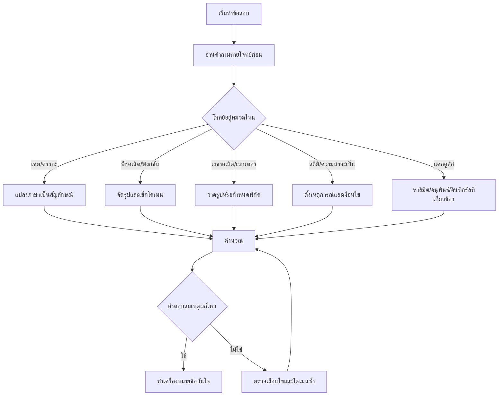

# Mindmap เนื้อหาและสูตร Math66

เอกสารนี้สรุปโครงเนื้อหา + สูตรหลัก + แนวคิดทำโจทย์แบบ mindmap สำหรับทบทวนเร็ว

## Mindmap ภาพรวมเนื้อหา

```mermaid
mindmap
  root((Math66))
    เซตและตรรกศาสตร์
      เซต
        n(A∪B)=n(A)+n(B)-n(A∩B)
        De Morgan
      ตรรกศาสตร์
        p→q
        p↔q
        นิเสธประพจน์
    พีชคณิตและฟังก์ชัน
      พหุนาม
        ทฤษฎีบทเศษเหลือ
        ทฤษฎีบทตัวประกอบ
      ลอการิทึม
        log(ab)=log a+log b
        log(a^n)=n log a
        เช็กโดเมนก่อน
      ฟังก์ชัน
        ผกผัน
        เพิ่ม-ลด
      จำนวนเชิงซ้อน
        z=a+bi
        polar form
        de Moivre
      เมทริกซ์
        determinant
        inverse
    เรขาคณิตและเวกเตอร์
      ตรีโกณ
        กฎไซน์
        กฎโคไซน์
      ภาคตัดกรวย
        วงรี
        วงกลม
        เส้นสัมผัส
      เวกเตอร์ 3 มิติ
        u·v=|u||v|cosθ
        u×v
        |u·(v×w)|
    ลำดับและอนุกรม
      เลขคณิต
        a_n=a_1+(n-1)d
      เรขาคณิต
        S_n
        S_∞=a/(1-r)
    สถิติและความน่าจะเป็น
      ความน่าจะเป็น
        P(A∪B)=P(A)+P(B)-P(A∩B)
        Complement
      Binomial
        P(X=k)=C(n,k)p^k(1-p)^(n-k)
      สถิติ
        mean
        median
        quartile
      Normal distribution
        z=(x-μ)/σ
    แคลคูลัส
      ลิมิต
      อนุพันธ์
      พื้นที่ใต้กราฟ
```

## Mindmap สูตรที่ต้องจำ

```mermaid
mindmap
  root((สูตรต้องจำ))
    เซต
      n(A∪B)=n(A)+n(B)-n(A∩B)
      (A∪B)'=A'∩B'
      (A∩B)'=A'∪B'
    ตรีโกณ
      a/sinA=b/sinB=c/sinC
      c^2=a^2+b^2-2ab cosC
    ลำดับอนุกรม
      a_n=a_1+(n-1)d
      S_∞=a/(1-r), |r|<1
    เวกเตอร์
      u·v=x1x2+y1y2+z1z2
      u·v=|u||v|cosθ
      Volume=|u·(v×w)|
    ความน่าจะเป็น
      P(A∪B)=P(A)+P(B)-P(A∩B)
      P(A')=1-P(A)
      Binomial: C(n,k)p^k(1-p)^(n-k)
    สถิติ
      x̄=Σx/n
      Var=E(X^2)-[E(X)]^2
      z=(x-μ)/σ
    แคลคูลัส
      f'(x)=lim(h→0)(f(x+h)-f(x))/h
      Area=∫_a^b f(x) dx
```

## Mindmap กลยุทธ์ทำข้อสอบ



## ลำดับทบทวน 30 นาทีสุดท้าย

1. สูตรเซต ตรรกศาสตร์ และความน่าจะเป็น
2. สูตรตรีโกณ เวกเตอร์ และภาคตัดกรวย
3. สูตรลำดับอนุกรมและจำนวนเชิงซ้อน
4. z-score และสูตรสถิติพื้นฐาน
5. นิยามอนุพันธ์และอินทิกรัล
