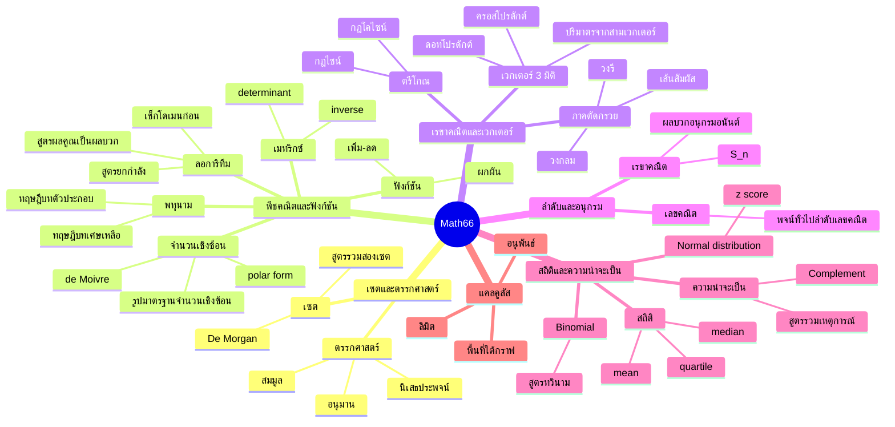
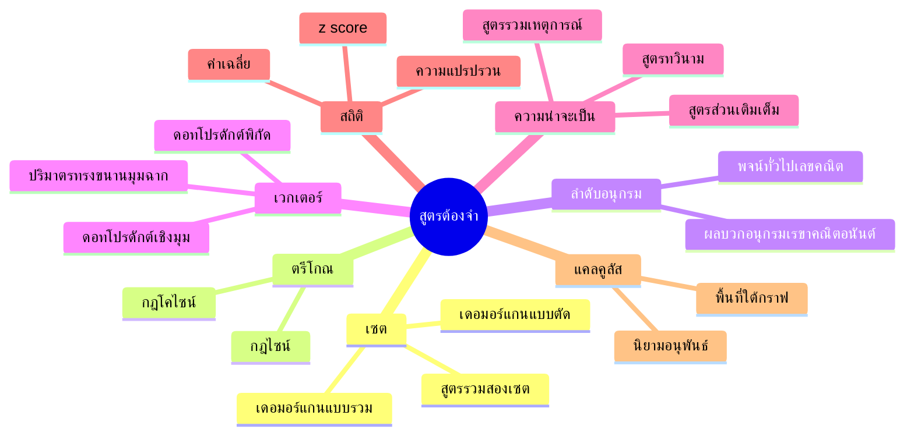
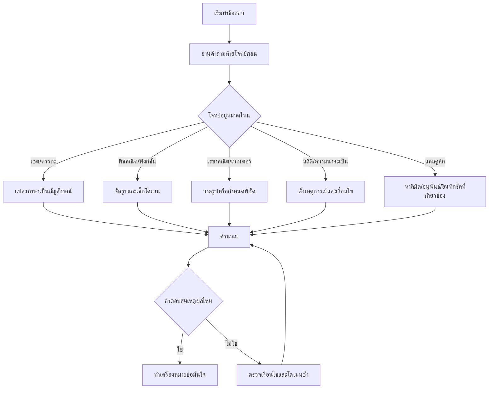
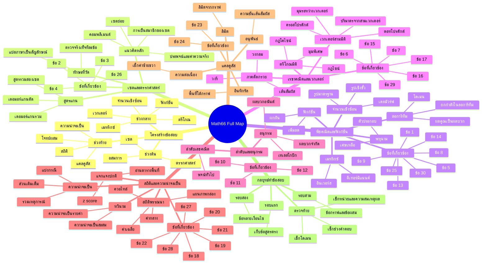
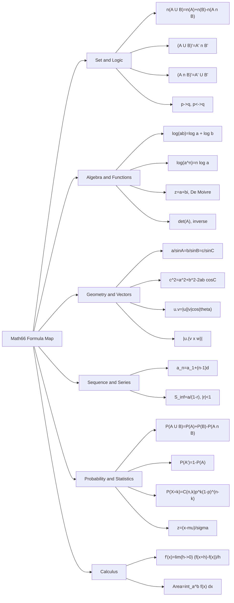

# Mindmap เนื้อหาและสูตร Math66

เอกสารนี้สรุปโครงเนื้อหา + สูตรหลัก + แนวคิดทำโจทย์แบบ mindmap สำหรับทบทวนเร็ว

## Mindmap ภาพรวมเนื้อหา



## Mindmap สูตรที่ต้องจำ



## สูตรจริง (อ้างอิงด่วน)

- n(A∪B)=n(A)+n(B)-n(A∩B)
- (A∪B)'=A'∩B', (A∩B)'=A'∪B'
- a/sinA=b/sinB=c/sinC
- c^2=a^2+b^2-2ab cosC
- a_n=a_1+(n-1)d
- S_∞=a/(1-r), |r|<1
- u·v=x1x2+y1y2+z1z2
- u·v=|u||v|cosθ
- Volume=|u·(v×w)|
- P(A∪B)=P(A)+P(B)-P(A∩B)
- P(A')=1-P(A)
- P(X=k)=C(n,k)p^k(1-p)^(n-k)
- x̄=Σx/n
- Var=E(X^2)-[E(X)]^2
- z=(x-μ)/σ
- f'(x)=lim(h→0)(f(x+h)-f(x))/h
- Area=∫_a^b f(x) dx

## Mindmap กลยุทธ์ทำข้อสอบ



## ลำดับทบทวน 30 นาทีสุดท้าย

1. สูตรเซต ตรรกศาสตร์ และความน่าจะเป็น
2. สูตรตรีโกณ เวกเตอร์ และภาคตัดกรวย
3. สูตรลำดับอนุกรมและจำนวนเชิงซ้อน
4. z-score และสูตรสถิติพื้นฐาน
5. นิยามอนุพันธ์และอินทิกรัล

## Mermaid Mindmap เวอร์ชั่นเต็ม (Code พร้อมใช้)



## Mermaid เวอร์ชั่นมีสูตร (สำหรับ Render ภายนอก)

หมายเหตุ: บล็อกนี้ตั้งใจให้ใช้กับ Mermaid เวอร์ชั่นใหม่ในระบบภายนอกที่รองรับ `mindmap` ได้ดี

```mermaid
mindmap
  root((Math66 Formula Map))
    Set and Logic
      "n(A U B)=n(A)+n(B)-n(A n B)"
      "(A U B)'=A' n B'"
      "(A n B)'=A' U B'"
      "p->q"
      "p<->q"
    Algebra and Functions
      "Remainder Theorem: f(a)"
      "log(ab)=log a + log b"
      "log(a^n)=n log a"
      "z=a+bi"
      "De Moivre"
      "det(A)"
    Geometry and Vectors
      "Law of Sines: a/sinA=b/sinB=c/sinC"
      "Law of Cosines: c^2=a^2+b^2-2ab cosC"
      "u.v=|u||v|cos(theta)"
      "u x v"
      "|u.(v x w)|"
    Sequence and Series
      "a_n=a_1+(n-1)d"
      "S_inf=a/(1-r), |r|<1"
    Probability and Statistics
      "P(A U B)=P(A)+P(B)-P(A n B)"
      "P(A')=1-P(A)"
      "P(X=k)=C(n,k)p^k(1-p)^(n-k)"
      "x_bar=Sum(x)/n"
      "Var=E(X^2)-[E(X)]^2"
      "z=(x-mu)/sigma"
    Calculus
      "f'(x)=lim(h->0) (f(x+h)-f(x))/h"
      "Area=int_a^b f(x) dx"
```

### Fallback สำหรับบาง Renderer


