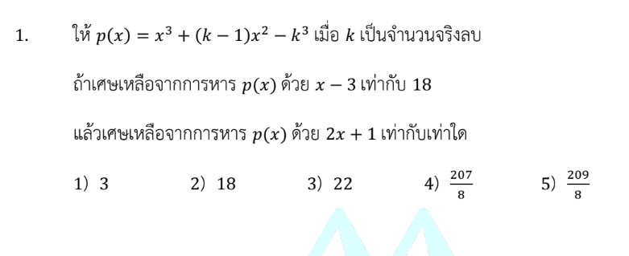

# โจทย์ข้อ 1: พหุนามและทฤษฎีบทเศษเหลือ

โจทย์ข้อ 1 ของวิชาคณิตศาสตร์ประยุกต์ 1 (A-Level) ปี 2566 เป็นเรื่องเกี่ยวกับ **พหุนามและทฤษฎีบทเศษเหลือ (Remainder Theorem)** ครับ ต่อไปนี้เป็นรายละเอียดการแก้โจทย์และเนื้อหาที่เกี่ยวข้องครับ

## **โจทย์ข้อ 1**

กำหนดให้ $f(x) = x^3 + (a - 1)x^2 + a^2x$ โดยที่ $a$ เป็นจำนวนจริงลบ
ถ้าเศษเหลือจากการหาร $f(x)$ ด้วย $x - 3$ เท่ากับ $18$ แล้วเศษเหลือจากการหาร $f(x)$ ด้วย $2x + 1$ เท่ากับเท่าใด

---

### **วิธีทำอย่างละเอียด**

**ขั้นตอนที่ 1: หาค่าของ $a$ จากเงื่อนไขแรก**
จากทฤษฎีบทเศษเหลือ การหาร $f(x)$ ด้วย $x - 3$ แล้วได้เศษ $18$ หมายความว่า **$f(3) = 18$**
แทนค่า $x = 3$ ลงในฟังก์ชัน $f(x)$:
$$f(3) = (3)^3 + (a - 1)(3)^2 + a^2(3) = 18$$
$$27 + 9(a - 1) + 3a^2 = 18$$
$$27 + 9a - 9 + 3a^2 = 18$$
$$18 + 9a + 3a^2 = 18$$
$$3a^2 + 9a = 0$$
แยกตัวประกอบ: $3a(a + 3) = 0$
จะได้ค่า $a = 0$ หรือ $a = -3$
เนื่องจากโจทย์ระบุว่า **$a$ เป็นจำนวนจริงลบ** ดังนั้นค่า $a$ จึงต้องเป็น **$-3$** เท่านั้น

**ขั้นตอนที่ 2: เขียนฟังก์ชัน $f(x)$ ที่สมบูรณ์**
แทนค่า $a = -3$ ลงใน $f(x)$:
$$f(x) = x^3 + (-3 - 1)x^2 + (-3)^2x$$
**$f(x) = x^3 - 4x^2 + 9x$**

**ขั้นตอนที่ 3: หาเศษเหลือจากการหารด้วย $2x + 1$**
ตามทฤษฎีบทเศษเหลือ การหารด้วย $2x + 1$ เศษเหลือคือค่าของ **$f(-\frac{1}{2})$** (หาได้จากจับ $2x + 1 = 0$ แล้วแก้หา $x$)
แทนค่า $x = -\frac{1}{2}$ ลงใน $f(x)$:
$$f(-\frac{1}{2}) = (-\frac{1}{2})^3 - 4(-\frac{1}{2})^2 + 9(-\frac{1}{2})$$
$$= -\frac{1}{8} - 4(\frac{1}{4}) - \frac{9}{2}$$
$$= -\frac{1}{8} - 1 - \frac{9}{2}$$
ทำส่วนให้เท่ากัน (ใช้ส่วนเป็น 8):
$$= -\frac{1}{8} - \frac{8}{8} - \frac{36}{8}$$
**$= -\frac{45}{8}$**

**ตอบ:** ตัวเลือกที่ 4) $-\frac{45}{8}$

---

### **เนื้อหาที่เกี่ยวข้องและสูตรที่สำคัญ**

1. **ทฤษฎีบทเศษเหลือ (Remainder Theorem):**
    * **สูตร:** ถ้าหารพหุนาม $f(x)$ ด้วย $(x - c)$ แล้ว เศษเหลือจะเท่ากับ $f(c)$
    * **กรณีทั่วไป:** ถ้าหาร $f(x)$ ด้วย $(ax + b)$ เศษเหลือจะเท่ากับ $f(-\frac{b}{a})$
2. **ตัวแปรและค่าคงที่:**
    * **$a$:** คือพารามิเตอร์หรือค่าคงที่ที่เราต้องหาจากเงื่อนไขที่โจทย์ให้มา
    * **จำนวนจริงลบ ($a < 0$):** เป็นเงื่อนไขบังคับเพื่อใช้เลือกค่า $a$ กรณีที่แก้สมการได้หลายคำตอบ

### **กลยุทธ์แก้โจทย์ประเภทนี้**

* **เปลี่ยนประโยคภาษาเป็นสมการ:** ทันทีที่เห็นคำว่า "หารด้วย... แล้วเหลือเศษ..." ให้เขียนในรูป $f(c) = R$ ทันที
* **ระวังเรื่องเครื่องหมาย:** จุดที่ผิดบ่อยที่สุดคือการแทนค่า $x$ ที่ติดลบลงในเลขยกกำลัง (เช่น $(-\frac{1}{2})^2$ ต้องได้ค่าบวก)
* **ตรวจสอบเงื่อนไข $a$:** โจทย์ A-Level มักให้เงื่อนไขเพิ่มเติม เช่น "จำนวนจริงลบ" หรือ "จำนวนเต็ม" เพื่อดักคนที่ไม่รอบคอบ

---

### **ตัวอย่างโจทย์เพิ่มเติมเพื่อฝึกทำ**

**โจทย์ฝึกหัด:**
ให้ $g(x) = x^3 + kx^2 - 4$ ถ้าหาร $g(x)$ ด้วย $x - 2$ แล้วเหลือเศษ 8 จงหาเศษเมื่อหาร $g(x)$ ด้วย $x + 1$

**เฉลย:**

1. **หา $k$:** จาก $g(2) = 8$ จะได้ $(2)^3 + k(2)^2 - 4 = 8$
    $8 + 4k - 4 = 8 \Rightarrow 4k = 4 \Rightarrow k = 1$
2. **ฟังก์ชันคือ:** $g(x) = x^3 + x^2 - 4$
3. **หาเศษเมื่อหารด้วย $x+1$:** คือการหา $g(-1)$
    $g(-1) = (-1)^3 + (-1)^2 - 4 = -1 + 1 - 4 = -4$
**ตอบ:** $-4$

---
จากการศึกษาวิธีการแก้โจทย์จากแหล่งข้อมูล โดยเฉพาะโจทย์ข้อ 1 ในข้อสอบ A-Level คณิตศาสตร์ 1 ปี 2566 สามารถสรุปเทคนิคการหาค่าตัวแปรคงที่ (เช่น ค่า $a$) จากทฤษฎีบทเศษเหลือได้ดังนี้ครับ

### **1. การเปลี่ยนประโยคเงื่อนไขเป็นสมการคณิตศาสตร์**

หัวใจสำคัญของทฤษฎีบทเศษเหลือคือการเปลี่ยนข้อความที่ว่า **"พหุนาม $f(x)$ หารด้วย $(x - c)$ แล้วเหลือเศษ $R$"** ให้กลายเป็นสมการ **$f(c) = R$**

* **เทคนิคการหาค่า $c$:** ให้จับตัวหารเท่ากับ 0 เช่น ถ้าหารด้วย $x - 3$ ให้ใช้ $c = 3$ หรือถ้าหารด้วย $2x + 1$ ให้ใช้ $c = -\frac{1}{2}$

### **2. ขั้นตอนการคำนวณเพื่อหาค่า $a$**

เมื่อได้สมการ $f(c) = R$ แล้ว ให้ดำเนินการตามลำดับดังนี้:

* **แทนค่า:** นำค่า $c$ ที่หาได้ไปแทนในทุกๆ ตำแหน่งของตัวแปร $x$ ในฟังก์ชัน $f(x)$ ที่โจทย์กำหนดมาให้ ซึ่งมักจะมีตัวแปร $a$ ติดอยู่
* **สร้างสมการ:** จับผลลัพธ์ที่ได้จากการแทนค่าให้เท่ากับเศษ $R$ ที่โจทย์ระบุ
* **แก้สมการพหุนาม:** จัดรูปสมการเพื่อหาค่า $a$ ในโจทย์ระดับ A-Level มักจะออกมาเป็นสมการกำลังสอง ซึ่งอาจได้คำตอบมากกว่า 1 ค่า

### **3. การใช้เงื่อนไขบังคับ (Constraints)**

โจทย์มักจะให้เงื่อนไขเพิ่มเติมเพื่อบีบให้เราเลือกค่า $a$ ที่ถูกต้องเพียงค่าเดียว

* **ตัวอย่างจากแหล่งข้อมูล:** ในโจทย์ข้อ 1 ระบุว่า **"$a$ เป็นจำนวนจริงลบ"** เมื่อเราแก้สมการได้ $a = 0$ หรือ $a = -3$ เราจึงต้องเลือกใช้ $a = -3$ เท่านั้นในการคำนวณขั้นต่อไป

### **4. กลยุทธ์ "ทำซ้ำ" เพื่อหาคำตอบสุดท้าย**

โจทย์มักไม่ได้ถามหาค่า $a$ ตรงๆ แต่จะใช้ค่า $a$ ที่หาได้ไปสร้างฟังก์ชัน $f(x)$ ที่สมบูรณ์ เพื่อให้เราหาเศษจากการหารด้วยตัวหารอีกตัวหนึ่ง

* **ขั้นตอน:** เมื่อได้ค่า $a$ แล้ว ให้เขียนฟังก์ชัน $f(x)$ ใหม่โดยไม่มีตัวแปร $a$ ค้างอยู่ จากนั้นจึงใช้ทฤษฎีบทเศษเหลือซ้ำอีกรอบกับตัวหารที่โจทย์ถามหา (เช่น การหา $f(-\frac{1}{2})$ หลังจากรู้ค่า $a$ แล้ว)

**ข้อควรระวัง:** ระหว่างการแก้สมการเพื่อหาค่า $a$ ควรระมัดระวังเรื่อง**เครื่องหมาย**และการ**ยกกำลัง** โดยเฉพาะเมื่อต้องแทนค่า $x$ ที่เป็นจำนวนลบหรือเศษส่วน ซึ่งเป็นจุดที่ผิดได้ง่ายที่สุดในห้องสอบครับ
