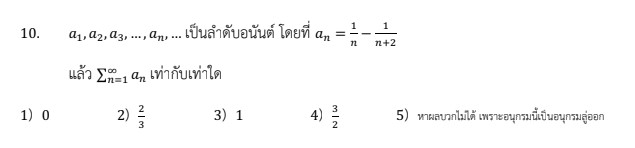

# เฉลยข้อ 10 คณิตศาสตร์ประยุกต์ 1 (A-Level) ปี 2566

การแก้โจทย์ข้อ 10 ของวิชาคณิตศาสตร์ประยุกต์ 1 (A-Level) ปี 2566 เป็นเรื่องเกี่ยวกับ **ลำดับและอนุกรม (Sequences and Series)** โดยเฉพาะการหาผลบวกของ **อนุกรมเทเลสโกปิก (Telescoping Series)** ซึ่งมีลักษณะพิเศษที่พจน์ต่าง ๆ จะตัดกันเองจนเหลือเพียงพจน์แรกและพจน์สุดท้ายครับ

## **เฉลยละเอียดโจทย์ข้อ 10**

**โจทย์:** กำหนดให้ $a_1, a_2, a_3, \dots, a_n, \dots$ เป็นลำดับอนันต์ โดยที่ $a_n = \frac{1}{n} - \frac{1}{n+1}$ แล้วค่าของ $\sum_{n=1}^{\infty} a_n$ เท่ากับเท่าใด

---

**วิธีทำอย่างละเอียด:**

**ขั้นตอนที่ 1: เขียนพจน์ต่าง ๆ ของลำดับออกมา**
จากสูตรพจน์ทั่วไป $a_n = \frac{1}{n} - \frac{1}{n+1}$ เราลองแทนค่า $n$ ตั้งแต่ 1 เป็นต้นไป:

* เมื่อ $n = 1$ จะได้ $a_1 = \frac{1}{1} - \frac{1}{2}$
* เมื่อ $n = 2$ จะได้ $a_2 = \frac{1}{2} - \frac{1}{3}$
* เมื่อ $n = 3$ จะได้ $a_3 = \frac{1}{3} - \frac{1}{4}$
* ...
* เมื่อ $n = k$ จะได้ $a_k = \frac{1}{k} - \frac{1}{k+1}$

**ขั้นตอนที่ 2: พิจารณาผลบวกย่อย $k$ พจน์แรก ($S_k$)**
นำพจน์ที่เขียนไว้ข้างต้นมาบวกกัน:
$S_k = a_1 + a_2 + a_3 + \dots + a_k$
$S_k = \left( 1 - \frac{1}{2} \right) + \left( \frac{1}{2} - \frac{1}{3} \right) + \left( \frac{1}{3} - \frac{1}{4} \right) + \dots + \left( \frac{1}{k} - \frac{1}{k+1} \right)$

**ขั้นตอนที่ 3: การหักล้างกันของพจน์ (Telescoping Effect)**
สังเกตว่าพจน์หลังของวงเล็บแรก ($-\frac{1}{2}$) จะหักล้างกับพจน์หน้าของวงเล็บถัดไป ($+\frac{1}{2}$) เป็นคู่ ๆ ไปเรื่อย ๆ:
$S_k = 1 \underbrace{- \frac{1}{2} + \frac{1}{2}}_{0} \underbrace{- \frac{1}{3} + \frac{1}{3}}_{0} \dots \underbrace{- \frac{1}{k} + \frac{1}{k}}_{0} - \frac{1}{k+1}$
จะได้ผลบวกย่อยคือ **$S_k = 1 - \frac{1}{k+1}$**

**ขั้นตอนที่ 4: หาผลบวกอนันต์โดยการเทคลิมิต**
ผลบวกอนันต์หาได้จาก $\lim_{k \to \infty} S_k$:
$\sum_{n=1}^{\infty} a_n = \lim_{k \to \infty} \left( 1 - \frac{1}{k+1} \right)$
เนื่องจากเมื่อ $k$ มีค่าเข้าใกล้ Changes $\infty$ ค่าของ $\frac{1}{k+1}$ จะเข้าใกล้ **0**
ดังนั้น ผลบวกจึงเท่ากับ $1 - 0 = \mathbf{1}$

**ตอบ:** 1 (ตรงกับตัวเลือกที่ 3)

---

### **เนื้อหาที่เกี่ยวข้องเพื่อศึกษาเพิ่มเติม**

**1. อนุกรมเทเลสโกปิก (Telescoping Series):**
คืออนุกรมที่พจน์ทั่วไปสามารถแยกเป็น **"ผลต่าง"** ของสองพจน์ที่อยู่ติดกันได้ เมื่อนำมาบวกกัน พจน์ตรงกลางจะหักล้างกันหมด เหลือเพียงพจน์แรกสุดและพจน์สุดท้าย

**2. ความหมายของตัวแปรและสัญลักษณ์:**

* **$a_n$:** พจน์ทั่วไป (General Term) ของลำดับ
* **$\sum_{n=1}^{\infty}$:** สัญลักษณ์ซิกมา แทนการบวกพจน์ตั้งแต่ $n=1$ ไปจนถึงอนันต์ (Infinity)
* **$n$:** ดัชนีหรือลำดับที่ของพจน์ เป็นจำนวนเต็มบวกเสมอ

### **กลยุทธ์แก้โจทย์ประเภทนี้**

* **จัดรูปพจน์ทั่วไป:** หากโจทย์ให้พจน์มาในรูปเศษส่วนพหุนามคูณกัน เช่น $\frac{1}{n(n+1)}$ ให้ใช้ **การแยกเศษส่วนย่อย (Partial Fraction)** เพื่อให้อยู่ในรูปผลต่างก่อน (ซึ่งข้อนี้โจทย์ใจดีจัดรูปมาให้แล้ว)
* **สังเกตการตัดกัน:** ลองเขียนผลรวมพจน์ 3-4 พจน์แรกดูว่าพจน์ไหนตัดกับพจน์ไหน เพื่อหาความสัมพันธ์ของพจน์ที่เหลืออยู่
* **เช็คการลู่ออก:** หากพจน์สุดท้ายที่เหลืออยู่ (หลังจากตัดกันแล้ว) ไม่มีลิมิตหรือลิมิตเป็นอนันต์ อนุกรมนั้นจะลู่ออก (Divergent) และหาผลบวกไม่ได้

---

### **ตัวอย่างโจทย์เพิ่มเติมเพื่อฝึกทำ**

**โจทย์:** จงหาผลบวกของอนุกรม $\sum_{n=1}^{\infty} \frac{1}{(n+1)(n+2)}$

**เฉลย:**

1. แยกเศษส่วนย่อย: $\frac{1}{(n+1)(n+2)} = \frac{1}{n+1} - \frac{1}{n+2}$
2. แทนค่า $n$:
    * $n=1 \rightarrow \frac{1}{2} - \frac{1}{3}$
    * $n=2 \rightarrow \frac{1}{3} - \frac{1}{4}$
3. รวมพจน์: $(\frac{1}{2} - \frac{1}{3}) + (\frac{1}{3} - \frac{1}{4}) + \dots + (\frac{1}{k+1} - \frac{1}{k+2})$
4. พจน์กลางตัดกัน เหลือ $S_k = \frac{1}{2} - \frac{1}{k+2}$
5. เทคลิมิต $k \to \infty$: จะได้ $\frac{1}{2} - 0 = \frac{1}{2}$
**ตอบ:** $1/2$

การฝึกมองหาคู่หักล้างจะทำให้คุณทำโจทย์เรื่องอนุกรมอนันต์ใน A-Level ได้อย่างรวดเร็วและแม่นยำครับ
