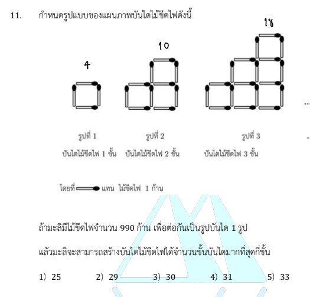

# การแก้โจทย์ข้อ 11 ของวิชาคณิตศาสตร์ประยุกต์ 1 (A-Level) ปี 2566 เป็นเรื่องเกี่ยวกับ **ลำดับและอนุกรม (Sequences and Series)** โดยเฉพาะการหาความสัมพันธ์ของรูปแบบ (Pattern Recognition) เพื่อสร้างพจน์ทั่วไปของลำดับครับ

## **เฉลยละเอียดโจทย์ข้อ 11**

**โจทย์:** กำหนดรูปแบบแผนภาพบันไดไม้ขีดไฟ โดยรูปที่ 1 มี 1 ขั้น, รูปที่ 2 มี 2 ขั้น, รูปที่ 3 มี 3 ขั้น หากมะลิมีไม้ขีดไฟ 990 ก้าน จะสร้างบันไดได้มากที่สุดกี่ขั้น

---

**วิธีทำอย่างละเอียด:**

### ขั้นตอนที่ 1: นับจำนวนไม้ขีดไฟในแต่ละรูปเพื่อหารูปแบบ

* **รูปที่ 1 (1 ขั้น):** ใช้ไม้ขีดไฟ **4** ก้าน
* **รูปที่ 2 (2 ขั้น):** ใช้ไม้ขีดไฟ **10** ก้าน
* **รูปที่ 3 (3 ขั้น):** ใช้ไม้ขีดไฟ **18** ก้าน

**ขั้นตอนที่ 2: สร้างสูตรพจน์ทั่วไป ($a_n$)**
พิจารณาความสัมพันธ์ของจำนวนขั้น ($n$) กับจำนวนไม้ขีดไฟ:

* $n=1 \rightarrow 1^2 + 3(1) = 1 + 3 = 4$
* $n=2 \rightarrow 2^2 + 3(2) = 4 + 6 = 10$
* $n=3 \rightarrow 3^2 + 3(3) = 9 + 9 = 18$
สังเกตได้ว่าจำนวนไม้ขีดไฟที่ต้องใช้สำหรับบันได $n$ ขั้น คือ **$a_n = n^2 + 3n$**

**ขั้นตอนที่ 3: แก้สมการหาจำนวนขั้นสูงสุด**
โจทย์กำหนดให้มีไม้ขีดไฟ 990 ก้าน ดังนั้น:
$$n^2 + 3n \leq 990$$
$$n^2 + 3n - 990 \leq 0$$
แยกตัวประกอบพหุนาม:
$$(n + 33)(n - 30) \leq 0$$
เนื่องจาก $n$ ต้องเป็นจำนวนเต็มบวก จะได้ว่าค่า $n$ ที่เป็นไปได้คือ $0 < n \leq 30$

**ขั้นตอนที่ 4: ตรวจสอบคำตอบ**
หากสร้างบันได 30 ขั้น จะใช้ไม้ขีดไฟ:
$30^2 + 3(30) = 900 + 90 = 990$ ก้าน พอดี

**ตอบ:** 30 ขั้น (ตรงกับตัวเลือกที่ 3)

---

### **เนื้อหาที่เกี่ยวข้องเพื่อศึกษาเพิ่มเติม**

**1. ลำดับพหุนาม (Polynomial Sequences):**
เป็นลำดับที่พจน์ทั่วไปอยู่ในรูปพหุนามดีกรีต่าง ๆ ในข้อนี้เป็น **ลำดับพหุนามดีกรีสอง (Quadratic Sequence)** เนื่องจากผลต่างของจำนวนไม้ขีดไฟในแต่ละขั้นเพิ่มขึ้นอย่างคงที่ในชั้นที่สอง (Second Difference)

* ผลต่างชั้นที่ 1: $10-4=6, 18-10=8, \dots$ (เพิ่มทีละ 2)
* ผลต่างชั้นที่ 2: $8-6=2$ (คงที่)

**2. ความหมายของตัวแปร:**

* **$n$:** แทนจำนวนชั้นของบันได หรือลำดับที่ของรูปภาพ
* **$a_n$:** แทนจำนวนไม้ขีดไฟทั้งหมดที่ต้องใช้ในการสร้างบันได $n$ ชั้น

### **กลยุทธ์แก้โจทย์ประเภทนี้**

* **เขียนตารางค่า:** จดบันทึกค่าที่นับได้จากรูปภาพอย่างน้อย 3-4 พจน์แรก เพื่อดูแนวโน้มการเพิ่มขึ้น
* **หาผลต่าง (Differences):** หากผลต่างชั้นแรกคงที่ แสดงว่าเป็นลำดับเลขคณิต (ดีกรี 1) หากผลต่างชั้นที่สองคงที่ แสดงว่าเป็นลำดับดีกรี 2
* **ใช้ตัวเลือกช่วย (Trial and Error):** ในห้องสอบหากไม่แน่ใจสูตร สามารถนำตัวเลือก $n$ ในโจทย์ไปแทนค่าในรูปแบบที่สังเกตได้ (เช่น $n(n+3)$) เพื่อหาค่าที่ใกล้เคียง 990 ที่สุด

---

### **ตัวอย่างโจทย์เพิ่มเติมเพื่อฝึกทำ**

**โจทย์:** รูปแบบหนึ่งประกอบด้วยจุด โดยรูปที่ 1 มี 3 จุด, รูปที่ 2 มี 8 จุด, รูปที่ 3 มี 15 จุด ตามลำดับ หากมีจุดทั้งหมด 440 จุด จะสร้างรูปตามรูปแบบนี้ได้เป็นรูปที่เท่าใด

**เฉลย:**

1. **หารูปแบบ:** สังเกตว่า $a_1 = 3, a_2 = 8, a_3 = 15$
2. **สร้างสูตร:** พจน์ทั่วไปคือ $a_n = n^2 + 2n$ (ตรวจสอบ: $1^2+2=3, 2^2+4=8, 3^2+6=15$)
3. **ตั้งสมการ:** $n^2 + 2n = 440 \Rightarrow n^2 + 2n - 440 = 0$
4. **แก้สมการ:** $(n + 22)(n - 20) = 0$
5. **คำตอบ:** $n = 20$
**ตอบ:** รูปที่ 20

การหมั่นสังเกตความสัมพันธ์ของตัวเลขจะช่วยให้คุณสร้างสูตรพจน์ทั่วไปได้แม่นยำขึ้นครับ
