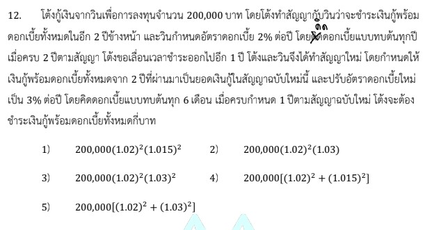

# การแก้โจทย์ข้อ 12 ของวิชาคณิตศาสตร์ประยุกต์ 1 (A-Level) ปี 2566 เป็นเรื่องเกี่ยวกับ **คณิตศาสตร์การเงิน (Financial Mathematics)** โดยเฉพาะเรื่อง **ดอกเบี้ยทบต้น (Compound Interest)** ซึ่งมีการเปลี่ยนแปลงเงื่อนไขของสัญญาในระหว่างทางครับ

## **โจทย์ข้อ 12**

โต้งกู้เงินจากวิน 200,000 บาท สัญญาแรกชำระคืนในอีก 2 ปีข้างหน้า อัตราดอกเบี้ย 2% ต่อปี ทบต้นทุกปี เมื่อครบ 2 ปี โต้งขอเลื่อนเวลาออกไปอีก 1 ปี จึงทำสัญญาใหม่โดยใช้ยอดเงินกู้เดิมพร้อมดอกเบี้ยจาก 2 ปีแรกเป็นเงินต้นใหม่ และปรับดอกเบี้ยเป็น 3% ต่อปี ทบต้นทุก 6 เดือน เมื่อครบกำหนด 1 ปีตามสัญญาใหม่ โต้งจะต้องชำระเงินทั้งหมดกี่บาท

---

### **วิธีทำอย่างละเอียด**

การคำนวณจะแบ่งออกเป็น **2 ช่วง** ตามเงื่อนไขของสัญญาดังนี้ครับ:

#### ช่วงที่ 1: สัญญาเดิม (2 ปีแรก)

* **เงินต้น ($P$):** 200,000 บาท
* **อัตราดอกเบี้ย ($r$):** 2% ต่อปี หรือ $0.02$
* **ระยะเวลา ($n$):** 2 ปี (ทบต้นทุกปี คือทบ 2 ครั้ง)
* **สูตรเงินรวม:** $S = P(1 + r)^n$
* **ยอดเงินรวมเมื่อจบปีที่ 2 ($P_{ใหม่}$):** $200,000(1 + 0.02)^2 = \mathbf{200,000(1.02)^2}$ บาท

#### ช่วงที่ 2: สัญญาใหม่ (ปีที่ 3)

* **เงินต้นใหม่:** ใช้ยอดจากช่วงแรกคือ $200,000(1.02)^2$ บาท
* **อัตราดอกเบี้ย:** 3% ต่อปี
* **การทบต้น:** ทุก 6 เดือน (แสดงว่า 1 ปี ทบดอกเบี้ย **2 ครั้ง**)
* **ดอกเบี้ยต่องวด ($i$):** $3\% / 2 = 1.5\%$ หรือ $0.015$
* **จำนวนงวดที่ทบ ($k$):** 2 งวด (เนื่องจากเลื่อนออกไป 1 ปี และทบทุก 6 เดือน)
* **คำนวณเงินรวมสุดท้าย:**
    $$\text{เงินรวม} = \text{เงินต้นใหม่} \times (1 + i)^k$$
    $$\text{เงินรวม} = [200,000(1.02)^2] \times (1 + 0.015)^2$$
    $$\text{เงินรวม} = \mathbf{200,000(1.02)^2(1.015)^2}$$

**ตอบ:** ตัวเลือกที่ 1) $200,000(1.02)^2(1.015)^2$

---

### **เนื้อหาที่เกี่ยวข้องเพื่อศึกษาเพิ่มเติม**

**1. สูตรดอกเบี้ยทบต้น (Compound Interest Formula):**
$$A = P(1 + \frac{r}{k})^{kn}$$

* **$A$ (Amount):** เงินรวม (เงินต้น + ดอกเบี้ย)
* **$P$ (Principal):** เงินต้นเริ่มแรก
* **$r$ (Annual interest rate):** อัตราดอกเบี้ยต่อปี (ทำเป็นทศนิยมเสมอ)
* **$k$ (Compounding periods):** จำนวนครั้งที่ทบดอกเบี้ยใน 1 ปี (เช่น ทบทุกเดือน $k=12$, ทุก 6 เดือน $k=2$)
* **$n$ (Number of years):** จำนวนปีที่ฝากหรือกู้

**2. ที่มาของตัวแปรในโจทย์:**

* **$1.02$:** มาจาก $1 + 0.02$ (ดอกเบี้ย 2% ต่อปี ทบปีละครั้ง)
* **$1.015$:** มาจาก $1 + (0.03 / 2)$ เนื่องจากดอกเบี้ย 3% ต้องหารด้วย 2 เพราะทบทุกครึ่งปี

### **กลยุทธ์แก้โจทย์ประเภทนี้**

* **แยกช่วงเวลา:** หากมีการเปลี่ยนสัญญาหรือเปลี่ยนดอกเบี้ย ให้คำนวณเงินรวมของช่วงแรกให้จบก่อน แล้วนำเงินรวมนั้นมาเป็น "เงินต้นใหม่" ของช่วงถัดไป
* **ระวังคำว่า "ทบต้นทุก..." :** นี่คือจุดที่ใช้เปลี่ยนค่า $k$ ในสูตร ถ้าทบทุก 6 เดือน ต้องหารดอกเบี้ยรายปีด้วย 2 และคูณจำนวนปีด้วย 2 เพื่อหาจำนวนงวดทั้งหมด
* **คงรูปเลขยกกำลัง:** โจทย์ A-Level มักไม่อยากให้เราเสียเวลาคิดเลขจำนวนมาก มักจะติดค่าในรูป $(1 + i)^n$ ไว้ในตัวเลือก ดังนั้นไม่ต้องรีบคูณเลขจนสุดทาง

---

### **ตัวอย่างโจทย์เพิ่มเติมเพื่อฝึกทำ**

**โจทย์:** มะนาวกู้เงิน 100,000 บาท ดอกเบี้ย 4% ต่อปี ทบต้นทุกไตรมาส (3 เดือน) เป็นเวลา 1 ปี หลังจากนั้นธนาคารปรับลดดอกเบี้ยเหลือ 2% ต่อปี ทบต้นทุกปี มะนาวขอส่งต่ออีก 2 ปี เมื่อครบกำหนดทั้งหมดมะนาวต้องจ่ายเงินรวมเท่าใด

**เฉลย:**

1. **ปีแรก (ทบต้นทุกไตรมาส):** ดอกเบี้ย $4\%/4 = 1\%$ ต่อไตรมาส, จำนวนงวด = 4 งวด
    * เงินรวมปีแรก = $100,000(1.01)^4$
2. **สองปีต่อมา (ทบต้นทุกปี):** ดอกเบี้ย 2% ต่อปี, จำนวนงวด = 2 ปี
    * เงินรวมสุดท้าย = $[100,000(1.01)^4] \times (1.02)^2$
**ตอบ:** $100,000(1.01)^4(1.02)^2$ บาท

การฝึกมองจำนวนงวด ($k \times n$) ให้แม่นยำจะช่วยให้ไม่พลาดในโจทย์การเงินครับ
