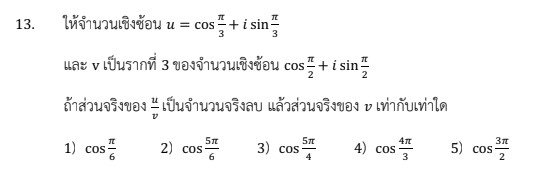

# การแก้โจทย์ข้อ 13 ในวิชาคณิตศาสตร์ประยุกต์ 1 (A-Level) ปี 2566 เป็นเรื่องเกี่ยวกับ **จำนวนเชิงซ้อน (Complex Numbers)** ในรูปเชิงขั้ว (Polar Form) และการหา **รากที่ n** ของจำนวนเชิงซ้อนครับ,

## **โจทย์ข้อ 13**

กำหนดให้จำนวนเชิงซ้อน $z = \cos \frac{4\pi}{9} + i \sin \frac{4\pi}{9}$ และ $w$ เป็นรากที่ 3 ของจำนวนเชิงซ้อน $\cos \frac{4\pi}{3} + i \sin \frac{4\pi}{3}$
ถ้าส่วนจริงของ $zw$ เป็นจำนวนจริงลบ แล้วส่วนจริงของ $w$ เท่ากับเท่าใด,

---

### **วิธีทำอย่างละเอียด**

**ขั้นตอนที่ 1: จัดรูป $z$ และหาค่า $w$ ที่เป็นไปได้**

1. จากโจทย์ $z = \text{cis} \frac{4\pi}{9}$ (ใช้สัญลักษณ์ $\text{cis} \theta$ แทน $\cos \theta + i \sin \theta$ เพื่อความรวดเร็ว)
2. หา $w$ ซึ่งเป็นรากที่ 3 ของ $w_0 = \text{cis} \frac{4\pi}{3}$ โดยใช้ทฤษฎีบทของเดอมัวร์สำหรับการหาราก:
    $$w_k = \text{cis} \left( \frac{\frac{4\pi}{3} + 2k\pi}{3} \right) \text{ เมื่อ } k = 0, 1, 2$$
3. คำนวณค่า $w$ ทั้ง 3 ค่า:
    * เมื่อ $k=0: w_0 = \text{cis} \left( \frac{4\pi}{9} \right)$
    * เมื่อ $k=1: w_1 = \text{cis} \left( \frac{4\pi + 6\pi}{9} \right) = \text{cis} \frac{10\pi}{9}$
    * เมื่อ $k=2: w_2 = \text{cis} \left( \frac{4\pi + 12\pi}{9} \right) = \text{cis} \frac{16\pi}{9}$

**ขั้นตอนที่ 2: ตรวจสอบเงื่อนไข "ส่วนจริงของ $zw$ เป็นจำนวนจริงลบ"**
ใช้สมบัติการคูณจำนวนเชิงซ้อนรูปเชิงขั้ว: $\text{cis} \theta_1 \cdot \text{cis} \theta_2 = \text{cis}(\theta_1 + \theta_2)$ และส่วนจริงคือค่า $\cos$

* **กรณีที่ 1 ($w_0$):** $zw_0 = \text{cis} \frac{4\pi}{9} \cdot \text{cis} \frac{4\pi}{9} = \text{cis} \frac{8\pi}{9}$
  * พิจารณามุม $\frac{8\pi}{9}$ อยู่ใน **จตุภาคที่ 2** (Quadrant II) เพราะ $\frac{\pi}{2} < \frac{8\pi}{9} < \pi$
  * ใน QII ค่า $\cos$ (ส่วนจริง) เป็น **ลบ** ซึ่งสอดคล้องกับเงื่อนไขโจทย์
* **กรณีที่ 2 ($w_1$):** $zw_1 = \text{cis} \frac{4\pi}{9} \cdot \text{cis} \frac{10\pi}{9} = \text{cis} \frac{14\pi}{9}$ (อยู่ใน QIV ค่า $\cos$ เป็นบวก)
* **กรณีที่ 3 ($w_2$):** $zw_2 = \text{cis} \frac{4\pi}{9} \cdot \text{cis} \frac{16\pi}{9} = \text{cis} \frac{20\pi}{9} = \text{cis} \frac{2\pi}{9}$ (อยู่ใน QI ค่า $\cos$ เป็นบวก)

**ขั้นตอนที่ 3: สรุปคำตอบ**
ค่า $w$ ที่ถูกต้องคือ $w_0 = \text{cis} \frac{4\pi}{9}$ ซึ่งมีส่วนจริงคือ **$\cos \frac{4\pi}{9}$**,

**ตอบ:** ตัวเลือกที่ 1) $\cos \frac{4\pi}{9}$

---

### **เนื้อหาที่เกี่ยวข้องเพื่อศึกษาเพิ่มเติม**

**1. สูตรและนิยามที่สำคัญ:**

* **รูปเชิงขั้ว:** $z = r(\cos \theta + i \sin \theta) = r \text{cis} \theta$
* **การคูณเชิงขั้ว:** $z_1 \cdot z_2 = r_1 r_2 \text{cis}(\theta_1 + \theta_2)$
* **การหารากที่ n:** $w_k = \sqrt[n]{r} \text{cis} \left( \frac{\theta + 2k\pi}{n} \right)$ เป็นการแบ่งมุมออกเป็น $n$ ส่วนเท่าๆ กันรอบวงกลม

**2. ความหมายของตัวแปร:**

* **$\theta$ (อาร์กิวเมนต์):** มุมที่ทำกับแกนจริงในทิศทวนเข็มนาฬิกา
* **$k$:** ตัวแปรที่ระบุลำดับของราก โดยรากที่ $n$ จะมีรากที่แตกต่างกันทั้งหมด $n$ ค่าเสมอ

### **กลยุทธ์แก้โจทย์ประเภทนี้**

* **ใช้รูปเชิงขั้วเสมอ:** เมื่อเห็นโจทย์ที่มีฟังก์ชัน $\cos$ และ $\sin$ ผสมกับ $i$ ให้ยุบเป็น $\text{cis} \theta$ ทันทีเพื่อความง่ายในการคูณและหาราก
* **เช็คจตุภาค (Quadrant):** การวิเคราะห์ว่าค่าจริงหรือจินตภาพเป็นบวกหรือลบ ให้ดูที่ตำแหน่งของมุม:
  * **ส่วนจริงเป็นลบ:** มุมต้องตกอยู่ในจตุภาคที่ 2 หรือ 3
  * **ส่วนจินตภาพเป็นลบ:** มุมต้องตกอยู่ในจตุภาคที่ 3 หรือ 4
* **บวก $2k\pi$:** อย่าลืมบวกพจน์นี้ก่อนหารด้วย $n$ เพื่อหาค่ารากอื่นๆ ให้ครบ

---

### **ตัวอย่างโจทย์เพิ่มเติมเพื่อฝึกทำ**

**โจทย์:** จงหาค่า $w$ ที่เป็นรากที่ 2 ของ $i$ โดยที่ส่วนจินตภาพของ $w$ เป็นจำนวนจริงลบ

**เฉลย:**

1. เปลี่ยน $i$ เป็นเชิงขั้ว: $i = \text{cis} \frac{\pi}{2}$
2. หารากที่ 2: $w_k = \text{cis} \left( \frac{\pi/2 + 2k\pi}{2} \right)$
    * $k=0: w_0 = \text{cis} \frac{\pi}{4}$ (ส่วนจินตภาพ $\sin \frac{\pi}{4}$ เป็นบวก)
    * $k=1: w_1 = \text{cis} \frac{5\pi}{4}$ (อยู่ใน QIII ส่วนจินตภาพ $\sin \frac{5\pi}{4}$ เป็นลบ)
3. **ตอบ:** $w = \cos \frac{5\pi}{4} + i \sin \frac{5\pi}{4}$

การฝึกฝนการวาดตำแหน่งมุมบนระนาบเชิงซ้อนจะช่วยให้คุณทำโจทย์แนวนี้ได้รวดเร็วขึ้นมากครับ
