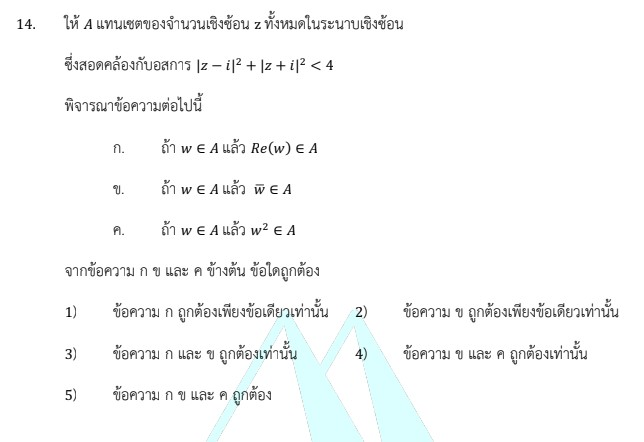

# การแก้โจทย์ข้อ 14 วิชาคณิตศาสตร์ประยุกต์ 1 (A-Level) ปี 2566

การแก้โจทย์ข้อ 14 ของวิชาคณิตศาสตร์ประยุกต์ 1 (A-Level) ปี 2566 เป็นเรื่องเกี่ยวกับ **จำนวนเชิงซ้อน (Complex Numbers)** โดยเน้นการวิเคราะห์สมบัติของเซตบนระนาบเชิงซ้อนผ่านอสมการของค่าสัมบูรณ์ครับ

## **เฉลยละเอียดโจทย์ข้อ 14**

**โจทย์:** ให้ $A$ แทนเซตของจำนวนเชิงซ้อน $z$ ทั้งหมดในระนาบเชิงซ้อน ซึ่งสอดคล้องกับอสมการ $|z - i|^2 + |z + i|^2 < 4$ พิจารณาข้อความต่อไปนี้:
ก. ถ้า $z \in A$ แล้ว $Re(z) \in A$
ข. ถ้า $z \in A$ แล้ว $\bar{z} \in A$
ค. ถ้า $z \in A$ แล้ว $z^2 \in A$

---

**วิธีทำอย่างละเอียด:**

**ขั้นตอนที่ 1: จัดรูปอสมการเพื่อหาลักษณะของเซต $A$**
สมมติให้ $z = x + yi$ โดยที่ $x, y \in \mathbb{R}$
แทนค่าลงในอสมการ $|z - i|^2 + |z + i|^2 < 4$:

1. $|x + (y - 1)i|^2 + |x + (y + 1)i|^2 < 4$
2. ใช้สมบัติ $|a + bi|^2 = a^2 + b^2$:
    $[x^2 + (y - 1)^2] + [x^2 + (y + 1)^2] < 4$
3. กระจายกำลังสองสมบูรณ์:
    $(x^2 + y^2 - 2y + 1) + (x^2 + y^2 + 2y + 1) < 4$
4. รวมพจน์ที่เหมือนกัน:
    $2x^2 + 2y^2 + 2 < 4$
    $2x^2 + 2y^2 < 2$
    **$x^2 + y^2 < 1$**
ซึ่งหมายความว่า **$|z| < 1$** (เซต $A$ คือจุดทั้งหมดภายในวงกลมหนึ่งหน่วยที่มีจุดศูนย์กลางที่จุดกำเนิด)

**ขั้นตอนที่ 2: พิจารณาข้อความ ก. (ถ้า $z \in A$ แล้ว $Re(z) \in A$)**

* จาก $z \in A$ จะได้ $x^2 + y^2 < 1$
* ส่วนจริงของ $z$ คือ $Re(z) = x$
* พิจารณาว่า $x$ อยู่ใน $A$ หรือไม่: ต้องเช็คว่า $|x| < 1$ หรือ $x^2 < 1$ หรือไม่
* เนื่องจาก $y^2 \geq 0$ เสมอ ดังนั้น $x^2 \leq x^2 + y^2$
* จาก $x^2 + y^2 < 1$ จึงสรุปได้ว่า $x^2 < 1$ ด้วย
* ดังนั้น **ข้อความ ก. ถูกต้อง**

**ขั้นตอนที่ 3: พิจารณาข้อความ ข. (ถ้า $z \in A$ แล้ว $\bar{z} \in A$)**

* จาก $z \in A$ จะได้ $|z| < 1$
* ใช้สมบัติของสังยุค (Conjugate): $|\bar{z}| = |z|$
* จะได้ $|\bar{z}| < 1$ ด้วย ซึ่งหมายถึง $\bar{z} \in A$
* ดังนั้น **ข้อความ ข. ถูกต้อง**

**ขั้นตอนที่ 4: พิจารณาข้อความ ค. (ถ้า $z \in A$ แล้ว $z^2 \in A$)**

* จาก $z \in A$ จะได้ $|z| < 1$
* พิจารณา $|z^2|$: จากสมบัติ $|z^n| = |z|^n$ จะได้ $|z^2| = |z|^2$
* เนื่องจาก $0 \leq |z| < 1$ เมื่อนำมายกกำลังสองจะได้ $0 \leq |z|^2 < 1$ เช่นกัน
* เมื่อ $|z^2| < 1$ แสดงว่า $z^2 \in A$
* ดังนั้น **ข้อความ ค. ถูกต้อง**

**ตอบ:** ข้อความ **ก, ข และ ค ถูกต้อง** (ตรงกับตัวเลือกที่ 5)

---

### **เนื้อหาที่เกี่ยวข้องเพื่อศึกษาเพิ่มเติม**

**1. สมบัติของค่าสัมบูรณ์ (Modulus) ของจำนวนเชิงซ้อน:**

* $|z|^2 = z \cdot \bar{z}$
* $|z| = |\bar{z}|$
* $|z_1 \cdot z_2| = |z_1| \cdot |z_2|$
* $|z^n| = |z|^n$

**2. ความหมายของตัวแปรและค่าคงที่:**

* **$Re(z)$:** ส่วนจริงของจำนวนเชิงซ้อน (ค่าบนแกน $X$)
* **$\bar{z}$:** สังยุคของจำนวนเชิงซ้อน (การสะท้อนจุดข้ามแกน $X$)
* **$|z| < r$:** พื้นที่ภายในวงกลมรัศมี $r$ รอบจุดกำเนิด

### **กลยุทธ์แก้โจทย์ประเภทนี้**

* **เปลี่ยนจากเรขาคณิตเป็นพีชคณิต:** เมื่อเจออสมการค่าสัมบูรณ์ ให้สมมติ $z = x + yi$ แล้วจัดรูปให้เหลือเพียง $x$ และ $y$ จะช่วยให้เห็นภาพขอบเขตของเซตได้ชัดเจนที่สุด
* **ใช้สมบัติเชิงฟังก์ชัน:** หากโจทย์ถามถึง $z^2, \bar{z}$ หรือส่วนจริง ให้พยายามพิสูจน์ผ่านสมบัติของค่าสัมบูรณ์โดยตรง แทนการแทนค่า $x, y$ ใหม่ทั้งหมดจะช่วยประหยัดเวลาได้มากครับ

---

### **ตัวอย่างโจทย์เพิ่มเติมเพื่อฝึกทำ**

**โจทย์:** กำหนดให้เซต $S$ สอดคล้องกับอสมการ $|z - 2| \leq |z + 2|$ จงพิจารณาว่าจุด $z = 1 + i$ อยู่ในเซต $S$ หรือไม่

**เฉลย:**

1. แทน $z = x + yi$: $|(x-2) + yi| \leq |(x+2) + yi|$
2. ยกกำลังสอง: $(x-2)^2 + y^2 \leq (x+2)^2 + y^2$
3. กระจาย: $x^2 - 4x + 4 \leq x^2 + 4x + 4$
4. ตัดพจน์: $-4x \leq 4x \Rightarrow 0 \leq 8x \Rightarrow x \geq 0$
5. วิเคราะห์: เซต $S$ คือจำนวนเชิงซ้อนที่มีส่วนจริงเป็นบวกหรือศูนย์
6. ตรวจสอบ $z = 1 + i$: มีส่วนจริงคือ $1$ ซึ่ง $1 \geq 0$
**ตอบ:** อยู่ในเซต $S$

การฝึกจัดรูปอสมการเชิงซ้อนจะช่วยให้คุณแม่นยำเรื่องการวิเคราะห์เซตในห้องสอบ A-Level ครับ
