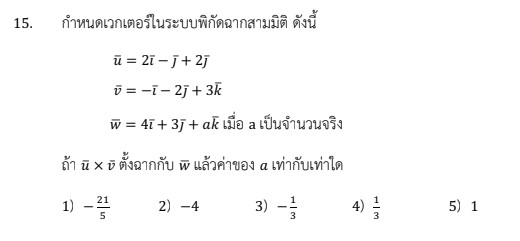

# โจทย์ข้อ 15 คณิตศาสตร์ประยุกต์ 1 (A-Level) ปี 2566

โจทย์ข้อ 15 ของวิชาคณิตศาสตร์ประยุกต์ 1 (A-Level) ปี 2566 เป็นเรื่องเกี่ยวกับ **เวกเตอร์ในระบบพิกัดฉากสามมิติ** โดยทดสอบความเข้าใจเรื่องการหาผลคูณเชิงเวกเตอร์ (Cross Product) และสมบัติของเวกเตอร์ที่ตั้งฉากกันผ่านผลคูณเชิงสเกลาร์ (Dot Product)

## **โจทย์ข้อ 15**

กำหนดเวกเตอร์ในระบบพิกัดฉากสามมิติ ดังนี้:
$\vec{u} = 2\vec{i} - \vec{j} + 2\vec{k}$
$\vec{v} = -\vec{i} - 2\vec{j} + 3\vec{k}$
$\vec{w} = 4\vec{i} + 3\vec{j} + a\vec{k}$ เมื่อ $a$ เป็นจำนวนจริง
ถ้า **$\vec{u} \times \vec{v}$ ตั้งฉากกับ $\vec{w}$** แล้วค่าของ $a$ เท่ากับเท่าใด,

---

### **วิธีทำอย่างละเอียด**

**ขั้นตอนที่ 1: หาผลคูณเชิงเวกเตอร์ $\vec{u} \times \vec{v}$**
ใช้การหาดีเทอร์มิแนนต์ของเมทริกซ์เพื่อหาผลคูณ $\vec{u} \times \vec{v}$:
$$\vec{u} \times \vec{v} = \begin{vmatrix} \vec{i} & \vec{j} & \vec{k} \\ 2 & -1 & 2 \\ -1 & -2 & 3 \end{vmatrix}$$

* **ส่วนประกอบ $\vec{i}$:** $(-1)(3) - (2)(-2) = -3 + 4 = 1$
* **ส่วนประกอบ $\vec{j}$:** $-[(2)(3) - (2)(-1)] = -(6 + 2) = -8$
* **ส่วนประกอบ $\vec{k}$:** $(2)(-2) - (-1)(-1) = -4 - 1 = -5$
จะได้ **$\vec{u} \times \vec{v} = \vec{i} - 8\vec{j} - 5\vec{k}$**

**ขั้นตอนที่ 2: ใช้เงื่อนไขการตั้งฉาก (Perpendicularity)**
ตามนิยาม เวกเตอร์สองเวกเตอร์จะตั้งฉากกันก็ต่อเมื่อ **ผลคูณเชิงสเกลาร์ (Dot Product) เท่ากับ 0**
ดังนั้น $(\vec{u} \times \vec{v}) \cdot \vec{w} = 0$

**ขั้นตอนที่ 3: แทนค่าและแก้สมการหา $a$**
นำส่วนประกอบของแต่ละแกนมาคูณกันแล้วจับบวกกัน:
$$(1)(4) + (-8)(3) + (-5)(a) = 0$$
$$4 - 24 - 5a = 0$$
$$-20 - 5a = 0$$
$$5a = -20$$
**$a = -4$**

**ตอบ:** ตัวเลือกที่ 2) $-4$

---

### **เนื้อหาที่เกี่ยวข้องและสูตรที่สำคัญ**

1. **ผลคูณเชิงเวกเตอร์ (Cross Product):**
    * **สูตร:** $\vec{A} \times \vec{B}$ ได้ผลลัพธ์เป็นเวกเตอร์ใหม่ที่ตั้งฉากกับทั้ง $\vec{A}$ และ $\vec{B}$
    * **ที่มา:** ใช้การกระจายตามแนวแถวของดีเทอร์มิแนนต์ โดยแถวแรกเป็นหน่วยเวกเตอร์ $\vec{i}, \vec{j}, \vec{k}$
2. **ผลคูณเชิงสเกลาร์ (Dot Product):**
    * **สูตร:** $\vec{A} \cdot \vec{B} = a_1b_1 + a_2b_2 + a_3b_3$
    * **ความหมาย:** หาก $\vec{A} \cdot \vec{B} = 0$ แสดงว่าเวกเตอร์ทั้งสองทำมุม $90^\circ$ ต่อกัน
3. **ตัวแปรและค่าคงที่:**
    * **$\vec{i}, \vec{j}, \vec{k}$:** หน่วยเวกเตอร์ในทิศทางแกน X, Y และ Z ตามลำดับ
    * **$a$:** สัมประสิทธิ์หรือความยาวของเวกเตอร์ $\vec{w}$ ในทิศทางแกน Z ที่เราต้องการหา

### **กลยุทธ์แก้โจทย์ประเภทนี้**

* **แยกการคำนวณเป็นส่วนๆ:** อย่าพยายามคำนวณรวดเดียว ให้หาเวกเตอร์ที่เป็นผลคูณ Cross Product ให้เสร็จก่อนแล้วค่อยนำมา Dot Product กับเวกเตอร์ที่เหลือ
* **ระวังเครื่องหมายหน้า $\vec{j}$:** ในการหา Cross Product ส่วนประกอบหน้า $\vec{j}$ ต้องมีเครื่องหมายลบนำหน้าเสมอตามกฎของโคแฟกเตอร์
* **Insight เพิ่มเติม:** โจทย์ข้อนี้แท้จริงแล้วกำลังทดสอบเรื่อง **Scalar Triple Product** หรือ $[\vec{u}, \vec{v}, \vec{w}] = 0$ ซึ่งหมายความว่าเวกเตอร์ทั้งสามวางตัวอยู่ในระนาบเดียวกัน (Coplanar)

---

### **ตัวอย่างโจทย์เพิ่มเติมเพื่อฝึกทำ**

**โจทย์:** กำหนด $\vec{u} = \vec{i} + \vec{j}$ และ $\vec{v} = \vec{j} + \vec{k}$ จงหาค่า $c$ ที่ทำให้เวกเตอร์ $\vec{w} = c\vec{i} + \vec{j} + \vec{k}$ ตั้งฉากกับ $\vec{u} \times \vec{v}$

**เฉลย:**

1. **หา $\vec{u} \times \vec{v}$:** $\begin{vmatrix} \vec{i} & \vec{j} & \vec{k} \\ 1 & 1 & 0 \\ 0 & 1 & 1 \end{vmatrix} = (1-0)\vec{i} - (1-0)\vec{j} + (1-0)\vec{k} = \vec{i} - \vec{j} + \vec{k}$
2. **เงื่อนไขตั้งฉาก:** $(\vec{i} - \vec{j} + \vec{k}) \cdot (c\vec{i} + \vec{j} + \vec{k}) = 0$
3. **แก้สมการ:** $c(1) + (1)(-1) + (1)(1) = 0 \Rightarrow c - 1 + 1 = 0 \Rightarrow c = 0$
**ตอบ:** $c = 0$

การฝึกฝนทักษะการคำนวณเมทริกซ์และการตรวจสอบเงื่อนไขการตั้งฉากจะช่วยให้คุณทำโจทย์เวกเตอร์ใน A-Level ได้อย่างรวดเร็วครับ

---
การหา**ผลคูณเชิงเวกเตอร์ (Cross Product)** จากโจทย์ข้อ 15 ของข้อสอบ A-Level คณิตศาสตร์ 1 ปี 2566 มีขั้นตอนการคำนวณโดยใช้การหาดีเทอร์มิแนนต์ (Determinant) ของเมทริกซ์ขนาด $3 \times 3$ ดังนี้ครับ

### **1. การตั้งเมทริกซ์เพื่อคำนวณ**

ให้นำหน่วยเวกเตอร์ $\vec{i}, \vec{j}, \vec{k}$ ไว้ในแถวที่ 1 และนำสัมประสิทธิ์ของเวกเตอร์ $\vec{u}$ และ $\vec{v}$ มาวางในแถวที่ 2 และ 3 ตามลำดับ:
$$\vec{u} \times \vec{v} = \begin{vmatrix} \vec{i} & \vec{j} & \vec{k} \\ 2 & -1 & 2 \\ -1 & -2 & 3 \end{vmatrix}$$

### **2. ขั้นตอนการกระจายเพื่อหาค่าแต่ละส่วนประกอบ**

การหาผลคูณจะแบ่งออกเป็น 3 ส่วนตามแนวแกน ดังนี้:

* **ส่วนประกอบหน้า $\vec{i}$:** ปิดแถวที่ 1 และหลักที่ 1 แล้วหาดีเทอร์มิแนนต์ของตัวเลขที่เหลือ
  * คำนวณ: $(-1)(3) - (2)(-2) = -3 + 4 = \mathbf{1}$
* **ส่วนประกอบหน้า $\vec{j}$:** ปิดแถวที่ 1 และหลักที่ 2 (และ**ต้องใส่เครื่องหมายลบ**ไว้ข้างหน้าตามกฎการหาโคแฟกเตอร์)
  * คำนวณ: $-[(2)(3) - (2)(-1)] = -(6 + 2) = \mathbf{-8}$
* **ส่วนประกอบหน้า $\vec{k}$:** ปิดแถวที่ 1 และหลักที่ 3
  * คำนวณ: $(2)(-2) - (-1)(-1) = -4 - 1 = \mathbf{-5}$

### **3. ผลลัพธ์สุดท้าย**

เมื่อนำสัมประสิทธิ์ที่คำนวณได้มารวมกัน จะได้เวกเตอร์ผลลัพธ์คือ:
**$\vec{u} \times \vec{v} = \vec{i} - 8\vec{j} - 5\vec{k}$**

---

### **เทคนิคและข้อควรระวังเพิ่มเติมจากแหล่งข้อมูล**

* **เครื่องหมายหน้า $\vec{j}$:** เป็นจุดที่ผิดบ่อยที่สุดในห้องสอบ เพราะตำแหน่งของ $\vec{j}$ อยู่ในตำแหน่งที่ต้องคูณด้วย $-1$ เสมอเมื่อกระจายดีเทอร์มิแนนต์จากแถวบนสุด
* **สมบัติของผลลัพธ์:** เวกเตอร์ $\vec{u} \times \vec{v}$ ที่ได้นี้จะมีสมบัติพิเศษคือ **ตั้งฉากกับทั้ง $\vec{u}$ และ $\vec{v}$** ซึ่งโจทย์ข้อนี้ใช้สมบัติดังกล่าวไปเชื่อมโยงกับเงื่อนไขการตั้งฉากกับเวกเตอร์ $\vec{w}$ โดยการใช้ Dot Product ต่อไป,
* **การตรวจสอบ:** หากมีเวลา ควรลองนำเวกเตอร์ผลลัพธ์ที่ได้ไป Dot Product กับ $\vec{u}$ หรือ $\vec{v}$ ดู ถ้าคำนวณถูกต้อง ผลลัพธ์ที่ได้ต้องเป็น 0 เสมอครับ
