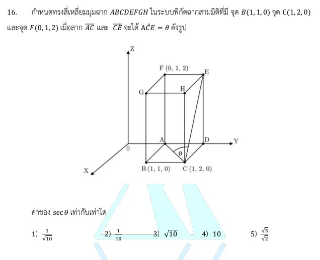

# โจทย์ข้อ 16 คณิตศาสตร์ประยุกต์ 1 (A-Level) ปี 2566

การแก้โจทย์ข้อ 16 ของวิชาคณิตศาสตร์ประยุกต์ 1 (A-Level) ปี 2566 เป็นเรื่องเกี่ยวกับ **เรขาคณิตวิเคราะห์และเวกเตอร์ในสามมิติ** โดยเน้นการหาพิกัดจุดในทรงสี่เหลี่ยมมุมฉากและการหาขนาดของมุมระหว่างเส้นตรง (หรือเวกเตอร์) ครับ

## **โจทย์ข้อ 16**

กำหนดทรงสี่เหลี่ยมมุมฉาก $ABCDEFGH$ ในระบบพิกัดฉากสามมิติที่มีจุด $B(1, 1, 0)$, จุด $C(1, 2, 0)$ และจุด $F(0, 1, 2)$ เมื่อลากเส้นตรง $AC$ และ $CE$ จะได้มุม $A\hat{C}E = \theta$ ดังรูป ค่าของ $\sec \theta$ เท่ากับเท่าใด

---

### **วิธีทำอย่างละเอียด**

**ขั้นตอนที่ 1: ระบุพิกัดของจุดที่เกี่ยวข้องทั้งหมด**
จากสมบัติของทรงสี่เหลี่ยมมุมฉากที่ด้านขนานกับแกนพิกัด เราสามารถหาจุด $A$ และ $E$ ได้ดังนี้:

1. **จุด $A$:** อยู่ในระนาบเดียวกับจุด $B$ และ $C$ (พื้นฐาน $z=0$) และอยู่ใต้จุด $F(0, 1, 2)$ โดยตรง ดังนั้นพิกัดของ **$A$ คือ $(0, 1, 0)$**
2. **จุด $C$:** โจทย์กำหนดมาให้คือ **$(1, 2, 0)$**
3. **จุด $E$:** อยู่บนระนาบด้านบน ($z=2$) และอยู่เหนือจุด $D$ ซึ่งจุด $D$ มีพิกัด $x$ เดียวกับ $A$ และพิกัด $y$ เดียวกับ $C$ คือ $(0, 2, 0)$ ดังนั้นพิกัดของ **$E$ คือ $(0, 2, 2)$**

**ขั้นตอนที่ 2: สร้างเวกเตอร์ $\vec{CA}$ และ $\vec{CE}$ เพื่อหามุม $\theta$**
เราต้องสร้างเวกเตอร์ออกจากจุดยอดของมุม (จุด $C$) ไปยังจุดปลายทั้งสอง:

* $\vec{CA} = A - C = (0 - 1, 1 - 2, 0 - 0) = \mathbf{(-1, -1, 0)}$
* $\vec{CE} = E - C = (0 - 1, 2 - 2, 2 - 0) = \mathbf{(-1, 0, 2)}$

**ขั้นตอนที่ 3: ใช้สูตรผลคูณเชิงสเกลาร์ (Dot Product) เพื่อหา $\cos \theta$**
จากสูตร $\vec{u} \cdot \vec{v} = |\vec{u}||\vec{v}| \cos \theta$

1. **หาผลคูณ $\vec{CA} \cdot \vec{CE}$:**
    $(-1)(-1) + (-1)(0) + (0)(2) = 1 + 0 + 0 = \mathbf{1}$
2. **หาขนาดของเวกเตอร์:**
    * $|\vec{CA}| = \sqrt{(-1)^2 + (-1)^2 + 0^2} = \mathbf{\sqrt{2}}$
    * $|\vec{CE}| = \sqrt{(-1)^2 + 0^2 + 2^2} = \mathbf{\sqrt{5}}$
3. **แทนค่าหา $\cos \theta$:**
    $1 = (\sqrt{2})(\sqrt{5}) \cos \theta$
    $\cos \theta = \frac{1}{\sqrt{10}}$

**ขั้นตอนที่ 4: หาค่า $\sec \theta$**
เนื่องจาก $\sec \theta = \frac{1}{\cos \theta}$
จะได้ $\sec \theta = \frac{1}{1/\sqrt{10}} = \mathbf{\sqrt{10}}$

**ตอบ:** $\sqrt{10}$ (ตรงกับตัวเลือกที่ 3)

---

### **เนื้อหาที่เกี่ยวข้องเพื่อศึกษาเพิ่มเติม**

**1. ระบบพิกัดฉากสามมิติ (3D Coordinate System):**

* การหาพิกัดในทรงสี่เหลี่ยมมุมฉากอาศัยการสังเกตระนาบที่ขนานกัน (เช่น จุดที่อยู่แนวตั้งเดียวกันจะมีค่า $x, y$ เท่ากันแต่ $z$ ต่างกัน)

**2. เวกเตอร์และมุมระหว่างเวกเตอร์:**

* **ขนาดของเวกเตอร์ ($|v|$):** คือระยะทางจากจุดเริ่มต้นไปจุดปลาย หาได้จาก $\sqrt{x^2 + y^2 + z^2}$
* **การ Dot Product:** เป็นวิธีที่ง่ายที่สุดในการหามุมระหว่างเส้นตรงสองเส้นในสามมิติ

**3. ฟังก์ชันตรีโกณมิติ:**

* **$\sec \theta$:** เป็นส่วนกลับของ $\cos \theta$ มักถูกใช้ในโจทย์เพื่อทดสอบว่านักเรียนจำนิยามพื้นฐานได้หรือไม่

### **กลยุทธ์แก้โจทย์ประเภทนี้**

* **วาดพิกัดกำกับในรูป:** เมื่อโจทย์ให้ทรงสี่เหลี่ยมมา ให้เขียนค่า $(x, y, z)$ ของจุดที่โจทย์ให้มาลงในรูปก่อน จากนั้นค่อยๆ ไล่หาจุดที่เหลือโดยใช้ความสูง ($z$) หรือแนวราบ ($x, y$) ที่สัมพันธ์กัน
* **เลือกจุดยอดมุมเป็นจุดเริ่มเวกเตอร์:** หากต้องการหามุมที่จุด $C$ ต้องใช้เวกเตอร์ $\vec{CA}$ และ $\vec{CE}$ (ไม่ใช่ $\vec{AC}$) เพื่อให้ทิศทางเวกเตอร์สอดคล้องกับมุมด้านใน
* **ตรวจสอบความสมเหตุสมผล:** ค่า $\cos \theta$ ต้องอยู่ระหว่าง $-1$ ถึง $1$ เสมอ หากคำนวณได้เกิน แสดงว่ามีจุดใดผิดพลาด

---

### **ตัวอย่างโจทย์เพิ่มเติมเพื่อฝึกทำ**

**โจทย์:** กำหนดจุด $P(1, 0, 0), Q(0, 1, 0)$ และ $R(0, 0, 1)$ จงหาค่า $\cos \theta$ เมื่อ $\theta$ เป็นมุม $P\hat{Q}R$

**เฉลย:**

1. สร้างเวกเตอร์จากจุดยอด $Q$:
    * $\vec{QP} = P - Q = (1, -1, 0)$
    * $\vec{QR} = R - Q = (0, -1, 1)$
2. คำนวณ Dot Product: $\vec{QP} \cdot \vec{QR} = (1)(0) + (-1)(-1) + (0)(1) = 1$
3. หาขนาด: $|\vec{QP}| = \sqrt{1^2 + (-1)^2} = \sqrt{2}$, $|\vec{QR}| = \sqrt{(-1)^2 + 1^2} = \sqrt{2}$
4. หา $\cos \theta$: $1 = (\sqrt{2})(\sqrt{2}) \cos \theta \Rightarrow 1 = 2 \cos \theta \Rightarrow \cos \theta = 1/2$
**ตอบ:** $1/2$ (หรือ $\theta = 60^\circ$)

การฝึกระบุพิกัดจากรูปภาพจะช่วยให้คุณทำคะแนนในหัวข้อเรขาคณิตสามมิติได้แม่นยำขึ้นครับ
