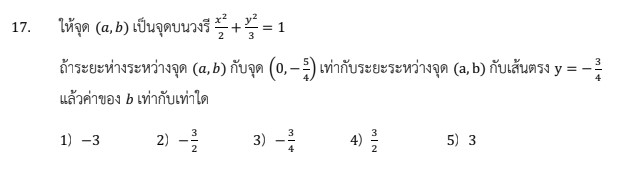

# การแก้โจทย์ข้อ 17 ของวิชาคณิตศาสตร์ประยุกต์ 1 (A-Level) ปี 2566

การแก้โจทย์ข้อนี้เป็นเรื่องเกี่ยวกับ **เรขาคณิตวิเคราะห์ (ภาคตัดกรวย)** โดยเฉพาะเรื่อง **วงรี** และการใช้ **สูตรระยะทาง** ระหว่างจุดกับจุด และจุดกับเส้นตรงครับ

## **โจทย์ข้อ 17**

กำหนดให้จุด $(a, b)$ เป็นจุดบนวงรี $\frac{x^2}{8} + \frac{y^2}{2} = 1$
ถ้าระยะห่างระหว่างจุด $(a, b)$ กับจุด $(0, -\frac{3}{2})$ เท่ากับระยะห่างระหว่างจุด $(a, b)$ กับเส้นตรง $y = -3$ แล้วค่าของ $b$ เท่ากับเท่าใด,

---

### **วิธีทำอย่างละเอียด**

**ขั้นตอนที่ 1: สร้างสมการจากเงื่อนไข "จุดบนวงรี"**
เนื่องจากจุด $(a, b)$ อยู่บนวงรี $\frac{x^2}{8} + \frac{y^2}{2} = 1$ เราสามารถแทนค่า $x = a$ และ $y = b$ ลงในสมการได้:
$$\frac{a^2}{8} + \frac{b^2}{2} = 1$$
จัดรูปเพื่อหาค่า $a^2$:
$$a^2 + 4b^2 = 8 \implies a^2 = 8 - 4b^2 \quad ---(1)$$,

**ขั้นตอนที่ 2: สร้างสมการจากเงื่อนไข "ระยะห่างเท่ากัน"**

1. **ระยะห่างระหว่าง $(a, b)$ กับจุด $(0, -\frac{3}{2})$:**
    ใช้สูตร $d = \sqrt{(x_1-x_2)^2 + (y_1-y_2)^2}$
    จะได้ $d_1 = \sqrt{(a-0)^2 + (b - (-\frac{3}{2}))^2} = \sqrt{a^2 + (b + \frac{3}{2})^2}$
2. **ระยะห่างระหว่าง $(a, b)$ กับเส้นตรง $y = -3$:**
    เนื่องจากเส้นตรงขนานแกน X ระยะห่างคือผลต่างของค่า $y$
    จะได้ $d_2 = |b - (-3)| = |b + 3|$

### **ขั้นตอนที่ 3: แก้สมการหาค่า $b$**
โจทย์กำหนดให้ $d_1 = d_2$ ดังนั้น:
$$\sqrt{a^2 + (b + \frac{3}{2})^2} = |b + 3|$$
ยกกำลังสองทั้งสองข้างเพื่อกำจัดรากที่สอง:
$$a^2 + (b + \frac{3}{2})^2 = (b + 3)^2$$
$$a^2 + (b^2 + 3b + \frac{9}{4}) = b^2 + 6b + 9$$
ตัด $b^2$ ออกทั้งสองข้างและย้ายข้างเพื่อหา $a^2$:
$$a^2 = 3b + 9 - \frac{9}{4} = 3b + \frac{27}{4} \quad ---(2)$$

### **ขั้นตอนที่ 4: แทนค่า (1) ลงใน (2)**
$$8 - 4b^2 = 3b + \frac{27}{4}$$
คูณด้วย 4 ตลอดทั้งสมการ:
$$32 - 16b^2 = 12b + 27$$
$$16b^2 + 12b - 5 = 0$$
แยกตัวประกอบ:
$$(4b + 5)(4b - 1) = 0$$
จะได้ $b = -\frac{5}{4}$ หรือ $b = \frac{1}{4}$

เมื่อพิจารณาจากตัวเลือกที่โจทย์ให้มา: 1) $-3$, 2) $-\frac{3}{2}$, 3) $-\frac{1}{2}$, 4) $\frac{1}{4}$, 5) $3$
พบว่าค่าที่ตรงคือ **$\frac{1}{4}$**

**ตอบ:** ตัวเลือกที่ 4) $\frac{1}{4}$

---

### **เนื้อหาที่เกี่ยวข้องเพื่อศึกษาเพิ่มเติม**

**1. สูตรที่ใช้ในโจทย์:**

* **ระยะทางระหว่างจุด $(x_1, y_1)$ และ $(x_2, y_2)$:** $d = \sqrt{(x_1-x_2)^2 + (y_1-y_2)^2}$
* **ระยะทางระหว่างจุด $(x_0, y_0)$ และเส้นตรง $y = k$:** $d = |y_0 - k|$

**2. ความหมายของตัวแปรและค่าคงที่:**

* **$(a, b)$:** พิกัดของจุดที่อยู่บนเส้นรอบรูปของวงรี ซึ่งต้องทำตามเงื่อนไขของสมการวงรีเสมอ
* **สมการวงรี $\frac{x^2}{8} + \frac{y^2}{2} = 1$:** เป็นวงรีที่มีจุดศูนย์กลางอยู่ที่ $(0,0)$ แกนเอกอยู่บนแกน X ($a^2=8$) และแกนโทอยู่บนแกน Y ($b^2=2$)

### **กลยุทธ์แก้โจทย์ประเภทนี้**

* **เปลี่ยนเงื่อนไขเป็นสมการ:** เมื่อโจทย์บอกว่า "จุดอยู่บนกราฟ" ให้เขียนสมการความสัมพันธ์ของพิกัดจุดนั้นไว้เป็นสมการแรกเสมอ
* **ใช้สมบัติทางเรขาคณิต:** หากโจทย์ระบุว่าระยะทางจากจุดหนึ่งไปยังจุดคงที่ เท่ากับระยะจากจุดนั้นไปยังเส้นตรงคงที่ จริงๆ แล้วนี่คือนิยามของ **พาราโบลา** (จุดคงที่คือจุดโฟกัส และเส้นตรงคือเส้นไดเรกตริกซ์) การมองออกจะช่วยให้เข้าใจภาพรวมได้ดีขึ้น
* **ตรวจสอบความสมเหตุสมผล:** เมื่อได้ค่าตัวแปรมาแล้ว (เช่น $b = 1/4$) ควรตรวจสอบว่าค่านี้ทำให้ $a^2$ มีค่าเป็นบวกหรือไม่ (เพราะ $a^2$ ติดลบไม่ได้ในระบบจำนวนจริง) ซึ่งในข้อนี้ $a^2 = 8 - 4(1/4)^2 = 7.75$ ซึ่งใช้ได้ครับ

---

### **ตัวอย่างโจทย์เพิ่มเติมเพื่อฝึกทำ**

**โจทย์:** จงหาค่า $y$ ของจุด $(x, y)$ บนวงรี $x^2 + 4y^2 = 4$ ที่มีระยะห่างจากจุดกำเนิด $(0, 0)$ เท่ากับ $\sqrt{2}$ หน่วย

**เฉลย:**

1. **จุดบนวงรี:** $x^2 + 4y^2 = 4 \implies x^2 = 4 - 4y^2$
2. **ระยะทาง:** $d^2 = x^2 + y^2 = (\sqrt{2})^2 = 2$
3. **แทนค่า:** $(4 - 4y^2) + y^2 = 2$
4. **แก้สมการ:** $4 - 3y^2 = 2 \implies 3y^2 = 2 \implies y^2 = 2/3$
5. **คำตอบ:** $y = \pm \sqrt{2/3}$
