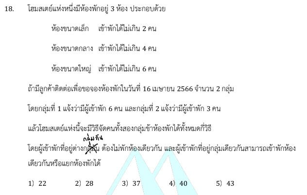

# การแก้โจทย์ข้อ 18 ของวิชาคณิตศาสตร์ประยุกต์ 1 (A-Level) ปี 2566

การแก้โจทย์ข้อนี้เป็นเรื่องเกี่ยวกับ **หลักการนับเบื้องต้นและความน่าจะเป็น** โดยเฉพาะเรื่อง **การจัดหมู่ (Combination)** ซึ่งต้องอาศัยการแบ่งกรณีตามเงื่อนไขที่โจทย์กำหนดครับ

## **เฉลยละเอียดโจทย์ข้อ 18**

**โจทย์:** โฮมสเตย์แห่งหนึ่งมีห้องพัก 3 ห้อง:

* ห้องเล็ก (S): จุได้ไม่เกิน 2 คน
* ห้องกลาง (M): จุได้ไม่เกิน 4 คน
* ห้องใหญ่ (L): จุได้ไม่เกิน 6 คน
มีลูกค้า 2 กลุ่ม: กลุ่มที่หนึ่งมี 6 คน และกลุ่มที่สองมี 3 คน โดย **ห้ามพักห้องเดียวกันระหว่างกลุ่ม** แต่ในกลุ่มเดียวกันแยกห้องได้ จะมีวิธีจัดคนเข้าพักได้ทั้งหมดกี่วิธี

---

**วิธีทำอย่างละเอียด:**

เนื่องจากกลุ่มคนต่างกลุ่มกันห้ามพักห้องเดียวกัน เราจึงต้องแบ่งกรณีโดยพิจารณาว่า **"กลุ่มที่ 2 (3 คน) จะใช้ห้องใดบ้าง"** เพราะมีจำนวนคนน้อยกว่าและมีข้อจำกัดเรื่องความจุของห้องที่น่าสนใจ ดังนี้ครับ:

**กรณีที่ 1: กลุ่มที่ 2 พักในห้องกลาง (M) เพียงห้องเดียว**

* **กลุ่มที่ 2 (3 คน):** เลือกคน 3 คนเข้าพักในห้องกลางที่มี 4 ที่นั่ง ได้ $\binom{3}{3} = 1$ วิธี
* **กลุ่มที่ 1 (6 คน):** ต้องแบ่งไปพักในห้องที่เหลือ คือ **ห้องเล็ก (S)** และ **ห้องใหญ่ (L)** ซึ่งรวมความจุได้ 8 ที่นั่ง ($2+6$):
  * พักห้องใหญ่ 6 คน, ห้องเล็ก 0 คน: $\binom{6}{6} = 1$ วิธี
  * พักห้องใหญ่ 5 คน, ห้องเล็ก 1 คน: $\binom{6}{5} = 6$ วิธี
  * พักห้องใหญ่ 4 คน, ห้องเล็ก 2 คน: $\binom{6}{4} = 15$ วิธี
* **รวมกรณีที่ 1:** $1 \times (1 + 6 + 15) = \mathbf{22}$ **วิธี**

**กรณีที่ 2: กลุ่มที่ 2 พักในห้องใหญ่ (L) เพียงห้องเดียว**

* **กลุ่มที่ 2 (3 คน):** เลือกคนเข้าพักห้องใหญ่ที่มี 6 ที่นั่ง ได้ $\binom{3}{3} = 1$ วิธี
* **กลุ่มที่ 1 (6 คน):** ต้องแบ่งไปพักในห้องที่เหลือ คือ **ห้องเล็ก (S)** และ **ห้องกลาง (M)** ซึ่งรวมความจุได้ 6 ที่นั่งพอดี ($2+4$):
  * ต้องพักให้เต็มทุกที่นั่ง (ห้องเล็ก 2 คน และห้องกลาง 4 คน) เท่านั้น: $\binom{6}{2} = 15$ วิธี
* **รวมกรณีที่ 2:** $1 \times 15 = \mathbf{15}$ **วิธี**

**กรณีที่ 3: กลุ่มที่ 2 แบ่งพักระหว่างห้องเล็ก (S) และห้องกลาง (M)**

* **กลุ่มที่ 2 (3 คน):** ต้องแบ่งคน 3 คนลงใน 2 ห้อง:
  * ห้องเล็ก 2 คน, ห้องกลาง 1 คน: $\binom{3}{2} = 3$ วิธี
  * ห้องเล็ก 1 คน, ห้องกลาง 2 คน: $\binom{3}{1} = 3$ วิธี
  * *(หมายเหตุ: พักห้องเล็กทั้ง 3 คนไม่ได้ เพราะห้องเล็กจุได้แค่ 2 คน)*
* **กลุ่มที่ 1 (6 คน):** ต้องพักในห้องที่เหลือเพียงห้องเดียวคือ **ห้องใหญ่ (L)**:
  * พักห้องใหญ่ครบทั้ง 6 คน: $\binom{6}{6} = 1$ วิธี
* **รวมกรณีที่ 3:** $(3 + 3) \times 1 = \mathbf{6}$ **วิธี**

**รวมวิธีจัดคนเข้าพักทั้งหมด:** $22 + 15 + 6 = \mathbf{43}$ **วิธี**

**ตอบ:** ตัวเลือกที่ 5) 43

---

### **เนื้อหาที่เกี่ยวข้องเพื่อศึกษาเพิ่มเติม**

**1. สูตรการเลือก (Combination):**

* **สูตร:** $\binom{n}{r} = \frac{n!}{r!(n-r)!}$
* **ความหมาย:** ใช้เมื่อต้องการเลือกสิ่งของ $r$ ชิ้น จากทั้งหมด $n$ ชิ้น โดย **ไม่ถือลำดับเป็นสำคัญ** ในโจทย์ข้อนี้คือการเลือก "คน" ว่าใครจะไปอยู่ห้องไหน

**2. กฎการบวกและกฎการคูณ:**

* **กฎการคูณ:** ใช้เมื่อขั้นตอนการทำงานยังไม่เสร็จสิ้น ต้องทำต่อเนื่องกัน (เช่น จัดกลุ่ม 2 เสร็จแล้วต้องจัดกลุ่ม 1 ต่อ)
* **กฎการบวก:** ใช้เมื่อแต่ละกรณีแยกขาดจากกันชัดเจน (เช่น กรณีพักห้องกลางอย่างเดียว กับกรณีพักห้องใหญ่)

### **กลยุทธ์แก้โจทย์ประเภทนี้**

* **เลือกพิจารณากลุ่มที่จัดการยากที่สุดก่อน:** ในที่นี้คือกลุ่มที่ 2 เพราะมีจำนวนคน 3 คน ซึ่งไปได้หลายห้องแต่ก็ติดเงื่อนไขความจุของห้องเล็ก
* **แบ่งกรณีให้ครอบคลุม (Mutually Exclusive):** พยายามแบ่งกรณีที่ไม่มีส่วนซ้อนทับกัน เพื่อให้สามารถนำวิธีทั้งหมดมาบวกกันได้ในตอนท้าย
* **ตรวจสอบความจุของห้องที่เหลือ:** ทุกครั้งที่วางแผนให้กลุ่มหนึ่งเข้าพัก ต้องเช็คเสมอว่าห้องที่เหลืออยู่ "เพียงพอ" สำหรับคนในอีกกลุ่มที่เหลือหรือไม่

---

### **ตัวอย่างโจทย์เพิ่มเติมเพื่อฝึกทำ**

**โจทย์:** มีห้องพัก 2 ห้อง ห้องละ 3 ที่นั่ง และมีคน 4 คน ต้องการจัดคนเข้าพักห้องละอย่างน้อย 1 คน จะทำได้กี่วิธี

**เฉลย:**

1. **แบ่งกรณีตามจำนวนคนในห้อง:**
    * กรณี (1, 3): เลือกคน 1 คนอยู่ห้องแรก อีก 3 คนอยู่ห้องสอง = $\binom{4}{1} = 4$ วิธี
    * กรณี (2, 2): เลือกคน 2 คนอยู่ห้องแรก อีก 2 คนอยู่ห้องสอง = $\binom{4}{2} = 6$ วิธี
    * กรณี (3, 1): เลือกคน 3 คนอยู่ห้องแรก อีก 1 คนอยู่ห้องสอง = $\binom{4}{3} = 4$ วิธี
2. **รวมผลลัพธ์:** $4 + 6 + 4 = 14$ วิธี

การฝึกแบ่งกรณีแบบนี้จะช่วยให้คุณแม่นยำในการทำข้อสอบ A-Level หัวข้อการนับมากขึ้นครับ
