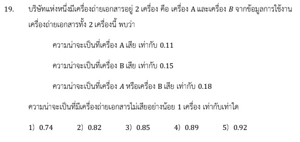

# เฉลยข้อ 19 วิชาคณิตศาสตร์ประยุกต์ 1 (A-Level) ปี 2566

การแก้โจทย์ข้อ 19 ของวิชาคณิตศาสตร์ประยุกต์ 1 (A-Level) ปี 2566 เป็นเรื่องเกี่ยวกับ **สถิติ (Statistics)** โดยเน้นการคำนวณค่าเฉลี่ยเลขคณิตรวม และการแปลความหมายจากแผนภาพกล่อง (Box Plot) ครับ

## **เฉลยละเอียดโจทย์ข้อ 19**

**โจทย์:** (สรุปจากข้อมูลในแหล่งข้อมูล) กำหนดข้อมูลอายุของผู้ป่วย 120 คน แบ่งเป็นเพศชาย 48 คน มีอายุเฉลี่ย 70 ปี และเพศหญิง 72 คน มีอายุเฉลี่ย 55 ปี,
**พิจารณาข้อความต่อไปนี้:**

* **ก.** ค่าเฉลี่ยเลขคณิตของอายุผู้ป่วยทั้งหมดเท่ากับ 62.5 ปี
* **ข.** พิสัยระหว่างควอไทล์ (IQR) ของอายุผู้ป่วยเพศชายน้อยกว่าเพศหญิง
* **ค.** ผู้ป่วยที่มีอายุน้อยกว่า 65 ปี มีจำนวนไม่เกิน 50 คน

---

**วิธีทำอย่างละเอียด:**

**ขั้นตอนที่ 1: ตรวจสอบข้อความ ก. (ค่าเฉลี่ยเลขคณิตรวม)**
ใช้สูตรค่าเฉลี่ยเลขคณิตรวม: $\bar{x}_{รวม} = \frac{n_1\bar{x}_1 + n_2\bar{x}_2}{n_1 + n_2}$

* แทนค่า: $\bar{x}_{รวม} = \frac{(48 \times 70) + (72 \times 55)}{120}$
* คำนวณ: $\bar{x}_{รวม} = \frac{3,360 + 3,960}{120} = \frac{7,320}{120} = \mathbf{61}$ **ปี**
* เนื่องจากโจทย์บอกว่า 62.5 ปี **ดังนั้น ข้อความ ก. ผิด**

**ขั้นตอนที่ 2: ตรวจสอบข้อความ ข. (พิสัยระหว่างควอไทล์ - IQR)**
จากแผนภาพกล่องในโจทย์ (อ้างอิงจากบันทึกช่วยจำ):

* พิสัยระหว่างควอไทล์คือ **"ความยาวของตัวกล่อง"** ($Q_3 - Q_1$)
* จากการสังเกตแผนภาพ พบว่าความยาวกรอบ (กล่อง) ของผู้ป่วยชายสั้นกว่าของผู้ป่วยหญิง
* **ดังนั้น ข้อความ ข. ถูกต้อง**

**ขั้นตอนที่ 3: ตรวจสอบข้อความ ค. (จำนวนผู้ป่วยอายุน้อยกว่า 65 ปี)**
ในแผนภาพกล่อง ข้อมูลแต่ละส่วน (จาก 4 ส่วน) จะมีจำนวนข้อมูลอยู่ 25% หรือ $1/4$ ของทั้งหมด

* พิจารณาเพศหญิง ($n = 72$): แต่ละส่วนมีคนอยู่ $72 \div 4 = \mathbf{18}$ **คน**
* จากแผนภาพ หากอายุ 65 ปี ตรงกับตำแหน่งควอไทล์ที่ 3 ($Q_3$) ของเพศหญิง จะมีผู้หญิงที่อายุน้อยกว่า 65 ปีอยู่ 3 ส่วน คือ $3 \times 18 = \mathbf{54}$ **คน**
* เพียงแค่จำนวนผู้หญิงอายุน้อยกว่า 65 ปี (54 คน) ก็เกิน 50 คนตามที่โจทย์ระบุแล้ว
* **ดังนั้น ข้อความ ค. ผิด**

**ตอบ:** ข้อความ **ข. ถูกต้องเพียงข้อเดียวเท่านั้น** (ตัวเลือกที่ 2)

---

### **เนื้อหาที่เกี่ยวข้องเพื่อศึกษาเพิ่มเติม**

**1. สูตรค่าเฉลี่ยเลขคณิตรวม (Combined Mean):**
$$\bar{x}_{รวม} = \frac{\sum n_i\bar{x}_i}{\sum n_i}$$
ใช้เมื่อต้องการหาค่าเฉลี่ยของกลุ่มตัวอย่างหลายกลุ่มรวมกัน โดยต้องทราบจำนวนสมาชิก ($n$) และค่าเฉลี่ย ($\bar{x}$) ของแต่ละกลุ่มย่อย

**2. แผนภาพกล่อง (Box Plot) และควอไทล์:**

* **$Q_1, Q_2 (Median), Q_3$:** แบ่งข้อมูลออกเป็น 4 ส่วนเท่าๆ กัน แต่ละส่วนมีจำนวนข้อมูล 25% ของทั้งหมด
* **IQR (Interquartile Range):** คือ $Q_3 - Q_1$ แทนความกว้างของข้อมูล 50% ตรงกลาง ช่วยบอกการกระจายตัวของข้อมูลส่วนใหญ่
* **ค่านอกเกณฑ์ (Outlier):** ข้อมูลที่มีค่าน้อยกว่า $Q_1 - 1.5(IQR)$ หรือมากกว่า $Q_3 + 1.5(IQR)$,

### **กลยุทธ์แก้โจทย์ประเภทนี้**

* **อย่ารีบคำนวณ:** ในข้อสอบที่มีหลายข้อความ (ก, ข, ค) บางครั้งการเช็คข้อที่ง่ายที่สุดก่อน (เช่น ค่าเฉลี่ยรวม) อาจช่วยตัดตัวเลือกได้ทันที
* **หลักการ 25%:** จำไว้ว่าพื้นที่แต่ละส่วนในแผนภาพกล่อง (รวมถึงหนวดแมว) มี "จำนวนข้อมูล" เท่ากันเสมอ แม้ความยาวในรูปจะไม่เท่ากันก็ตาม
* **เปรียบเทียบด้วยตา:** สำหรับโจทย์ IQR หากมีกราฟสองอันวางคู่กัน ให้ดูความกว้างของตัวกล่องได้เลยโดยไม่ต้องหาค่าตัวเลขแม่นยำ

---

### **ตัวอย่างโจทย์เพิ่มเติมเพื่อฝึกทำ**

**โจทย์:** กลุ่ม A มี 10 คน ค่าเฉลี่ยอายุ 20 ปี และกลุ่ม B มี 20 คน ค่าเฉลี่ยอายุ 26 ปี หากนำทั้งสองกลุ่มมารวมกัน ค่าเฉลี่ยอายุรวมจะเป็นเท่าใด

**เฉลย:**

1. **ตั้งสูตร:** $\bar{x}_{รวม} = \frac{(10 \times 20) + (20 \times 26)}{10 + 20}$
2. **คำนวณ:** $\bar{x}_{รวม} = \frac{200 + 520}{30} = \frac{720}{30} = \mathbf{24}$ **ปี**
**ตอบ:** 24 ปี

การฝึกวิเคราะห์แผนภาพกล่องควบคู่กับการคำนวณพื้นฐานจะช่วยให้คุณเก็บคะแนนบทสถิติใน A-Level ได้อย่างแน่นอนครับ
