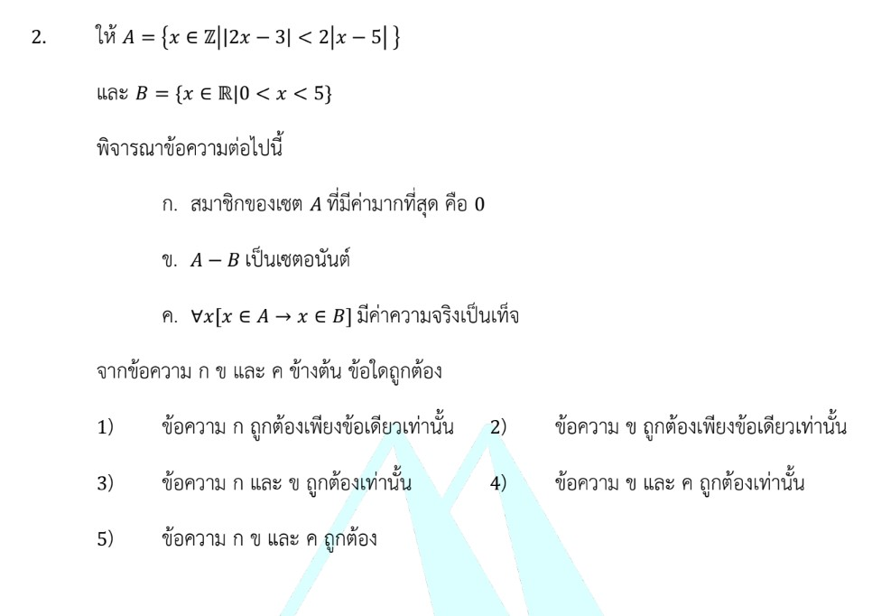

# โจทย์ข้อ 2 : จำนวนจริง (อสมการค่าสัมบูรณ์), เซต และตรรกศาสตร์ (ตัวบ่งปริมาณ)

การแก้โจทย์ข้อ 2 ของวิชาคณิตศาสตร์ประยุกต์ 1 (A-Level) ปี 2566 เป็นการวัดความรู้เรื่อง **จำนวนจริง (อสมการค่าสัมบูรณ์)**, **เซต** และ **ตรรกศาสตร์ (ตัวบ่งปริมาณ)** เข้าด้วยกันครับ

## **โจทย์ข้อ 2**

กำหนดให้ $A = \{x \in \mathbb{Z} : |2x - 3| < 2|x - 5|\}$ และ $B = \{x \in \mathbb{R} : 0 < x < 5\}$
พิจารณาข้อความต่อไปนี้:
ก. สมาชิกของเซต $A$ ที่มีค่ามากที่สุด คือ $0$
ข. $A - B$ เป็นเซตอนันต์
ค. $\forall x [x \in A \rightarrow x \in B]$ มีค่าความจริงเป็นเท็จ

---

### **วิธีทำอย่างละเอียด**

**ขั้นตอนที่ 1: แก้หาเซต $A$ จากอสมการ $|2x - 3| < 2|x - 5|$**
เนื่องจากทั้งสองข้างของอสมการเป็นค่าสัมบูรณ์ (มีค่าไม่เป็นลบ) เราสามารถ **ยกกำลังสองทั้งสองข้าง** เพื่อกำจัดค่าสัมบูรณ์ได้:
$$(2x - 3)^2 < [2(x - 5)]^2$$
$$4x^2 - 12x + 9 < 4(x^2 - 10x + 25)$$
$$4x^2 - 12x + 9 < 4x^2 - 40x + 100$$
กำจัด $4x^2$ ออกทั้งสองข้าง:
$$-12x + 40x < 100 - 9$$
$$28x < 91$$
$$x < \frac{91}{28}$$
$$x < 3.25$$

เนื่องจากโจทย์ระบุว่า $A$ ต้องเป็น **จำนวนเต็ม ($\mathbb{Z}$)** ดังนั้น:
**$A = \{..., -2, -1, 0, 1, 2, 3\}$**

**ขั้นตอนที่ 2: พิจารณาข้อความ ก**

* จาก $A = \{..., 0, 1, 2, 3\}$ จะเห็นว่าสมาชิกที่มากที่สุดคือ **$3$**
* ดังนั้น **ข้อความ ก ผิด**

**ขั้นตอนที่ 3: พิจารณาข้อความ ข**

* เซต $B = \{x \in \mathbb{R} : 0 < x < 5\}$ หรือช่วง $(0, 5)$
* $A - B$ คือสมาชิกที่อยู่ใน $A$ แต่ **ไม่อยู่** ในช่วง $(0, 5)$
* สมาชิกของ $A$ ที่อยู่ในช่วง $(0, 5)$ คือ $\{1, 2, 3\}$
* ดังนั้น $A - B = \{..., -2, -1, 0\}$
* จะเห็นว่าเซตนี้มีสมาชิกนับไม่ถ้วนและลดลงไปถึง $-\infty$ จึงเป็น **เซตอนันต์**
* ดังนั้น **ข้อความ ข ถูกต้อง**

**ขั้นตอนที่ 4: พิจารณาข้อความ ค**

* ประโยค $\forall x [x \in A \rightarrow x \in B]$ หมายถึง "สมาชิกทุกตัวของ $A$ ต้องอยู่ใน $B$"
* เราพบว่ามี $0 \in A$ แต่ $0 \notin B$ (เพราะ $B$ เริ่มที่ค่ามากกว่า $0$)
* เมื่อมีตัวอย่างค้านเพียงตัวเดียว ทำให้ประพจน์นี้มีค่าความจริงเป็น **เท็จ**
* ข้อความ ค ระบุว่าประพจน์นี้ "มีค่าความจริงเป็นเท็จ" ซึ่งเป็น **คำกล่าวที่ถูกต้อง**
* ดังนั้น **ข้อความ ค ถูกต้อง**

**ตอบ:** ข้อความ **ข และ ค ถูกต้อง** (ตรงกับตัวเลือกที่ 4)
*(หมายเหตุ: ในบันทึกช่วยจำ อาจมีการตีความว่าถามเฉพาะความจริงของตัวประพจน์ข้างใน แต่ตามหลักภาษาไทยของโจทย์ที่ระบุว่า "มีค่าความจริงเป็นเท็จ" หากตัวประพจน์เป็นเท็จจริง ข้อความนั้นถือว่ากล่าวถูกครับ)*

---

### **เนื้อหาที่เกี่ยวข้องและสูตรที่สำคัญ**

1. **อสมการค่าสัมบูรณ์:**
    * สูตรยกกำลังสอง: $|a| < |b| \iff a^2 < b^2$ (ใช้ได้เมื่อทั้งสองข้างมั่นใจว่าไม่เป็นลบ)
    * สูตรกระจาย: $(ax+b)^2 = a^2x^2 + 2abx + b^2$
2. **เซต (Sets):**
    * **$\mathbb{Z}$ (Integers):** จำนวนเต็ม $\{..., -1, 0, 1, ...\}$
    * **$\mathbb{R}$ (Real numbers):** จำนวนจริงทั้งหมดบนเส้นจำนวน
    * **เซตอนันต์:** เซตที่มีจำนวนสมาชิกไม่จำกัด
3. **ตรรกศาสตร์ (Logic):**
    * **$\forall x [P(x)]$:** จะเป็นจริงเมื่อ $P(x)$ เป็นจริงสำหรับทุกตัวในเอกภพสัมพัทธ์ และเป็นเท็จเมื่อพบตัวอย่างค้านเพียงตัวเดียว

### **กลยุทธ์แก้โจทย์ประเภทนี้**

* **แก้อสมการให้จบก่อน:** อย่าเพิ่งรีบพิจารณาข้อความ ก-ค จนกว่าจะได้หน้าตาของเซต $A$ และ $B$ ที่ชัดเจน
* **ระวังเงื่อนไขสมาชิก:** โจทย์มักหลอกระหว่าง "จำนวนเต็ม" กับ "จำนวนจริง" อย่างในข้อนี้ $A$ เป็นจุดๆ บนเส้นจำนวน แต่ $B$ เป็นช่วงต่อเนื่อง
* **การหาตัวอย่างค้าน:** สำหรับตัวบ่งปริมาณ $\forall$ (สำหรับทุกตัว) วิธีพิสูจน์ว่าเป็นเท็จที่ง่ายที่สุดคือการหาเลขเพียงตัวเดียวที่ทำให้เงื่อนไขไม่จริง (เช่น เลข 0 ในข้อนี้)

---

### **ตัวอย่างโจทย์เพิ่มเติมเพื่อฝึกทำ**

**โจทย์:** ให้ $A = \{x \in \mathbb{Z} : |x - 1| \leq 2\}$ และ $B = \{x \in \mathbb{Z} : x^2 < 5\}$
จงพิจารณาว่า $A \subset B$ หรือไม่ และ $n(A \cap B)$ เท่ากับเท่าใด

**เฉลย:**

1. **หา $A$:** $|x - 1| \leq 2 \Rightarrow -2 \leq x - 1 \leq 2 \Rightarrow -1 \leq x \leq 3$
    ดังนั้น $A = \{-1, 0, 1, 2, 3\}$
2. **หา $B$:** $x^2 < 5 \Rightarrow -\sqrt{5} < x < \sqrt{5}$ (ประมาณ $-2.23 < x < 2.23$)
    เนื่องจาก $x \in \mathbb{Z}$ จะได้ $B = \{-2, -1, 0, 1, 2\}$
3. **วิเคราะห์:** $A$ ไม่เป็นสับเซตของ $B$ เพราะ $3 \in A$ แต่ $3 \notin B$
4. **หา $n(A \cap B)$:** $A \cap B = \{-1, 0, 1, 2\}$ ดังนั้น $n(A \cap B) = 4$
