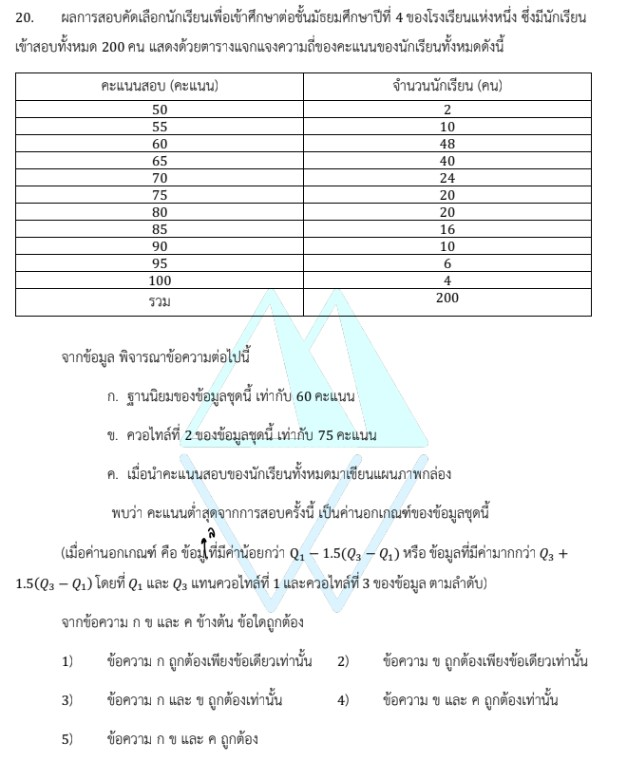

# การแก้โจทย์ข้อ 20 ปี 2566

การแก้โจทย์ข้อ 20 ในวิชาคณิตศาสตร์ประยุกต์ 1 (A-Level) ปี 2566 เป็นเรื่องเกี่ยวกับ **ความน่าจะเป็น (Probability)** โดยใช้พื้นฐานของ **ทฤษฎีเซต (การรวมกันและการแยกออก - Inclusion-Exclusion Principle)** และ **กฎส่วนเติมเต็ม (Complement Rule)** ครับ

### **โจทย์ข้อ 20**

ร้านถ่ายเอกสารแห่งหนึ่งมีเครื่องถ่ายเอกสาร 2 เครื่อง คือ เครื่อง A และ เครื่อง B ความน่าจะเป็นที่เครื่อง A เสีย เท่ากับ 0.11 ความน่าจะเป็นที่เครื่อง B เสีย เท่ากับ 0.15 และความน่าจะเป็นที่เครื่อง A หรือ เครื่อง B เสีย เท่ากับ 0.18 จงหาความน่าจะเป็นที่เครื่องถ่ายเอกสารไม่เสียอย่างน้อย 1 เครื่อง

---

### **วิธีทำอย่างละเอียด**

**ขั้นตอนที่ 1: กำหนดตัวแปรและเหตุการณ์**

* ให้ $E_A$ แทนเหตุการณ์ที่เครื่อง A เสีย $\implies P(E_A) = 0.11$
* ให้ $E_B$ แทนเหตุการณ์ที่เครื่อง B เสีย $\implies P(E_B) = 0.15$
* โจทย์กำหนดความน่าจะเป็นที่เครื่อง A **หรือ** เครื่อง B เสีย $\implies P(E_A \cup E_B) = 0.18$

**ขั้นตอนที่ 2: หาความน่าจะเป็นที่เครื่องเสียทั้งสองเครื่อง ($E_A \cap E_B$)**
ใช้สูตรการรวมกันของสองเหตุการณ์:
$$P(E_A \cup E_B) = P(E_A) + P(E_B) - P(E_A \cap E_B)$$
แทนค่าที่ทราบลงไป:
$$0.18 = 0.11 + 0.15 - P(E_A \cap E_B)$$
$$0.18 = 0.26 - P(E_A \cap E_B)$$
$$P(E_A \cap E_B) = 0.26 - 0.18 = \mathbf{0.08}$$
*(หมายความว่า ความน่าจะเป็นที่ทั้งสองเครื่องจะเสียพร้อมกันคือ 0.08)*

**ขั้นตอนที่ 3: วิเคราะห์สิ่งที่โจทย์ถาม "ไม่เสียอย่างน้อย 1 เครื่อง"**
คำว่า **"ไม่เสียอย่างน้อย 1 เครื่อง"** คือเหตุการณ์ที่ตรงข้ามกับ **"เสียทั้ง 2 เครื่อง"** โดยสิ้นเชิง

* เราทราบว่า $P(\text{เสียทั้ง 2 เครื่อง}) = P(E_A \cap E_B) = 0.08$
* ใช้กฎส่วนเติมเต็ม (Complement Rule):
    $$P(\text{ไม่เสียอย่างน้อย 1 เครื่อง}) = 1 - P(\text{เสียทั้ง 2 เครื่อง})$$
    $$P(\text{ไม่เสียอย่างน้อย 1 เครื่อง}) = 1 - 0.08 = \mathbf{0.92}$$

**ตอบ:** 0.92 (ตรงกับตัวเลือกที่ 5)

---

### **เนื้อหาที่เกี่ยวข้องเพื่อศึกษาเพิ่มเติม**

**1. กฎการบวกของความน่าจะเป็น (Addition Rule):**

* **สูตร:** $P(A \cup B) = P(A) + P(B) - P(A \cap B)$
* **ที่มา:** มาจากแผนภาพเวนน์-ออยเลอร์ เนื่องจากพื้นที่ส่วนที่ทับกัน ($A \cap B$) ถูกนับรวมไปสองครั้งเมื่อเราบวก $P(A)$ กับ $P(B)$ จึงต้องลบออกหนึ่งครั้งเพื่อให้ได้พื้นที่รวมทั้งหมดที่ถูกต้อง

**2. กฎส่วนเติมเต็ม (Complement Law):**

* **สูตร:** $P(A') = 1 - P(A)$
* **ความหมาย:** ความน่าจะเป็นที่จะไม่เกิดเหตุการณ์ $A$ เท่ากับ 1 ลบด้วยความน่าจะเป็นที่จะเกิดเหตุการณ์ $A$

### **กลยุทธ์แก้โจทย์ประเภทนี้**

* **แปลงข้อความภาษาไทยเป็นสัญลักษณ์:** คำว่า "หรือ" หมายถึง $Union (\cup)$, คำว่า "และ" หมายถึง $Intersection (\cap)$, และคำว่า "ไม่..." หมายถึง $Complement (')$
* **มองหาเหตุการณ์ที่ตรงข้าม:** เมื่อเจอคำว่า **"อย่างน้อย..."** มักจะคำนวณได้เร็วกว่าหากเราหาเหตุการณ์ที่ไม่ต้องการแล้วนำไปลบออกจาก 1
* **วาดแผนภาพเวนน์:** หากตัวเลขซับซ้อน การวาดวงกลมสองวงเพื่อเติมค่าลงในแต่ละส่วนจะช่วยลดความสับสนเรื่องการนับซ้ำได้ดีมากครับ

---

### **ตัวอย่างโจทย์เพิ่มเติมเพื่อฝึกทำ**

**โจทย์:** ความน่าจะเป็นที่นาย ก จะสอบผ่านวิชาเลขคือ 0.6 และสอบผ่านวิชาอังกฤษคือ 0.5 ถ้าความน่าจะเป็นที่จะสอบผ่านทั้งสองวิชาคือ 0.3 จงหาความน่าจะเป็นที่นาย ก จะสอบไม่ผ่านเลยทั้งสองวิชา

**เฉลย:**

1. **หาความน่าจะเป็นที่สอบผ่านอย่างน้อย 1 วิชา ($P(M \cup E)$):**
    $P(M \cup E) = 0.6 + 0.5 - 0.3 = 0.8$
2. **หาความน่าจะเป็นที่สอบไม่ผ่านเลย (ตรงข้ามกับผ่านอย่างน้อย 1 วิชา):**
    $P(\text{ไม่ผ่านทั้งคู่}) = 1 - 0.8 = 0.2$
**ตอบ:** 0.2

การฝึกใช้ความสัมพันธ์ระหว่าง $Union$ และ $Intersection$ จะทำให้คุณทำคะแนนบทความน่าจะเป็นได้มั่นใจขึ้นครับ
