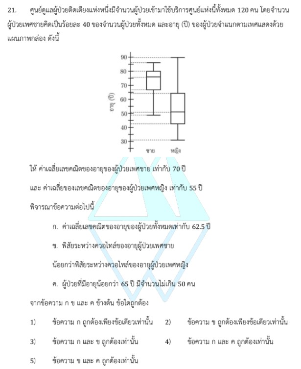

# การแก้โจทย์ข้อ 21 ของข้อสอบ A-Level คณิตศาสตร์ 1 ปี 2566

เป็นเรื่องเกี่ยวกับ **สถิติ (Statistics)** โดยมีการใช้ความรู้เรื่องค่าเฉลี่ยเลขคณิตรวม และการวิเคราะห์ข้อมูลจากแผนภาพกล่อง (Box Plot) ครับ

## **โจทย์ข้อ 21**

ศูนย์ดูแลผู้ป่วยมีผู้ป่วยทั้งหมด 120 คน เป็นเพศชาย 40% มีอายุเฉลี่ย 70 ปี และเพศหญิงมีอายุเฉลี่ย 55 ปี โดยมีแผนภาพกล่องแสดงช่วงอายุประกอบ,
**พิจารณาข้อความต่อไปนี้:**

* **ก.** ค่าเฉลี่ยเลขคณิตของอายุผู้ป่วยทั้งหมดเท่ากับ 62.5 ปี
* **ข.** พิสัยระหว่างควอไทล์ (IQR) ของอายุผู้ป่วยเพศชายน้อยกว่าเพศหญิง
* **ค.** ผู้ป่วยที่มีอายุน้อยกว่า 65 ปี มีจำนวนไม่เกิน 50 คน

---

### **วิธีทำอย่างละเอียด**

**ขั้นตอนที่ 1: คำนวณจำนวนผู้ป่วยแต่ละเพศ**

* ผู้ป่วยทั้งหมด ($n_{รวม}$) = 120 คน
* ผู้ป่วยเพศชาย ($n_{ชาย}$) = 40% ของ 120 = $\frac{40}{100} \times 120 = \mathbf{48}$ **คน**
* ผู้ป่วยเพศหญิง ($n_{หญิง}$) = $120 - 48 = \mathbf{72}$ **คน**

**ขั้นตอนที่ 2: ตรวจสอบข้อความ ก (ค่าเฉลี่ยเลขคณิตรวม)**
ใช้สูตร $\bar{x}_{รวม} = \frac{n_1\bar{x}_1 + n_2\bar{x}_2}{n_1 + n_2}$

* $\bar{x}_{รวม} = \frac{(48 \times 70) + (72 \times 55)}{120}$
* $\bar{x}_{รวม} = \frac{3,360 + 3,960}{120} = \frac{7,320}{120} = \mathbf{61}$ **ปี**
* **สรุป:** ข้อความ ก **ผิด** (เพราะโจทย์ระบุว่า 62.5 ปี)

**ขั้นตอนที่ 3: ตรวจสอบข้อความ ข (พิสัยระหว่างควอไทล์ - IQR)**

* **นิยาม:** พิสัยระหว่างควอไทล์คือความยาวของรูปสี่เหลี่ยม (ตัวกล่อง) ในแผนภาพกล่อง ($Q_3 - Q_1$)
* **การวิเคราะห์:** เมื่อสังเกตจากแผนภาพกล่องในโจทย์ พบว่าความยาวของกล่องผู้ป่วยชายสั้นกว่าความยาวของกล่องผู้ป่วยหญิง
* **สรุป:** ข้อความ ข **ถูกต้อง**

**ขั้นตอนที่ 4: ตรวจสอบข้อความ ค (จำนวนผู้ป่วยที่มีอายุน้อยกว่า 65 ปี)**

* ในแผนภาพกล่อง ข้อมูลแต่ละส่วน (แบ่งโดยควอไทล์) จะมีจำนวนข้อมูลอยู่ 25% เสมอ
* **พิจารณาเพศหญิง ($n=72$):** จากแผนภาพ อายุ 65 ปีอยู่สูงกว่าตำแหน่ง $Q_3$ เล็กน้อย หมายความว่ามีผู้หญิงที่มีอายุน้อยกว่า 65 ปี อยู่ประมาณ 3 ส่วนของกล่อง (75%)
* คำนวณจำนวนผู้หญิง: $75\% \times 72 = \mathbf{54}$ **คน**
* เนื่องจากแค่จำนวนผู้หญิงก็เกิน 50 คนแล้ว (54 > 50) จึงไม่ต้องรวมจำนวนผู้ชายก็สรุปได้ทันที
* **สรุป:** ข้อความ ค **ผิด**

**ตอบ:** ข้อความ **ข ถูกต้องเพียงข้อเดียวเท่านั้น** (ตรงกับตัวเลือกที่ 2)

---

### **เนื้อหาที่เกี่ยวข้องเพื่อศึกษาเพิ่มเติม**

**1. ค่าเฉลี่ยเลขคณิตรวม (Combined Mean):**
คือการหาค่าเฉลี่ยของกลุ่มตัวอย่างที่ทราบจำนวน ($n$) และค่าเฉลี่ย ($\bar{x}$) ของแต่ละกลุ่มย่อยอยู่แล้ว ช่วยให้หาภาพรวมของข้อมูลทั้งหมดได้โดยไม่ต้องมีข้อมูลรายบุคคล

**2. แผนภาพกล่อง (Box Plot):**

* **$Q_1, Q_2, Q_3$:** แบ่งข้อมูลออกเป็น 4 ส่วน ส่วนละ 25%
* **IQR (Interquartile Range):** คือความกว้างของข้อมูล 50% ตรงกลาง ใช้เพื่อดูการกระจายตัวของข้อมูลส่วนใหญ่โดยไม่ถูกรบกวนจากค่าที่สูงหรือต่ำผิดปกติ

### **กลยุทธ์แก้โจทย์ประเภทนี้**

* **วิเคราะห์ร้อยละก่อน:** ในโจทย์สถิติที่ให้มาเป็นเปอร์เซ็นต์ ให้รีบเปลี่ยนเป็นจำนวนจริง ($n$) เพื่อใช้ในสูตรถัดไป
* **ใช้สมบัติ 25%:** จำไว้ว่าพื้นที่แต่ละส่วนของแผนภาพกล่อง "มีจำนวนคนเท่ากัน" เสมอ แม้ความกว้างในรูปจะไม่เท่ากันก็ตาม เทคนิคนี้ช่วยให้ประมาณจำนวนคนได้รวดเร็ว
* **เปรียบเทียบเชิงภาพ:** โจทย์เรื่อง IQR มักไม่ต้องการตัวเลขที่แม่นยำ แต่ต้องการให้เรา "มอง" ความยาวของกล่องเพื่อเปรียบเทียบการกระจายตัวครับ
