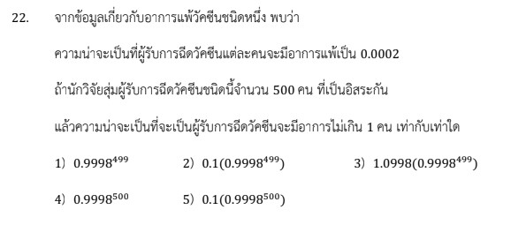

# โจทย์ข้อ 22 - การแจกแจงทวินาม

การแก้โจทย์ข้อ 22 ของวิชาคณิตศาสตร์ประยุกต์ 1 (A-Level) ปี 2566 เป็นเรื่องเกี่ยวกับ **การแจกแจงทวินาม (Binomial Distribution)** ซึ่งเป็นส่วนหนึ่งของสถิติและความน่าจะเป็นครับ

### **โจทย์ข้อ 22**

จากข้อมูลเกี่ยวกับอาการแพ้วัคซีนชนิดหนึ่ง พบว่าความน่าจะเป็นที่ผู้รับการฉีดวัคซีนแต่ละคนจะมีอาการแพ้เป็น 0.0002 ถ้านักวิจัยสุ่มผู้รับการฉีดวัคซีนชนิดนี้จำนวน 500 คน ที่เป็นอิสระกัน แล้วความน่าจะเป็นที่จะเป็นผู้รับการฉีดวัคซีนจะมีอาการไม่เกิน 1 คน เท่ากับเท่าใด

---

### **วิธีทำอย่างละเอียด**

**ขั้นตอนที่ 1: วิเคราะห์และกำหนดตัวแปร**
โจทย์ข้อนี้เป็นการทดลองซ้ำๆ ที่เป็นอิสระต่อกัน และมีผลลัพธ์เพียง 2 อย่าง (แพ้หรือไม่แพ้) จึงเข้าข่าย **การแจกแจงทวินาม $X \sim B(n, p)$**

* **$n$ (จำนวนการสุ่ม):** 500 คน
* **$p$ (ความน่าจะเป็นที่จะแพ้):** 0.0002
* **$q$ (ความน่าจะเป็นที่ไม่แพ้):** $1 - p = 1 - 0.0002 = 0.9998$
* **สิ่งที่โจทย์ถาม:** ความน่าจะเป็นที่มีอาการ **"ไม่เกิน 1 คน"** หมายถึง $P(X \leq 1)$ ซึ่งเท่ากับ $P(X = 0) + P(X = 1)$

**ขั้นตอนที่ 2: ใช้สูตรการแจกแจงทวินาม**
สูตรคือ $P(X = k) = \binom{n}{k} p^k q^{n-k}$

1. **หา $P(X = 0)$:**
    $$P(X = 0) = \binom{500}{0} (0.0002)^0 (0.9998)^{500}$$
    $$P(X = 0) = 1 \cdot 1 \cdot (0.9998)^{500} = (0.9998)^{500}$$
2. **หา $P(X = 1)$:**
    $$P(X = 1) = \binom{500}{1} (0.0002)^1 (0.9998)^{499}$$
    $$P(X = 1) = 500 \cdot (0.0002) \cdot (0.9998)^{499}$$
    คำนวณ $500 \times 0.0002 = 0.1$ จะได้ $P(X = 1) = 0.1(0.9998)^{499}$

**ขั้นตอนที่ 3: รวมผลลัพธ์และจัดรูปตามตัวเลือก**
$$P(X \leq 1) = (0.9998)^{500} + 0.1(0.9998)^{499}$$
ดึงตัวร่วม **$(0.9998)^{499}$** ออกมา:
$$P(X \leq 1) = (0.9998)^{499} [0.9998 + 0.1]$$
$$P(X \leq 1) = (0.9998)^{499} [1.0998]$$
**$P(X \leq 1) = 1.0998(0.9998)^{499}$**

**ตอบ:** ตัวเลือกที่ 3) $1.0998(0.9998^{499})$

---

### **เนื้อหาที่เกี่ยวข้องเพื่อศึกษาเพิ่มเติม**

**1. นิยามของการแจกแจงทวินาม:**

* ประกอบด้วยการทดลอง $n$ ครั้งที่เหมือนกัน
* แต่ละครั้งมีผลลัพธ์เพียง 2 แบบ คือ "สำเร็จ" ($p$) และ "ไม่สำเร็จ" ($q$)
* การทดลองแต่ละครั้งต้องเป็น **อิสระต่อกัน (Independent)**

**2. ความหมายของตัวแปรและค่าคงที่:**

* **$\binom{n}{k}$:** จำนวนวิธีในการเลือกที่เกิดผลสำเร็จ $k$ ครั้ง จากการทดลอง $n$ ครั้ง
* **$p^k$:** ความน่าจะเป็นที่สำเร็จ $k$ ครั้ง
* **$q^{n-k}$:** ความน่าจะเป็นที่ไม่สำเร็จในครั้งที่เหลือ

### **กลยุทธ์แก้โจทย์ประเภทนี้**

* **สังเกตคำสำคัญ:** "สุ่ม...คน", "ที่เป็นอิสระกัน", "ความน่าจะเป็นแต่ละคนเป็น..." คำเหล่านี้บ่งบอกชัดเจนว่าต้องใช้การแจกแจงทวินาม
* **จัดการกับ "ไม่เกิน" หรือ "อย่างน้อย":** ต้องแยกคิดเป็นกรณีๆ แล้วนำมาบวกกัน (เช่น ไม่เกิน 1 คือ 0 กับ 1)
* **เทคนิคการจัดรูป:** โจทย์ A-Level มักไม่ให้เราคิดเลขยกกำลังเยอะๆ แต่จะให้ติดรูปไว้ การฝึก **"ดึงตัวร่วม"** เพื่อจัดรูปให้ตรงกับตัวเลือกเป็นทักษะที่สำคัญมากครับ

---

### **ตัวอย่างโจทย์เพิ่มเติมเพื่อฝึกทำ**

**โจทย์:** ความน่าจะเป็นที่เมล็ดพันธุ์ข้าวโพดจะงอกเป็น 0.8 ถ้าสุ่มเมล็ดพันธุ์มา 10 เมล็ด จงหาความน่าจะเป็นที่มีเมล็ดงอก 9 เมล็ด (ติดรูปเลขยกกำลัง)

**เฉลย:**

1. กำหนด $n = 10, p = 0.8, q = 0.2$
2. ต้องการ $P(X = 9)$
3. ใช้สูตร: $\binom{10}{9} (0.8)^9 (0.2)^1$
4. คำนวณ: $10 \cdot (0.8)^9 \cdot (0.2) = 2(0.8)^9$
**ตอบ:** $2(0.8)^9$

การทำความเข้าใจที่มาของตัวเลข 0.1 และการจัดรูปเลขยกกำลังในข้อ 22 นี้ จะช่วยให้คุณพร้อมสำหรับโจทย์สถิติในระดับที่สูงขึ้นครับ

---
การดึงตัวร่วมในโจทย์ข้อ 22 เรื่องการแจกแจงทวินาม มีหัวใจสำคัญอยู่ที่การจัดการกับ **เลขยกกำลัง** เพื่อให้ได้รูปผลลัพธ์ที่ตรงกับตัวเลือกในข้อสอบครับ โดยมีขั้นตอนโดยละเอียดดังนี้

### **1. ที่มาของพจน์ตั้งต้น**

จากการคำนวณหาความน่าจะเป็นที่ผู้รับวัคซีนจะมีอาการแพ้ไม่เกิน 1 คน ($P(X \leq 1)$) เราจะได้ผลบวกของ 2 กรณี คือ:

* **กรณีไม่มีคนแพ้เลย ($P(X=0)$):** $(0.9998)^{500}$
* **กรณีมีคนแพ้ 1 คน ($P(X=1)$):** $0.1(0.9998)^{499}$ (ซึ่ง $0.1$ มาจาก $500 \times 0.0002$)

จะได้สมการคือ: **$(0.9998)^{500} + 0.1(0.9998)^{499}$**

### **2. วิธีการดึงตัวร่วม (Step-by-Step)**

เป้าหมายคือการดึงพจน์ที่มีเลขยกกำลังน้อยกว่าออกมา เพื่อจัดรูปให้ง่ายขึ้น

* **ขั้นที่ 1: กระจายเลขยกกำลัง**
    เราสามารถแยก $(0.9998)^{500}$ ให้อยู่ในรูปที่มีกำลัง $499$ ได้ตามสมบัติ $a^m = a^{m-n} \cdot a^n$:
    $$(0.9998)^{500} = (0.9998)^{499} \cdot (0.9998)^1$$
* **ขั้นที่ 2: เขียนสมการใหม่โดยใช้พจน์ที่กระจายแล้ว**
    จากเดิม $(0.9998)^{500} + 0.1(0.9998)^{499}$
    เปลี่ยนเป็น **$[(0.9998)^{499} \cdot 0.9998] + [0.1 \cdot (0.9998)^{499}]$**
* **ขั้นที่ 3: ดึงตัวร่วม $(0.9998)^{499}$ ออกมา**
    เมื่อดึงตัวร่วมที่เหมือนกันออกไปไว้หน้าวงเล็บ จะเหลือค่าในวงเล็บดังนี้:
    $$(0.9998)^{499} \times [0.9998 + 0.1]$$
* **ขั้นที่ 4: คำนวณค่าในวงเล็บ**
    นำ $0.9998 + 0.1 = 1.0998$

### **3. ผลลัพธ์สุดท้าย**

เมื่อนำมารวมกันจะได้รูปคำตอบคือ:
**$1.0998(0.9998)^{499}$** ซึ่งตรงกับ **ตัวเลือกที่ 3** ในข้อสอบครับ

**กลยุทธ์เพิ่มเติม:** ในการสอบ A-Level หากเจอโจทย์ที่ติดรูปเลขยกกำลังจำนวนมากแบบนี้ ให้สังเกต **ตัวเลือก (Choices)** ก่อนเสมอ หากทุกตัวเลือกติดพจน์ยกกำลังที่น้อยกว่า (เช่น $499$) ให้เราพยายามแยกพจน์ที่มีกำลังมากกว่า (เช่น $500$) ออกมาเป็น $n-1$ และ $1$ เพื่อให้สามารถดึงตัวร่วมได้ทันทีครับ

---

สูตรและหลักการสำคัญที่ใช้ในการแก้โจทย์ **A-Level คณิตศาสตร์ 1 ปี 2566 ข้อ 22** เรื่องการแจกแจงทวินาม มีดังนี้ครับ:

**1. สูตรการแจกแจงทวินาม (Binomial Distribution)**
โจทย์ข้อนี้เป็นการสุ่มตัวอย่างที่มีผลลัพธ์ 2 แบบ (แพ้หรือไม่แพ้) และแต่ละครั้งเป็นอิสระต่อกัน จึงใช้สูตร:
$$P(X = k) = \binom{n}{k} p^k q^{n-k}$$

* **$n$:** จำนวนครั้งของการทดลองหรือจำนวนที่สุ่มมา (ในข้อนี้คือ **500**)
* **$k$:** จำนวนครั้งที่เกิดผลสำเร็จตามที่สนใจ (ในข้อนี้คือจำนวนคนที่มีอาการแพ้)
* **$p$:** ความน่าจะเป็นที่เกิดผลสำเร็จในแต่ละครั้ง (ในข้อนี้คือ **0.0002**)
* **$q$:** ความน่าจะเป็นที่ไม่เกิดผลสำเร็จ ($1 - p$) (ในข้อนี้คือ **0.9998**)

**2. สูตรการเลือก (Combination)**
ใช้เพื่อหาจำนวนวิธีในการเกิดเหตุการณ์ $k$ ครั้ง:

* **$\binom{n}{0} = 1$:** สำหรับกรณีไม่มีคนแพ้เลย ($k=0$)
* **$\binom{n}{1} = n$:** สำหรับกรณีมีคนแพ้ 1 คน ($k=1$)

**3. หลักการ "ไม่เกิน 1 คน"**
โจทย์ถามหาความน่าจะเป็นที่ผู้รับวัคซีนจะมีอาการไม่เกิน 1 คน ซึ่งหมายถึงการรวม 2 กรณีเข้าด้วยกัน:
$$P(X \leq 1) = P(X = 0) + P(X = 1)$$

**4. สมบัติของเลขยกกำลังและการดึงตัวร่วม**
ในการจัดรูปคำตอบให้ตรงกับตัวเลือก ต้องใช้สมบัติ $a^n = a^{n-1} \cdot a^1$ เพื่อแยกพจน์และดึงตัวร่วมที่มีกำลังน้อยกว่าออกมา:

* $(0.9998)^{500} = (0.9998)^{499} \cdot (0.9998)^1$
* นำไปบวกกับ $0.1(0.9998)^{499}$ แล้วดึงตัวร่วม $(0.9998)^{499}$ ออกมา

**สรุปพจน์ที่ต้องคำนวณ:**

1. **กรณี $k=0$:** $1 \cdot (0.0002)^0 \cdot (0.9998)^{500} = (0.9998)^{500}$
2. **กรณี $k=1$:** $500 \cdot (0.0002)^1 \cdot (0.9998)^{499} = 0.1(0.9998)^{499}$
3. **ผลรวม:** $(0.9998)^{499} [0.9998 + 0.1] = \mathbf{1.0998(0.9998)^{499}}$

---

การใช้สูตรการแจกแจงทวินาม (Binomial Distribution) ในการแก้โจทย์ข้อ 22 ของข้อสอบ A-Level คณิตศาสตร์ 1 ปี 2566 มีหลักการและขั้นตอนที่สำคัญดังนี้ครับ

### **1. เหตุผลที่ใช้การแจกแจงทวินาม**

โจทย์ข้อนี้ระบุเงื่อนไขที่ครบถ้วนสำหรับการแจกแจงทวินาม ได้แก่:

* มีการทดลองที่เหมือนกันซ้ำๆ กันทั้งหมด $n$ ครั้ง (สุ่มผู้รับวัคซีน 500 คน)
* การสุ่มแต่ละคนเป็น **อิสระต่อกัน**
* ในแต่ละครั้งมีผลลัพธ์เพียง 2 แบบ คือ "สำเร็จ" (แพ้วัคซีน) หรือ "ไม่สำเร็จ" (ไม่แพ้วัคซีน)
* ความน่าจะเป็นที่จะแพ้วัคซีน ($p$) มีค่าคงที่สำหรับทุกคน

### **2. โครงสร้างสูตรและการกำหนดตัวแปร**

สูตรความน่าจะเป็นสำหรับการแจกแจงทวินามคือ:
$$P(X = k) = \binom{n}{k} p^k q^{n-k}$$

โดยที่ตัวแปรในโจทย์ข้อนี้คือ:

* **$n = 500$:** จำนวนคนทั้งหมดที่สุ่มมา
* **$p = 0.0002$:** ความน่าจะเป็นที่แต่ละคนจะแพ้วัคซีน
* **$q = 1 - p = 0.9998$:** ความน่าจะเป็นที่แต่ละคนจะไม่แพ้วัคซีน
* **$k$:** จำนวนคนที่มีอาการแพ้ ซึ่งโจทย์ต้องการแบบ **"ไม่เกิน 1 คน"** หมายถึงต้องหาผลรวมของกรณี $k=0$ และ $k=1$

### **3. ขั้นตอนการแทนค่าและคำนวณ**

**กรณีที่ 1: ไม่มีผู้มีอาการแพ้เลย ($k=0$)**
$$P(X = 0) = \binom{500}{0} (0.0002)^0 (0.9998)^{500-0}$$
$$P(X = 0) = 1 \cdot 1 \cdot (0.9998)^{500} = \mathbf{0.9998^{500}}$$

**กรณีที่ 2: มีผู้มีอาการแพ้ 1 คน ($k=1$)**
$$P(X = 1) = \binom{500}{1} (0.0002)^1 (0.9998)^{500-1}$$
$$P(X = 1) = 500 \cdot (0.0002) \cdot (0.9998)^{499}$$
คำนวณ $500 \times 0.0002 = 0.1$ จะได้ $P(X = 1) = \mathbf{0.1(0.9998^{499})}$

### **4. การจัดรูปคำตอบให้ตรงกับตัวเลือก**

โจทย์ต้องการความน่าจะเป็นรวมคือ $P(X=0) + P(X=1)$:
$$\text{ความน่าจะเป็น} = 0.9998^{500} + 0.1(0.9998^{499})$$

ใช้สมบัติเลขยกกำลังแยก $0.9998^{500}$ เป็น $(0.9998^{499} \cdot 0.9998^1)$ เพื่อดึงตัวร่วม:
$$\text{ความน่าจะเป็น} = (0.9998^{499} \cdot 0.9998) + 0.1(0.9998^{499})$$
$$\text{ความน่าจะเป็น} = 0.9998^{499} [0.9998 + 0.1]$$
$$\text{ความน่าจะเป็น} = \mathbf{1.0998(0.9998^{499})}$$

**สรุป:** คำตอบที่ถูกต้องคือ **ตัวเลือกที่ 3** ซึ่งได้มาจากการแทนค่าลงในสูตรทวินามทีละกรณีแล้วนำมาบวกกันพร้อมจัดรูปโดยการดึงตัวร่วมครับ
