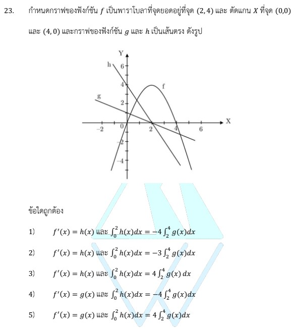

# โจทย์ข้อ 23 วิชาคณิตศาสตร์ประยุกต์ 1 (A-Level) ปี 2566

การแก้โจทย์ข้อ 23 เป็นเรื่องเกี่ยวกับ **แคลคูลัส (Calculus)** โดยต้องใช้ความรู้เรื่องการหาฟังก์ชันพาราโบลา สมการเส้นตรง การหาอนุพันธ์ และการอินทิเกรตจำกัดเขตจากกราฟครับ

### **เฉลยละเอียดโจทย์ข้อ 23**

**โจทย์:** กำหนดกราฟฟังก์ชัน $f$ เป็นพาราโบลาที่มีจุดยอดที่ $(2, 4)$ ตัดแกน $X$ ที่ $(0, 0)$ และ $(4, 0)$ ส่วนกราฟ $g$ และ $h$ เป็นเส้นตรง ดังรูป พิจารณาว่าข้อความใดถูกต้อง,

---

**วิธีทำอย่างละเอียด:**

**ขั้นตอนที่ 1: หาสมการพาราโบลา $f(x)$**

* พาราโบลามีจุดยอด $(h, k) = (2, 4)$ ใช้รูปสมการ $f(x) = a(x - h)^2 + k$
* แทนค่า: $f(x) = a(x - 2)^2 + 4$
* หาค่า $a$ โดยแทนจุดที่กราฟผ่านคือ $(0, 0)$:
    $0 = a(0 - 2)^2 + 4 \implies 0 = 4a + 4 \implies a = -1$
* จะได้ $f(x) = -1(x - 2)^2 + 4 = -(x^2 - 4x + 4) + 4 = \mathbf{-x^2 + 4x}$

**ขั้นตอนที่ 2: หาอนุพันธ์ $f'(x)$**

* จาก $f(x) = -x^2 + 4x$ จะได้ $f'(x) = \frac{d}{dx}(-x^2 + 4x) = \mathbf{-2x + 4}$

**ขั้นตอนที่ 3: หาสมการเส้นตรง $h(x)$ และ $g(x)$ จากกราฟ**

* **ฟังก์ชัน $h$:** เป็นเส้นตรงที่ผ่านจุด $(0, 4)$ และ $(2, 0)$
  * ความชัน $m = \frac{0 - 4}{2 - 0} = -2$
  * สมการคือ $y - 0 = -2(x - 2) \implies h(x) = \mathbf{-2x + 4}$
* **ฟังก์ชัน $g$:** เป็นเส้นตรงที่ผ่านจุด $(0, 1)$ และ $(2, 0)$
  * ความชัน $m = \frac{0 - 1}{2 - 0} = -1/2$
  * สมการคือ $y - 0 = -1/2(x - 2) \implies g(x) = \mathbf{-1/2x + 1}$
* **สังเกต:** จะพบว่า **$f'(x) = h(x)$**

**ขั้นตอนที่ 4: คำนวณค่าอินทิเกรตเพื่อเช็คความสัมพันธ์**

1. **คำนวณ $\int_0^4 f(x) \, dx$:**
    $$\int_0^4 (-x^2 + 4x) \, dx = \left[ -\frac{x^3}{3} + 2x^2 \right]_0^4 = \left( -\frac{64}{3} + 32 \right) - 0 = \mathbf{\frac{32}{3}}$$
2. **คำนวณ $\int_0^2 g(x) \, dx$:**
    $$\int_0^2 (-\frac{1}{2}x + 1) \, dx = \left[ -\frac{x^2}{4} + x \right]_0^2 = \left( -1 + 2 \right) - 0 = \mathbf{1}$$
3. **ความสัมพันธ์:** จะเห็นว่า $\int_0^4 f(x) \, dx = \frac{32}{3}$ ซึ่งเท่ากับ $\frac{32}{3} \times \int_0^2 g(x) \, dx$

**สรุปคำตอบ:** ข้อความที่ถูกต้องคือ **$f'(x) = h(x)$ และ $\int_0^4 f(x) \, dx = \frac{32}{3} \int_0^2 g(x) \, dx$** (ตรงกับตัวเลือกที่ 1)

---

### **เนื้อหาที่เกี่ยวข้องเพื่อศึกษาเพิ่มเติม**

**1. สูตรและนิยามที่สำคัญ:**

* **รูปสมการพาราโบลา:** $y = a(x-h)^2 + k$ เมื่อ $(h, k)$ คือจุดยอด ถ้า $a < 0$ กราฟจะคว่ำ
* **สมการเส้นตรง:** $y = mx + c$ โดยที่ $m$ คือความชัน และ $c$ คือจุดตัดแกน $Y$
* **อนุพันธ์ (Derivative):** การหาความชันของเส้นสัมผัสโค้ง ณ จุดใดๆ $f'(x)$
* **อินทิเกรตจำกัดเขต (Definite Integral):** การหาพื้นที่ใต้กราฟในช่วงที่กำหนด

**2. ความหมายของตัวแปร:**

* **$f'(x)$:** อัตราการเปลี่ยนแปลงของ $f$ หรือความชันของกราฟ $f$ ณ จุด $x$
* **$\int_a^b f(x) \, dx$:** ผลรวมสะสมของค่าฟังก์ชันจาก $x=a$ ถึง $x=b$

### **กลยุทธ์แก้โจทย์ประเภทนี้**

* **สร้างฟังก์ชันจากกราฟ:** ขั้นตอนแรกที่สำคัญที่สุดคือการเปลี่ยนข้อมูลภาพ (จุดยอด, จุดตัด) ให้เป็นสมการคณิตศาสตร์ให้ได้
* **ตรวจสอบอนุพันธ์ก่อน:** การเช็คว่า $f'(x)$ ตรงกับฟังก์ชันเส้นตรงใด ($g$ หรือ $h$) จะช่วยตัดตัวเลือกผิดออกไปได้ครึ่งหนึ่งทันที
* **ใช้สมบัติเชิงเรขาคณิต:** บางครั้งการหาค่าอินทิเกรตของเส้นตรง สามารถใช้สูตรพื้นที่สามเหลี่ยม $(\frac{1}{2} \times \text{ฐาน} \times \text{สูง})$ แทนการอินทิเกรตเพื่อความรวดเร็วได้ เช่น $\int_0^2 g(x) \, dx$ คือพื้นที่สามเหลี่ยมที่มีฐาน 2 สูง 1 ซึ่งเท่ากับ 1 พอดี

---

### **ตัวอย่างโจทย์เพิ่มเติมเพื่อฝึกทำ**

**โจทย์:** กำหนด $f(x) = -x^2 + 2x$ จงหาฟังก์ชันเส้นตรง $L(x)$ ที่มีค่าเท่ากับ $f'(x)$ และจงหาค่าของ $\int_0^2 f(x) \, dx$

**เฉลย:**

1. **หา $L(x)$:** $f'(x) = -2x + 2$ ดังนั้น $L(x) = -2x + 2$
2. **หาอินทิเกรต:** $\int_0^2 (-x^2 + 2x) \, dx = [-\frac{x^3}{3} + x^2]_0^2 = (-\frac{8}{3} + 4) = 4/3$
**ตอบ:** $L(x) = -2x + 2$ และค่าอินทิเกรตคือ $4/3$

การฝึกหาสมการจากกราฟจะช่วยให้คุณทำคะแนนในหัวข้อแคลคูลัสประยุกต์ได้แม่นยำขึ้นครับ
