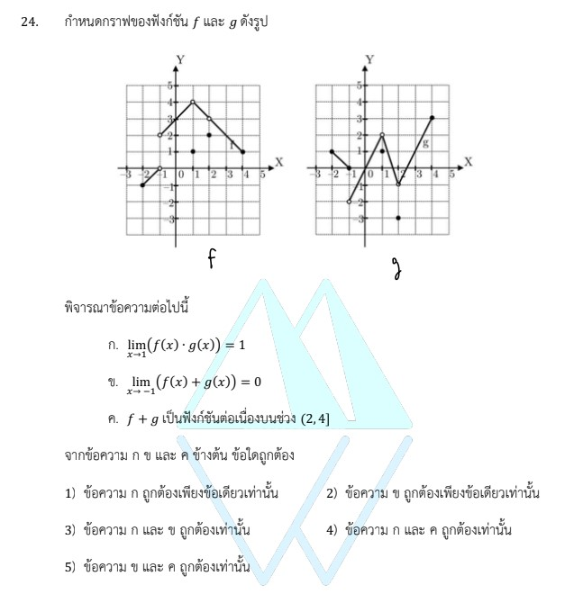

# การแก้โจทย์ข้อ 24 ของวิชาคณิตศาสตร์ประยุกต์ 1 (A-Level) ปี 2566

การแก้โจทย์ข้อ 24 ของวิชาคณิตศาสตร์ประยุกต์ 1 (A-Level) ปี 2566 เป็นเรื่องเกี่ยวกับ **แคลคูลัส (Calculus)** ในหัวข้อ **ลิมิต (Limits)** และ **ความต่อเนื่องของฟังก์ชัน (Continuity)** โดยเน้นการอ่านค่าจากกราฟและวิเคราะห์สมบัติต่างๆ ครับ

---

## เฉลยละเอียดโจทย์ข้อ 24

**โจทย์:** กำหนดกราฟของฟังก์ชัน $f$ และ $g$ มาให้ (ดังปรากฏในรูปประกอบโจทย์) พิจารณาข้อความต่อไปนี้:

* **ก.** $\lim_{x \to 1} [f(x) \cdot g(x)] = 1$
* **ข.** $\lim_{x \to -1} [f(x) + g(x)] = 0$
* **ค.** $f + g$ เป็นฟังก์ชันต่อเนื่องบนช่วง $(2, 4]$

---

**วิธีทำอย่างละเอียด:**

**ขั้นตอนที่ 1: ตรวจสอบข้อความ ก (ลิมิตของผลคูณที่ $x \to 1$)**
จากกราฟ ให้พิจารณาค่าลิมิต (แนวโน้มของกราฟเข้าใกล้ค่าใด) ไม่ใช่จุดทึบ:

1. **พิจารณา $f(x)$ ที่ $x \to 1$:** กราฟ $f$ วิ่งเข้าหาค่า $y = 4$ (แม้มียุดโปร่งที่นั่น) ดังนั้น $\lim_{x \to 1} f(x) = 4$
2. **พิจารณา $g(x)$ ที่ $x \to 1$:** กราฟ $g$ วิ่งเข้าหาค่า $y = 2$ (มียุดโปร่งที่นั่น) ดังนั้น $\lim_{x \to 1} g(x) = 2$
3. **หาผลคูณ:** $\lim_{x \to 1} [f(x) \cdot g(x)] = 4 \times 2 = \mathbf{8}$

* **สรุป:** ข้อความ ก **ผิด** (เพราะโจทย์ระบุว่าเท่ากับ 1)

**ขั้นตอนที่ 2: ตรวจสอบข้อความ ข (ลิมิตของผลบวกที่ $x \to -1$)**
ลิมิตจะหาค่าได้ก็ต่อเมื่อ ลิมิตซ้าย ($x \to -1^-$) และลิมิตขวา ($x \to -1^+$) ต้องเท่ากัน:

1. **ลิมิตซ้าย ($x \to -1^-$):**
    * $f(x) \to 2$ และ $g(x) \to 0$
    * ผลบวกคือ $2 + 0 = \mathbf{2}$
2. **ลิมิตขวา ($x \to -1^+$):**
    * $f(x) \to 2$ และ $g(x) \to -2$
    * ผลบวกคือ $2 + (-2) = \mathbf{0}$
3. **สรุปค่าลิมิต:** เนื่องจากลิมิตซ้าย (2) ไม่เท่ากับลิมิตขวา (0) ดังนั้น $\lim_{x \to -1} [f(x) + g(x)]$ **หาค่าไม่ได้**

* **สรุป:** ข้อความ ข **ผิด** (โจทย์ระบุว่าเป็น 0)

**ขั้นตอนที่ 3: ตรวจสอบข้อความ ค (ความต่อเนื่องบนช่วง $(2, 4]$)**

1. บนช่วงเปิด 2 ถึงปิด 4 $(2, 4]$ ให้ดูว่ากราฟขาดตอนหรือไม่
2. **กราฟ $f$:** เป็นเส้นตรงเส้นเดียวที่ต่อเนื่องกันตลอดในช่วง $x$ ตั้งแต่ 2 ถึง 4
3. **กราฟ $g$:** เป็นเส้นตรงเส้นเดียวที่ต่อเนื่องกันตลอดในช่วง $x$ ตั้งแต่ 2 ถึง 4
4. ตามสมบัติของฟังก์ชัน: ถ้า $f$ และ $g$ ต่อเนื่องบนช่วงใดๆ แล้ว **ฟังก์ชันผลบวก ($f+g$) จะต้องต่อเนื่องบนช่วงนั้นด้วย**

* **สรุป:** ข้อความ ค **ถูกต้อง**

**ตอบ:** ข้อความ **ค. ถูกต้องเพียงข้อเดียวเท่านั้น** (ตรงกับตัวเลือกที่เกี่ยวข้องในข้อสอบ)

---

### **เนื้อหาที่เกี่ยวข้องเพื่อศึกษาเพิ่มเติม**

**1. นิยามของลิมิต (Definition of Limit):**
$\lim_{x \to a} f(x) = L$ หมายถึง เมื่อ $x$ มีค่าเข้าใกล้ $a$ มากๆ (แต่ไม่เท่ากับ $a$) แล้วค่าของ $f(x)$ จะเข้าใกล้ค่า $L$

* **จุดสำคัญ:** ลิมิตไม่สนใจว่าที่จุด $x = a$ ฟังก์ชันจะมีค่าเท่าไหร่ หรือจะเป็นจุดโปร่งหรือไม่ ให้ดูตาม "เส้น" ของกราฟเท่านั้น

**2. ความต่อเนื่องของฟังก์ชัน (Continuity):**
ฟังก์ชันจะต่อเนื่องที่จุด $x = a$ เมื่อ:

1. $f(a)$ หาค่าได้ (มีจุดทึบ)
2. $\lim_{x \to a} f(x)$ หาค่าได้ (ลิมิตซ้าย = ลิมิตขวา)
3. $f(a) = \lim_{x \to a} f(x)$

**3. สมบัติของลิมิตและฟังก์ชันต่อเนื่อง:**

* $\lim (f \pm g) = \lim f \pm \lim g$
* $\lim (f \cdot g) = \lim f \cdot \lim g$
* ผลบวก, ผลต่าง, และผลคูณของฟังก์ชันที่ต่อเนื่อง จะเป็นฟังก์ชันที่ต่อเนื่องเสมอ

---

### **กลยุทธ์แก้โจทย์ประเภทนี้**

* **แยกแยะ "จุด" กับ "ลิมิต":** อย่าหลงกลจุดทึบที่วางแยกไว้ ลิมิตให้ดูที่ปลายเส้นกราฟว่าพุ่งไปหาเลขใด
* **เช็คซ้าย-ขวาเสมอ:** เมื่อเจอโจทย์ลิมิตที่จุดซึ่งกราฟกระโดด (เช่นที่ $x = -1$ ในข้อนี้) ต้องเช็คลิมิตทั้งสองฝั่งเสมอ
* **มองช่วงความต่อเนื่อง:** ความต่อเนื่องบนช่วง $(a, b]$ หมายความว่าต้องต่อเนื่องทุกจุดภายในช่วง และต่อเนื่องทางซ้ายที่จุด $b$ ด้วย

---

### **ตัวอย่างโจทย์เพิ่มเติมเพื่อฝึกทำ**

**โจทย์:** จากกราฟเดิม จงหาค่าของ $\lim_{x \to 1} \frac{f(x)}{g(x)}$
**เฉลย:**

1. หา $\lim_{x \to 1} f(x) = 4$
2. หา $\lim_{x \to 1} g(x) = 2$
3. นำมาหารกัน: $4 / 2 = 2$
**ตอบ:** 2

**หมายเหตุ:** ข้อมูลกราฟและรายละเอียดการวิเคราะห์อ้างอิงจากแหล่งข้อมูลข้อสอบปี 2566 และบันทึกช่วยจำการแก้โจทย์แคลคูลัสพื้นฐานครับ

---

สรุปสูตรและหลักการสำคัญทางแคลคูลัสที่ปรากฏในโจทย์ข้อ 23 และ 24 ของข้อสอบ A-Level คณิตศาสตร์ 1 ปี 2566 มีรายละเอียดดังนี้ครับ

### **1. สูตรและหลักการจากข้อ 23 (อนุพันธ์และอินทิเกรต)**

โจทย์ข้อนี้เน้นการสร้างฟังก์ชันจากกราฟพาราโบลาและการหาค่าสะสมผ่านการอินทิเกรต:

* **การหาสมการพาราโบลาจากจุดยอด:** เมื่อทราบจุดยอด $(h, k)$ จะใช้สูตร **$f(x) = a(x - h)^2 + k$** โดยในข้อนี้จุดยอดคือ $(2, 4)$ จึงได้ $f(x) = a(x - 2)^2 + 4$
* **สูตรการหาอนุพันธ์ (Derivative):** ใช้กฎกำลังพื้นฐาน **$\frac{d}{dx}(x^n) = nx^{n-1}$** เพื่อหาความชันของเส้นสัมผัสเส้นโค้ง โดยอนุพันธ์ของ $f(x) = -x^2 + 4x$ คือ **$f'(x) = -2x + 4$** ซึ่งไปตรงกับฟังก์ชันเส้นตรง $h(x)$ ในโจทย์พอดี
* **การอินทิเกรตจำกัดเขต (Definite Integral):** ใช้สูตร **$\int_a^b x^n \, dx = \left[ \frac{x^{n+1}}{n+1} \right]_a^b$** เพื่อหาพื้นที่ใต้กราฟหรือค่าสะสมของฟังก์ชัน
  * ตัวอย่างจากการคำนวณ: $\int_0^4 (-x^2 + 4x) \, dx = \frac{32}{3}$
* **สมบัติเชิงเรขาคณิตของการอินทิเกรต:** พื้นที่ใต้กราฟเส้นตรงสามารถคำนวณได้จากสูตรพื้นที่รูปเรขาคณิต เช่น **$\frac{1}{2} \times \text{ฐาน} \times \text{สูง}$** ซึ่งในโจทย์ใช้ตรวจสอบค่าของ $\int_0^2 g(x) \, dx$ ว่ามีค่าเท่ากับ 1

### **2. สูตรและหลักการจากข้อ 24 (ลิมิตและความต่อเนื่อง)**

โจทย์ข้อนี้เน้นการวิเคราะห์สมบัติของฟังก์ชันผ่านกราฟ:

* **ทฤษฎีบทลิมิต (Limit Laws):**
  * ลิมิตของผลคูณ: **$\lim_{x \to a} [f(x) \cdot g(x)] = \lim_{x \to a} f(x) \cdot \lim_{x \to a} g(x)$**
  * ลิมิตของผลบวก: **$\lim_{x \to a} [f(x) + g(x)] = \lim_{x \to a} f(x) + \lim_{x \to a} g(x)$**
* **เงื่อนไขการหาค่าลิมิตได้:** ลิมิตที่จุด $a$ จะหาค่าได้ก็ต่อเมื่อ **ลิมิตทางซ้ายเท่ากับลิมิตทางขวา** หรือ **$\lim_{x \to a^-} f(x) = \lim_{x \to a^+} f(x)$**
  * หากค่าทั้งสองฝั่งไม่เท่ากัน (เช่น กราฟกระโดด) ลิมิตนั้นจะ **หาค่าไม่ได้**
* **ความต่อเนื่องของฟังก์ชัน (Continuity):** ฟังก์ชันจะต่อเนื่องบนช่วงใดๆ เมื่อสามารถลากเส้นกราฟได้โดยไม่ต้องยกปากกา
* **สมบัติการบวกของฟังก์ชันต่อเนื่อง:** ถ้า $f$ และ $g$ เป็นฟังก์ชันที่ต่อเนื่องบนช่วงเดียวกันแล้ว **ผลบวกของฟังก์ชัน ($f + g$) จะยังคงเป็นฟังก์ชันที่ต่อเนื่องบนช่วงนั้นด้วย**

การจำหลักการ **"ลิมิตซ้าย-ขวาต้องเท่ากัน"** และการเปลี่ยน **"สมบัติภาพกราฟเป็นสมการพีชคณิต"** คือหัวใจสำคัญในการทำโจทย์แคลคูลัสทั้งสองข้อนี้ครับ

---

สาเหตุที่ลิมิตของผลบวกในข้อ 24 ในจุดที่ $x$ เข้าใกล้ $-1$ ($\lim_{x \to -1} [f(x) + g(x)]$) **หาค่าไม่ได้** เป็นเพราะค่าลิมิตทางซ้ายและลิมิตทางขวามีค่าไม่เท่ากันครับ

จากการพิจารณากราฟของฟังก์ชัน $f$ และ $g$ ที่จุด $x = -1$ จะได้รายละเอียดดังนี้:

**1. พิจารณาลิมิตทางซ้าย ($x \to -1^-$):**

* ค่าของ $f(x)$ วิ่งเข้าใกล้ **2**
* ค่าของ $g(x)$ วิ่งเข้าใกล้ **0**
* ดังนั้น $\lim_{x \to -1^-} [f(x) + g(x)] = 2 + 0 = \mathbf{2}$

**2. พิจารณาลิมิตทางขวา ($x \to -1^+$):**

* ค่าของ $f(x)$ วิ่งเข้าใกล้ **2**
* ค่าของ $g(x)$ วิ่งเข้าใกล้ **-2**
* ดังนั้น $\lim_{x \to -1^+} [f(x) + g(x)] = 2 + (-2) = \mathbf{0}$

**สรุปเหตุผล:**
เนื่องจาก **ลิมิตทางซ้าย (2) ไม่เท่ากับลิมิตทางขวา (0)** ตามนิยามของลิมิต หากค่าเข้าใกล้จากทั้งสองฝั่งไม่เท่ากัน จะถือว่าลิมิตที่จุดนั้น **"หาค่าไม่ได้" (Does not exist)** ครับ
