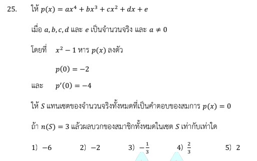

# การแก้โจทย์ข้อ 25 ของวิชาคณิตศาสตร์ประยุกต์ 1 (A-Level) ปี 2566

เป็นเรื่องเกี่ยวกับ **ฟังก์ชันพหุนาม (Polynomials)** โดยใช้ความรู้เรื่องการหารลงตัว (ทฤษฎีบทเศษเหลือ), อนุพันธ์ของพหุนาม และสมบัติของเซตคำตอบครับ

### **โจทย์ข้อ 25**

กำหนดให้ $f(x) = ax^4 + bx^3 + cx^2 + dx + e$ โดยที่ $a, b, c, d, e$ เป็นจำนวนจริง และ $a \neq 0$
โดยมีเงื่อนไขดังนี้:

1. $x^2 - 1$ หาร $f(x)$ ลงตัว,
2. $f(0) = -2$,
3. $f'(0) = -4$,
4. ให้ $S$ แทนเซตของจำนวนจริงที่เป็นคำตอบของสมการ $f(x) = 0$ โดยที่ $n(S) = 3$,
**จงหาผลบวกของสมาชิกทั้งหมดในเซต $S$**

---

### **วิธีทำอย่างละเอียด**

**ขั้นตอนที่ 1: หาค่าคงที่จากจุดตัดและอนุพันธ์**

* จาก $f(x) = ax^4 + bx^3 + cx^2 + dx + e$
* ใช้เงื่อนไข $f(0) = -2$: แทน $x = 0$ จะได้ $e = -2$
* หาอนุพันธ์ $f'(x) = 4ax^3 + 3bx^2 + 2cx + d$
* ใช้เงื่อนไข $f'(0) = -4$: แทน $x = 0$ จะได้ $d = -4$
* ตอนนี้พหุนามคือ $f(x) = ax^4 + bx^3 + cx^2 - 4x - 2$

**ขั้นตอนที่ 2: ใช้เงื่อนไขการหารลงตัว**

* $x^2 - 1 = (x-1)(x+1)$ หาร $f(x)$ ลงตัว แสดงว่า $f(1) = 0$ และ $f(-1) = 0$
* แทนค่า $f(1) = 0: a + b + c - 4 - 2 = 0 \implies a + b + c = 6 \quad --(1)$
* แทนค่า $f(-1) = 0: a - b + c + 4 - 2 = 0 \implies a - b + c = -2 \quad --(2)$
* นำ (1) - (2): $2b = 8 \implies \mathbf{b = 4}$
* แทน $b$ ใน (1): $a + 4 + c = 6 \implies \mathbf{c = 2 - a}$

**ขั้นตอนที่ 3: จัดรูป $f(x)$ และพิจารณาจำนวนคำตอบ**

* แทนค่า $b$ และ $c$ กลับลงไป: $f(x) = ax^4 + 4x^3 + (2-a)x^2 - 4x - 2$
* แยกตัวประกอบโดยมี $(x^2-1)$ เป็นตัวยืน: $f(x) = (x^2-1)(ax^2 + 4x + 2)$
* คำตอบของ $f(x) = 0$ คือ $x = 1, -1$ และรากจากสมการ **$ax^2 + 4x + 2 = 0$**

**ขั้นตอนที่ 4: วิเคราะห์เงื่อนไข $n(S) = 3$**
เพื่อให้เซตคำตอบมีสมาชิกเพียง 3 ตัว (จากเดิมมี 1 และ -1 อยู่แล้ว) สมการกำลังสอง $ax^2 + 4x + 2 = 0$ ต้องมีเงื่อนไขอย่างใดอย่างหนึ่งดังนี้:

1. **มีรากซ้ำ** และรากนั้นไม่ใช่อันเดิม ($\Delta = 0$): $16 - 8a = 0 \implies a = 2$
    * ถ้า $a = 2$ จะได้ $2x^2 + 4x + 2 = 2(x+1)^2 = 0$ จะได้ $x = -1$ (ซ้ำกับของเดิม)
    * สมาชิกใน $S = \{1, -1\}$ ซึ่ง $n(S) = 2$ (ไม่ใช่ที่โจทย์ต้องการ)
2. **มีรากสองตัวที่แตกต่างกัน** แต่รากตัวหนึ่งไปซ้ำกับ $1$ หรือ $-1$:
    * **กรณีที่ 1: รากตัวหนึ่งคือ $1$**
        * แทน $x=1$ ใน $ax^2+4x+2=0 \implies a + 4 + 2 = 0 \implies \mathbf{a = -6}$
        * เมื่อ $a = -6$ สมการคือ $-6x^2+4x+2 = -2(3x+1)(x-1) = 0$ ได้รากคือ $1, -1/3$
        * คำตอบทั้งหมดคือ $\{1, -1, 1, -1/3\}$ สมาชิกในเซตคือ **$S = \{1, -1, -1/3\}$**
        * ตรวจเช็ค $n(S) = 3$ (ถูกต้อง)
    * **กรณีที่ 2: รากตัวหนึ่งคือ $-1$**
        * แทน $x=-1$ จะได้ $a - 4 + 2 = 0 \implies a = 2$ (ซึ่งทำให้เกิดรากซ้ำตามข้อ 1 สมาชิกในเซตเหลือแค่ 2 ตัว)

**ขั้นตอนที่ 5: หาผลรวมสมาชิกใน $S$**

* สมาชิกในเซต $S$ คือ $1, -1, -1/3$
* ผลบวก $= 1 + (-1) + (-1/3) = \mathbf{-1/3}$

**ตอบ:** ตัวเลือกที่ 3) $-1/3$ (หรือตามรหัส OCR ในแหล่งข้อมูลคือ $-. !$),

---

### **เนื้อหาที่เกี่ยวข้องเพื่อศึกษาเพิ่มเติม**

**1. ทฤษฎีบทเศษเหลือ (Remainder Theorem):**
ถ้าพหุนาม $P(x)$ หารด้วย $(x-c)$ ลงตัวแล้ว $P(c) = 0$ ซึ่งค่า $c$ นั้นจะเป็นราก (คำตอบ) ของสมการ $P(x)=0$

**2. ความสัมพันธ์ระหว่างรากและสัมประสิทธิ์ (Vieta's Formulas):**
สำหรับสมการ $ax^2 + bx + c = 0$:

* ผลบวกของราก $= -b/a$
* ผลคูณของราก $= c/a$
ในข้อนี้เราสามารถใช้ตรวจสอบได้ว่าเมื่อ $a=-6$ ผลบวกรากของส่วนกำลังสองคือ $-4/-6 = 2/3$ ซึ่งรากคือ $1$ และ $-1/3$ ($1 - 1/3 = 2/3$ จริง)

### **กลยุทธ์แก้โจทย์ประเภทนี้**

* **ใช้เงื่อนไขที่ "เป็นศูนย์" ก่อน:** $f(0)$ และ $f'(0)$ มักจะบอกค่าคงที่ตัวสุดท้าย ($e$) และสัมประสิทธิ์หน้า $x$ ($d$) ได้ทันที
* **วิเคราะห์ "เซต" คำตอบ:** โจทย์ระบุว่า $n(S) = 3$ หมายความว่าต้องมีรากซ้ำในเชิงค่าตัวเลข เพื่อให้เมื่อเขียนเป็นเซตแล้วสมาชิกจะลดลงจาก 4 ตัวเหลือ 3 ตัว
* **ระวังความแตกต่างระหว่าง "ราก" กับ "สมาชิกเซต":** รากอาจมี 4 ตัว (นับซ้ำ) แต่สมาชิกในเซตนับเฉพาะค่าที่ไม่ซ้ำกัน,

---

### **ตัวอย่างโจทย์เพิ่มเติมเพื่อฝึกทำ**

**โจทย์:** กำหนด $P(x) = x^3 + ax^2 + bx + 2$ ถ้า $x-1$ หาร $P(x)$ ลงตัว และ $n(S) = 2$ เมื่อ $S$ คือเซตคำตอบของ $P(x)=0$ จงหาผลบวกสมาชิกใน $S$

**เฉลยแนวคิด:**

1. $P(1) = 0 \implies 1 + a + b + 2 = 0 \implies a + b = -3$
2. $P(x) = (x-1)(x^2 + (a+1)x - 2)$
3. เพื่อให้ $n(S)=2$ ส่วนกำลังสองต้องมีรากซ้ำ หรือมีรากตัวหนึ่งเป็น $1$
   * กรณีรากตัวหนึ่งเป็น $1: 1 + (a+1) - 2 = 0 \implies a = 0$
   * ถ้า $a=0$ จะได้ $x^2+x-2 = (x+2)(x-1)$ คำตอบคือ $1, -2$
4. **ตอบ:** ผลบวกสมาชิกคือ $1 + (-2) = -1$

---

กลยุทธ์การทำโจทย์พหุนามในข้อ 25 ของข้อสอบ A-Level คณิตศาสตร์ 1 ปี 2566 มีหัวใจสำคัญอยู่ที่การเชื่อมโยงความรู้เรื่อง **พีชคณิต แคลคูลัสพื้นฐาน และทฤษฎีบทเศษเหลือ** เข้าด้วยกัน โดยสามารถสรุปขั้นตอนและเทคนิคสำคัญได้ดังนี้ครับ

### **1. การหาค่าคงที่จากจุดตัดและอนุพันธ์**

กลยุทธ์แรกคือการใช้เงื่อนไขที่ "เป็นศูนย์" เพื่อลดทอนความซับซ้อนของตัวแปรในฟังก์ชัน $f(x) = ax^4 + bx^3 + cx^2 + dx + e$:

* **ใช้ $f(0)$ หาค่า $e$:** จากโจทย์ $f(0) = -2$ เมื่อแทนค่า $x = 0$ ลงในพหุนาม จะได้ค่าคงที่ตัวสุดท้าย **$e = -2$** ทันที
* **ใช้ $f'(0)$ หาค่า $d$:** ทำการหาอนุพันธ์ของฟังก์ชันก่อน จะได้ $f'(x) = 4ax^3 + 3bx^2 + 2cx + d$ เมื่อแทนค่า $x = 0$ ตามเงื่อนไข $f'(0) = -4$ จะได้สัมประสิทธิ์หน้า $x$ คือ **$d = -4$**

### **2. การใช้ทฤษฎีบทเศษเหลือและการหารลงตัว**

เมื่อโจทย์ระบุว่า $x^2 - 1$ หาร $f(x)$ ลงตัว กลยุทธ์คือการแยกตัวประกอบของตัวหารเป็น $(x-1)(x+1)$:

* ตามนิยามการหารลงตัว จะได้ว่า **$f(1) = 0$** และ **$f(-1) = 0$**
* สร้างระบบสมการเพื่อหาความสัมพันธ์ของ $a, b, c$:
  * จาก $f(1) = 0 \implies a + b + c = 6$
  * จาก $f(-1) = 0 \implies a - b + c = -2$
* **เทคนิคการแก้สมการ:** นำทั้งสองสมการมาลบกันเพื่อกำจัด $a$ และ $c$ จะได้ค่า **$b = 4$** และได้ความสัมพันธ์ **$c = 2 - a$**

### **3. การวิเคราะห์จำนวนสมาชิกในเซตคำตอบ ($n(S) = 3$)**

นี่คือจุดที่ยากที่สุดของโจทย์ ซึ่งต้องใช้กลยุทธ์การวิเคราะห์ **"รากซ้ำ"** เพื่อให้สมาชิกในเซตเหลือเพียง 3 ตัวจากเดิมที่มีได้สูงสุด 4 ตัว,:

* จัดรูปฟังก์ชันใหม่เป็น $f(x) = (x^2-1)(ax^2 + 4x + 2)$ ซึ่งมีรากที่ทราบแน่ชัดแล้วคือ $1$ และ $-1$
* พิจารณาสมการกำลังสองที่เหลือคือ **$ax^2 + 4x + 2 = 0$** ซึ่งต้องมีรากตัวหนึ่งไปซ้ำกับ $1$ หรือ $-1$ เพื่อให้สมาชิกในเซตรวมลดลงเหลือ 3 ตัว,
* **การตรวจสอบกรณี:**
  * หากรากคือ $1$ ให้แทน $x = 1$ ลงในสมการกำลังสอง จะได้ **$a = -6$** ซึ่งทำให้ได้รากที่เหลือคือ $-1/3$ ส่งผลให้ $S = \{1, -1, -1/3\}$ และ $n(S) = 3$ ตามที่ต้องการ
  * หากรากคือ $-1$ หรือพยายามหาจากค่า $\Delta = 0$ จะได้ $a = 2$ ซึ่งทำให้ $n(S) = 2$ จึงไม่สอดคล้องกับโจทย์

### **4. การหาผลสรุป**

ขั้นตอนสุดท้ายคือนำสมาชิกในเซต $S$ ที่ได้จากการวิเคราะห์ที่ถูกต้องมาบวกกัน:

* ผลบวกของสมาชิกทั้งหมด $= 1 + (-1) + (-1/3) = \mathbf{-1/3}$

**สรุปสั้นๆ สำหรับห้องสอบ:** เริ่มจากหา $d, e$ จากเลขศูนย์ $\to$ ใช้ทฤษฎีบทเศษเหลือสร้างระบบสมการ $\to$ แยกพจน์กำลังสองออกมาวิเคราะห์รากซ้ำเพื่อให้สมาชิกในเซตตรงตามเงื่อนไข $\to$ หาคำตอบสุดท้าย,

---

การหาความสัมพันธ์ระหว่างรากและสัมประสิทธิ์ในโจทย์ข้อ 25 ของ A-Level คณิตศาสตร์ 1 ปี 2566 มีขั้นตอนการวิเคราะห์เพื่อให้ได้ค่าตัวแปรและสมาชิกของเซตคำตอบดังนี้ครับ

### **1. การหาค่าสัมประสิทธิ์เบื้องต้นจากจุดตัดและอนุพันธ์**

จากฟังก์ชันพหุนาม $f(x) = ax^4 + bx^3 + cx^2 + dx + e$ เราสามารถใช้ข้อมูลจากโจทย์เพื่อหาค่าคงที่บางตัวได้ทันที:

* **ใช้ $f(0) = -2$:** เมื่อแทน $x = 0$ ในสมการ จะเหลือเพียงค่าคงที่ $e$ ดังนั้น **$e = -2$**
* **ใช้ $f'(0) = -4$:** หาอนุพันธ์ได้เป็น $f'(x) = 4ax^3 + 3bx^2 + 2cx + d$ เมื่อแทน $x = 0$ จะได้ **$d = -4$**
* ทำให้ได้พหุนามเบื้องต้นคือ **$f(x) = ax^4 + bx^3 + cx^2 - 4x - 2$**

### **2. การใช้ทฤษฎีบทเศษเหลือหาความสัมพันธ์ของ $a, b, c$**

โจทย์ระบุว่า $x^2 - 1$ หรือ $(x - 1)(x + 1)$ หาร $f(x)$ ลงตัว หมายความว่า **$x = 1$ และ $x = -1$ เป็นรากของสมการ $f(x) = 0$** ซึ่งเขียนความสัมพันธ์ได้ดังนี้:

* **จาก $f(1) = 0$:** $a + b + c - 4 - 2 = 0 \implies a + b + c = 6$ (สมการที่ 1)
* **จาก $f(-1) = 0$:** $a - b + c + 4 - 2 = 0 \implies a - b + c = -2$ (สมการที่ 2)
* **แก้ระบบสมการ:** นำ (1) - (2) จะได้ $2b = 8$ ดังนั้น **$b = 4$** และเมื่อแทน $b$ กลับไปจะได้ความสัมพันธ์ **$c = 2 - a$**

### **3. วิเคราะห์รากที่เหลือผ่านเงื่อนไข $n(S) = 3$**

เมื่อเราทราบค่า $b$ และความสัมพันธ์ของ $c$ แล้ว เราสามารถแยกตัวประกอบพหุนามได้เป็น:
$$f(x) = (x^2 - 1)(ax^2 + 4x + 2)$$
รากของสมการคือ $x = 1, -1$ และรากที่ได้จากพจน์ **$ax^2 + 4x + 2 = 0$**
โจทย์กำหนดให้เซตคำตอบ $S$ มีสมาชิก 3 ตัว ($n(S) = 3$) ซึ่งหมายความว่ารากจากพจน์กำลังสองต้องมีลักษณะอย่างใดอย่างหนึ่งดังนี้:

1. **พจน์กำลังสองมีรากซ้ำ** ($\Delta = 0$): $16 - 8a = 0 \implies a = 2$ แต่เมื่อลองแทนค่าจะได้ $S = \{1, -1\}$ ซึ่งมีสมาชิกเพียง 2 ตัว จึงใช้ไม่ได้
2. **รากตัวหนึ่งซ้ำกับรากเดิมที่มีอยู่ (1 หรือ -1):**
    * **ถ้า $x = 1$ เป็นราก:** แทนค่าใน $ax^2 + 4x + 2 = 0 \implies a + 4 + 2 = 0 \implies \mathbf{a = -6}$
    * เมื่อ $a = -6$ สมการกำลังสองคือ $-6x^2 + 4x + 2 = 0$ ซึ่งได้รากคือ **$1$** (ซ้ำ) และ **$-1/3$** (ใหม่)
    * เซตคำตอบจึงเป็น **$S = \{1, -1, -1/3\}$** ซึ่งมีสมาชิก 3 ตัวตามเงื่อนไขพอดี

### **4. สรุปผลรวมของสมาชิกในเซต $S$**

เมื่อได้สมาชิกในเซต $S$ ครบทั้ง 3 ตัว คือ $1, -1,$ และ $-1/3$ ผลบวกของสมาชิกทั้งหมดคือ:
$$\text{ผลรวม} = 1 + (-1) + (-1/3) = \mathbf{-1/3}$$

**กลยุทธ์สำคัญ:** การหาความสัมพันธ์นี้อาศัยการเปลี่ยนเงื่อนไข "การหารลงตัว" ให้เป็น "ค่าของฟังก์ชันที่จุดราก" และใช้เงื่อนไข "จำนวนสมาชิกในเซต" มาบีบให้เราต้องพิจารณากรณีรากซ้ำเพื่อหาค่าสัมประสิทธิ์ $a$ ที่แน่นอนครับ

---

ในข้อ 25 ของคณิตศาสตร์ประยุกต์ A-Level ปี 2566 มีการนำ **ทฤษฎีบทเศษเหลือ (Remainder Theorem)** มาประยุกต์ใช้อย่างมีนัยสำคัญร่วมกับสมบัติของการหารลงตัว ดังนี้ครับ

### **1. นิยามของทฤษฎีบทเศษเหลือ**

ทฤษฎีบทเศษเหลือระบุว่า ถ้าหารพหุนาม $P(x)$ ด้วย $(x - c)$ แล้ว **เศษเหลือที่ได้จะเท่ากับ $P(c)$** เสมอ, โดยหลักการสำคัญคือการพยายามทำให้ตัวหารเป็น 0 เพื่อให้ฝั่งขวาของสมการเหลือเพียงค่าเศษ

### **2. การประยุกต์ใช้ในข้อ 25**

ในโจทย์ข้อนี้ระบุเงื่อนไขว่า **"$x^2 - 1$ หาร $f(x)$ ลงตัว"**, ซึ่งเราสามารถแยกรายละเอียดตามทฤษฎีได้ดังนี้:

* **การแยกตัวประกอบตัวหาร:** $x^2 - 1$ สามารถแยกได้เป็น $(x - 1)(x + 1)$
* **นิยามของการหารลงตัว:** คำว่า "หารลงตัว" หมายความว่า **เศษเหลือต้องเท่ากับ 0**
* **การสร้างสมการความสัมพันธ์:** จากทฤษฎีบทเศษเหลือ เมื่อนำตัวประกอบแต่ละตัวมาพิจารณา จะได้ว่า:
    1. ถ้า $(x - 1)$ หาร $f(x)$ ลงตัว แสดงว่าเศษเหลือคือ **$f(1) = 0$**
    2. ถ้า $(x + 1)$ หาร $f(x)$ ลงตัว แสดงว่าเศษเหลือคือ **$f(-1) = 0$**

### **3. ประโยชน์ของทฤษฎีนี้ต่อการแก้โจทย์**

การใช้ทฤษฎีบทเศษเหลือช่วยเปลี่ยนข้อมูลจากการ "หาร" ให้กลายเป็น **"สมการพีชคณิต"** เพื่อหาค่าสัมประสิทธิ์ $a, b, c$ ที่ไม่ทราบค่า:

* เมื่อเราแทนค่า $x = 1$ และ $x = -1$ ลงในพหุนาม $f(x) = ax^4 + bx^3 + cx^2 - 4x - 2$ (หลังจากหา $d, e$ ได้แล้ว) จะได้ระบบสมการ:
  * $a + b + c - 4 - 2 = 0 \implies a + b + c = 6$
  * $a - b + c + 4 - 2 = 0 \implies a - b + c = -2$
* **ผลลัพธ์:** การแก้ระบบสมการนี้ทำให้เราทราบค่า $b = 4$ และความสัมพันธ์ของ $a$ และ $c$ เพื่อนำไปวิเคราะห์คำตอบในขั้นตอนถัดไป

**สรุปสั้นๆ:** ทฤษฎีบทเศษเหลือในข้อนี้ทำหน้าที่เป็นสะพานเชื่อมเพื่อเปลี่ยนเงื่อนไข "การหารลงตัว" ให้เป็น "ค่าของฟังก์ชันที่จุดรากเป็นศูนย์" ซึ่งเป็นหัวใจสำคัญในการปลดล็อกค่าตัวแปรในโจทย์พหุนามครับ
